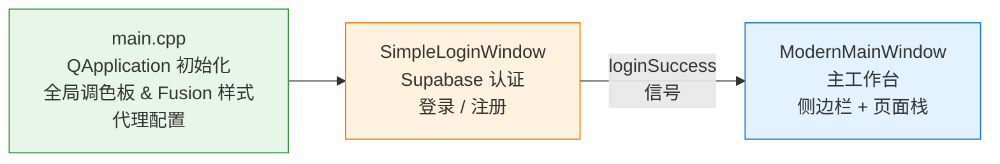

**AI 思政智慧课堂系统**是一个面向高校思政课堂场景的桌面端教学辅助平台，基于 Qt 6 / C++17 构建，将 AI 对话、智能备课、试题管理、数据分析等能力整合为统一的教学工作台。系统以"思政红"为视觉基调，采用 Supabase 云端后端 + Dify AI 引擎的技术组合，支持 macOS 与 Windows 双平台一键打包发布，旨在帮助思政教师将 AI 能力无缝融入日常教学流程。

Sources: [README.md](README.md#L1-L14), [CMakeLists.txt](CMakeLists.txt#L1-L7)

## 系统定位与核心价值

传统思政课堂面临备课素材获取难、试题编撰耗时长、学情反馈滞后等痛点。本系统从三个维度提供核心价值：

| 维度 | 痛点 | 系统解决方案 |
|------|------|-------------|
| **AI 赋能备课** | 手动编写教案、制作 PPT 耗时耗力 | AI 对话助手 + AI 备课 + 智谱 PPT 三阶段生成流水线 |
| **智能化题库** | 题目来源分散、组卷依赖人工经验 | AI 文档解析试题 + 智能组卷贪心算法 + 多格式导出 |
| **数据驱动教学** | 学情掌握靠经验判断，缺乏量化依据 | 数据分析抽象层 + 雷达图可视化 + 考勤与通知系统 |

系统的核心设计理念是**分层解耦**：每个业务模块通过接口抽象与具体实现分离。例如，新闻数据获取通过 [INewsProvider](src/hotspot/INewsProvider.h) 接口抽象，学情数据通过 [IAnalyticsDataSource](src/analytics/interfaces/IAnalyticsDataSource.h) 接口抽象。这种设计使得模块在 Mock 数据源与真实数据源之间自由切换，既便于独立开发调试，也为后续对接真实教务系统预留了扩展空间。

Sources: [src/hotspot/INewsProvider.h](src/hotspot/INewsProvider.h#L1-L82), [src/analytics/interfaces/IAnalyticsDataSource.h](src/analytics/interfaces/IAnalyticsDataSource.h#L1-L51), [src/smartpaper/SmartPaperService.h](src/smartpaper/SmartPaperService.h#L1-L81)

## 整体架构概览

系统采用经典的**分层架构**设计，从底向上分为四层：配置层、服务层、业务逻辑层、表现层。各层职责清晰，通过 Qt 信号-槽机制实现松耦合通信。以下是系统架构的全景视图：

```mermaid
graph TB
    subgraph Presentation["表现层 (UI)"]
        Login["SimpleLoginWindow<br/>登录窗口"]
        Dashboard["ModernMainWindow<br/>主工作台"]
        QB["QuestionBankWindow<br/>试题库"]
        AI["AIPreparationWidget<br/>AI 备课"]
        Analytics["DataAnalyticsWidget<br/>数据分析"]
        Hotspot["HotspotTrackingWidget<br/>热点追踪"]
        Attendance["AttendanceWidget<br/>考勤管理"]
        Notif["NotificationWidget<br/>通知中心"]
    end

    subgraph Services["服务层 (Business Services)"]
        Dify["DifyService<br/>AI 对话"]
        Parser["QuestionParserService<br/>试题解析"]
        Paper["PaperService<br/>题目 CRUD"]
        SmartPaper["SmartPaperService<br/>智能组卷"]
        Export["ExportService<br/>多格式导出"]
        PPT["ZhipuPPTAgentService<br/>PPT 生成"]
        NotifSvc["NotificationService<br/>通知服务"]
        AttendSvc["AttendanceService<br/>考勤服务"]
    end

    subgraph Infrastructure["基础设施层 (Infrastructure)"]
        AppConfig["AppConfig<br/>多级配置"]
        Network["NetworkRequestFactory<br/>请求工厂"]
        Retry["NetworkRetryHelper<br/>重试策略"]
        SSE["SseStreamParser<br/>SSE 解析器"]
        Tracker["FailedTaskTracker<br/>失败追踪"]
    end

    subgraph External["外部服务 (External)"]
        Supabase["Supabase<br/>认证 / 数据 / 存储"]
        DifyAPI["Dify Cloud<br/>AI 对话 / 工作流"]
        Zhipu["智谱 GLM<br/>PPT 大纲 / SVG"]
    end

    Presentation --> Services
    Services --> Infrastructure
    Infrastructure --> External

    style Presentation fill:#FFF3E0,stroke:#F57C00,color:#333
    style Services fill:#E3F2FD,stroke:#1976D2,color:#333
    style Infrastructure fill:#E8F5E9,stroke:#388E3C,color:#333
    style External fill:#F3E5F5,stroke:#7B1FA2,color:#333
```



**数据流路径**：用户在表现层触发操作（如点击"AI 备课"），主工作台通过信号调用服务层相应方法；服务层通过基础设施层构造网络请求、处理 SSE 流式响应、管理重试与错误追踪；最终与外部服务（Supabase / Dify / 智谱）通信，获取结果后通过信号回传至表现层更新 UI。

Sources: [src/main/main.cpp](src/main/main.cpp#L99-L132), [src/dashboard/modernmainwindow.h](src/dashboard/modernmainwindow.h#L1-L100), [src/config/AppConfig.h](src/config/AppConfig.h#L1-L42)

## 功能模块总览

系统当前包含 **10 个核心功能模块**，覆盖思政教学的完整流程。下表按用户使用频率排列，展示各模块的核心能力与关键实现类：

| 模块 | 核心能力 | 关键入口类 | 后端依赖 |
|------|---------|-----------|---------|
| **用户认证** | 邮箱登录、注册、密码重置、"记住我" | [SimpleLoginWindow](src/auth/login/simpleloginwindow.h) | Supabase Auth |
| **AI 对话助手** | 多模型流式对话、会话历史管理 | [AIChatDialog](src/ui/AIChatDialog.h) | Dify Cloud |
| **AI 智能备课** | 教案生成、PPT 三阶段生成、预览下载 | [AIPreparationWidget](src/ui/aipreparationwidget.h) | Dify + 智谱 GLM |
| **试题库管理** | 题目 CRUD、分类检索、批量导入 | [QuestionBankWindow](src/questionbank/questionbankwindow.h) | Supabase |
| **智能组卷** | 分阶段贪心选题、约束满足、换题 | [SmartPaperWidget](src/smartpaper/SmartPaperWidget.h) | Supabase |
| **多格式导出** | HTML / DOCX / PDF 试卷输出 | [ExportService](src/services/ExportService.h) | 本地 |
| **时政热点追踪** | 新闻分类浏览、搜索、详情查看 | [HotspotTrackingWidget](src/ui/HotspotTrackingWidget.h) | INewsProvider 接口 |
| **学情数据分析** | 个人/班级分析、雷达图、排名 | [DataAnalyticsWidget](src/analytics/DataAnalyticsWidget.h) | IAnalyticsDataSource 接口 |
| **通知中心** | 实时通知、已读标记、徽章提示 | [NotificationWidget](src/notifications/ui/NotificationWidget.h) | Supabase |
| **考勤管理** | 班级学生考勤记录、统计分析 | [AttendanceWidget](src/attendance/ui/AttendanceWidget.h) | Supabase |

每个模块遵循统一的分层模式：**UI 组件 → Service 服务层 → 外部 API**，Service 层持有 `QNetworkAccessManager` 管理网络请求，通过 Qt 信号-槽机制与 UI 层解耦通信。

Sources: [src/services/DifyService.h](src/services/DifyService.h#L1-L40), [src/services/QuestionParserService.h](src/services/QuestionParserService.h#L1-L60), [src/services/PaperService.h](src/services/PaperService.h#L1-L60), [src/services/ZhipuPPTAgentService.h](src/services/ZhipuPPTAgentService.h#L1-L50)

## 技术栈全景

系统技术选型围绕 **Qt 6 桌面生态**展开，辅以现代 C++17 特性与云端 AI 服务。以下是完整的技术栈组成：

| 分类 | 技术 | 用途 |
|------|------|------|
| **语言** | C++17 | 核心开发语言，使用 `std::function`、`std::optional` 等现代特性 |
| **框架** | Qt 6.6+ (Widgets, Network, Charts, QuickWidgets, Svg, PrintSupport, Concurrent) | UI 框架、网络通信、图表渲染、SVG 处理、并发任务 |
| **构建** | CMake 3.16+ | 跨平台构建系统，启用 AUTOUIC / AUTOMOC / AUTORCC |
| **AI 对话** | Dify Cloud API + SSE 流式协议 | AI 对话与工作流调用，实时流式响应 |
| **AI 代码** | 智谱 GLM (glm-5.1 / glm-5v-turbo) | PPT 大纲生成、布局指令、SVG 代码生成 |
| **认证/数据** | Supabase (Auth, REST API, Storage) | 用户认证、试题数据存储、通知与考勤业务后端 |
| **文档生成** | DocxGenerator + SimpleZipWriter | 本地 DOCX 文件生成，ZIP 打包 |
| **Markdown** | md4c (第三方库) | Markdown 解析与 HTML 渲染 |
| **发布** | GitHub Actions + macOS DMG + Windows ZIP/EXE | Tag 触发自动构建、跨平台安装包生成 |

**值得注意的设计决策**：系统默认禁用 HTTP/2 以避免特定平台协议兼容问题；网络请求通过 [NetworkRequestFactory](src/utils/NetworkRequestFactory.h) 统一创建，确保 SSL 配置、超时策略的一致性；代理配置支持环境变量读取，并内置本地代理可用性检测，避免无代理环境下的连接超时。

Sources: [CMakeLists.txt](CMakeLists.txt#L1-L20), [src/utils/NetworkRequestFactory.h](src/utils/NetworkRequestFactory.h#L1-L1), [src/utils/SseStreamParser.h](src/utils/SseStreamParser.h#L1-L40), [third_party/md4c/CMakeLists.txt](third_party/md4c/CMakeLists.txt#L1-L1)

## 项目目录结构导览

系统的源代码组织遵循**按功能模块分目录**的原则，每个模块包含 `ui/`、`services/`、`models/` 等子目录，形成一致的内部结构。以下是关键目录的职责说明：

```
src/
├── main/              # 程序入口：QApplication 初始化、代理配置、调色板设置
├── auth/              # 用户认证模块
│   ├── login/         #   登录窗口 (SimpleLoginWindow)
│   ├── signup/        #   注册窗口 (SignupWindow)
│   └── supabase/      #   Supabase 认证客户端 (SupabaseClient)
├── dashboard/         # 主工作台框架
│                      #   ModernMainWindow — 侧边栏 + 页面栈布局
│                      #   ChatManager / SidebarManager — 功能管理器
├── services/          # 业务服务层（15+ 服务类）
│                      #   DifyService, PaperService, ExportService,
│                      #   ZhipuPPTAgentService, QuestionParserService ...
├── questionbank/      # 试题库 UI：题目管理、组卷对话框、AI 出题、质量检查
├── smartpaper/        # 智能组卷：贪心算法 + 约束满足
├── analytics/         # 学情数据分析：数据源抽象、Mock 实现、雷达图
├── hotspot/           # 时政热点：INewsProvider 接口 + Mock/Real 双实现
├── notifications/     # 通知中心：Supabase REST API 通知服务
├── attendance/        # 考勤管理：记录提交、统计分析
├── ui/                # 通用 UI 组件：AI 对话、教案编辑、PPT 预览等
├── utils/             # 工具类：网络请求工厂、重试策略、SSE 解析、Markdown 渲染
├── config/            # 配置管理：AppConfig 多级配置加载
├── settings/          # 用户设置：偏好管理对话框
└── shared/            # 全局共享：StyleConfig 调色板常量
```

`resources/` 目录存放样式表（QSS）、图标（SVG）、模板（PPTX）、示例数据（JSON）等静态资源，通过 Qt 资源系统（`.qrc`）编译打包。`scripts/` 目录包含 macOS 和 Windows 的打包脚本，`third_party/` 仅包含 md4c 一个 Markdown 解析库。

Sources: [src/main/main.cpp](src/main/main.cpp#L95-L132), [resources.qrc](resources.qrc#L1-L1), [src/shared/StyleConfig.h](src/shared/StyleConfig.h#L1-L50)

## 应用启动流程

从用户双击应用图标到进入主工作台，系统经历三个关键阶段：



**第一阶段**（[main.cpp](src/main/main.cpp)）：初始化 `QApplication`，设置应用名称为"AI思政智慧课堂系统"，应用 Fusion 样式与全局调色板（以思政红 `#E53935` 为主色调），读取环境变量配置网络代理。

**第二阶段**（[SimpleLoginWindow](src/auth/login/simpleloginwindow.h)）：显示登录窗口，通过 [SupabaseClient](src/auth/supabase/supabaseclient.h) 调用 Supabase Auth API 完成邮箱/密码认证，支持"记住我"、注册、密码重置功能。

**第三阶段**（[ModernMainWindow](src/dashboard/modernmainwindow.h)）：认证成功后，主工作台接管界面。主工作台采用**左侧边栏导航 + 右侧内容栈**的经典布局，通过 `QStackedWidget` 管理各功能页面切换，侧边栏按钮点击触发页面栈索引切换。

Sources: [src/main/main.cpp](src/main/main.cpp#L93-L132), [src/auth/supabase/supabaseclient.h](src/auth/supabase/supabaseclient.h#L1-L99), [src/dashboard/modernmainwindow.h](src/dashboard/modernmainwindow.h#L55-L120)

## 系统核心设计模式

系统在架构层面贯彻了若干关键设计模式，理解这些模式有助于快速把握代码组织逻辑：

**接口抽象 + 双实现模式**：热点新闻模块的 [INewsProvider](src/hotspot/INewsProvider.h) 和数据分析模块的 [IAnalyticsDataSource](src/analytics/interfaces/IAnalyticsDataSource.h) 均定义纯虚接口，分别提供 `MockNewsProvider` / `RealNewsProvider` 和 `MockDataSource` 两套实现。这种模式使 UI 层完全不感知数据来源，方便在开发阶段使用 Mock 数据，部署时切换至真实数据源。

**信号-槽解耦模式**：所有 Service 类通过 Qt 信号向外发射结果（如 `DifyService::streamChunkReceived`、`PaperService::searchCompleted`），UI 组件连接信号接收数据。这种发布-订阅机制使 Service 与 UI 之间无直接依赖。

**SSE 流式处理管线**：[SseStreamParser](src/utils/SseStreamParser.h) 作为纯解析工具，将 SSE 字节流解析为 `(event, QJsonObject)` 对，通过回调传递给业务层。DifyService 和 QuestionParserService 均内置 `SseStreamParser` 实例，实现 AI 响应的实时逐字展示。

Sources: [src/utils/SseStreamParser.h](src/utils/SseStreamParser.h#L1-L60), [src/services/DifyService.h](src/services/DifyService.h#L1-L50), [src/hotspot/INewsProvider.h](src/hotspot/INewsProvider.h#L1-L40)

## 推荐阅读路径

本文档已为您提供系统的全景认知。根据您的关注点，建议按以下路径深入阅读：

**路径一：快速上手开发**（适合刚加入项目的开发者）
1. [快速搭建：环境配置、构建与运行应用](2-kuai-su-da-jian-huan-jing-pei-zhi-gou-jian-yu-yun-xing-ying-yong) — 搭建本地开发环境
2. [代码规范与目录结构导航](3-dai-ma-gui-fan-yu-mu-lu-jie-gou-dao-hang) — 熟悉代码组织与命名约定
3. [整体架构设计：分层架构与模块职责划分](4-zheng-ti-jia-gou-she-ji-fen-ceng-jia-gou-yu-mo-kuai-zhi-ze-hua-fen) — 深入理解分层设计

**路径二：AI 服务开发**（适合需要扩展 AI 能力的开发者）
1. [Dify AI 对话服务：SSE 流式响应与多模型支持](9-dify-ai-dui-hua-fu-wu-sse-liu-shi-xiang-ying-yu-duo-mo-xing-zhi-chi) — 理解 AI 对话核心
2. [SSE 协议解析器：SseStreamParser 的设计与实现](10-sse-xie-yi-jie-xi-qi-ssestreamparser-de-she-ji-yu-shi-xian) — 掌握流式协议处理
3. [AI 文档解析与试题生成：QuestionParserService 工作流](11-ai-wen-dang-jie-xi-yu-shi-ti-sheng-cheng-questionparserservice-gong-zuo-liu) — 试题生成全流程
4. [PPT 生成流水线：智谱三阶段大纲-布局-SVG 渲染架构](15-ppt-sheng-cheng-liu-shui-xian-zhi-pu-san-jie-duan-da-gang-bu-ju-svg-xuan-ran-jia-gou) — PPT 生成深度解析

**路径三：教学业务模块**（适合需要理解或扩展教学功能的开发者）
1. [应用启动与导航流程：从登录窗口到主工作台](5-ying-yong-qi-dong-yu-dao-hang-liu-cheng-cong-deng-lu-chuang-kou-dao-zhu-gong-zuo-tai) — 启动全链路
2. [试题库管理：题目的 CRUD、检索与 PaperService 数据模型](12-shi-ti-ku-guan-li-ti-mu-de-crud-jian-suo-yu-paperservice-shu-ju-mo-xing) — 试题数据模型
3. [智能组卷算法：分阶段贪心选题与约束满足](13-zhi-neng-zu-juan-suan-fa-fen-jie-duan-tan-xin-zuan-ti-yu-yue-shu-man-zu) — 组卷算法原理
4. [导出与文档生成：HTML、DOCX、PDF 多格式输出](14-dao-chu-yu-wen-dang-sheng-cheng-html-docx-pdf-duo-ge-shi-shu-chu) — 试卷导出机制