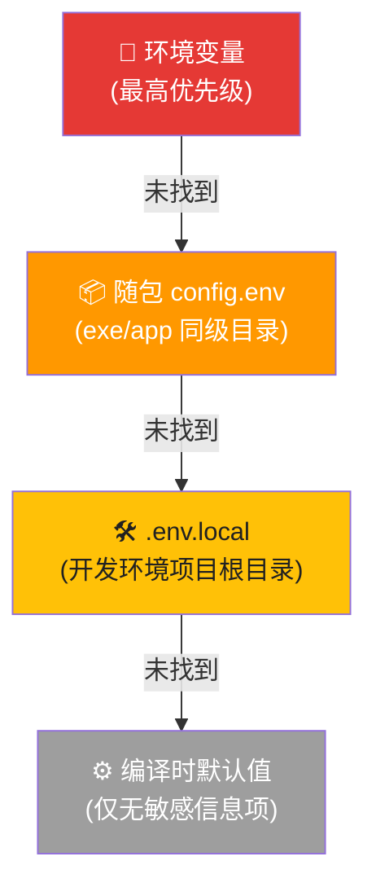
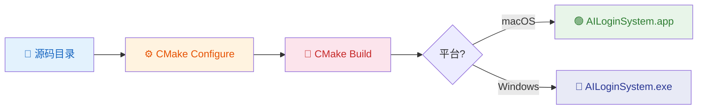
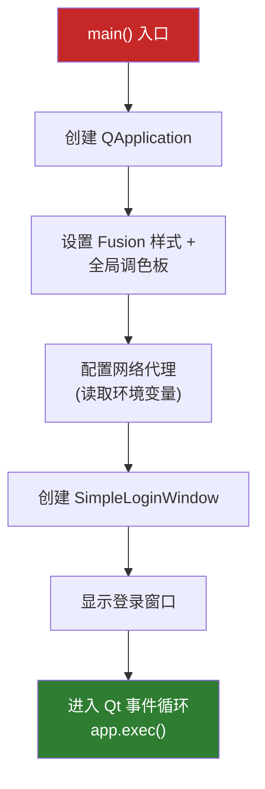

本文是 **AI 思政智慧课堂系统**（AILoginSystem）的完整搭建指南，面向初次接触本项目的开发者。你将按顺序完成：开发环境准备 → API 密钥配置 → CMake 构建编译 → 本地运行与验证。整个过程从零开始，大约需要 **15-30 分钟**（不含 Qt 安装下载时间）。

## 技术栈与版本总览

在开始之前，先确认你的开发环境满足以下最低要求：

| 依赖项 | 最低版本 | 推荐版本 | 说明 |
|--------|----------|----------|------|
| **Qt** | 6.6.0 | 6.6.2 | 需包含 `qtbase`、`qtsvg`、`qtdeclarative`、`qtshadertools` 及 `qtcharts` 模块 |
| **CMake** | 3.16 | 最新稳定版 | 项目使用 `cmake_minimum_required(VERSION 3.16)` |
| **C++ 编译器** | C++17 兼容 | Clang 15+ / MSVC 2019+ | macOS 推荐 Xcode Command Line Tools，Windows 推荐 MSVC 2019 64-bit |
| **操作系统** | macOS 12+ / Windows 10+ | macOS 14 (Sonoma) / Windows 11 | CI 分别使用 `macos-14` 和 `windows-latest` |
| **Ninja** (可选) | 任意 | 最新 | 构建脚本会自动检测并启用 Ninja 以加速编译 |

项目声明的 Qt 组件包括 **Widgets、Network、Charts、QuickWidgets、Svg、SvgWidgets、PrintSupport、Concurrent** 共八个模块，安装 Qt 时请确保这些模块均已勾选。

Sources: [CMakeLists.txt](CMakeLists.txt#L1-L17), [.github/workflows/build-macos.yml](.github/workflows/build-macos.yml#L46-L55)

## 开发环境安装

### macOS 环境准备

**第一步：安装 Xcode Command Line Tools**

```bash
xcode-select --install
```

**第二步：安装 Qt 6.6.2**

推荐使用 Homebrew 安装（最简方式）：

```bash
brew install qt@6
```

或者通过 [Qt 官方在线安装器](https://www.qt.io/download-qt-installer) 安装到 `~/Qt/6.6.2/macos`，后续构建脚本会自动在以下路径中查找 Qt：`/opt/homebrew/opt/qt@6`、`/usr/local/opt/qt@6`、`~/Qt/6.6.2/macos` 等。

**第三步（可选）：安装 Ninja 以加速构建**

```bash
brew install ninja
```

### Windows 环境准备

**第一步：安装 Visual Studio 2019 或更高版本**

确保勾选"使用 C++ 的桌面开发"工作负载，需要 MSVC x64 编译器。

**第二步：安装 Qt 6.6.2**

通过 Qt 在线安装器安装，选择 `win64_msvc2019_64` 架构，勾选以下组件：
- `qtbase`、`qtsvg`、`qtdeclarative`、`qtshadertools`（Qt 基础）
- `qtcharts`（图表模块）

**第三步：安装 CMake 与 Ninja**

CMake 通常随 Visual Studio 安装。如需独立安装，可通过 `winget install Kitware.CMake` 或 `choco install cmake` 获取。Ninja 同样可选：`choco install ninja`。

Sources: [scripts/package_app.sh](scripts/package_app.sh#L96-L124), [.github/workflows/build-windows.yml](.github/workflows/build-windows.yml#L48-L65)

## API 密钥配置

本系统依赖两个外部服务的 API 密钥才能完整运行。密钥配置采用 **四级优先级加载**机制，开发者可根据场景选择最合适的方式。

### 配置加载优先级

系统通过 `AppConfig` 类统一读取配置，优先级从高到低为：



**环境变量**适合 CI/CD 和临时测试；**config.env** 适合发布版本随包分发；**.env.local** 适合本地日常开发，该文件已在 `.gitignore` 中排除，不会意外提交。

Sources: [src/config/AppConfig.h](src/config/AppConfig.h#L7-L18), [src/config/AppConfig.cpp](src/config/AppConfig.cpp#L58-L91)

### 必需的环境变量

在项目根目录下复制模板文件并填入真实密钥：

```bash
cp .env.example .env.local
```

然后编辑 `.env.local`，填入以下内容：

| 变量名 | 是否必需 | 用途 | 示例值 |
|--------|----------|------|--------|
| `DIFY_API_KEY` | ✅ 必需 | Dify AI 对话服务的 API Key | `app-xxxxxxxx` |
| `PARSER_API_KEY` | ✅ 必需 | Dify 文档解析工作流的 API Key | `app-xxxxxxxx` |
| `SUPABASE_URL` | ✅ 必需 | Supabase 项目 URL（认证/数据/存储） | `https://xxx.supabase.co` |
| `SUPABASE_ANON_KEY` | ✅ 必需 | Supabase 匿名访问 Key | `eyJhbG...` |
| `SUPABASE_SERVICE_KEY` | ❌ 可选 | Supabase 服务端角色 Key（管理操作） | `eyJhbG...` |
| `ALLOW_INSECURE_SSL` | ❌ 可选 | 开发调试时放宽 SSL 校验（值为 `1`） | `1` |
| `http_proxy` / `https_proxy` | ❌ 可选 | 本地代理地址 | `http://127.0.0.1:7897` |

> ⚠️ **安全提醒**：`.env.local` 已在 `.gitignore` 中排除。**永远不要将真实 API Key 提交到版本控制系统**。`.env.example` 仅作为模板，不包含真实值。

Sources: [.env.example](.env.example#L1-L21), [.gitignore](.gitignore#L126-L134)

### 密钥获取指引

- **Dify API Key**：登录 Dify 控制台 → 进入你的应用 → 左侧"API 访问"页面 → 复制 API Key。本项目需要两个 Dify 应用（对话 + 文档解析），分别获取 `DIFY_API_KEY` 和 `PARSER_API_KEY`。
- **Supabase URL & Anon Key**：登录 Supabase 控制台 → 进入项目 → Settings → API → 复制 Project URL 和 `anon public` Key。

## 构建项目

### 构建流程总览



### macOS 构建

```bash
# 1. 克隆仓库并进入目录
git clone <repository-url>
cd AItechnology

# 2. 创建构建目录并配置 CMake
mkdir -p build
cmake -S . -B build

# 3. 编译（自动使用全部 CPU 核心）
cmake --build build -j$(sysctl -n hw.ncpu)
```

构建完成后，产物位于 `build/AILoginSystem.app`。

如果 Qt 未在系统 PATH 中，需通过 `CMAKE_PREFIX_PATH` 指定 Qt 路径：

```bash
cmake -S . -B build -DCMAKE_PREFIX_PATH=~/Qt/6.6.2/macos/lib/cmake
```

### Windows 构建

```powershell
# 1. 克隆仓库并进入目录
git clone <repository-url>
cd AItechnology

# 2. 配置 CMake（如已安装 Ninja 会自动使用）
cmake -S . -B build -DCMAKE_BUILD_TYPE=Release

# 3. 编译
cmake --build build --config Release
```

构建完成后，产物位于 `build/AILoginSystem.exe` 或 `build/Release/AILoginSystem.exe`。

### 构建产物的目录结构

**macOS App Bundle 布局**：

```
AILoginSystem.app/
├── Contents/
│   ├── MacOS/
│   │   └── AILoginSystem          # 可执行文件
│   ├── Resources/
│   │   ├── AppIcon.icns           # 应用图标
│   │   ├── ppt/                   # PPT 示例资源
│   │   ├── templates/             # PPT 模板
│   │   └── config.env             # 发布版运行时配置（打包时生成）
│   ├── Info.plist
│   └── Frameworks/                # Qt 动态库（macdeployqt 部署后）
```

**Windows 部署目录布局**：

```
deploy/
├── AILoginSystem.exe              # 可执行文件
├── config.env                     # 发布版运行时配置（打包时生成）
├── ppt/                           # PPT 示例资源
├── templates/                     # PPT 模板
├── styles/                        # QSS 样式资源
└── *.dll                          # Qt 及依赖 DLL（windeployqt 部署后）
```

Sources: [CMakeLists.txt](CMakeLists.txt#L221-L258), [CMakeLists.txt](CMakeLists.txt#L260-L286)

## 运行应用

### 直接运行构建产物

**macOS**：

```bash
open build/AILoginSystem.app
```

**Windows**：

```powershell
.\build\Release\AILoginSystem.exe
# 或
.\build\AILoginSystem.exe
```

### 使用启动脚本

项目提供了 `Run-AILoginSystem.command` 脚本（macOS 双击即可运行），它会调用项目根目录下的 `run_app.sh`（注意：该文件已在 `.gitignore` 中排除，需开发者自行创建或通过其他方式提供）。你可以在 `run_app.sh` 中预置环境变量后启动应用：

```bash
#!/bin/bash
export DIFY_API_KEY="app-your-key"
export SUPABASE_URL="https://your-project.supabase.co"
export SUPABASE_ANON_KEY="your-anon-key"
open build/AILoginSystem.app
```

Sources: [Run-AILoginSystem.command](Run-AILoginSystem.command#L1-L12), [.gitignore](.gitignore#L133)

### 应用启动流程

当你启动应用后，内部将按以下顺序完成初始化：



启动时应用会自动检测本地代理可用性：如果配置了 `https_proxy` 指向本地地址（`127.0.0.1`/`localhost`），应用会尝试 TCP 连接测试；如果代理不可达，则自动跳过代理配置，避免登录请求直接失败。

Sources: [src/main/main.cpp](src/main/main.cpp#L40-L131)

### 验证运行是否成功

应用启动成功的标志是出现 **登录窗口**。在终端中你应该能看到以下输出：

```
=== 应用启动 ===
应用启动
登录窗口已显示
```

如果看到网络错误（如 `RemoteHostClosedError`），请检查以下事项：

| 问题 | 可能原因 | 解决方案 |
|------|----------|----------|
| "Network error: 2" (RemoteHostClosedError) | 代理配置不正确或目标服务器不可达 | 检查 `https_proxy` 环境变量，确保 `*.supabase.co` 和 `api.dify.ai` 可访问 |
| 登录请求超时 | SSL 证书问题（常见于开发环境） | 设置 `ALLOW_INSECURE_SSL=1`（仅限开发调试） |
| "API Key 未设置" 日志 | 环境变量未配置 | 确认 `.env.local` 文件存在且包含有效的 `DIFY_API_KEY` |
| 编译错误找不到 `embedded_keys.h` | 缺少编译时头文件 | 复制 `embedded_keys.h.example` 为 `embedded_keys.h`（空值即可用于开发） |

Sources: [CLAUDE.md](CLAUDE.md#L100-L108), [src/config/embedded_keys.h.example](src/config/embedded_keys.h.example#L1-L17)

## 第三方依赖说明

项目内置了 **md4c** 作为 Markdown 解析库，位于 `third_party/md4c/` 目录。该项目由 CMakeLists.txt 中 `qt_add_executable` 直接编译，无需额外安装步骤。

对于 **zlib** 依赖，项目采用灵活策略：macOS/Linux 优先使用系统自带的 zlib；Windows 平台则自动查找 Qt 内置的 bundled zlib 头文件和静态库，无需开发者手动配置。

Sources: [CMakeLists.txt](CMakeLists.txt#L18-L53)

## 下一步

恭喜你完成了环境搭建！现在可以开始探索项目的更多细节：

- 📁 了解项目代码组织 → [代码规范与目录结构导航](3-dai-ma-gui-fan-yu-mu-lu-jie-gou-dao-hang)
- 🏗️ 深入理解整体架构 → [整体架构设计：分层架构与模块职责划分](4-zheng-ti-jia-gou-she-ji-fen-ceng-jia-gou-yu-mo-kuai-zhi-ze-hua-fen)
- 🔐 了解登录认证流程 → [应用启动与导航流程：从登录窗口到主工作台](5-ying-yong-qi-dong-yu-dao-hang-liu-cheng-cong-deng-lu-chuang-kou-dao-zhu-gong-zuo-tai)
- 📦 跨平台打包发布 → [跨平台打包：macOS DMG 与 Windows ZIP/EXE 打包脚本](22-kua-ping-tai-da-bao-macos-dmg-yu-windows-zip-exe-da-bao-jiao-ben)