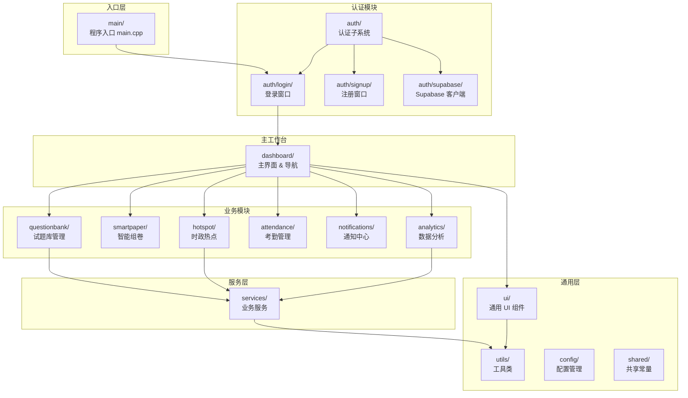

本文档是你在本项目中导航代码的"地图与交通规则"——它同时回答两个问题：**文件放在哪里**，以及**代码该怎么写**。理解目录结构与命名规范后，你将能快速定位任何模块的入口文件、理解头文件的组织约定、并遵循团队统一的编码风格贡献代码。

Sources: [CLAUDE.md](CLAUDE.md#L1-L116), [CMakeLists.txt](CMakeLists.txt#L1-L339), [.gitignore](.gitignore#L1-L143)

---

## 顶层目录总览

项目根目录下的文件和文件夹按职责清晰分区，下表展示了每个顶层条目的角色：

| 目录 / 文件 | 职责 | 备注 |
|---|---|---|
| `src/` | 全部 C++ 源代码，按业务模块分子目录 | 开发者主要工作区 |
| `resources/` | 静态资源：图标、样式表、模板、图片 | 通过 Qt 资源系统 (`resources.qrc`) 嵌入 |
| `scripts/` | 跨平台打包脚本 | `package_app.sh` (macOS) / `package_windows.ps1` (Windows) |
| `third_party/` | 第三方库（当前仅 md4c Markdown 解析器） | 独立 CMake 构建 |
| `.github/workflows/` | GitHub Actions CI/CD 配置 | Tag 触发自动构建发布 |
| `.env.example` | 环境变量模板 | 复制为 `.env` 填入真实密钥 |
| `CMakeLists.txt` | 根构建配置 | 定义项目名 `AILoginSystem`、Qt 依赖、双目标 |
| `resources.qrc` | Qt 资源收集文件 | 将图标、QSS、主题等编译进二进制 |
| `CLAUDE.md` | AI 辅助开发上下文文件 | 项目概述与代码规范速查 |

Sources: [CLAUDE.md](CLAUDE.md#L40-L70), [README.md](README.md#L116-L147)

---

## 源代码目录 `src/` 深度解析

`src/` 是项目的核心开发区域，所有 C++ 业务代码按**功能域**组织为独立子目录。下图展示了各模块之间的逻辑关系与层次结构：



每个业务模块的内部结构遵循统一的**三层子目录约定**（详见后文），这种一致性让你在任意模块中都能快速定位"数据模型在哪里"、"服务逻辑在哪里"、"界面组件在哪里"。

Sources: [CMakeLists.txt](CMakeLists.txt#L55-L202), [README.md](README.md#L118-L146)

### 各模块职责速查

| 模块目录 | 核心职责 | 关键类 |
|---|---|---|
| `src/main/` | 应用程序入口，全局初始化（样式、代理、调色板） | `main()` |
| `src/auth/` | 用户认证：登录、注册、密码重置 | `SimpleLoginWindow`, `SignupWindow`, `SupabaseClient` |
| `src/dashboard/` | 主窗口框架，侧边栏导航，页面栈切换 | `ModernMainWindow`, `ChatManager`, `SidebarManager` |
| `src/questionbank/` | 试题库 CRUD、AI 出题、组卷对话框、质量检查 | `QuestionBankWindow`, `AIQuestionGenWidget`, `PaperComposerDialog` |
| `src/smartpaper/` | 智能组卷：约束驱动的自动选题算法 | `SmartPaperService`, `SmartPaperWidget` |
| `src/services/` | 无界面的业务服务：AI 对话、文档解析、导出、PPT 生成等 | `DifyService`, `PaperService`, `ExportService`, `XunfeiPPTService` |
| `src/hotspot/` | 时政热点数据提供者（接口 + Mock/Real 双实现） | `INewsProvider`, `MockNewsProvider`, `RealNewsProvider` |
| `src/analytics/` | 学情数据分析：数据源抽象、模型、可视化 UI | `IAnalyticsDataSource`, `DataAnalyticsWidget`, `RadarChartWidget` |
| `src/notifications/` | 通知中心：模型、服务、UI 徽章与面板 | `NotificationService`, `NotificationWidget` |
| `src/attendance/` | 考勤管理：记录模型、考勤服务、考勤面板 | `AttendanceService`, `AttendanceWidget` |
| `src/ui/` | 跨模块共享的 UI 组件：AI 对话、聊天、备课等 | `AIChatDialog`, `ChatWidget`, `AIPreparationWidget` |
| `src/utils/` | 通用工具类：网络请求工厂、重试、Markdown、SSE 解析 | `NetworkRequestFactory`, `SseStreamParser`, `MarkdownRenderer` |
| `src/config/` | 多级配置加载（环境变量 → 随包配置 → 开发 .env） | `AppConfig` |
| `src/shared/` | 全局共享常量（颜色、圆角、卡片样式字符串） | `StyleConfig` 命名空间 |

Sources: [CLAUDE.md](CLAUDE.md#L42-L69), [CMakeLists.txt](CMakeLists.txt#L55-L202)

---

## 模块内部结构约定

规模较大的模块（`analytics`、`notifications`、`attendance`）内部统一采用**三层子目录**组织，这是本项目最重要的结构模式之一：

```
模块目录/
├── models/          ← 数据模型类（纯数据持有者，含 getter/setter）
│   ├── SomeModel.h
│   └── SomeModel.cpp
├── interfaces/      ← 抽象接口（I 前缀，定义虚函数契约）
│   └── ISomeProvider.h
├── datasources/     ← 接口的具体实现（如 MockDataSource）
│   ├── MockDataSource.h
│   └── MockDataSource.cpp
├── services/        ← 业务逻辑服务（协调模型与数据源）
│   ├── SomeService.h
│   └── SomeService.cpp
├── ui/              ← Qt Widget 界面组件
│   ├── SomeWidget.h
│   └── SomeWidget.cpp
├── ModuleService.h  ← 模块级入口服务
└── ModuleService.cpp
```

以 `analytics` 模块为例，你可以清晰地看到这个三层分离的实践：

```
src/analytics/
├── interfaces/
│   └── IAnalyticsDataSource.h     ← 数据源抽象接口
├── datasources/
│   └── MockDataSource.cpp/.h      ← Mock 实现（开发测试用）
├── models/
│   ├── Student.h/.cpp             ← 学生模型
│   ├── ScoreRecord.h/.cpp         ← 成绩记录模型
│   ├── ClassStatistics.h/.cpp     ← 班级统计模型
│   └── ...
├── ui/
│   ├── PersonalAnalyticsPage.h/.cpp
│   ├── RadarChartWidget.h/.cpp
│   └── ...
├── AnalyticsDataService.h/.cpp    ← 模块级服务入口
└── DataAnalyticsWidget.h/.cpp     ← 模块级 UI 入口
```

**规律总结**：当你需要修改某个模块时，按 "找接口 → 找实现 → 找模型 → 找 UI" 的路径定向导航即可。对于规模较小的模块（如 `hotspot/`），目录层级可能扁平化，但命名与职责划分仍遵循同样的模式。

Sources: [IAnalyticsDataSource.h](src/analytics/interfaces/IAnalyticsDataSource.h#L1-L50), [Student.h](src/analytics/models/Student.h#L1-L54)

---

## 代码命名规范

本项目的命名约定源自 Qt 社区的惯用风格，结合 C++ 的工程实践。以下是关键规则的速查表：

| 实体类型 | 命名风格 | 示例 | 说明 |
|---|---|---|---|
| **类名** | **PascalCase** | `DifyService`, `ChatManager` | 每个单词首字母大写，无前缀 |
| **成员变量** | **`m_` + camelCase** | `m_networkManager`, `m_conversationId` | `m_` 前缀是 Qt 惯例，在成员列表中一目了然 |
| **方法 / 函数** | **camelCase** | `sendMessage()`, `onReplyFinished()` | 公有方法与私有方法同风格 |
| **信号** | **camelCase** | `messageReceived()`, `errorOccurred()` | 动词 + 过去分词，表达事件已完成 |
| **槽函数** | **`on` + PascalCase** | `onLoginClicked()`, `onReadyRead()` | 以 `on` 开头，绑定到信号或 UI 事件 |
| **接口类** | **`I` 前缀** | `INewsProvider`, `IAnalyticsDataSource` | 纯虚函数接口，`I` 前缀标识 |
| **命名空间** | **PascalCase** | `StyleConfig`, `LayoutUtils` | 仅头文件工具集使用命名空间 |
| **头文件守卫** | **全大写 + 下划线** | `DIFYSERVICE_H`, `STUDENT_H` | 与文件名对应 |
| **局部变量** | **camelCase** | `proxyUrl`, `normalizedScheme` | 无前缀 |
| **常量** | **全大写 + 下划线** | `CONFIG_FILENAME` | `static const` 成员 |
| **文件名** | **全小写** | `difyserice.h`, `simpleloginwindow.cpp` | 类名小写化，`.h` / `.cpp` 成对出现 |

Sources: [CLAUDE.md](CLAUDE.md#L110-L116), [DifyService.h](src/services/DifyService.h#L1-L185), [INewsProvider.h](src/hotspot/INewsProvider.h#L1-L81)

---

## 头文件编写模板

项目中的头文件遵循统一的编写模式，以下是一个典型结构，以 `AppConfig` 为例提炼出的模板要素：

```cpp
#ifndef APP_CONFIG_H              // 1. Include Guard（全大写 + 下划线）
#define APP_CONFIG_H

#include <QString>                 // 2. Qt 标准库头文件在前
#include <QStringList>

/**
 * @brief 统一的应用配置读取器        // 3. Doxygen 风格注释
 *
 * 按优先级加载配置：                 // 4. 类/接口用途概述
 *   1. 环境变量（最高）
 *   2. 随包配置文件 config.env
 *   3. .env.local
 *   4. 编译时默认值
 */
class AppConfig
{
public:
    static QString get(const QString &key,
                       const QString &defaultValue = QString());  // 5. camelCase 方法

    static const QString CONFIG_FILENAME;                         // 6. 全大写常量

private:
    AppConfig() = default;              // 7. 禁止实例化的工具类用私有构造

    static QString readFromEnvFile(const QString &filePath,
                                    const QString &key);
};

#endif // APP_CONFIG_H              // 8. 守卫结尾注释
```

**关键约定**：

- **Include Guard**：使用 `#ifndef` / `#define` / `#endif` 三段式，宏名与文件路径对应（`src/config/AppConfig.h` → `APP_CONFIG_H`）
- **头文件顺序**：先 Qt 标准头（`<QObject>`, `<QString>`），再项目内头文件（`"../utils/SseStreamParser.h"`）
- **注释风格**：使用 `/** @brief ... */` Doxygen 格式描述类和公开方法的用途，参数说明用 `@param`
- **注释语言**：**全部使用中文注释和日志**，这是项目的统一规范

Sources: [AppConfig.h](src/config/AppConfig.h#L1-L41), [DifyService.h](src/services/DifyService.h#L1-L185)

---

## 资源目录 `resources/` 组织

`resources/` 目录存放所有不参与编译但需要嵌入到最终应用中的静态资源，通过 Qt 资源系统（`.qrc` 文件）映射到运行时的 `qrc:/` 虚拟路径：

| 子目录 | 内容 | 引用方式 |
|---|---|---|
| `resources/icons/` | 全局 SVG 图标（60+ 个） | `:/icons/search.svg` |
| `resources/images/` | 位图资源（Banner、通知图等） | `:/images/banner.png` |
| `resources/styles/` | QSS 样式表（4 个） | `:/styles/auth.qss` |
| `resources/QtTheme/` | Qt 内置主题覆盖（JSON + SVG 图标集） | 通过 `QtTheme.qrc` 独立注册 |
| `resources/data/` | JSON 数据文件（课程大纲、示例试题） | `QFile(":/data/...")` 读取 |
| `resources/templates/` | PPT 模板文件 | 打包时复制到 App Bundle / exe 同级目录 |
| `resources/ppt/` | PPT 示例资源 | 打包时复制到 App Bundle / exe 同级目录 |
| `resources/qml/` | QML 组件 | `QQuickWidget` 加载 |

**QSS 样式表命名约定**：样式文件按功能域命名，如 `auth.qss`（认证页面）、`ChatWidget.qss`（聊天组件）、`question_bank.qss`（试题库）、`qt_theme_safe.qss`（全局安全主题）。样式选择器使用 Qt Object Name（`#objectName`）和动态属性（`[role="xxx"]`）进行精准匹配，而非全局类型选择器，避免样式冲突。

Sources: [resources.qrc](resources.qrc#L1-L213), [auth.qss](resources/styles/auth.qss#L1-L175)

---

## 构建系统结构

项目使用 **CMake** 作为唯一的构建系统，根 `CMakeLists.txt` 定义了两个构建目标：

| 目标 | 类型 | 用途 |
|---|---|---|
| `AILoginSystem` | GUI 可执行文件（macOS App Bundle / Windows EXE） | 主应用程序 |
| `ImportTool` | 命令行可执行文件 | 批量导入工具（无 GUI，仅链接 Qt Core + Network） |

**构建配置要点**：

- **C++17 标准**：`set(CMAKE_CXX_STANDARD 17)` 并强制要求 `[CMAKE_CXX_STANDARD_REQUIRED ON]`
- **Qt 自动化工具**：启用 `AUTOUIC`、`AUTOMOC`、`AUTORCC` 三件套，无需手动调用 `moc`/`uic`/`rcc`
- **Qt 模块依赖**：Widgets、Network、Charts、QuickWidgets、Svg、SvgWidgets、PrintSupport、Concurrent
- **平台条件编译**：macOS 特有的 Objective-C++ 文件（`.mm`）和 QuickLook 框架通过 `if(APPLE)` 条件引入
- **子模块 CMake**：`src/attendance/CMakeLists.txt` 展示了模块级 CMake 的模式——定义源文件列表后通过 `PARENT_SCOPE` 传递给根配置

Sources: [CMakeLists.txt](CMakeLists.txt#L1-L50), [CMakeLists.txt](CMakeLists.txt#L221-L339), [attendance/CMakeLists.txt](src/attendance/CMakeLists.txt#L1-L21)

---

## 配置与环境变量管理

项目采用**多级配置优先级**策略，通过 `AppConfig` 类统一管理，**绝不在代码中硬编码密钥**：

```
优先级 1（最高）: 环境变量          ← qEnvironmentVariable()
优先级 2:         随包 config.env    ← 应用同级目录（发布版）
优先级 3:         .env.local        ← 项目根目录（开发版）
优先级 4（最低）: 编译时默认值       ← embedded_keys.h
```

**关键规则**：

- `.env` 文件已在 `.gitignore` 中排除，**永远不要提交真实密钥**
- 开发时复制 `.env.example` 为 `.env` 并填入真实值
- 发布时打包脚本通过 `--embed-release-keys` 生成 `src/config/embedded_keys.h`
- `embedded_keys.h` 同样在 `.gitignore` 中排除

Sources: [AppConfig.cpp](src/config/AppConfig.cpp#L1-L141), [.env.example](.env.example#L1-L21), [.gitignore](.gitignore#L126-L135)

---

## .gitignore 要点

`.gitignore` 文件保护了项目的安全性，以下类别必须注意**绝不提交**：

| 忽略规则 | 原因 |
|---|---|
| `.env`, `.env.local` | 包含 API 密钥等敏感信息 |
| `src/config/embedded_keys.h` | 发布版密钥头文件 |
| `build/`, `build-*/` | 构建产物（二进制、中间文件） |
| `run_app.sh` | 本地启动脚本，包含个人路径 |
| `*.log`, `app.log` | 运行时日志文件 |
| `.vscode/`, `.idea/` | IDE 个人配置 |
| `archive/` | 归档资产与遗留代码 |
| `ppt-resource/` | 大文件资源 |

Sources: [.gitignore](.gitignore#L1-L143)

---

## 新建模块的 Checklist

当你需要创建新的业务模块时，请参照以下检查清单：

- [ ] 在 `src/` 下创建模块目录，内含 `models/`、`services/`、`ui/` 子目录
- [ ] 类名使用 PascalCase，文件名使用对应的全小写（如 `MyService` → `myservice.h` / `myservice.cpp`）
- [ ] 头文件使用 `#ifndef` Include Guard，宏名与路径对应
- [ ] 成员变量使用 `m_` 前缀，信号用 camelCase，槽函数用 `on` 前缀
- [ ] 添加中文 Doxygen 注释（`/** @brief ... */`）
- [ ] 在根 `CMakeLists.txt` 的 `PROJECT_SOURCES` 中注册新的 `.h` / `.cpp` 文件
- [ ] 如果新增图标，放入 `resources/icons/` 并在 `resources.qrc` 中注册
- [ ] 如果新增样式，放入 `resources/styles/` 并在 `resources.qrc` 中注册
- [ ] 确认 `.env.example` 已更新所需的新环境变量

Sources: [CMakeLists.txt](CMakeLists.txt#L55-L202), [CLAUDE.md](CLAUDE.md#L110-L116)

---

## 推荐阅读路径

理解了目录结构与编码规范后，建议按以下顺序深入项目：

1. **[整体架构设计：分层架构与模块职责划分](4-zheng-ti-jia-gou-she-ji-fen-ceng-jia-gou-yu-mo-kuai-zhi-ze-hua-fen)** — 理解模块间依赖关系与分层策略
2. **[应用启动与导航流程：从登录窗口到主工作台](5-ying-yong-qi-dong-yu-dao-hang-liu-cheng-cong-deng-lu-chuang-kou-dao-zhu-gong-zuo-tai)** — 追踪 `main.cpp` 到 `ModernMainWindow` 的启动链路
3. **[配置管理：AppConfig 多级配置加载与环境变量机制](6-pei-zhi-guan-li-appconfig-duo-ji-pei-zhi-jia-zai-yu-huan-jing-bian-liang-ji-zhi)** — 深入配置系统的实现细节