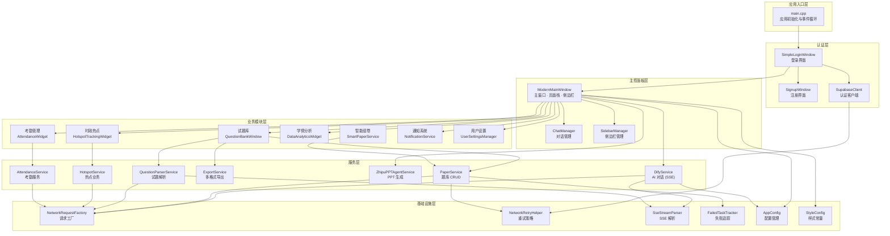
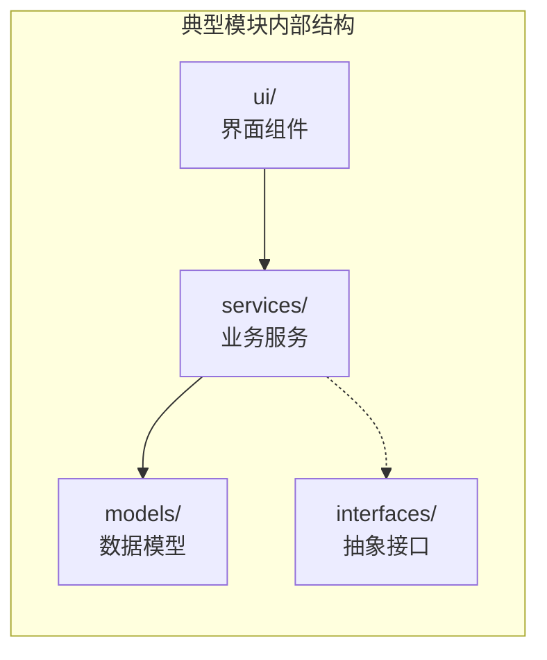
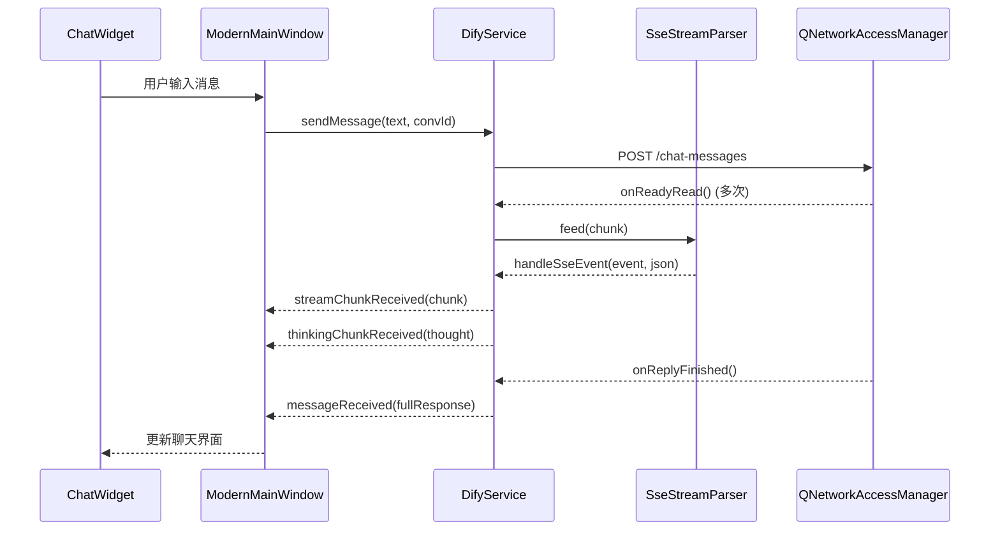

AI 思政智慧课堂系统采用 **Qt6/C++17** 技术栈，基于经典的 **分层架构（Layered Architecture）** 组织代码。整个系统从入口到基础设施被划分为六个职责清晰的层次：应用入口层、认证层、主控面板层、业务模块层、服务层与基础设施层。每一层只依赖其下方的层，严格避免反向依赖，从而保证了模块的可替换性和可测试性。

Sources: [CLAUDE.md](CLAUDE.md#L1-L15), [CMakeLists.txt](CMakeLists.txt#L1-L20)

## 全局架构总览

下面的 Mermaid 图展示了系统的六层架构以及各层之间的依赖关系。阅读此图时，请注意箭头方向始终从上层指向下层——上层调用下层提供的能力，而下层对上层一无所知。



Sources: [src/main/main.cpp](src/main/main.cpp#L68-L131), [src/dashboard/modernmainwindow.h](src/dashboard/modernmainwindow.h#L54-L301), [src/dashboard/modernmainwindow.cpp](src/dashboard/modernmainwindow.cpp#L1-L80)

## 六层职责详解

### 第一层：应用入口层（Application Entry）

应用入口层由单一文件 [main.cpp](src/main/main.cpp#L68-L131) 构成，承担三项初始化职责：创建 `QApplication` 并设置 Fusion 样式与全局调色板；从环境变量读取代理配置并通过 `configureApplicationProxy()` 应用到全局；创建并显示 `SimpleLoginWindow` 登录窗口作为用户交互的起点。入口层不包含任何业务逻辑，仅负责"将应用跑起来"。

Sources: [src/main/main.cpp](src/main/main.cpp#L68-L131)

### 第二层：认证层（Authentication）

认证层封装了用户身份验证的完整生命周期，由三个子模块组成：

| 子模块 | 核心类 | 职责 |
|--------|--------|------|
| 登录 | `SimpleLoginWindow` | 登录表单 UI、"记住我"功能、会话恢复 |
| 注册 | `SignupWindow` | 注册表单 UI、表单校验 |
| 后端客户端 | `SupabaseClient` | 封装 Supabase Auth REST API（登录/注册/密码重置/Token 刷新） |

认证层的关键设计在于 **信号驱动的状态传递**：`SupabaseClient` 通过 `loginSuccess(userId, email)` 信号通知 `SimpleLoginWindow` 登录结果，后者在槽函数中调用 `openMainWindow()` 将用户身份信息传递给 `ModernMainWindow`，完成从认证层到主控面板层的跳转。

Sources: [src/auth/login/simpleloginwindow.h](src/auth/login/simpleloginwindow.h#L24-L103), [src/auth/supabase/supabaseclient.h](src/auth/supabase/supabaseclient.h#L19-L96)

### 第三层：主控面板层（Dashboard）

`ModernMainWindow` 是整个应用的 **中枢控制器（Hub）**，采用 `QStackedWidget` 页面栈模式管理多个业务模块的切换。它的职责包括：

- **侧边栏导航**：通过 7 个功能按钮（教师中心、时政新闻、AI 备课、资源库、学情分析、考勤管理、数据分析）驱动页面切换
- **懒加载模块**：通过 `ensureQuestionBankWindow()`、`ensureHotspotWidget()` 等方法实现按需创建，避免启动时加载全部模块
- **AI 对话编排**：内嵌 `DifyService` 实例，直接管理流式对话、PPT 生成请求、教案编辑等 AI 交互流程
- **历史记录管理**：维护 `QHash<QString, AIHistoryEntry>` 对话历史，支持跨会话持久化

`ChatManager` 和 `SidebarManager` 作为辅助类，分别将对话逻辑和侧边栏状态管理从主窗口中解耦，减轻了 `ModernMainWindow` 的臃肿程度。

Sources: [src/dashboard/modernmainwindow.h](src/dashboard/modernmainwindow.h#L54-L301), [src/dashboard/ChatManager.h](src/dashboard/ChatManager.h#L1-L1), [src/dashboard/SidebarManager.h](src/dashboard/SidebarManager.h#L1-L1)

### 第四层：业务模块层（Business Modules）

业务模块层包含 7 个功能完整的子系统，每个子系统遵循统一的 **"模型-服务-界面"三元组**内部结构：



以考勤模块为例，其内部结构清晰地体现了这一模式：

| 层次 | 文件 | 职责 |
|------|------|------|
| 数据模型 | `models/AttendanceRecord.h` | 考勤记录结构体 |
| 数据模型 | `models/AttendanceSummary.h` | 统计汇总结构体 |
| 数据模型 | `models/AttendanceStatus.h` | 枚举常量定义 |
| 业务服务 | `services/AttendanceService.h` | Supabase REST API 封装 |
| 界面组件 | `ui/AttendanceWidget.h` | 考勤界面交互 |

各业务模块一览：

| 模块 | 入口类 | 核心能力 |
|------|--------|----------|
| 试题库 | `QuestionBankWindow` | 题目 CRUD、检索筛选、AI 出题、质量检测、试题篮 |
| 智能组卷 | `SmartPaperService` | 分阶段贪心选题、约束满足、换题功能 |
| 时政热点 | `HotspotTrackingWidget` | 新闻列表浏览、分类筛选、AI 教学内容生成 |
| 学情分析 | `DataAnalyticsWidget` | 个人/班级分析、雷达图、知识点掌握度 |
| 考勤管理 | `AttendanceWidget` | 学生列表、批量考勤提交、统计汇总 |
| 通知系统 | `NotificationService` | 消息拉取、未读计数、批量已读 |
| 用户设置 | `UserSettingsManager` | 个人信息管理、偏好配置 |

Sources: [src/attendance/services/AttendanceService.h](src/attendance/services/AttendanceService.h#L1-L100), [src/notifications/NotificationService.h](src/notifications/NotificationService.h#L1-L67), [src/smartpaper/SmartPaperService.h](src/smartpaper/SmartPaperService.h#L18-L78), [src/analytics/DataAnalyticsWidget.h](src/analytics/DataAnalyticsWidget.h#L1-L1)

### 第五层：服务层（Services）

服务层是业务模块与后端 API 之间的桥梁，每个服务类封装特定的远程调用逻辑。服务层的核心设计原则是 **一个服务对应一个外部系统或 API 端点族**：

| 服务类 | 对接系统 | 通信协议 | 核心能力 |
|--------|----------|----------|----------|
| `DifyService` | Dify Cloud | SSE 流式 | AI 对话、会话管理、应用信息 |
| `PaperService` | Supabase REST | HTTP JSON | 试卷/题目 CRUD、条件检索 |
| `QuestionParserService` | Dify Workflow | SSE 流式 | 文档解析为结构化试题 |
| `ZhipuPPTAgentService` | 智谱 GLM API | HTTP JSON | 三阶段 PPT 生成流水线 |
| `HotspotService` | INewsProvider | 接口抽象 | 新闻数据管理与 AI 联动 |
| `ExportService` | 本地 | 文件 I/O | HTML/DOCX/PDF 多格式导出 |
| `AttendanceService` | Supabase REST | HTTP JSON | 考勤记录 CRUD |
| `NotificationService` | Supabase REST | HTTP JSON | 通知拉取与状态管理 |

服务层的统一模式是：每个服务类持有自己的 `QNetworkAccessManager`，通过 `NetworkRequestFactory` 创建标准化请求，通过 Qt 信号/槽将异步结果传递给上层。这种模式确保了每个服务类的独立性和可替换性。

Sources: [src/services/DifyService.h](src/services/DifyService.h#L19-L185), [src/services/PaperService.h](src/services/PaperService.h#L80-L170), [src/services/ZhipuPPTAgentService.h](src/services/ZhipuPPTAgentService.h#L26-L187), [src/services/ExportService.h](src/services/ExportService.h#L14-L40)

### 第六层：基础设施层（Infrastructure）

基础设施层提供横切关注点的统一实现，被服务层和业务模块层广泛复用：

**网络基础设施** 是本层最核心的部分。`NetworkRequestFactory` 作为纯静态工具类，统一了 SSL 配置、HTTP/2 禁用、超时分级（认证 15s、数据操作 30s、AI 对话 120s、文件上传 300s）等策略，消除了各服务类中重复的网络配置代码。`NetworkRetryHelper` 以组合模式嵌入服务类，提供指数退避重试策略（默认 3 次，退避倍数 2.0，针对 500/502/503/504/408 状态码重试）。`FailedTaskTracker` 持久化重试耗尽后的写操作到 `QSettings`，支持后续手动重试。

**协议解析** 由 `SseStreamParser` 承担。这是一个纯解析工具（不持有网络连接），负责将 SSE 字节流解析为 `(event, QJsonObject)` 对，通过 `std::function` 回调将解析结果传递给调用方。`DifyService` 和 `QuestionParserService` 均内嵌 `SseStreamParser` 实例。

**配置管理** 由 `AppConfig` 按四级优先级加载配置值：环境变量 → 随包 `config.env` → 开发环境 `.env.local` → 编译时默认值。`StyleConfig` 命名空间则定义了全局颜色常量和圆角参数，供 UI 层统一引用。

Sources: [src/utils/NetworkRequestFactory.h](src/utils/NetworkRequestFactory.h#L24-L119), [src/utils/NetworkRetryHelper.h](src/utils/NetworkRetryHelper.h#L17-L65), [src/utils/SseStreamParser.h](src/utils/SseStreamParser.h#L26-L178), [src/utils/FailedTaskTracker.h](src/utils/FailedTaskTracker.h#L16-L52), [src/config/AppConfig.h](src/config/AppConfig.h#L8-L39), [src/shared/StyleConfig.h](src/shared/StyleConfig.h#L7-L55)

## 核心架构模式

### 接口抽象与策略模式

系统中有两个典型的接口抽象应用，遵循 **策略模式（Strategy Pattern）** 实现数据源的可替换性：

**`INewsProvider`** 定义了新闻获取的标准接口（`fetchHotNews`、`searchNews`、`fetchNewsDetail`、`refresh`），目前有 `MockNewsProvider`（本地模拟数据）和 `RealNewsProvider`（Dify AI 生成）两种实现。`HotspotService` 通过 `setNewsProvider()` 方法接受依赖注入，完全解耦了业务逻辑与数据来源。

**`IAnalyticsDataSource`** 定义了学情数据的标准接口（学生列表、成绩记录、知识点掌握度、班级排名等），目前有 `MockDataSource` 实现。未来对接真实数据库时，只需新增一个实现类即可，无需修改上层代码。

Sources: [src/hotspot/INewsProvider.h](src/hotspot/INewsProvider.h#L20-L79), [src/analytics/interfaces/IAnalyticsDataSource.h](src/analytics/interfaces/IAnalyticsDataSource.h#L18-L48), [src/services/HotspotService.h](src/services/HotspotService.h#L27-L41)

### Hub-and-Spoke 中心编排模式

`ModernMainWindow` 承担了 Hub（中枢）角色，所有业务模块（Spoke）通过它进行页面切换和状态协调。这种模式的优点是模块间零耦合——试题库不知道考勤模块的存在，时政热点不知道学情分析的存在——所有交互都通过主窗口中转。

但这一模式也带来了 **Hub 膨胀风险**：从 [modernmainwindow.h](src/dashboard/modernmainwindow.h#L165-L293) 可以看到，主窗口持有超过 50 个成员变量，涵盖 UI 组件、服务实例、状态标志等各类职责。项目通过引入 `ChatManager` 和 `SidebarManager` 开始了拆分重构，将部分编排逻辑从主窗口中提取出来。

Sources: [src/dashboard/modernmainwindow.h](src/dashboard/modernmainwindow.h#L165-L293)

### 信号/槽事件驱动通信

整个系统基于 Qt 的 **信号/槽机制** 实现松耦合的异步通信。以 AI 对话流程为例：



每个服务类通过 `requestStarted()` / `requestFinished()` 信号对让上层感知请求生命周期，通过 `errorOccurred(QString)` 统一错误传递，形成了统一的事件契约。

Sources: [src/services/DifyService.h](src/services/DifyService.h#L91-L150), [src/utils/SseStreamParser.h](src/utils/SseStreamParser.h#L38-L61)

## 模块间依赖关系

下表总结了主要模块之间的编译期依赖关系。行表示依赖方，列表示被依赖方：

| 依赖方 ↓ / 被依赖方 → | PaperService | DifyService | NetworkRequestFactory | SseStreamParser | AppConfig |
|---|:---:|:---:|:---:|:---:|:---:|
| QuestionBankWindow | ✓ | | | | |
| SmartPaperService | ✓ | | | | |
| QuestionParserService | ✓ | | | ✓ | |
| ZhipuPPTAgentService | | | ✓ | | |
| HotspotService | | ✓ | | | |
| DifyService | | | ✓ | ✓ | ✓ |
| PaperService | | | ✓ | | |
| SupabaseClient | | | | | ✓ |

可以看到，`PaperService` 和 `DifyService` 是系统中被依赖最多的两个服务——前者支撑了试题库、智能组卷、试题解析三大功能模块，后者支撑了 AI 对话、热点内容生成等 AI 驱动能力。`NetworkRequestFactory` 和 `SseStreamParser` 作为基础设施组件，被多个服务类共享。

Sources: [src/services/QuestionParserService.h](src/services/QuestionParserService.h#L1-L10), [src/smartpaper/SmartPaperService.h](src/smartpaper/SmartPaperService.h#L9-L9), [src/services/DifyService.h](src/services/DifyService.h#L12-L12), [src/services/PaperService.h](src/services/PaperService.h#L13-L13)

## 目录结构与层次映射

项目的 `src/` 目录直接映射到架构层次，每个子目录对应一个架构层或功能模块：

```
src/
├── main/                          # 第一层：应用入口
│   └── main.cpp
├── auth/                          # 第二层：认证
│   ├── login/                     #   登录窗口 + Supabase 认证
│   ├── signup/                    #   注册窗口
│   └── supabase/                  #   Supabase 客户端与配置
├── dashboard/                     # 第三层：主控面板
│   ├── modernmainwindow.*         #   主窗口 (Hub)
│   ├── ChatManager.*              #   对话管理 (解耦)
│   └── SidebarManager.*          #   侧边栏管理 (解耦)
├── questionbank/                  # 第四层：业务模块 - 试题库
├── smartpaper/                    # 第四层：业务模块 - 智能组卷
├── hotspot/                       # 第四层：业务模块 - 时政热点
├── analytics/                     # 第四层：业务模块 - 学情分析
│   ├── interfaces/                #   IAnalyticsDataSource 接口
│   ├── models/                    #   Student, ScoreRecord 等模型
│   ├── datasources/               #   MockDataSource 实现
│   └── ui/                        #   雷达图、分析页面
├── attendance/                    # 第四层：业务模块 - 考勤
│   ├── models/
│   ├── services/
│   └── ui/
├── notifications/                 # 第四层：业务模块 - 通知
│   ├── models/
│   └── ui/
├── settings/                      # 第四层：业务模块 - 用户设置
├── services/                      # 第五层：服务层
│   ├── DifyService.*              #   AI 对话服务
│   ├── PaperService.*             #   题库数据服务
│   ├── QuestionParserService.*    #   试题解析服务
│   ├── ZhipuPPTAgentService.*     #   PPT 生成服务
│   ├── HotspotService.*           #   热点业务服务
│   ├── ExportService.*            #   多格式导出
│   ├── DocxGenerator.*            #   DOCX 生成器
│   └── ...
├── ui/                            # 通用 UI 组件
│   ├── ChatWidget.*               #   聊天气泡组件
│   ├── AIChatDialog.*             #   AI 对话框
│   ├── LessonPlanEditor.*         #   教案编辑器
│   └── ...
├── utils/                         # 第六层：基础设施
│   ├── NetworkRequestFactory.*    #   请求工厂
│   ├── NetworkRetryHelper.*       #   重试策略
│   ├── SseStreamParser.h          #   SSE 解析器
│   ├── FailedTaskTracker.*        #   失败追踪
│   └── MarkdownRenderer.*        #   Markdown 渲染
├── config/                        # 第六层：配置
│   ├── AppConfig.*                #   多级配置加载
│   └── embedded_keys.h            #   编译时密钥
└── shared/                        # 第六层：共享常量
    └── StyleConfig.h              #   全局样式常量
```

Sources: [CMakeLists.txt](CMakeLists.txt#L55-L200), [CLAUDE.md](CLAUDE.md#L42-L70)

## 架构设计决策总结

| 决策 | 选择 | 理由 |
|------|------|------|
| 主窗口模式 | Hub-and-Spoke + QStackedWidget | 业务模块零耦合，页面切换高效 |
| 异步通信 | Qt 信号/槽 | 天然支持跨线程、松耦合、生命周期安全 |
| 网络请求标准化 | NetworkRequestFactory 静态工厂 | 消除 SSL/HTTP2/超时的重复配置 |
| 数据源可替换性 | 接口抽象（INewsProvider、IAnalyticsDataSource） | 支持Mock测试和未来对接真实数据 |
| 流式协议处理 | SseStreamParser 纯工具类 | 解析逻辑与业务逻辑分离，可独立测试 |
| 配置管理 | 四级优先级加载 | 开发环境灵活、生产环境随包分发 |
| 模块懒加载 | ensure*() 延迟创建模式 | 减少启动时间，按需分配资源 |
| 失败恢复 | FailedTaskTracker 持久化 | 网络不稳定时保证写操作不丢失 |

---

**下一步阅读建议**：

- 了解应用从登录到主窗口的完整启动流程 → [应用启动与导航流程：从登录窗口到主工作台](5-ying-yong-qi-dong-yu-dao-hang-liu-cheng-cong-deng-lu-chuang-kou-dao-zhu-gong-zuo-tai)
- 深入配置管理的多级加载机制 → [配置管理：AppConfig 多级配置加载与环境变量机制](6-pei-zhi-guan-li-appconfig-duo-ji-pei-zhi-jia-zai-yu-huan-jing-bian-liang-ji-zhi)
- 探索网络基础设施的统一设计 → [网络基础设施：请求工厂、重试策略与失败任务追踪](8-wang-luo-ji-chu-she-shi-qing-qiu-gong-han-zhong-shi-ce-lue-yu-shi-bai-ren-wu-zhui-zong)