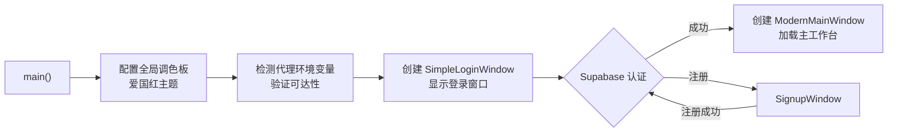

本文档为 **AI 思政智慧课堂系统** 的全景总览。你将在这里了解系统"是什么"、"为什么这样设计"，以及"由哪些核心部分构成"。文档面向初入项目的开发者，旨在帮助你快速建立对整个系统的宏观认知，为后续深入各模块细节奠定基础。

Sources: [README.md](README.md#L1-L12), [CLAUDE.md](CLAUDE.md#L1-L10)

---

## 系统定位与目标

**AI 思政智慧课堂系统** 是一个基于 Qt 6 / C++17 的桌面端教学辅助应用，专门面向高校"思想道德与法治"等思政课堂场景。系统将 **AI 对话能力、试题库管理、智能组卷、教案编辑、学情分析、考勤管理** 等教学功能统一整合到一个现代化桌面工作台中，旨在为思政课教师提供从备课到授课再到教学评估的一站式数字化工具。

系统的核心设计目标可以概括为三个关键词：

| 设计目标 | 具体体现 |
|---------|---------|
| **AI 原生** | 集成 Dify AI 平台的流式对话与工作流 API，AI 不是"附加功能"而是贯穿备课、出题、PPT 生成的核心引擎 |
| **课堂实用** | 考勤、通知、试题库、学情分析等模块直接对标真实教学场景，而非技术演示 |
| **开箱即用** | 支持 macOS / Windows 双平台打包发布，发布版本通过内嵌密钥实现免配置启动，也支持 GitHub Actions 自动化构建分发 |

从启动链路看，用户打开应用后首先进入登录界面，登录成功后加载主工作台，整个过程仅涉及一个可执行文件 `AILoginSystem.app` / `AILoginSystem.exe`。

Sources: [main.cpp](src/main/main.cpp#L68-L131), [README.md](README.md#L1-L12)

---

## 技术栈全景

系统采用 **C++17 + Qt 6 桌面技术栈**，后端能力通过云端 API 获取，本地不依赖数据库。下表列出了所有关键技术组件及其在本项目中的具体用途：

| 技术领域 | 技术选型 | 项目中的用途 |
|---------|---------|------------|
| **UI 框架** | Qt 6 Widgets | 主窗口、侧边栏、卡片式布局、表单控件 |
| **网络通信** | Qt 6 Network | HTTPS 请求、SSE 流式连接、文件上传 |
| **图表可视化** | Qt 6 Charts | 学情数据柱状图、雷达图、趋势折线图 |
| **富文本渲染** | MD4C (第三方) + Qt TextBrowser | Markdown 转 HTML 显示，AI 回复内容渲染 |
| **矢量图形** | Qt 6 Svg / SvgWidgets | SVG 图标加载与渲染 |
| **QML 嵌入** | Qt 6 QuickWidgets | 部分数据分析卡片使用 QML 渲染 |
| **AI 服务** | Dify Cloud API | 流式对话 (`/chat-messages`)、工作流 (`/workflows/run`) |
| **认证/数据** | Supabase (PostgreSQL) | 邮箱登录注册、Token 管理、考勤/通知 CRUD |
| **PPT 生成** | 讯飞智文 API / 智谱 Agent / 自研 XML+ZIP | 多通道 PPT 文件生成 |
| **构建系统** | CMake 3.16+ | 多目标构建、Qt MOC/UIC/RCC 自动化 |
| **CI/CD** | GitHub Actions | Tag 触发自动构建 macOS DMG 和 Windows 安装包 |

Sources: [CMakeLists.txt](CMakeLists.txt#L1-L14), [README.md](README.md#L48-L56)

---

## 系统架构总览

理解一个系统的最佳方式是看清它的 **层次划分** 和 **数据流向**。AI 思政智慧课堂系统采用经典的 **三层架构**，从上到下依次是 UI 展示层、业务服务层、网络与工具基础设施层。每一层只依赖其下层，不存在反向调用。

下面的 Mermaid 图展示了系统各层的核心组件及其依赖关系。如果你是第一次接触 Mermaid，只需理解：**箭头从调用方指向被调用方**，代表"谁在使用谁"。

```mermaid
graph TD
    subgraph UI["🖥️ UI 展示层"]
        Login["SimpleLoginWindow<br/>登录窗口"]
        Dashboard["ModernMainWindow<br/>主工作台"]
        QB["QuestionBankWindow<br/>试题库管理"]
        AI["AIPreparationWidget<br/>AI 备课"]
        Chat["ChatWidget<br/>AI 对话气泡"]
        LP["LessonPlanEditor<br/>教案编辑器"]
        Analytics["DataAnalyticsWidget<br/>学情分析"]
        Attend["AttendanceWidget<br/>考勤管理"]
        Notif["NotificationWidget<br/>通知中心"]
        Hotspot["HotspotTrackingWidget<br/>时政热点"]
        SmartPaper["SmartPaperWidget<br/>智能组卷"]
    end

    subgraph Service["⚙️ 业务服务层"]
        Dify["DifyService<br/>AI 对话引擎"]
        QParser["QuestionParserService<br/>文档解析工作流"]
        Paper["PaperService<br/>试题云端 CRUD"]
        Export["ExportService<br/>HTML/DOCX/PDF 导出"]
        SP["SmartPaperService<br/>贪心选题算法"]
        PPTX["PPTXGenerator<br/>PPT 文件构建"]
        AttendSvc["AttendanceService<br/>考勤 CRUD"]
        NotifSvc["NotificationService<br/>通知 CRUD"]
        HotspotSvc["HotspotService<br/>热点聚合"]
        AnalyticsSvc["AnalyticsDataService<br/>学情统计"]
    end

    subgraph Infra["🔧 网络与工具层"]
        NWF["NetworkRequestFactory<br/>统一请求创建"]
        SSE["SseStreamParser<br/>SSE 协议解析"]
        Retry["NetworkRetryHelper<br/>指数退避重试"]
        Config["AppConfig<br/>配置加载"]
        Auth["SupabaseClient<br/>认证客户端"]
        MD["MarkdownRenderer<br/>Markdown 渲染"]
    end

    %% UI -> Service
    Dashboard --> Dify
    Dashboard --> Chat
    Dashboard --> HotspotSvc
    Dashboard --> AnalyticsSvc
    Dashboard --> AttendSvc
    Dashboard --> NotifSvc
    AI --> Dify
    AI --> QParser
    QB --> Paper
    QB --> Export
    SmartPaper --> SP
    SP --> Paper
    Login --> Auth

    %% Service -> Infra
    Dify --> NWF
    Dify --> SSE
    QParser --> NWF
    QParser --> SSE
    Paper --> NWF
    Auth --> NWF
    Auth --> Retry
    AttendSvc --> NWF
    NotifSvc --> NWF
    HotspotSvc --> NWF
    Export --> MD

    %% Style
    classDef uiStyle fill:#E3F2FD,stroke:#1565C0,color:#0D47A1
    classDef svcStyle fill:#FFF3E0,stroke:#E65100,color:#BF360C
    classDef infraStyle fill:#E8F5E9,stroke:#2E7D32,color:#1B5E20
    class Login,Dashboard,QB,AI,Chat,LP,Analytics,Attend,Notif,Hotspot,SmartPaper uiStyle
    class Dify,QParser,Paper,Export,SP,PPTX,AttendSvc,NotifSvc,HotspotSvc,AnalyticsSvc svcStyle
    class NWF,SSE,Retry,Config,Auth,MD infraStyle
```



### 应用启动流程

应用的完整启动路径清晰且线性，从 `main()` 函数出发，经历代理配置、主题设置，最终展示登录窗口：



Sources: [main.cpp](src/main/main.cpp#L68-L131), [modernmainwindow.h](src/dashboard/modernmainwindow.h#L51-L60), [simpleloginwindow.h](src/auth/login/simpleloginwindow.h#L24-L29)

---

## 功能模块概览

系统围绕思政课堂教学的完整生命周期，划分为以下核心功能模块。每个模块在代码中对应一个独立的目录，拥有自己的 UI 组件和服务层。

### 用户认证模块 (`src/auth`)

实现基于 **Supabase** 的完整认证链路，包括邮箱登录、新用户注册、密码重置和 Token 刷新。登录窗口支持"记住我"功能，通过 `QSettings` 持久化凭据。认证成功后，`userId` 和 `accessToken` 会传递给后续的所有需要身份验证的模块。核心类包括 `SimpleLoginWindow`（登录界面）、`SignupWindow`（注册界面）、`SupabaseClient`（认证客户端）和 `SupabaseConfig`（配置读取）。

### AI 教学能力 (`src/services` + `src/ui`)

这是系统的核心差异化能力。通过 `DifyService` 与 Dify Cloud API 通信，支持 **SSE 流式对话**（用户可以看到 AI 逐字输出回复）和 **工作流调用**（用于文档解析生成试题）。`QuestionParserService` 负责将上传的文档（DOCX、PDF）通过 AI 工作流解析为结构化的试题数据。`AIPreparationWidget` 提供完整的 AI 备课界面，`LessonPlanEditor` 提供教案编辑能力。

### 试题库与智能组卷 (`src/questionbank` + `src/smartpaper`)

试题库管理涵盖题目录入、分类筛选、质量检查（`QualityCheckDialog`）、题目篮子（`QuestionBasket`）和试卷编排（`PaperComposerDialog`）。`SmartPaperService` 实现了基于 **分阶段贪心算法** 的智能组卷引擎，可以根据知识点覆盖、难度分布等约束条件自动选题，并支持"换一题"操作。`QuestionRepository` 作为本地题库仓库，`PaperService` 负责与云端题库交互。

### 试卷导出 (`src/services`)

`ExportService` 支持将组好的试卷导出为 **HTML、DOCX、PDF** 三种格式。`DocxGenerator` 负责生成真正的 `.docx` 文件（基于 ZIP + XML），PDF 导出通过 Qt 的 `QPrinter` 实现。整个导出管道与试题数据模型 `PaperQuestion` 紧密耦合。

### PPT 生成 (`src/services`)

系统提供三种 PPT 生成通道：`PPTXGenerator` 是自研的原生 PPTX 构建器（基于 XML + ZIP 打包），`XunfeiPPTService` 对接讯飞智文 API，`ZhipuPPTAgentService` 对接智谱 Agent 服务。用户可通过 AI 对话交互式地生成课件演示文稿。

### 学情数据分析 (`src/analytics`)

`AnalyticsDataService` 采用单例模式，提供课堂参与度、作业完成率、目标达成率等核心指标。UI 层包含个人分析页（`PersonalAnalyticsPage`）、班级分析页（`ClassAnalyticsPage`）、雷达图（`RadarChartWidget`）和知识点图谱（`KnowledgeGraphWidget`）。当前使用模拟数据，架构上预留了 `IAnalyticsDataSource` 接口以便对接真实数据源。

### 考勤管理 (`src/attendance`)

`AttendanceService` 通过 Supabase REST API 实现完整的考勤 CRUD 操作，包括按班级获取学生列表、按课次查询考勤记录、批量提交考勤和统计汇总。`AttendanceWidget` 提供可视化的考勤操作界面。代码注释中提到该模块参考了 `NotificationService` 的模式。

### 通知中心 (`src/notifications`)

`NotificationService` 同样基于 Supabase REST API，支持获取通知列表、未读计数、单条/批量标记已读、删除通知等操作。UI 层包含 `NotificationWidget`（通知面板）和 `NotificationBadge`（顶部工具栏的红点计数器）。

### 时政热点追踪 (`src/hotspot`)

采用 **策略模式** 设计，定义了 `INewsProvider` 抽象接口，当前实现了 `MockNewsProvider`（模拟数据）和 `RealNewsProvider`（天行数据 API）。这种设计使得切换数据源只需替换 Provider 实例，不影响上层 UI 逻辑。`NewsCategoryUtils` 负责新闻分类的工具方法。

Sources: [supabaseclient.h](src/auth/supabase/supabaseclient.h#L19-L26), [DifyService.h](src/services/DifyService.h#L18-L50), [SmartPaperService.h](src/smartpaper/SmartPaperService.h#L18-L50), [ExportService.h](src/services/ExportService.h#L14-L40), [PPTXGenerator.h](src/services/PPTXGenerator.h#L17-L56), [AnalyticsDataService.h](src/analytics/AnalyticsDataService.h#L15-L60), [AttendanceService.h](src/attendance/services/AttendanceService.h#L16-L50), [NotificationService.h](src/notifications/NotificationService.h#L14-L39), [INewsProvider.h](src/hotspot/INewsProvider.h#L20-L50)

---

## 外部服务依赖

系统依赖两个核心云服务，理解它们的角色定位对后续开发至关重要：

| 外部服务 | 角色 | 配置变量 | 使用的模块 |
|---------|------|---------|-----------|
| **Dify Cloud** | AI 对话引擎 + 工作流引擎 | `DIFY_API_KEY`、`PARSER_API_KEY` | AI 对话、文档解析、AI 备课 |
| **Supabase** | 认证后端 + 数据存储 | `SUPABASE_URL`、`SUPABASE_ANON_KEY` | 登录注册、考勤、通知、试题云端存储 |

这两个服务的 API Key 通过 `AppConfig` 按优先级加载：**环境变量 > 随包配置文件 `config.env` > 开发环境 `.env.local` > 编译时默认值**。发布版本通过打包脚本将密钥写入 `embedded_keys.h`，用户无需任何手动配置。

Sources: [AppConfig.h](src/config/AppConfig.h#L7-L38), [.env.example](.env.example#L1-L21), [embedded_keys.h.example](src/config/embedded_keys.h.example#L1-L18)

---

## 项目目录地图

以下树形图展示了源代码的核心目录结构，帮助你快速定位"某个功能在哪个文件夹"。每个顶层目录对应一个独立的功能域：

```
src/
├── main/                    # 应用入口 (main.cpp)
├── auth/                    # 用户认证
│   ├── login/              #   SimpleLoginWindow — 登录界面
│   ├── signup/             #   SignupWindow — 注册界面
│   └── supabase/           #   SupabaseClient + SupabaseConfig
├── dashboard/              # 主工作台
│   ├── ModernMainWindow    #   核心主窗口，编排所有模块页面
│   ├── ChatManager         #   AI 对话状态管理
│   └── SidebarManager      #   侧边栏导航逻辑
├── questionbank/           # 试题库管理
│   ├── QuestionRepository  #   本地题库仓库
│   ├── QuestionBasket      #   题目篮子
│   └── QualityCheckDialog  #   质量检查对话框
├── smartpaper/             # 智能组卷
│   └── SmartPaperService   #   贪心选题算法引擎
├── services/               # 业务服务层 (15+ 服务类)
│   ├── DifyService         #   AI 对话 (SSE 流式)
│   ├── QuestionParserService #  文档解析工作流
│   ├── PaperService        #   试题云端 CRUD
│   ├── ExportService       #   试卷多格式导出
│   ├── PPTXGenerator       #   原生 PPTX 构建
│   └── ...                 #   讯飞PPT、智谱PPT、热点等
├── analytics/              # 学情数据分析
│   ├── models/             #   Student、ScoreRecord 等数据模型
│   ├── interfaces/         #   IAnalyticsDataSource 抽象接口
│   ├── datasources/        #   MockDataSource 实现
│   └── ui/                 #   个人/班级分析页、雷达图、知识图谱
├── attendance/             # 考勤管理
│   ├── models/             #   AttendanceRecord、AttendanceSummary
│   ├── services/           #   AttendanceService (Supabase CRUD)
│   └── ui/                 #   AttendanceWidget
├── notifications/          # 通知中心
│   ├── models/             #   Notification 数据模型
│   ├── services/           #   NotificationService
│   └── ui/                 #   NotificationWidget + Badge
├── hotspot/                # 时政热点追踪
│   ├── INewsProvider       #   抽象接口 (策略模式)
│   ├── MockNewsProvider    #   模拟数据源
│   └── RealNewsProvider    #   天行数据 API
├── ui/                     # 通用 UI 组件
│   ├── ChatWidget          #   气泡样式聊天
│   ├── AIPreparationWidget #   AI 备课页面
│   ├── LessonPlanEditor    #   教案编辑器
│   └── HotspotTrackingWidget # 热点追踪页面
├── utils/                  # 工具基础设施
│   ├── NetworkRequestFactory # 统一请求创建
│   ├── SseStreamParser     #   SSE 协议解析器
│   ├── NetworkRetryHelper  #   指数退避重试
│   └── MarkdownRenderer    #   Markdown 渲染
├── config/                 # 配置管理
│   ├── AppConfig           #   统一配置加载器
│   └── embedded_keys       #   发布版内嵌密钥
└── settings/               # 用户设置
    ├── UserSettingsManager #   设置持久化
    └── UserSettingsDialog  #   设置对话框
```

Sources: [CMakeLists.txt](CMakeLists.txt#L15-L163), [README.md](README.md#L118-L147)

---

## 推荐阅读路径

作为初入项目的开发者，建议按照以下顺序阅读文档，从宏观到微观逐步深入：

1. **👉 [快速上手：环境准备与首次构建运行](2-kuai-su-shang-shou-huan-jing-zhun-bei-yu-shou-ci-gou-jian-yun-xing)** — 搭建开发环境，完成第一次构建运行
2. **👉 [项目目录结构与模块职责速查](3-xiang-mu-mu-lu-jie-gou-yu-mo-kuai-zhi-ze-su-cha)** — 深入理解每个目录的职责边界
3. **👉 [环境变量与密钥配置指南](4-huan-jing-bian-liang-yu-mi-yao-pei-zhi-zhi-nan-env-appconfig-embedded_keys)** — 理解配置加载机制，正确设置 API Key

在完成入门指南后，可以按照兴趣选择深入模块：

- **架构理解**：[分层架构总览](5-fen-ceng-jia-gou-zong-lan-ui-ceng-fu-wu-ceng-wang-luo-yu-gong-ju-ceng) → [主工作台 ModernMainWindow](6-zhu-gong-zuo-tai-modernmainwindow-dao-hang-ye-mian-zhan-yu-mo-kuai-bian-pai) → [统一配置加载机制](7-tong-pei-zhi-jia-zai-ji-zhi-appconfig-huan-jing-bian-liang-sui-bao-pei-zhi-kai-fa-pei-zhi)
- **AI 能力线**：[Supabase 认证](8-supabase-ren-zheng-ji-cheng-deng-lu-zhu-ce-mi-ma-zhong-zhi-yu-token-guan-li) → [DifyService](10-difyservice-sse-liu-shi-dui-hua-duo-shi-jian-lei-xing-chu-li-yu-hui-hua-guan-li) → [SseStreamParser](11-ssestreamparser-chun-xie-yi-ceng-sse-jie-xi-qi-de-she-ji-yu-shi-yong)
- **教学业务线**：[试题库管理](13-shi-ti-ku-guan-li-ti-mu-lu-ru-lan-zi-zhi-liang-jian-cha-yu-pi-liang-dao-ru) → [智能组卷引擎](14-zhi-neng-zu-juan-yin-qing-smartpaperservice-tan-xin-xuan-ti-suan-fa-yu-huan-ti-ji-zhi) → [试卷导出管道](16-shi-juan-dao-chu-guan-dao-exportservice-de-html-docx-pdf-duo-ge-shi-sheng-cheng)
- **发布上线**：[CMake 构建配置](25-cmake-gou-jian-pei-zhi-jie-xi-qt-mo-kuai-yi-lai-yu-ping-tai-bundle-she-zhi) → [跨平台打包](26-kua-ping-tai-da-bao-liu-cheng-macos-dmg-yu-windows-inno-setup-an-zhuang-bao) → [GitHub Actions 自动发布](27-github-actions-zi-dong-fa-bu-tag-hong-fa-mi-yao-nei-qian-yu-chan-wu-shang-chuan)