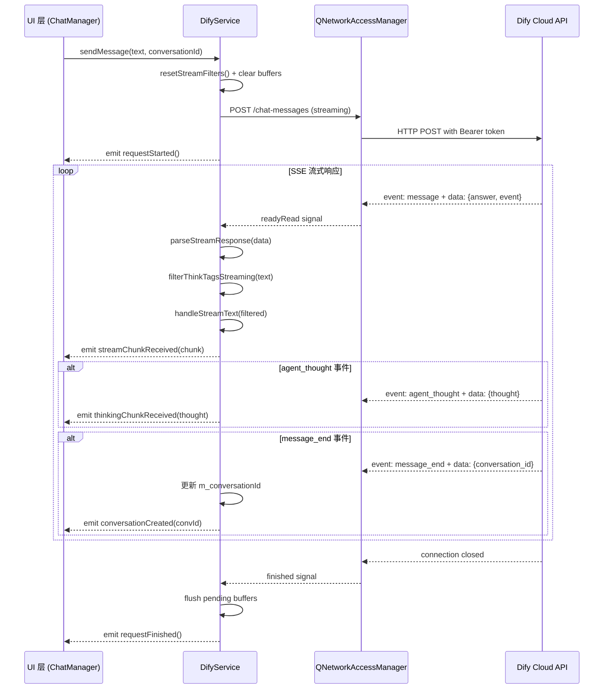

`DifyService` 是本项目与 **Dify Cloud 对话 API** 交互的核心服务层类。它封装了完整的 SSE（Server-Sent Events）流式通信协议，处理 Dify Agent 返回的多种事件类型（`message`、`agent_message`、`agent_thought`、`text_chunk` 等），并提供会话生命周期管理（创建、续接、历史查询、清除）。作为系统中被最广泛依赖的 AI 服务，它被 ChatManager、AIChatDialog、LessonPlanEditor、HotspotService、QuestionQualityService、DataAnalyticsWidget 等十余个组件直接引用，是理解整个 AI 交互管道的关键入口。

Sources: [DifyService.h](src/services/DifyService.h#L1-L179), [DifyService.cpp](src/services/DifyService.cpp#L1-L657)

## 架构定位与信号流

从分层架构的视角看，`DifyService` 位于**服务层**，向上通过 Qt 信号/槽机制向 UI 层（ChatManager、ChatWidget）推送流式数据，向下通过 `NetworkRequestFactory` 构建标准化的 HTTP 请求与 Dify Cloud 通信。它不持有任何 UI 引用，也不直接操作界面组件，保持了纯粹的业务服务职责。

下面的 Mermaid 图展示了 `DifyService` 在一次完整对话中的数据流与信号发射时序。在阅读此图之前，你需要了解三个核心概念：**SSE 流**（服务器端推送的文本流，以 `event:` / `data:` 行分隔）、**流式文本**（逐 chunk 到达的 AI 回复片段）、**会话 ID**（Dify 服务器在首次对话后返回的 `conversation_id`，用于续接上下文）。



Sources: [DifyService.cpp L69-L138](src/services/DifyService.cpp#L69-L138), [ChatManager.cpp L75-L112](src/dashboard/ChatManager.cpp#L75-L112)

## 核心方法与职责矩阵

`DifyService` 的公共 API 设计遵循**单一职责的命令模式**——每个方法对应一个明确的 Dify API 端点操作，所有结果通过信号异步通知。下面的表格概括了全部公共方法及其对应的 API 端点和职责。

| 方法 | HTTP 方法 | API 端点 | 核心职责 |
|---|---|---|---|
| `sendMessage(msg, convId)` | POST | `/chat-messages` | 发送对话消息，强制 streaming 模式，触发 SSE 流 |
| `fetchConversations(limit)` | GET | `/conversations` | 获取用户对话列表，按更新时间降序 |
| `fetchMessages(convId, limit)` | GET | `/messages` | 获取指定对话的消息历史 |
| `fetchAppInfo()` | GET | `/meta` | 获取应用元数据（名称、开场白） |
| `clearConversation()` | — | — | 清空本地 `m_conversationId`，下次发消息创建新会话 |
| `setApiKey(key)` | — | — | 设置 Bearer Token |
| `setBaseUrl(url)` | — | — | 覆盖默认 `https://api.dify.ai/v1` |
| `setCurrentConversationId(id)` | — | — | 从外部注入会话 ID（用于加载历史对话后续接） |

Sources: [DifyService.h L26-L83](src/services/DifyService.h#L26-L83)

## SSE 流式解析引擎

`DifyService` 在内部实现了一套完整的 SSE 协议解析器（`parseStreamResponse`），负责将 QNetworkReply 的原始字节流解析为结构化的 JSON 事件。这套解析器**独立于**项目中另一个通用解析器 `SseStreamParser`（详见 [SseStreamParser：纯协议层 SSE 解析器的设计与使用](11-ssestreamparser-chun-xie-yi-ceng-sse-jie-xi-qi-de-she-ji-yu-shi-yong)），是 DifyService 为满足自身特定需求而做的内联实现。

### 三级缓冲机制

SSE 数据在网络传输中可能被 TCP 分片，导致一次 `readyRead` 回调收到的数据在任意位置被截断。`DifyService` 使用三个缓冲变量来保证协议完整性：

| 缓冲变量 | 类型 | 职责 |
|---|---|---|
| `m_streamBuffer` | `QString` | 存储不完整的最后一行（跨 chunk 的行级拼接） |
| `m_sseEvent` | `QString` | 缓存 `event:` 行的值（Dify 的 `event` 可能通过 `event:` 行或 JSON 字段传递） |
| `m_sseDataLines` | `QStringList` | 累积同一事件的多行 `data:` 内容（SSE 协议允许多行 data 拼接） |

解析流程的核心逻辑是：按 `\n` 分割数据 → 识别 `event:` / `data:` / 空行（事件边界） → 空行触发 `flushEvent` → 合并 data 行并解析 JSON。当连接结束时，`forceFlush`（传入空 `QByteArray`）确保残留缓冲被强制刷新。

Sources: [DifyService.cpp L390-L516](src/services/DifyService.cpp#L390-L516), [DifyService.h L169-L174](src/services/DifyService.h#L169-L174)

### 与 SseStreamParser 的关系

项目中存在两套 SSE 解析实现。`SseStreamParser` 是一个独立的、无状态的纯工具类，通过回调函数 `EventHandler` 分发解析结果；而 `DifyService::parseStreamResponse` 是内联实现，直接访问成员变量并发射 Qt 信号。两者解析逻辑等价（行分割 → 事件/数据识别 → 空行触发刷新），但 `DifyService` 的内联版本省去了回调中间层，可以直接操作 `handleStreamText` 和 `filterThinkTagsStreaming` 等成员方法，适合在单一服务内部使用。`SseStreamParser` 则更适合被多个不同服务复用的场景。

Sources: [SseStreamParser.h](src/utils/SseStreamParser.h#L1-L178), [DifyService.cpp L390-L516](src/services/DifyService.cpp#L390-L516)

## 多事件类型处理

Dify Agent API 在 SSE 流中会发射多种事件类型，每种携带不同的数据结构。`DifyService` 通过 `processEvent` lambda（定义在 `parseStreamResponse` 内部）对所有已知事件类型做分发处理，**未识别的事件被静默忽略**。

| 事件类型 | 数据字段 | 处理方式 | 发射的信号 |
|---|---|---|---|
| `message` | `answer` | 经过 tag 过滤后流式输出 | `streamChunkReceived` |
| `agent_message` | `answer` | 与 `message` 相同处理（调用 `handleStreamText`） | `streamChunkReceived` |
| `agent_thought` | `thought` | 直接透传思考内容 | `thinkingChunkReceived` |
| `text_chunk` | `data.text` 或 `text` | 兼容两种字段位置，统一流式输出 | `streamChunkReceived` |
| `message_end` | `conversation_id` | 更新本地会话 ID，新会话时通知 UI | `conversationCreated` |
| `error` | `message` | 直接报告错误 | `errorOccurred` |
| `workflow_started` / `node_started` / `node_finished` / `workflow_finished` | — | 静默忽略（工作流内部状态） | 无 |

### handleStreamText：统一的流式文本处理器

`message`、`agent_message`、`text_chunk` 三种事件虽然来源不同，但最终都需要执行相同的处理管线：tag 过滤 → 长度限制 → 累积完整响应 → 发射信号。`handleStreamText` 方法正是为了消除这三处的重复逻辑而抽取的统一入口。它依次执行以下检查：

1. **内容截断守卫**：如果 `m_ignoreFurtherContent` 已被标记（之前已触发截断），直接返回
2. **Think 标签过滤**：调用 `filterThinkTagsStreaming` 移除 `<think >/` 和 `<analysis>/</analysis>` 块
3. **最大长度限制**：`m_maxResponseChars` 默认 10000 字符，超出时追加省略号并设置 `m_ignoreFurtherContent = true`

Sources: [DifyService.cpp L405-L464](src/services/DifyService.cpp#L405-L464), [DifyService.cpp L273-L310](src/services/DifyService.cpp#L273-L310)

## Think 标签流式过滤

许多大语言模型（如 DeepSeek）在推理过程中会输出 `<think >...</think >` 或 `<analysis >...</analysis >` 等隐藏标签包裹的思考过程。这些内容不应展示给最终用户，但问题在于——**SSE 流可能在标签的任意位置将文本切断**。

`filterThinkTagsStreaming` 方法实现了一个**跨 chunk 的有状态标签过滤器**，其核心设计包括：

- **`m_hiddenTagName`**：当前正处于隐藏块中的标签名（如 `think`）。一旦匹配到开始标签 `<think >`，后续文本被静默丢弃，直到遇到对应的结束标签 `</think >`
- **`m_tagRemainder`**：保留输入文本末尾可能的不完整标签片段。例如 chunk 以 `<thi` 结尾，这个片段被缓存到下次拼接，避免跨 chunk 的标签被遗漏
- **`partialSuffixLength`** 辅助函数：对所有已知标签 token（`<think >`、`</think >`、`<analysis >`、`</analysis >`）计算文本末尾的最大匹配前缀长度

这种设计保证了即使在最不利的网络分片条件下，隐藏标签也能被完整识别和过滤，而不会将残留的标签片段泄露到用户界面。

Sources: [DifyService.cpp L312-L388](src/services/DifyService.cpp#L312-L388), [DifyService.h L258-L259](src/services/DifyService.h#L258-L259)

## 会话管理与用户身份

### 持久化用户 ID

Dify API 要求每个请求携带 `user` 字段用于标识终端用户。`DifyService` 在构造函数中通过 `QSettings` 实现了**跨会话的持久化用户 ID**：首次运行时生成 UUID 并保存，后续启动直接读取。这保证了同一设备上的用户在 Dify 侧始终对应同一个身份标识。

```
QSettings → dify/userId → 存在则复用，不存在则 QUuid::createUuid() 生成并持久化
```

Sources: [DifyService.cpp L12-L29](src/services/DifyService.cpp#L12-L29)

### 会话生命周期

一个完整的会话生命周期如下：

1. **新会话**：`sendMessage` 时不传 `conversationId`，请求体中不包含 `conversation_id` 字段。Dify 在 `message_end` 事件中返回新创建的 `conversation_id`
2. **会话续接**：`setCurrentConversationId` 注入已有的会话 ID，后续 `sendMessage` 自动在请求体中附带该 ID，Dify 将在新消息中沿用同一对话上下文
3. **会话清除**：`clearConversation` 清空本地 `m_conversationId`，下次发消息将创建全新会话
4. **历史查询**：`fetchConversations` 获取对话列表，`fetchMessages` 获取指定对话的完整消息历史

请求体构建时，`conversationId` 的优先级为：方法参数 > 成员变量 `m_conversationId`。`response_mode` 被硬编码为 `"streaming"`，因为当前架构完全基于流式处理。

Sources: [DifyService.cpp L69-L138](src/services/DifyService.cpp#L69-L138), [DifyService.cpp L518-L610](src/services/DifyService.cpp#L518-L610)

## 请求构建与网络安全

`DifyService` 不直接构建 `QNetworkRequest`，而是将所有请求配置委托给 `[NetworkRequestFactory](src/utils/NetworkRequestFactory.h)` 的 `createDifyRequest` 方法。该工厂方法统一处理：

- **认证头**：`Authorization: Bearer {apiKey}`
- **内容类型**：`Content-Type: application/json`
- **SSL 策略**：默认严格校验，`ALLOW_INSECURE_SSL=1` 时降级（仅开发调试）
- **HTTP/2 禁用**：避免 macOS 上的协议协商错误
- **超时设置**：AI 对话默认 120 秒（`TIMEOUT_AI_CHAT`）
- **重定向策略**：`NoLessSafeRedirectPolicy`

SSL 错误处理在 `onSslErrors` 中完成——如果调试模式开启则忽略错误继续连接，否则中止请求并发射 `errorOccurred` 信号。

Sources: [DifyService.cpp L266-L270](src/services/DifyService.cpp#L266-L270), [DifyService.cpp L239-L256](src/services/DifyService.cpp#L239-L256), [NetworkRequestFactory.h L28-L43](src/utils/NetworkRequestFactory.h#L28-L43)

## 消费者集成模式

`DifyService` 被系统中多个模块通过两种模式集成：

### 模式一：专属实例（ChatManager / ModernMainWindow）

`ChatManager` 和 `ModernMainWindow` 各自创建并持有独立的 `DifyService` 实例。它们连接完整的六个核心信号（`messageReceived`、`streamChunkReceived`、`thinkingChunkReceived`、`errorOccurred`、`requestStarted`、`requestFinished`），实现完整的流式对话 UI 更新。

### 模式二：共享实例注入

`ModernMainWindow` 将其 `m_difyService` 实例通过 `setDifyService` 方法注入到多个子模块中使用，包括 `HotspotTrackingWidget`、`DataAnalyticsWidget`、`ClassAnalyticsPage`、`PersonalAnalyticsPage`、`LessonPlanEditor` 等。这些模块通常只连接 `streamChunkReceived` 和 `requestFinished` 两个信号——它们只需要流式文本，不需要完整的对话 UI 状态管理。

`QuestionQualityService` 和 `HotspotService` 则采用**临时连接模式**：在需要 AI 能力时动态 `connect` DifyService 的信号，操作完成后断开，避免信号冲突。

Sources: [ChatManager.cpp L58-L112](src/dashboard/ChatManager.cpp#L58-L112), [AIChatDialog.cpp L8-L18](src/ui/AIChatDialog.cpp#L8-L18), [QuestionQualityService.cpp L57-L85](src/services/QuestionQualityService.cpp#L57-L85), [modernmainwindow.cpp L779-L860](src/dashboard/modernmainwindow.cpp#L779-L860)

## 错误处理与防御机制

`DifyService` 的错误处理覆盖了网络通信的多个故障场景：

| 故障场景 | 处理方式 |
|---|---|
| API Key 未设置 | `sendMessage` 前置检查，直接 `emit errorOccurred` |
| 空消息 | 同上前置检查 |
| HTTP 错误（4xx/5xx） | 尝试解析响应体中的 `message` 字段，拼接 HTTP 状态码 |
| SSL 证书错误 | 调试模式忽略，生产模式中止连接 |
| 网络中断 | `onReplyFinished` 中检测 `RemoteHostClosedError`（视为正常）|
| 流残留数据 | 连接结束时 `forceFlush` 确保最后的事件被处理 |
| 请求冲突 | 新请求自动 `abort` 正在进行的旧请求 |

`onReplyFinished` 方法中对 `RemoteHostClosedError` 做了特殊处理——在 SSE 流式场景下，服务器发送完数据后关闭连接是正常行为，不应被视为错误。

Sources: [DifyService.cpp L69-L79](src/services/DifyService.cpp#L69-L79), [DifyService.cpp L151-L237](src/services/DifyService.cpp#L151-L237), [DifyService.cpp L239-L256](src/services/DifyService.cpp#L239-L256)

## 关键设计决策总结

| 决策 | 选择 | 理由 |
|---|---|---|
| SSE 解析器 | 内联实现而非复用 SseStreamParser | 避免回调中间层，直接访问成员方法 |
| 请求构建 | 委托 NetworkRequestFactory | 统一 SSL/HTTP2/超时配置，避免各服务各自为政 |
| 用户 ID | QSettings 持久化 | 保证跨会话的 Dify 侧用户身份一致性 |
| 响应模式 | 硬编码 streaming | 整个架构基于流式处理设计，blocking 模式仅作为降级路径保留 |
| Think 标签过滤 | 有状态跨 chunk 过滤器 | 应对 TCP 分片导致标签跨 chunk 的边界情况 |
| 响应长度限制 | 10000 字符硬上限 | 防止异常超长响应撑爆内存或 UI |

## 延伸阅读

- [SseStreamParser：纯协议层 SSE 解析器的设计与使用](11-ssestreamparser-chun-xie-yi-ceng-sse-jie-xi-qi-de-she-ji-yu-shi-yong) — 了解项目中另一套通用的 SSE 解析器实现
- [NetworkRequestFactory：统一请求创建、SSL 策略与 HTTP/2 禁用约定](23-networkrequestfactory-tong-qing-qiu-chuang-jian-ssl-ce-lue-yu-http-2-jin-yong-yue-ding) — 深入理解 DifyService 依赖的网络基础设施层
- [主工作台 ModernMainWindow：导航、页面栈与模块编排](6-zhu-gong-zuo-tai-modernmainwindow-dao-hang-ye-mian-zhan-yu-mo-kuai-bian-pai) — 查看 DifyService 实例如何被注入到各子模块
- [NetworkRetryHelper：指数退避重试策略与可配置错误码](9-networkretryhelper-zhi-shu-tui-bi-zhong-shi-ce-lue-yu-ke-pei-zhi-cuo-wu-ma) — 了解网络层的重试机制设计