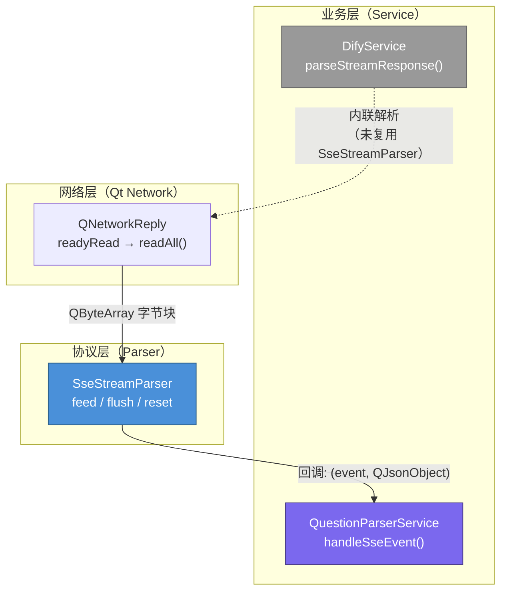
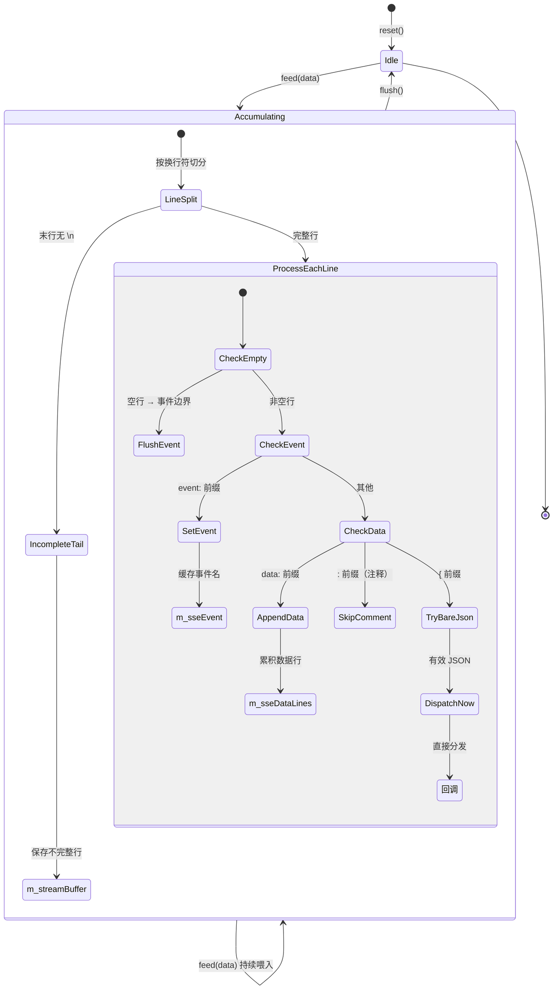
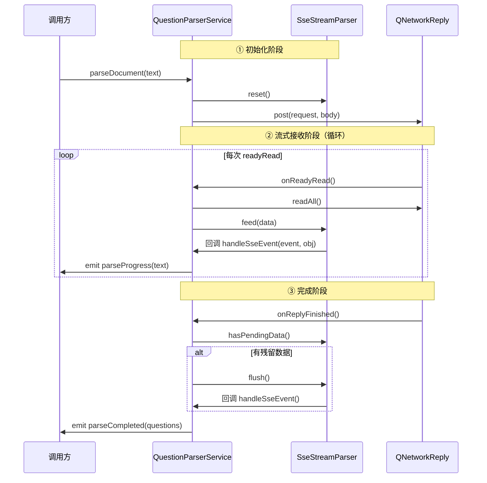

在项目与 Dify Cloud API 的流式通信中，SSE（Server-Sent Events）协议是承载数据推送的核心机制。然而 SSE 数据包在 TCP 传输层并不保证按完整的「事件边界」到达——一个 `data:` 行可能被截断在两次 `readyRead` 信号之间，多个事件也可能被合并到同一个数据块中。**SseStreamParser** 正是为解决这一「协议碎片化」问题而设计的纯协议层解析工具：它不持有网络连接、不依赖 Qt 信号槽体系，仅通过 `feed` → `flush` 的推入式 API 和一个回调函数，将任意字节流可靠地解析为 `(event, QJsonObject)` 事件对。本页将深入剖析其协议模型、内部状态机、非标准扩展设计，以及在项目中的实际集成模式。

Sources: [SseStreamParser.h](src/utils/SseStreamParser.h#L1-L179)

## SSE 协议基础与解析挑战

SSE 是 W3C 定义的一种基于 HTTP 的单向实时推送协议。服务端以 `text/event-stream` Content-Type 持续发送文本行，客户端通过 `EventSource` API（浏览器端）或手动解析（如本项目）消费事件。一个标准 SSE 事件流的结构如下：

```
event: message
data: {"event":"text_chunk","data":{"text":"你好"}}

event: message
data: {"event":"message_end","conversation_id":"abc-123"}

```

每个事件由若干 `field: value` 行组成，空行（`\n\n`）标记事件边界。`event:` 行指定事件类型，`data:` 行承载负载数据（可多行拼接），`:` 开头的行是注释（常用于保持连接活跃的心跳）。实际网络传输中，TCP 分段会打破这种整洁结构——一次 `readyRead` 可能返回半个 `data:` 行、多个完整事件、或仅一个 `\n`，这就要求解析器必须维护跨包缓冲和行级状态。

Sources: [SseStreamParser.h](src/utils/SseStreamParser.h#L10-L25)

## 架构定位：协议层与业务层的严格分离

SseStreamParser 在分层架构中处于**网络与工具层**的最底端，其职责边界极为明确：



关键设计约束体现在三个方面：**零网络依赖**——不持有 `QNetworkReply`、不管理连接生命周期；**零业务知识**——不理解 `text_chunk`、`agent_thought` 等业务事件的语义；**零 QObject 继承**——作为纯 C++ 类，通过 `std::function` 回调分发事件，避免了信号槽的开销和 QObject 生命周期的复杂性。这种「纯工具」定位使其可以在任何 C++ 上下文中实例化，甚至脱离 Qt 事件循环独立使用（仅需 Qt 的 JSON 和字符串类型）。

Sources: [SseStreamParser.h](src/utils/SseStreamParser.h#L26-L33)

值得注意的是，项目中 **DifyService 仍然保留了内联的 SSE 解析逻辑**（`parseStreamResponse` 方法），而非复用 SseStreamParser。这是因为 DifyService 的解析与业务处理高度耦合——它在解析事件的同时执行 `<think/>` 标签过滤、响应长度截断、`conversation_id` 提取等业务操作，直接将 `processEvent` 定义为局部 lambda。而 QuestionParserService 采用了更清晰的分层：SseStreamParser 纯解析 + `handleSseEvent` 纯业务，这是一种推荐的新代码模式。

Sources: [DifyService.cpp](src/services/DifyService.cpp#L390-L516), [QuestionParserService.cpp](src/services/QuestionParserService.cpp#L421-L485)

## 公共 API 全景

SseStreamParser 的全部公开接口仅有五个方法，遵循极简设计原则：

| 方法 | 签名 | 调用时机 | 职责 |
|------|------|----------|------|
| **构造** | `SseStreamParser() = default` | 使用前 | 零成本初始化，无需传参 |
| **setEventHandler** | `void setEventHandler(EventHandler handler)` | 构造后、首次 `feed` 前 | 注册事件回调，签名为 `void(const QString& event, const QJsonObject& data)` |
| **feed** | `void feed(const QByteArray& data)` | 每次 `readyRead` | 喂入新的字节块，触发增量解析和回调分发 |
| **flush** | `void flush()` | 连接结束（`finished` 信号） | 强制刷新残留缓冲和未完成事件 |
| **reset** | `void reset()` | 新请求开始前 | 清空所有内部状态，回到初始态 |
| **hasPendingData** | `bool hasPendingData() const` | `finished` 时检查 | 查询是否有未刷新的缓冲数据 |

Sources: [SseStreamParser.h](src/utils/SseStreamParser.h#L29-L91)

## 内部状态机：从字节流到事件对象

SseStreamParser 的核心是一个三状态的状态机，通过 `m_streamBuffer`、`m_sseEvent`、`m_sseDataLines` 三个成员变量维护解析上下文：



**`feed` 方法**的处理流程可拆解为四个阶段：

**阶段一——行缓冲拼接**：将新到达的 `QByteArray`（UTF-8 解码后）追加到 `m_streamBuffer` 残留部分，以 `\n` 为分隔符切分为完整行列表。若原始字符串不以 `\n` 结尾，则将最后一行重新存入 `m_streamBuffer`，等待下一次 `feed` 补全。这确保了即使一个 `data:` 行被 TCP 分成两段到达，也能正确拼接。Sources: [SseStreamParser.h](src/utils/SseStreamParser.h#L38-L56)

**阶段二——逐行协议解析**（`processLine`）：对每一行修剪空白后执行模式匹配：
- **空行**：触发 `flushEvent()`，标志着一个 SSE 事件的结束边界
- **`event:` 前缀**：提取事件类型字符串存入 `m_sseEvent`
- **`data:` 前缀**：提取数据内容（注意：仅当紧跟空格时才跳过一个空格，符合 SSE 规范中「`data:` 后可选拧空格」的要求），追加到 `m_sseDataLines`
- **`:` 前缀**：SSE 注释行，静默忽略
- **`{` 前缀**（非标准扩展）：尝试直接解析为 JSON 对象，成功则立即通过 `dispatchEvent` 分发

Sources: [SseStreamParser.h](src/utils/SseStreamParser.h#L94-L132)

**阶段三——事件组装**（`flushEvent`）：当遇到空行（事件边界）时，将 `m_sseDataLines` 中累积的所有数据行用 `\n` 拼接为完整 JSON 字符串，执行以下校验后分发：
- 跳过空数据和 `[DONE]` 标记（OpenAI 风格的流结束信号）
- JSON 解析失败则静默丢弃（防御性编程）
- 解析成功后调用 `dispatchEvent`，然后清空 `m_sseEvent` 和 `m_sseDataLines`

Sources: [SseStreamParser.h](src/utils/SseStreamParser.h#L134-L157)

**阶段四——双换行即时刷新**：`feed` 方法在行处理之后，额外检查缓冲区是否以 `\n\n` 结尾。若满足条件则立即调用 `flushEvent()`。这是对「空行标记事件边界」的补充——当服务端在一个数据块中发送完整的 `data:...\n\n` 序列时，无需等待下一次 `feed` 即可触发回调，降低事件延迟。

Sources: [SseStreamParser.h](src/utils/SseStreamParser.h#L57-L60)

## 事件类型的双重来源机制

SSE 协议中事件类型可通过两种途径传递，SseStreamParser 的 `dispatchEvent` 方法实现了统一的优先级策略：

```cpp
void dispatchEvent(const QString &eventHint, const QJsonObject &obj)
{
    QString event = obj["event"].toString();  // 优先级 1：JSON 内嵌
    if (event.isEmpty()) {
        event = eventHint;                     // 优先级 2：event: 行
    }
    m_handler(event, obj);
}
```

**优先级一：JSON 负载内嵌的 `event` 字段**。这是 Dify API 的主要模式——所有事件都通过 `data:` 行传递 JSON 对象，而事件类型嵌在 JSON 的 `"event"` 键中。例如 `data: {"event":"text_chunk","data":{"text":"..."}}` 中的 `text_chunk` 会被提取为事件名。

**优先级二：SSE 协议的 `event:` 行**。当 JSON 中不含 `event` 字段时，退回使用 `event:` 行的值（参数 `eventHint`）。这兼容了标准 SSE 客户端的用法。

这种双重来源机制使 SseStreamParser 能同时兼容标准 SSE 语义和 Dify 的 JSON-in-`data` 模式，无需调用方做任何适配。

Sources: [SseStreamParser.h](src/utils/SseStreamParser.h#L159-L170)

## 非标准扩展：裸 JSON 行直通

除了标准 SSE 协议，`processLine` 还处理以 `{` 开头的行——尝试直接解析为 JSON 对象，成功则立即分发，无需等待空行边界。这一扩展服务于两类实际场景：

1. **非标准 API 响应**：部分 AI 服务（如某些 OpenAI 兼容端点）直接在流中输出 JSON 行，而非包裹在 `data:` 前缀中
2. **错误响应穿透**：HTTP 错误响应体可能是纯 JSON（`{"error": "..."}`），在流式读取的后期阶段到达时，此机制允许其被正确捕获而非静默丢弃

值得注意的是，裸 JSON 行的分发会立即清空 `m_sseEvent` 缓存，这隐含一个语义假设：裸 JSON 行是自描述的完整事件，不需要与之前的 `event:` 行组合。

Sources: [SseStreamParser.h](src/utils/SseStreamParser.h#L123-L131)

## 集成模式：QuestionParserService 中的完整生命周期

以下展示 SseStreamParser 在 QuestionParserService 中从初始化到完成的标准集成模式，这是项目中推荐的参考实现：



**初始化阶段**中，构造函数注册一次性回调，将解析器的事件输出桥接至业务处理方法：

```cpp
// 构造函数中一次性绑定
m_sseParser.setEventHandler([this](const QString &event, const QJsonObject &obj) {
    handleSseEvent(event, obj);
});
```

每次发起新请求时调用 `reset()` 清空所有残留状态，避免前一次请求的残留数据污染当前会话。

Sources: [QuestionParserService.cpp](src/services/QuestionParserService.cpp#L22-L25), [QuestionParserService.cpp](src/services/QuestionParserService.cpp#L110-L112)

**流式接收阶段**中，`onReadyRead` 的实现极为精简——读取全部可用数据后直接喂入解析器，所有协议解析和事件分发由解析器内部自动完成：

```cpp
void QuestionParserService::onReadyRead()
{
    if (!m_currentReply) return;
    QByteArray data = m_currentReply->readAll();
    if (!data.isEmpty()) {
        m_sseParser.feed(data);
    }
}
```

Sources: [QuestionParserService.cpp](src/services/QuestionParserService.cpp#L334-L342)

**完成阶段**中，`onReplyFinished` 在处理错误路径和正常路径时都检查并刷新残留数据，确保不丢失最后一批事件：

```cpp
// 错误路径
if (m_sseParser.hasPendingData()) {
    m_sseParser.flush();
}
// ... 正常路径
if (m_sseParser.hasPendingData()) {
    m_sseParser.flush();
}
```

Sources: [QuestionParserService.cpp](src/services/QuestionParserService.cpp#L344-L419)

**业务处理方法** `handleSseEvent` 接收解析器输出的 `(event, QJsonObject)` 对，根据事件类型执行不同业务逻辑——`text_chunk` 累积文本并报告进度、`workflow_finished` 提取最终输出、`error` 记录错误状态。业务层完全不需要感知 SSE 协议的分包、拼接、边界检测等底层细节。

Sources: [QuestionParserService.cpp](src/services/QuestionParserService.cpp#L421-L485)

## 设计权衡与对比分析

SseStreamParser 与 DifyService 内联解析代表了两种不同的架构选择。以下从多个维度进行对比：

| 维度 | SseStreamParser（独立解析器） | DifyService 内联解析 |
|------|------|------|
| **复用性** | ✅ 头文件直接引入，无链接依赖 | ❌ 解析逻辑与 DifyService 强耦合 |
| **可测试性** | ✅ 可独立构造测试用例 | ❌ 需模拟完整 QNetworkReply |
| **业务混合度** | ✅ 零业务知识，纯协议解析 | ❌ processEvent lambda 包含大量业务分支 |
| **代码行数** | ~150 行（头文件） | ~130 行（parseStreamResponse 内联） |
| **灵活性** | ⚠️ 回调模式，无法在解析中途取消 | ✅ lambda 可直接访问类成员做复杂控制 |
| **协议扩展** | ⚠️ 裸 JSON 直通是唯一扩展点 | ✅ 可任意定制行处理逻辑 |

DifyService 未迁移至 SseStreamParser 的核心原因在于其 `parseStreamResponse` 中的 `processEvent` lambda 深度耦合了流式文本过滤（`filterThinkTagsStreaming`）、响应长度截断（`m_maxResponseChars`）、会话 ID 提取等业务逻辑。若要迁移，需要将 `handleStreamText`、`filterThinkTagsStreaming` 等方法提取为独立层——这属于架构重构范畴，非当前优先级。

Sources: [DifyService.cpp](src/services/DifyService.cpp#L390-L516), [SseStreamParser.h](src/utils/SseStreamParser.h#L1-L179)

## 边界条件与防御性设计

SseStreamParser 在多个层面实现了防御性编程，确保在异常网络条件下不会崩溃或产生错误回调：

- **`[DONE]` 令牌静默消费**：OpenAI 兼容 API 在流结束时发送 `data: [DONE]`，`flushEvent` 中检测到后直接跳过，不触发回调。Sources: [SseStreamParser.h](src/utils/SseStreamParser.h#L144-L147)
- **JSON 解析失败静默丢弃**：无论是标准 `data:` 拼接还是裸 JSON 行，`QJsonDocument::fromJson` 失败后仅清空状态，不抛异常不打印错误（由上层业务决定日志策略）。Sources: [SseStreamParser.h](src/utils/SseStreamParser.h#L149-L153)
- **UTF-8 解码隐式容错**：使用 `QString::fromUtf8()` 解码字节流，对非法 UTF-8 序列产生替换字符而非崩溃。Sources: [SseStreamParser.h](src/utils/SseStreamParser.h#L40)
- **回调空指针防护**：`dispatchEvent` 首先检查 `m_handler` 是否已设置，避免未注册回调时的空函数调用。Sources: [SseStreamParser.h](src/utils/SseStreamParser.h#L161)
- **`feed` 空数据安全**：传入空 `QByteArray` 时，`buffer` 即为 `m_streamBuffer`（可能为空），`split('\n')` 返回单元素列表，流程正常通过。

Sources: [SseStreamParser.h](src/utils/SseStreamParser.h#L38-L60)

## 快速集成清单

对于需要新增 SSE 流式消费的场景，以下是最小集成步骤：

1. **包含头文件**：`#include "../utils/SseStreamParser.h"`（或对应相对路径）
2. **声明成员变量**：`SseStreamParser m_sseParser;`
3. **构造函数中注册回调**：`m_sseParser.setEventHandler([this](const QString& event, const QJsonObject& obj) { ... });`
4. **请求前重置**：`m_sseParser.reset();`
5. **`readyRead` 中喂入**：`m_sseParser.feed(reply->readAll());`
6. **`finished` 中刷新**：`if (m_sseParser.hasPendingData()) m_sseParser.flush();`

整个过程无需继承 QObject、无需信号槽连接、无需管理解析器的生命周期——它就是一个带有内部状态的纯函数集合。

Sources: [SseStreamParser.h](src/utils/SseStreamParser.h#L10-L25)

## 延伸阅读

- [DifyService：SSE 流式对话、多事件类型处理与会话管理](10-difyservice-sse-liu-shi-dui-hua-duo-shi-jian-lei-xing-chu-li-yu-hui-hua-guan-li) — 了解 DifyService 中内联 SSE 解析的完整业务逻辑，以及它与 SseStreamParser 的架构差异
- [NetworkRequestFactory：统一请求创建、SSL 策略与 HTTP/2 禁用约定](23-networkrequestfactory-tong-qing-qiu-chuang-jian-ssl-ce-lue-yu-http-2-jin-yong-yue-ding) — 了解 `createDifyRequest` 如何为 SSE 流式请求配置超时和 SSL 参数
- [QuestionParserService：文档解析与 AI 工作流调用](12-questionparserservice-wen-dang-jie-xi-yu-ai-gong-zuo-liu-diao-yong) — 了解 SseStreamParser 的上层业务如何消费解析后的事件