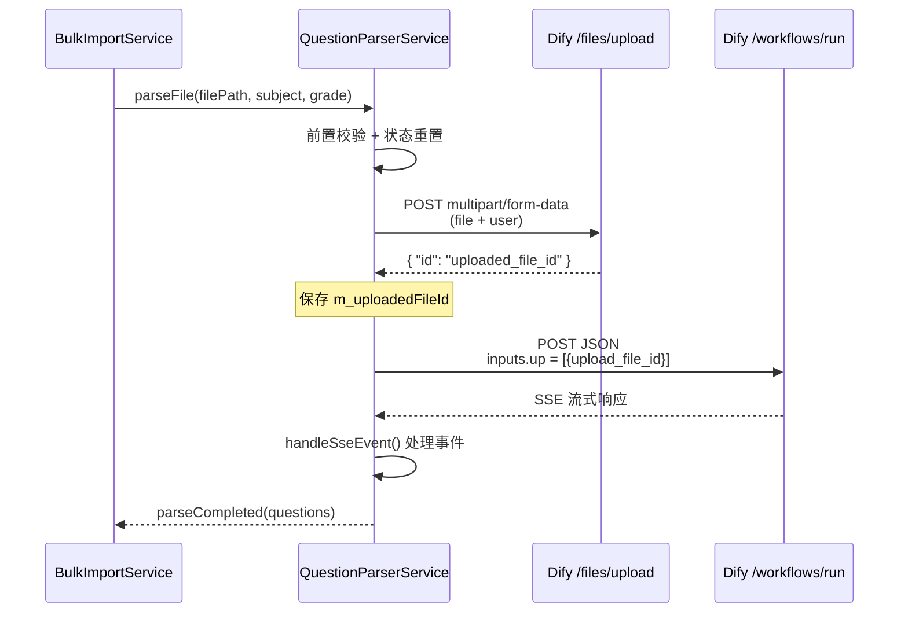

**QuestionParserService** 是试题生命周期中的核心解析引擎，承担着"将非结构化内容转化为结构化 `PaperQuestion` 数据"这一关键职责。它提供三条独立的解析路径——文本模式（调用 Dify 工作流）、文件上传模式（先上传再调用工作流）、本地 Markdown 正则解析（零网络依赖），分别服务于 AI 出题后的保存入库和批量文档导入两大业务场景。理解此服务的设计，是掌握系统"从原始内容到可管理试题"这条数据管道的关键一步。

Sources: [QuestionParserService.h](src/services/QuestionParserService.h#L1-L165), [QuestionParserService.cpp](src/services/QuestionParserService.cpp#L1-L26)

## 架构定位与三种解析模式

QuestionParserService 位于系统的**服务层**（`src/services/`），在整体分层中处于 UI 层与网络基础设施层之间的枢纽位置。它的上游是两个 UI/业务编排组件：`QuestionBankWindow`（AI 出题保存链路）和 `BulkImportService`（批量文档导入链路）；下游依赖 `SseStreamParser` 做 SSE 协议解析、`NetworkRequestFactory` 构建认证请求，最终将解析结果输出为 `PaperQuestion` 结构体列表。

Sources: [QuestionParserService.h](src/services/QuestionParserService.h#L12-L19)

```mermaid
graph TD
    subgraph "上游调用者"
        QBW["QuestionBankWindow<br/>AI 出题 → 保存入库"]
        BIS["BulkImportService<br/>文档批量导入"]
    end

    subgraph "QuestionParserService"
        direction TB
        PM_TEXT["文本模式<br/>parseDocument()"]
        PM_FILE["文件上传模式<br/>parseFile()"]
        PM_LOCAL["本地 Markdown 解析<br/>parseMarkdownToQuestions()<br/>(静态方法，零网络)"]
    end

    subgraph "下游依赖"
        SSE["SseStreamParser<br/>SSE 协议解析"]
        NRF["NetworkRequestFactory<br/>请求构建与认证"]
        DIFY["Dify API<br/>/workflows/run<br/>/files/upload"]
        PQ["PaperQuestion<br/>结构化试题数据"]
    end

    QBW -->|"AI 生成的文本"| PM_TEXT
    QBW -->|"导出时使用"| PM_LOCAL
    BIS -->|"文档文件路径"| PM_FILE

    PM_TEXT --> SSE
    PM_TEXT --> NRF
    PM_FILE --> NRF
    NRF --> DIFY
    SSE -->|"事件分发"| PM_TEXT
    PM_TEXT -->|"parseJsonResponse()"| PQ
    PM_FILE -->|"parseJsonResponse()"| PQ
    PM_LOCAL -->|"正则状态机"| PQ
```



三种模式的差异对比如下：

| 维度 | 文本模式 `parseDocument` | 文件上传模式 `parseFile` | 本地 Markdown `parseMarkdownToQuestions` |
|---|---|---|---|
| 调用方式 | 异步（信号驱动） | 异步（信号驱动） | 同步静态方法 |
| 网络依赖 | Dify 工作流 API | Dify 文件上传 + 工作流 API | 无 |
| 输入格式 | 纯文本字符串 | 本地文件路径 | Markdown 文本 |
| 典型场景 | AI 出题后保存到题库 | 批量导入 DOCX 文档 | 本地快速解析（如导出 DOCX 时） |
| Dify API 端点 | `/workflows/run` | `/files/upload` → `/workflows/run` | — |

Sources: [QuestionParserService.h](src/services/QuestionParserService.h#L39-L57), [QuestionParserService.h](src/services/QuestionParserService.h#L129-L142)

## 文本模式：从纯文本到结构化试题

文本模式是 `parseDocument()` 方法实现的解析路径，用于将 AI 对话中生成的试题文本发送到 Dify 工作流进行结构化提取。整个流程分为**前置校验 → 构建 SSE 流式请求 → 增量接收 → 最终解析**四个阶段。

前置校验阶段会依次检查 API Key 是否已设置、文本内容是否为空，以及是否需要取消上一次未完成的操作（通过 `cancelActiveOperation()` 确保同时只有一个解析任务运行）。校验通过后，服务会保存 `subject`（学科）和 `grade`（年级）等元数据，重置 SSE 解析器和响应缓冲区。

Sources: [QuestionParserService.cpp](src/services/QuestionParserService.cpp#L87-L145)

请求构建阶段向 Dify 的 `/workflows/run` 端点发送 POST 请求，请求体结构如下：

```json
{
  "inputs": { "document_text": "<用户提供的文本>" },
  "response_mode": "streaming",
  "user": "<随机 UUID>"
}
```

其中 `inputs.document_text` 是 Dify 工作流开始节点定义的输入变量名，`response_mode` 固定为 `streaming` 以启用 SSE 流式响应。`user` 字段使用 `QUuid::createUuid()` 生成唯一标识，满足 Dify API 的用户追踪要求。请求通过 `NetworkRequestFactory::createDifyRequest()` 构建，自动附加 Bearer Token 认证头和 300 秒超时设置。

Sources: [QuestionParserService.cpp](src/services/QuestionParserService.cpp#L114-L144), [NetworkRequestFactory.cpp](src/utils/NetworkRequestFactory.cpp#L53-L77)

## 文件上传模式：两阶段解析流程

文件上传模式由 `parseFile()` 方法启动，专为处理 DOCX、PDF 等原始文档设计。与文本模式不同，它采用**先上传、后调用**的两阶段架构：第一阶段通过 Dify 文件上传 API 获取服务器端文件 ID，第二阶段将此 ID 作为工作流输入变量触发解析。



第一阶段（`uploadFileToDify`）使用 `QHttpMultiPart` 构建 multipart/form-data 请求，包含文件本体和 `user` 参数。文件 MIME 类型通过 `QMimeDatabase` 自动检测，上传超时设为 120 秒。上传成功后从响应 JSON 中提取 `id` 字段作为 `m_uploadedFileId`。

Sources: [QuestionParserService.cpp](src/services/QuestionParserService.cpp#L147-L284)

第二阶段（`callWorkflowWithFile`）构建的请求体与文本模式有显著差异。文件以引用方式传递给工作流，而非直接嵌入文本内容：

```json
{
  "inputs": {
    "up": [{
      "type": "document",
      "transfer_method": "local_file",
      "upload_file_id": "<第一阶段获取的 ID>"
    }]
  },
  "response_mode": "streaming",
  "user": "<随机 UUID>"
}
```

这里 `inputs.up` 是 Dify 工作流开始节点定义的文件列表变量名（类型为文件数组），`transfer_method` 设为 `local_file` 表示引用已上传的文件。此请求的超时设置为 600 秒（10 分钟），因为大文档解析可能耗时较长。

Sources: [QuestionParserService.cpp](src/services/QuestionParserService.cpp#L287-L332)

## SSE 事件处理：工作流生命周期映射

无论是文本模式还是文件上传模式，工作流调用后的 SSE 响应都由同一个事件处理链路处理。`SseStreamParser` 作为纯协议层工具，负责将 SSE 字节流解析为 `(event, QJsonObject)` 对，然后通过回调分发到 `handleSseEvent()` 方法进行业务处理。

Sources: [QuestionParserService.cpp](src/services/QuestionParserService.cpp#L421-L485), [SseStreamParser.h](src/utils/SseStreamParser.h#L1-L179)

服务处理以下五种 Dify 工作流事件：

| SSE 事件 | 业务含义 | 处理逻辑 |
|---|---|---|
| `text_chunk` | 流式文本片段（工作流中间输出） | 追加到 `m_fullResponse`，发射 `parseProgress` 信号 |
| `workflow_finished` | 工作流执行完成 | 从 `outputs` 中提取 `result`/`text`/`output` 等字段，覆盖写入 `m_fullResponse` |
| `workflow_started` | 工作流已启动 | 仅日志记录 |
| `node_started` / `node_finished` | 工作流节点执行状态 | 提取节点标题，仅日志记录 |
| `error` | 工作流执行错误 | 设置 `m_hasStreamError` 标志，发射 `errorOccurred` 信号 |

`workflow_finished` 事件的输出提取采用了**多层级降级策略**：依次尝试 `outputs.result`、`outputs.text`、`outputs.output`，如果都为空则遍历 `outputs` 所有键，取第一个非空字符串值。这种设计使服务能适配不同配置的 Dify 工作流（输出变量名可能不同）。

Sources: [QuestionParserService.cpp](src/services/QuestionParserService.cpp#L421-L485)

当网络请求完成（`onReplyFinished`），服务会先 flush SSE 解析器的残留缓冲，然后根据是否有流式错误决定后续流程：若无错误且收到了有效数据，则调用 `parseJsonResponse()` 将完整响应文本转换为 `PaperQuestion` 列表并发射 `parseCompleted` 信号；若响应为空则报告超时错误。

Sources: [QuestionParserService.cpp](src/services/QuestionParserService.cpp#L344-L419)

## JSON 响应解析：鲁棒的多层降级策略

`parseJsonResponse()` 是两种远程模式共用的最终解析步骤，负责将 Dify 工作流返回的文本转化为 `QList<PaperQuestion>`。由于 AI 输出的 JSON 格式存在极大的不确定性，此方法实现了多层降级的解析策略。

Sources: [QuestionParserService.cpp](src/services/QuestionParserService.cpp#L487-L789)

**第一层：预处理清洗。** 移除 `<think...</think >` 标签（AI 的内部推理过程），然后检测是否为 Dify 工作流"直接插入数据库"的报告格式（包含"成功：N"的文本模式）。如果是直接插入报告，则生成 N 个虚拟 `PaperQuestion`（stem 以"已由工作流插入"为前缀），调用方据此判断无需再写入数据库。

**第二层：JSON 提取。** 先尝试提取 Markdown 代码块（````json ... ``` ``）中的内容，然后通过逐字符括号匹配定位 JSON 的精确起止位置，截断尾部可能存在的多余内容。

**第三层：反转义修复。** 若首次 `QJsonDocument::fromJson()` 失败，执行反转义操作（`\\"` → `"`、`\\\\n` → 换行等），然后重新定位和解析。这处理了 AI 输出中常见的双重转义问题。

**第四层：字段映射。** 解析成功后，对每个题目对象进行宽松的字段匹配——例如题干依次尝试 `stem`、`question`、`content` 三个键名；题型依次尝试 `question_type`、`questionType`、`type`；解析尝试 `explanation`、`analysis`。同时内置中文→英文题型映射（如"单选题" → `single_choice`）。

Sources: [QuestionParserService.cpp](src/services/QuestionParserService.cpp#L487-L789)

支持的 `PaperQuestion` 字段与 JSON 键名映射如下：

| PaperQuestion 字段 | JSON 键名（降序尝试） | 说明 |
|---|---|---|
| `stem` | `stem` → `question` → `content` | 题干（必填，缺省则跳过该题） |
| `questionType` | `question_type` → `questionType` → `type` | 自动做中文→英文映射 |
| `options` | `options` | 选项数组 |
| `answer` | `answer` | 答案 |
| `explanation` | `explanation` → `analysis` | 解析说明 |
| `difficulty` | `difficulty` | 缺省值 `medium` |
| `score` | `score` | 缺省值 5 |
| `material` | `material` → `materials` | 材料论述题的材料内容 |
| `subQuestions` | `sub_questions` → `subQuestions` | 材料题的小问列表 |
| `subAnswers` | `sub_answers` → `subAnswers` | 材料题的小问答案 |
| `tags` | `tags` | 标签数组 |
| `knowledgePoints` | `knowledgePoints` | 知识点数组 |

Sources: [QuestionParserService.cpp](src/services/QuestionParserService.cpp#L648-L784), [PaperService.h](src/services/PaperService.h#L33-L59)

## 本地 Markdown 解析：零网络依赖的状态机

`parseMarkdownToQuestions()` 是一个**静态方法**，完全不依赖网络或实例状态，使用正则表达式驱动的状态机直接在本地解析 AI 生成的 Markdown 格式试题文本。它最初服务于 AI 出题后的 DOCX 导出链路——在 `QuestionBankWindow::onExportToDocx()` 中，导出路径已切换为使用 `DocxGenerator::generateFromMarkdown()` 直接转换，但此静态方法仍作为独立的本地解析工具保留。

Sources: [QuestionParserService.cpp](src/services/QuestionParserService.cpp#L791-L1004)

解析器维护三个状态标志：`inQuestion`（是否正在构建一道题）、`inAnalysis`（后续行追加到解析字段）、`inStem`（后续行追加到题干），以及一个 `currentSectionType` 用于继承段落级别的题型声明。逐行扫描时通过五组正则表达式识别不同语义元素：

| 正则模式 | 匹配目标 | 示例 |
|---|---|---|
| `questionNumRe` | 题目编号 | `1.`、`1、`、`（1）`、`第1题`、`**1.**` |
| `optionRe` | 选项行 | `A. xxx`、`B、xxx`、`c) xxx` |
| `answerRe` | 答案标记 | `【答案】xxx` |
| `analysisRe` | 解析标记 | `【解析】xxx`、`【解释】xxx` |
| `sectionTypeRe` | 段落题型标题 | `## 一、选择题`、`**判断题**` |

当遇到新的题目编号时，解析器先将上一道题通过 `flushQuestion` lambda 入库（填充默认值：`visibility = "public"`、`score = 5`、`difficulty = "medium"`），然后开始构建新题目。如果编号行中包含内嵌题型标注（如 `1. **（选择题）** 以下...`），会从中提取并从题干中移除；否则继承段落级别的 `currentSectionType`。

Sources: [QuestionParserService.cpp](src/services/QuestionParserService.cpp#L817-L994)

## 上游调用者与集成模式

QuestionParserService 被两个组件直接持有和调用，形成两条独立的业务链路。

### 保存链路：QuestionBankWindow

在 `QuestionBankWindow` 中，`QuestionParserService` 以成员变量 `m_questionParser` 的形式被持有。当用户在 `AIQuestionGenWidget` 中点击"保存到题库"按钮时，触发 `saveRequested(content)` 信号，经 `onSaveGeneratedQuestionsRequested()` 桥接，调用 `parseDocument(content, "道德与法治")` 启动文本模式解析。解析结果通过 `parseCompleted` 信号传回 `onGeneratedQuestionsParsed()`，随后调用 `PaperService::addQuestions()` 写入数据库。整条链路的信号连接在构造函数中一次性完成。

Sources: [questionbankwindow.cpp](src/questionbank/questionbankwindow.cpp#L42-L83), [questionbankwindow.cpp](src/questionbank/questionbankwindow.cpp#L589-L651)

API Key 的配置采用了**三级降级查找**策略：优先使用 `PARSER_API_KEY`（专用解析 Key），若为空则回退到 `DIFY_API_KEY`（通用 Dify Key），再为空则尝试 `DIFY_QUESTION_GEN_API_KEY`（出题专用 Key）。Base URL 同样支持通过 `PARSER_API_BASE_URL` 环境变量自定义。

Sources: [questionbankwindow.cpp](src/questionbank/questionbankwindow.cpp#L56-L68)

### 批量导入链路：BulkImportService

`BulkImportService` 内部同时持有 `DocumentReaderService`（本地文档预处理）和 `QuestionParserService`（AI 解析）两个实例。批量导入的流程更为复杂：

1. `DocumentReaderService::readDocxWithImages()` 在本地提取 DOCX 的文本、表格（HTML 格式）和图片内容
2. 将提取结果写入临时 `.txt` 文件
3. 调用 `QuestionParserService::parseFile()` 以文件上传模式将临时文件发送给 Dify 工作流
4. 解析完成后，过滤只保留"大题"（简答题、论述题、材料分析题等），跳过选择题/判断题/填空题
5. 若配置了 `QuestionQualityService`，对结果进行标签规范化和本地去重快筛
6. 最终通过 `PaperService::addQuestions()` 批量写入数据库

这种"本地预处理 + 远程 AI 解析"的混合架构，既保留了文档中的表格和图片信息（Dify 原生文件解析可能丢失这些结构），又利用了 AI 的智能结构化能力。

Sources: [BulkImportService.cpp](src/services/BulkImportService.cpp#L15-L39), [BulkImportService.cpp](src/services/BulkImportService.cpp#L190-L241)

## 并发管理与资源清理

QuestionParserService 通过 `cancelActiveOperation()` 方法确保同一时刻只有一个解析任务运行。此方法同时调用 `cancelCurrentReply()` 和 `cancelUploadReply()`，分别处理工作流请求和文件上传请求的清理。清理过程包括：断开信号连接、abort 网络请求、deleteLater 释放内存、关闭并删除上传文件句柄。

在 `parseDocument()` 和 `parseFile()` 的入口处都会先调用 `cancelActiveOperation()`，这意味着如果用户在解析未完成时发起新请求，旧请求会被安全取消。析构函数同样调用 `cancelActiveOperation()`，防止悬空的网络回调。

Sources: [QuestionParserService.cpp](src/services/QuestionParserService.cpp#L53-L85)

## 信号体系

QuestionParserService 的信号设计遵循"一个信号一个职责"的原则，为 UI 层提供完整的生命周期感知能力：

| 信号 | 发射时机 | 典型用途 |
|---|---|---|
| `parseStarted()` | 解析请求发送后 | UI 进入加载状态 |
| `uploadProgress(sent, total)` | 文件上传过程中 | 显示上传进度条 |
| `parseProgress(text)` | 收到每个 `text_chunk` 时 | 实时显示 AI 输出 |
| `parseCompleted(questions)` | 成功解析完成 | 更新题目列表/写入数据库 |
| `errorOccurred(error)` | 任何阶段出错 | 向用户展示错误信息 |

Sources: [QuestionParserService.h](src/services/QuestionParserService.h#L68-L95)

## 延伸阅读

- [DifyService：SSE 流式对话、多事件类型处理与会话管理](10-difyservice-sse-liu-shi-dui-hua-duo-shi-jian-lei-xing-chu-li-yu-hui-hua-guan-li) — 与本服务共享相同的 SSE 解析架构和 Dify API 交互模式
- [SseStreamParser：纯协议层 SSE 解析器的设计与使用](11-ssestreamparser-chun-xie-yi-ceng-sse-jie-xi-qi-de-she-ji-yu-shi-yong) — 本服务依赖的 SSE 协议层解析器
- [试题库管理：题目录入、篮子、质量检查与批量导入](13-shi-ti-ku-guan-li-ti-mu-lu-ru-lan-zi-zhi-liang-jian-cha-yu-pi-liang-dao-ru) — 上游业务场景的全貌
- [NetworkRequestFactory：统一请求创建、SSL 策略与 HTTP/2 禁用约定](23-networkrequestfactory-tong-qing-qiu-chuang-jian-ssl-ce-lue-yu-http-2-jin-yong-yue-ding) — 请求构建基础设施