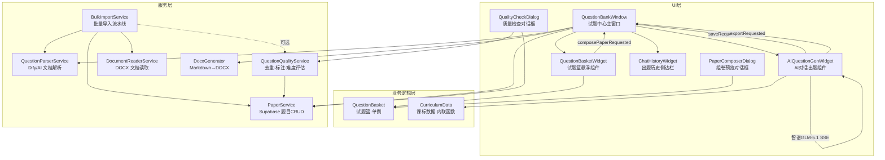
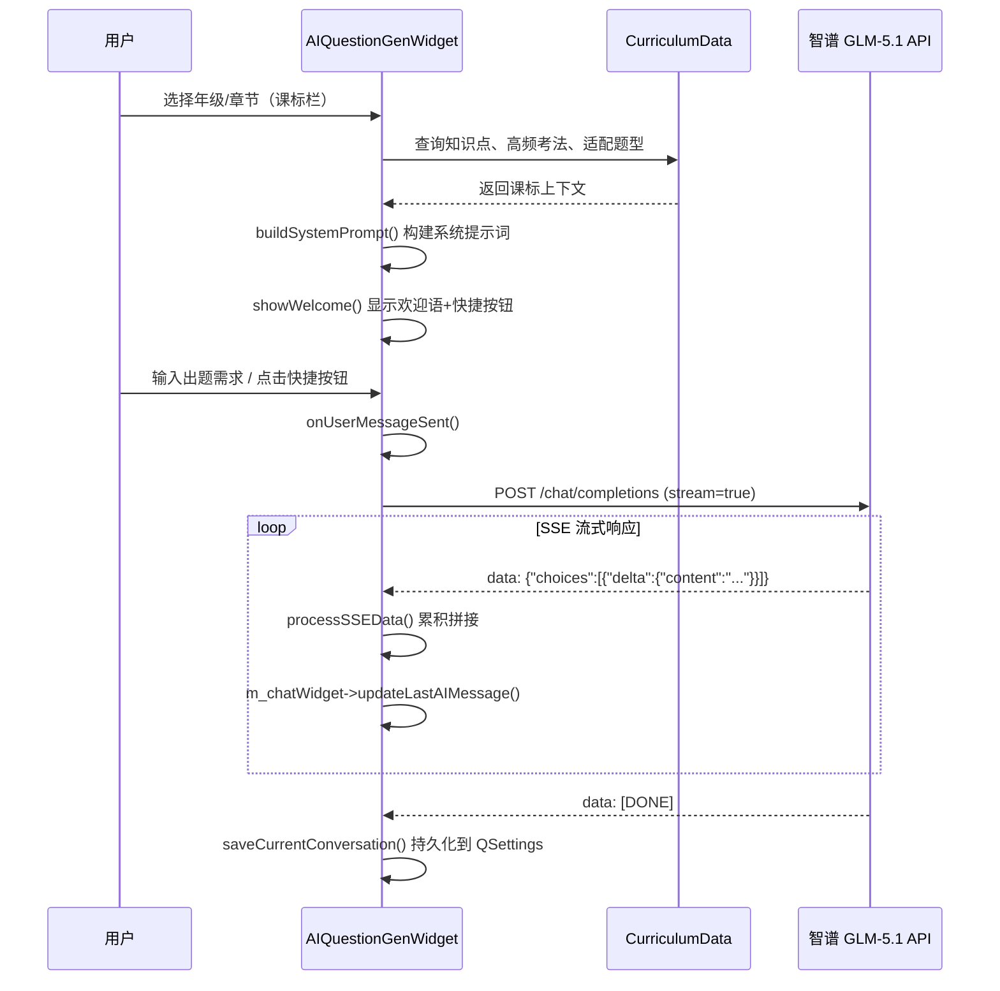
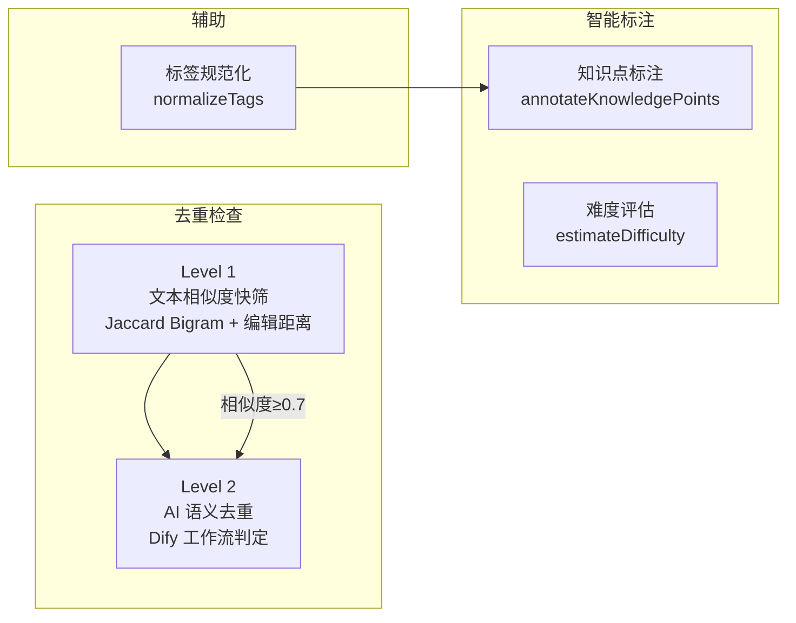
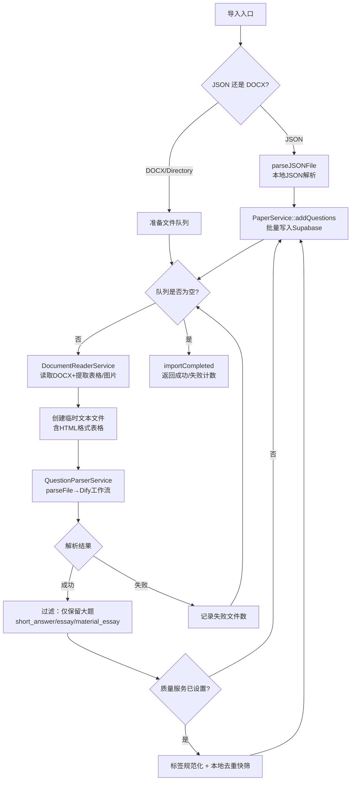

试题库是 AI 思政智慧课堂系统中支撑教学评估的核心基础设施，负责试题的生成、存储、筛选、质检与批量导入。本文档深入剖析 `src/questionbank/` 模块与 `src/services/` 中相关服务的分层协作机制：从 **AI 对话式出题** 的实时交互，到 **试题篮** 的单例暂存与组卷衔接，再到 **质量检查** 的双层去重管线（文本相似度 + AI 语义判定），以及 **批量导入** 的文档解析流水线。理解这些组件的职责边界与信号流，是掌握整个试题生命周期管理的关键。

Sources: [questionbankwindow.h](src/questionbank/questionbankwindow.h#L1-L83), [PaperService.h](src/services/PaperService.h#L1-L173)

## 模块全景架构

试题库管理涉及 **UI 层**、**业务逻辑层** 和 **服务层** 三个清晰的分层。下图展示了核心类之间的依赖关系与信号流向：



**QuestionBankWindow** 作为编排中心，持有 `AIQuestionGenWidget`（AI 出题页）和 `SmartPaperWidget`（智能组卷页）两个子页面，通过 `QStackedWidget` 实现模式切换。试题篮悬浮组件 `QuestionBasketWidget` 仅在"智能组卷"模式下可见，而质量检查对话框 `QualityCheckDialog` 则以模态方式按需弹出。

Sources: [questionbankwindow.cpp](src/questionbank/questionbankwindow.cpp#L114-L187)

## 核心数据模型

### PaperQuestion 结构体

`PaperQuestion` 是贯穿整个试题库的唯一数据载体，定义在 `PaperService.h` 中，既用于前端展示也用于 Supabase 后端交互：

| 字段 | 类型 | 说明 |
|------|------|------|
| `id` | `QString` | 题目唯一标识 |
| `paperId` | `QString` | 所属试卷 ID（公共题为空） |
| `questionType` | `QString` | 题型：`single_choice`、`multi_choice`、`true_false`、`short_answer`、`essay`、`material_analysis` |
| `difficulty` | `QString` | 难度：`easy`、`medium`、`hard` |
| `stem` | `QString` | 题干（支持 HTML，含图片/表格） |
| `material` | `QString` | 材料内容（材料分析题专用） |
| `subQuestions` | `QStringList` | 小问列表（材料论述题） |
| `options` | `QStringList` | 选择题选项 |
| `answer` | `QString` | 答案 |
| `explanation` | `QString` | 解析 |
| `score` | `int` | 分值（默认 5） |
| `tags` | `QStringList` | 标签 |
| `visibility` | `QString` | 可见性：`public`（公共题库）/ `private`（私有） |
| `subject` | `QString` | 学科 |
| `grade` | `QString` | 年级 |
| `chapter` | `QString` | 章节 |
| `knowledgePoints` | `QStringList` | 知识点 |

该结构体提供 `fromJson()` / `toJson()` 序列化方法，与 Supabase REST API 直接对接。`QuestionSearchCriteria` 封装了检索条件（题型、难度、关键词、可见性、分页参数等），支持 `PaperService::searchQuestions()` 进行条件筛选。

Sources: [PaperService.h](src/services/PaperService.h#L33-L78)

### 课标数据 CurriculumData

`CurriculumData.h` 以编译期内联函数的形式，在内存中构建了一套完整的 **初中道德与法治** 课程知识体系。这套数据不仅是 AI 出题的上下文来源，也是质量检查的知识基准。

核心数据结构包括 **KnowledgePoint**（知识点，含 ID、名称、所属章节/年级、考试权重、适配题型）和 **ChapterGuide**（章节出题指南，含高频考法提示）。系统预置了 **57 个知识点**，覆盖七年级上/下册到九年级上/下册共 **24 个章节**。

```
CurriculumData::gradeSemesters()        → ["七年级上册", "七年级下册", ..., "九年级下册"]
CurriculumData::chaptersForGradeSemester("八年级下册")
    → ["第一单元 坚持宪法至上", "第二单元 理解权利义务", ...]
CurriculumData::knowledgePointsFor("七年级上册", "第一单元 成长的节拍")
    → [{id:"7s-1-1", name:"中学生活新起点", examWeight:"高频", ...}, ...]
CurriculumData::quickPromptsFor("八年级下册", "第一单元 坚持宪法至上")
    → ["帮我出5道选择题，范围：八年级下册 第一单元 坚持宪法至上，聚焦宪法是国家的根本法、...", ...]
```

这套 API 在 `AIQuestionGenWidget` 中被用于：填充年级/章节下拉框、构建系统提示词（System Prompt）、生成欢迎语和快捷出题按钮。

Sources: [CurriculumData.h](src/questionbank/CurriculumData.h#L1-L282)

## AI 对话式出题

### 出题架构与 API 调用

`AIQuestionGenWidget` 是一个独立的 AI 对话出题组件，直接调用 **智谱 GLM-5.1** 的 OpenAI 兼容 API，通过 **SSE 流式响应** 实时展示题目生成过程。它不依赖 Dify 中间层，而是自建 `QNetworkAccessManager` 进行网络请求。

出题流程分为以下阶段：



系统提示词（System Prompt）通过 `buildSystemPrompt()` 动态构建：基础部分定义了出题专家角色、输出格式规范（Markdown：题号+题型、ABCD选项、【答案】、【解析】）、题型支持范围；课标上下文部分则根据当前选中的年级和章节，注入 **核心考点**、**高频考法** 和 **优先考虑的题型**，确保生成的试题精准匹配教学进度。

Sources: [AIQuestionGenWidget.cpp](src/questionbank/AIQuestionGenWidget.cpp#L633-L689)

### 对话持久化与历史管理

每个对话通过 `QUuid::createUuid()` 生成唯一 ID，对话消息以 JSON 数组形式存储在 `QSettings` 的 `questionGen/messages/{uuid}` 键下，同时维护一个 `questionGen/index` 索引记录所有对话的 ID、标题（首条用户消息前 20 字）和更新时间。**QuestionBankWindow** 通过 `ChatHistoryWidget` 渲染左侧历史侧边栏，支持对话切换和删除操作。

Sources: [AIQuestionGenWidget.cpp](src/questionbank/AIQuestionGenWidget.cpp#L559-L629), [questionbankwindow.cpp](src/questionbank/questionbankwindow.cpp#L444-L518)

## 试题篮：单例暂存与组卷衔接

### QuestionBasket 单例设计

**QuestionBasket** 采用经典单例模式（`static` 实例指针），作为组卷过程中试题的临时容器。其核心职责：

- **去重添加**：`addQuestion()` 通过 `id` 检查避免重复入篮
- **分值管理**：`m_scores` 哈希表独立存储每题分值（默认 5 分），支持 `setQuestionScore()` 动态调整
- **分组统计**：`groupedByType()` 按题型分组，`countByType()` 统计各题型数量，`totalScore()` 计算总分
- **顺序调整**：`moveQuestion()` 支持题目的拖拽排序

所有状态变更均通过 Qt 信号（`questionAdded`、`questionRemoved`、`cleared`、`countChanged`）通知 UI 层，实现数据与视图的松耦合。

Sources: [QuestionBasket.h](src/questionbank/QuestionBasket.h#L1-L82), [QuestionBasket.cpp](src/questionbank/QuestionBasket.cpp#L1-L142)

### QuestionBasketWidget 悬浮组件

**QuestionBasketWidget** 是悬浮在 `QuestionBankWindow` 右下角的交互组件，提供两种视觉状态：

| 状态 | 尺寸 | 功能 |
|------|------|------|
| **收起态** (`m_collapsedView`) | 100×48 | 红色胶囊按钮，显示"试题篮"文字 + 数量徽章 |
| **展开态** (`m_expandedView`) | 360×480 | 白色卡片面板：标题栏 + 试题滚动列表 + 底部操作按钮 |

展开态的试题列表中，每个题目项展示序号（红色圆形）、题干前 30 字预览（已去除 HTML 标签）、题型标签（蓝色背景），以及删除按钮。底部的"生成试卷"按钮通过 `composePaperRequested` 信号触发 `QuestionBankWindow::onComposePaper()`，进而打开 `PaperComposerDialog` 组卷预览。

组件通过 `resizeEvent` 自动重新定位到父窗口右下角，并监听 `sizeChanged` 信号处理尺寸变化。

Sources: [QuestionBasketWidget.cpp](src/questionbank/QuestionBasketWidget.cpp#L1-L413)

## 质量检查：双层去重管线

### QuestionQualityService 服务设计

**QuestionQualityService** 是题库质量的统一入口，提供四个核心能力：



**文本相似度算法**采用混合指标：`0.6 × Jaccard(Bigram) + 0.4 × (1 - 编辑距离/最大长度)`。编辑距离对超长文本截断至 500 字符以避免 O(m×n) 内存爆炸。相似度阈值默认 0.7，超过阈值的候选对进入 Level 2 的 AI 语义判定。

**全库扫描**（`scanDuplicatesInLibrary()`）采用异步分块策略：通过 `PaperService::searchQuestions()` 加载所有公共题目后，以每 5 题为一组进行 C(n,2) 比对，通过 `QTimer::singleShot(0)` 让出事件循环，确保 UI 线程不阻塞。

Sources: [QuestionQualityService.cpp](src/services/QuestionQualityService.cpp#L88-L289)

### QualityCheckDialog 交互流程

质量检查对话框提供三态切换的 UI 模式：

| 状态 | 视图 | 内容 |
|------|------|------|
| **空闲态** (`m_idleView`) | 提示图标 + "点击扫描"文案 | 等待用户触发 |
| **扫描中** (`m_scanningView`) | 进度条 + 百分比文本 | 实时更新 `libraryScanProgress` 信号 |
| **结果态** (`m_resultView`) | 汇总标签 + 重复对列表 | 绿色（无重复）/ 橙色（发现 N 对）/ 红色（失败） |

扫描完成后，对话框通过 `NotificationService` 创建本地通知，将结果推送到系统通知中心。

Sources: [QualityCheckDialog.cpp](src/questionbank/QualityCheckDialog.cpp#L1-L292)

### 标签规范化

`normalizeTags()` 通过静态映射表 `s_tagNormalizationMap` 将同义词统一为标准标签。例如 "马克思" → "马克思主义"，"核心价值观" → "社会主义核心价值观"，"环保" → "生态文明"。映射表在首次调用时通过 `initTagMap()` 初始化，包含约 20 组思政核心概念的规范化规则。

Sources: [QuestionQualityService.cpp](src/services/QuestionQualityService.cpp#L11-L53)

## 批量导入流水线

### BulkImportService 导入架构

**BulkImportService** 支持三种导入源：JSON 文件（本地解析）、DOCX 文档（AI 解析）、目录批量扫描。核心流程如下：



**关键设计决策**：批量导入时过滤掉选择题、判断题、填空题，只保留 `short_answer`、`essay`、`material_essay`、`analysis`、`discussion`、`comprehensive` 类型的大题。这是因为大题通常需要 AI 辅助解析其复杂结构，而选择题等可通过其他渠道快速入库。

Sources: [BulkImportService.cpp](src/services/BulkImportService.cpp#L1-L407)

### import_tool 命令行工具

`src/tools/import_tool.cpp` 提供了独立的后台导入工具，供管理员在服务器端批量导入试题：

```bash
# 目录批量导入
./ImportTool --dir /path/to/试卷目录 --subject 道德与法治 --grade 七年级

# 单文件导入
./ImportTool --file /path/to/试卷.docx --subject 道德与法治 --grade 七年级

# 完整参数
./ImportTool -d ./试卷 -s 道德与法治 -g 八年级 -t <supabase_token> -k <dify_api_key>
```

API Key 优先级：`--parser-api-key` 参数 → `PARSER_API_KEY` 环境变量 → `DIFY_API_KEY` 环境变量。导入完成后延迟 2 秒退出，确保所有网络请求完成。

Sources: [import_tool.cpp](src/tools/import_tool.cpp#L1-L182)

## 关键信号链路

### AI 出题保存链路

当用户在 AI 出题界面点击"保存到题库"时，触发以下异步信号链：

```
AIQuestionGenWidget::saveRequested(content)
  → QuestionBankWindow::onSaveGeneratedQuestionsRequested(content)
    → QuestionParserService::parseDocument(content, "道德与法治")
      → [Dify 工作流解析]
      → QuestionParserService::parseCompleted(questions)
        → QuestionBankWindow::onGeneratedQuestionsParsed(questions)
          → PaperService::addQuestions(questions)
            → [Supabase REST API 批量插入]
            → PaperService::questionsAdded(count)
              → QuestionBankWindow::onGeneratedQuestionsSaved(count)
```

每一步都有对应的错误处理槽（`onGeneratedQuestionsParseError`、`onGeneratedQuestionsSaveError`），通过 `m_isSavingGeneratedQuestions` 标志位防止并发重入。

Sources: [questionbankwindow.cpp](src/questionbank/questionbankwindow.cpp#L587-L651)

### 导出链路

导出采用 **本地 Markdown → DOCX 直接转换** 的路径，不依赖 Dify API：

```
AIQuestionGenWidget::exportRequested(content)
  → QuestionBankWindow::onExportToDocx(content)
    → DocxGenerator::generateFromMarkdown(filePath, title, content)
    → [本地生成 DOCX]
    → QDesktopServices::openUrl()（可选打开文件）
```

试卷标题通过正则表达式从对话标题中智能提取主题关键词（如"宪法"、"法治"），默认回退为"道德与法治 专项练习"。

Sources: [questionbankwindow.cpp](src/questionbank/questionbankwindow.cpp#L520-L585)

## 模块间协作总结

| 功能 | UI 组件 | 核心服务 | 数据流向 |
|------|---------|----------|----------|
| AI 出题 | `AIQuestionGenWidget` | 智谱 GLM-5.1 SSE | 用户输入 → API → 流式展示 → 持久化 |
| 保存到题库 | `AIQuestionGenWidget` 底部栏 | `QuestionParserService` → `PaperService` | AI 文本 → Dify 解析 → PaperQuestion 列表 → Supabase |
| 导出 DOCX | `AIQuestionGenWidget` 底部栏 | `DocxGenerator` | AI Markdown → 本地转换 → 文件系统 |
| 试题篮 | `QuestionBasketWidget` | `QuestionBasket`（单例） | UI 操作 → 内存暂存 → 组卷对话框 |
| 质量检查 | `QualityCheckDialog` | `QuestionQualityService` → `PaperService` | 全库加载 → 分块比对 → 重复报告 |
| 批量导入 | 命令行 `import_tool` | `BulkImportService` → `DocumentReaderService` → `QuestionParserService` | 文件系统 → DOCX 读取 → AI 解析 → Supabase |

**继续阅读建议**：试题篮中的题目最终通过 [智能组卷引擎 SmartPaperService：贪心选题算法与换题机制](14-zhi-neng-zu-juan-yin-qing-smartpaperservice-tan-xin-xuan-ti-suan-fa-yu-huan-ti-ji-zhi) 完成自动组卷；组卷后的试卷导出流程详见 [试卷导出管道：ExportService 的 HTML / DOCX / PDF 多格式生成](16-shi-juan-dao-chu-guan-dao-exportservice-de-html-docx-pdf-duo-ge-shi-sheng-cheng)；AI 解析服务的详细实现可参考 [QuestionParserService：文档解析与 AI 工作流调用](12-questionparserservice-wen-dang-jie-xi-yu-ai-gong-zuo-liu-diao-yong)。