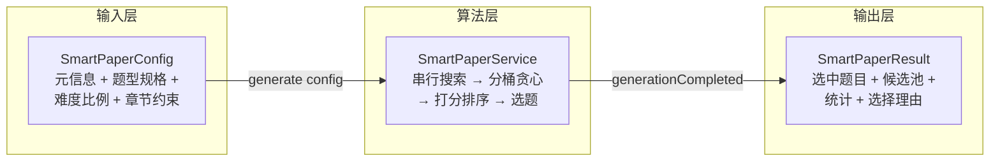
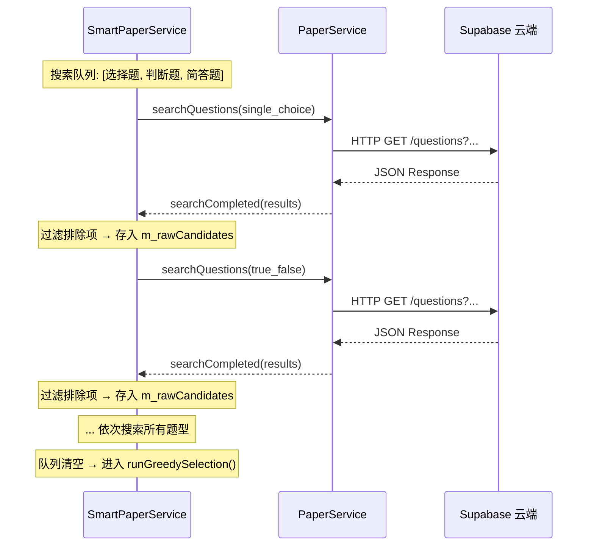
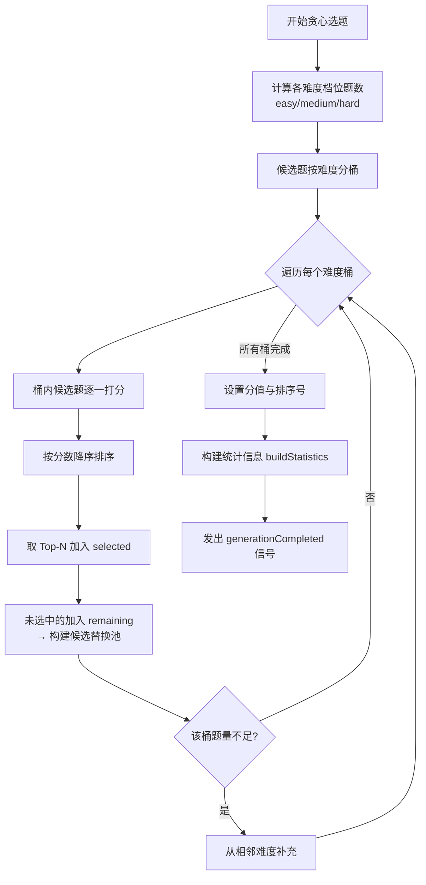
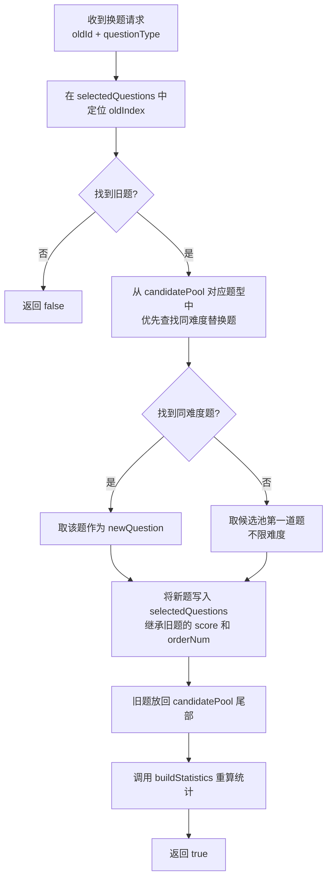

**SmartPaperService** 是 AI 思政智慧课堂系统中负责**自动组卷**的核心算法引擎。教师只需设定学科、年级、题型分布、难度比例与章节/知识点约束，引擎便从云端公共题库中串行搜索候选题目，经**分桶贪心选题**后输出一份满足约束条件的试卷。引擎同时为每道选中题目生成**可解释的选择理由**，并保留一份**候选替换池**，允许教师在预览阶段逐题"换一题"而不破坏整体难度平衡。本文将从数据模型、算法原理、换题机制与 UI 编排四个维度展开深入解析。

Sources: [SmartPaperService.h](src/smartpaper/SmartPaperService.h#L1-L81), [SmartPaperService.cpp](src/smartpaper/SmartPaperService.cpp#L1-L478)

## 一、数据模型三层结构

智能组卷的数据流由三个核心结构体承载：**输入配置 `SmartPaperConfig`**、**中间评分 `QuestionSelectionReason`**、**输出结果 `SmartPaperResult`**。它们全部定义在 [SmartPaperConfig.h](src/smartpaper/SmartPaperConfig.h) 中，不依赖任何 UI 头文件，确保算法层可独立测试。



### 1.1 输入配置 `SmartPaperConfig`

| 字段 | 类型 | 用途 | 示例 |
|---|---|---|---|
| `title / subject / grade` | `QString` | 试卷元信息 | `"期中考试"` / `"道德与法治"` / `"六年级"` |
| `duration` | `int` | 考试时长（分钟） | `90` |
| `typeSpecs` | `QList<QuestionTypeSpec>` | 每种题型的**数量 + 分值** | `{single_choice, 10题, 2分/题}` |
| `easyRatio / mediumRatio / hardRatio` | `int` | 三档难度比例（归一化） | `3 : 5 : 2` |
| `chapters` | `QStringList` | 目标章节范围 | `{"第一单元"}` |
| `knowledgePoints` | `QStringList` | 目标知识点白名单 | `{"宪法", "公民权利"}` |
| `excludeQuestionIds` | `QStringList` | 排除的题目 ID | 上一轮已使用的题目 |

配置提供两个便捷计算方法：`computedTotalScore()` 按 `∑(count × scorePerQuestion)` 累加总分，`computedTotalCount()` 累加总题数——供 UI 层实时显示汇总信息与校验按钮状态。

Sources: [SmartPaperConfig.h](src/smartpaper/SmartPaperConfig.h#L22-L63)

### 1.2 单题选择理由 `QuestionSelectionReason`

算法为每道选中的题目生成一份**评分明细**，包含三个维度的独立分数和一句人类可读的摘要：

| 字段 | 含义 | 取值范围 |
|---|---|---|
| `coverageScore` | 知识点/章节新覆盖得分 | 0 ~ 70 |
| `difficultyMatchScore` | 目标章节与知识点匹配度 | 0 ~ 45 |
| `diversityScore` | 随机扰动（防重复） | 0 ~ 10 |
| `summary` | 人类可读的一句话理由 | 如 `"覆盖新知识点「宪法」，命中目标考点「公民权利」"` |

Sources: [SmartPaperConfig.h](src/smartpaper/SmartPaperConfig.h#L68-L74)

### 1.3 输出结果 `SmartPaperResult`

| 字段 | 类型 | 用途 |
|---|---|---|
| `selectedQuestions` | `QList<PaperQuestion>` | 最终选中的题目列表（含分值和排序号） |
| `candidatePool` | `QMap<QString, QList<PaperQuestion>>` | 按题型分组的**替换候选池**（贪心未选中的题目） |
| `typeCount / difficultyCount` | `QMap<QString, int>` | 题型/难度分布统计 |
| `coveredChapters / coveredKnowledgePoints` | `QStringList` | 已覆盖的章节和知识点 |
| `knowledgePointCoverage` | `double` | 知识点覆盖率 `0.0 ~ 1.0` |
| `warnings` | `QStringList` | 警告（题量不足、章节未覆盖等） |
| `selectionReasons` | `QList<QuestionSelectionReason>` | 逐题选择理由 |

`candidatePool` 的存在是**换题机制**的前提——贪心算法在分桶打分排序时，未被选中的题目不会丢弃，而是按题型归入候选池，供 `swapQuestion()` 随时取用。

Sources: [SmartPaperConfig.h](src/smartpaper/SmartPaperConfig.h#L79-L94)

## 二、串行搜索策略：为什么不能并行

SmartPaperService 的搜索阶段采用**严格的串行队列**模式。每个题型依次发起一次 `PaperService::searchQuestions()` 网络请求，收到 `searchCompleted` 信号后处理结果，再发起下一个题型的搜索。



串行的根本原因在于 `PaperService::searchCompleted` 信号**没有请求标识字段**——当多个搜索并行返回时，服务端无法区分哪次响应对应哪个题型。因此 `SmartPaperService` 通过 `m_currentSearchType` 成员变量追踪当前搜索的题型，确保每次回调都能正确归档到 `m_rawCandidates[题型]` 中。这种设计虽然牺牲了并发速度，但换来了简洁的状态管理与可靠的分类归档。

搜索阶段的进度映射规则：**搜索阶段占总进度的 0% ~ 60%**（均摊到每次搜索），选题算法占 60% ~ 90%，统计构建占 90% ~ 100%。

Sources: [SmartPaperService.cpp](src/smartpaper/SmartPaperService.cpp#L74-L162)

## 三、贪心选题算法详解

当所有题型的搜索完成后，`runGreedySelection()` 被调用。这是整个引擎的核心算法，采用**"分桶 + 评分 + Top-N 截断"**的三阶段贪心策略。下文逐步拆解每个阶段。

### 3.1 算法总览流程



### 3.2 阶段一：难度比例计算

将教师设定的难度比例（如 `3:5:2`）转换为每个题型内各难度档位的具体题数。以"选择题 10 题、比例 3:5:2"为例：

```
easyCount   = round(10 × 3 / 10) = 3
hardCount   = round(10 × 2 / 10) = 2
mediumCount = 10 - 3 - 2 = 5
```

若 `mediumCount` 出现负数（极端比例下），算法会将其钳制为 0 并重新分配。

Sources: [SmartPaperService.cpp](src/smartpaper/SmartPaperService.cpp#L164-L188)

### 3.3 阶段二：候选题按难度分桶

所有候选题根据 `difficulty` 字段归入三个桶：`easy`、`medium`、`hard`。若某题的难度字段不在标准三档中，默认归入 `medium` 桶——这是一个防御性策略，避免因数据质量问题导致题目被遗漏。

```
buckets["easy"]   → [题目A, 题目D, ...]
buckets["medium"] → [题目B, 题目C, ...]
buckets["hard"]   → [题目E, 题目F, ...]
```

Sources: [SmartPaperService.cpp](src/smartpaper/SmartPaperService.cpp#L190-L198)

### 3.4 阶段三：桶内打分与 Top-N 截断

这是算法的**精华部分**。对每个难度桶内的候选题逐一调用 `scoreCandidate()` 计算综合得分，然后按分数降序排序，取前 `need` 道作为该难度的选中题。未被选中的题目全部归入 `remaining` 列表，最终成为候选替换池 `candidatePool`。

**`scoreCandidate()` 评分函数**由三个独立维度加总，最高可得 125 分：

| 维度 | 分值 | 判定逻辑 |
|---|---|---|
| **知识点新覆盖度** | +40 | 题目的任一知识点不在 `globalCoveredKnowledgePoints` 中即触发 |
| **章节新覆盖度** | +30 | 题目的章节不在 `globalCoveredChapters` 中即触发 |
| **目标章节匹配** | +20 | 题目的章节在教师指定的 `chapters` 列表中 |
| **目标知识点匹配** | +25 | 题目的任一知识点在教师指定的 `knowledgePoints` 列表中 |
| **随机扰动** | +0~10 | `QRandomGenerator` 生成，避免每次结果完全相同 |

关键设计要点：`globalCoveredChapters` 和 `globalCoveredKnowledgePoints` 是**跨题型共享的全局状态**。每当一道题被选中，它的章节和知识点会立即注入这两个集合。这意味着**后续题型的选题会优先选择与已选题目不同的知识点**，从而最大化整张试卷的知识覆盖面。这正是"贪心"的核心思想——每一步都选择当前最优（覆盖面最广）的题目。

Sources: [SmartPaperService.cpp](src/smartpaper/SmartPaperService.cpp#L209-L285), [SmartPaperService.cpp](src/smartpaper/SmartPaperService.cpp#L304-L366)

### 3.5 难度不足时的降级补充

当某个难度桶的题量不足以满足配额时，算法会将缺口**转嫁给相邻难度**：

| 不足的难度 | 补充来源 |
|---|---|
| `easy` 不足 | 缺口全部转给 `medium` |
| `hard` 不足 | 缺口全部转给 `medium` |
| `medium` 不足 | 缺口平分给 `easy` 和 `hard` |

这种策略优先保持难度的**中心偏移方向**一致——简单题不够就向中等题靠拢，而非直接跳到困难题。

Sources: [SmartPaperService.cpp](src/smartpaper/SmartPaperService.cpp#L252-L272)

## 四、换题机制 `swapQuestion()`

教师在预览试卷时，每道题旁都有一个"换一题"按钮。点击后触发 `SmartPaperWidget::onSwapQuestion()`，进而调用 `SmartPaperService::swapQuestion(oldId, questionType)`。

### 4.1 换题算法步骤



### 4.2 换题的关键设计

**同难度优先**：`swapQuestion()` 首先遍历候选池寻找与被替换题**相同难度**的替换题（[SmartPaperService.cpp](src/smartpaper/SmartPaperService.cpp#L446-L452)）。只有在候选池中不存在同难度题目时，才会退而取候选池的第一道题。这确保了换题操作不会显著改变试卷的整体难度分布。

**双向交换**：旧题不是被丢弃，而是追加到候选池末尾。这意味着教师可以在多道题之间反复切换——每次换题都是一次候选池与已选列表的**交换**操作，候选池永远不会单向耗尽。

**统计即时重算**：每次换题后立即调用 `buildStatistics()` 更新总分、题型分布、难度分布、覆盖率和警告信息。UI 层收到成功信号后调用 `buildResultPreview()` 重新渲染整个结果区域，确保统计数据始终反映当前试卷的实时状态。

Sources: [SmartPaperService.cpp](src/smartpaper/SmartPaperService.cpp#L421-L472), [SmartPaperWidget.cpp](src/smartpaper/SmartPaperWidget.cpp#L1307-L1315)

## 五、统计构建与覆盖率计算

`buildStatistics()` 在选题完成和每次换题后被调用，负责遍历当前 `selectedQuestions` 重新计算以下指标：

| 指标 | 计算方式 |
|---|---|
| `totalScore` | 所有选中题目的 `score` 累加 |
| `typeCount` | 按 `questionType` 分组计数 |
| `difficultyCount` | 按 `difficulty` 分组计数 |
| `coveredChapters` | 去重后的章节列表 |
| `coveredKnowledgePoints` | 去重后的知识点列表 |
| `knowledgePointCoverage` | `已命中目标知识点数 / 目标知识点总数`（若教师指定了知识点） |

当教师未指定目标知识点时，覆盖率自动设为 `1.0`（表示"不适用"而非"100% 覆盖"）。此外，算法还会逐一检查教师指定的每个章节是否已被覆盖，未被覆盖的章节会以警告形式追加到 `warnings` 列表。

Sources: [SmartPaperService.cpp](src/smartpaper/SmartPaperService.cpp#L368-L418)

## 六、UI 层编排：SmartPaperWidget

`SmartPaperWidget` 是智能组卷功能的完整 UI 容器，负责将教师的配置意图转化为 `SmartPaperConfig`，驱动 `SmartPaperService` 执行算法，并将 `SmartPaperResult` 渲染为可视化结果。它采用**四区布局**：

```mermaid
graph TB
    subgraph SmartPaperWidget
        direction TB
        A["配置卡片区<br/>标题 / 学科 / 年级 / 时长<br/>章节 + 知识点勾选<br/>题型分布表（动态行）<br/>难度比例 3:5:2"]
        B["状态区 QStackedWidget<br/>Idle / Generating进度 / Failed错误"]
        C["结果预览区<br/>统计报告卡片（总题数/分值/覆盖率）<br/>题型分布表 + 难度分布标签<br/>逐题列表（含选择理由 + 换一题按钮）"]
        D["底部操作栏<br/>重新组卷 | 保存到云端 | 导入试题篮 | 编辑导出"]
    end
    A -->|点击"开始组卷"| B
    B -->|generationCompleted| C
    C --> D
```

### 6.1 配置收集流程

`onGenerateClicked()` 从 UI 控件中提取所有配置信息，特别值得注意的几处映射：

- **年级处理**：`m_gradeCombo` 显示的是"年级册别"（如"六年级上册"），通过 `CurriculumData::baseGradeFromGradeSemester()` 转换为基础年级（如"六年级"）作为搜索条件 [SmartPaperWidget.cpp](src/smartpaper/SmartPaperWidget.cpp#L912)
- **章节**：仅当教师选中了具体章节（非"不限定章节"）时才加入约束 [SmartPaperWidget.cpp](src/smartpaper/SmartPaperWidget.cpp#L917-L919)
- **知识点**：从 `QListWidget` 的勾选项中收集，`Qt::UserRole` 存储知识点名称 [SmartPaperWidget.cpp](src/smartpaper/SmartPaperWidget.cpp#L920)
- **总分**：不是教师直接输入，而是由 `computedTotalScore()` 自动计算 [SmartPaperWidget.cpp](src/smartpaper/SmartPaperWidget.cpp#L937)

Sources: [SmartPaperWidget.cpp](src/smartpaper/SmartPaperWidget.cpp#L902-L944)

### 6.2 状态机管理

`SmartPaperWidget` 定义了一个四态枚举 `AssemblyState`，由 `setState()` 统一控制 UI 元素的可见性和可用性：

| 状态 | 进度区 | 结果区 | 底部操作栏 | 组卷按钮 |
|---|---|---|---|---|
| `Idle` | 隐藏 | 隐藏 | 隐藏 | 启用 |
| `Generating` | 显示进度条 | 隐藏 | 隐藏 | 禁用 |
| `Success` | 隐藏 | 显示 | 显示 | 启用 |
| `Failed` | 显示错误+重试 | 隐藏 | 隐藏 | 启用 |

Sources: [SmartPaperWidget.h](src/smartpaper/SmartPaperWidget.h#L35), [SmartPaperWidget.cpp](src/smartpaper/SmartPaperWidget.cpp#L871-L900)

### 6.3 结果后续动作

组卷成功后，底部操作栏提供四条动作链路：

| 按钮 | 行为 | 涉及组件 |
|---|---|---|
| **重新组卷** | 回到 Idle 状态，清空结果预览 | `SmartPaperWidget` 内部状态 |
| **保存到云端** | 创建 `Paper` → 收到 `paperCreated` → 批量 `addQuestions()` | [PaperService](src/services/PaperService.h) |
| **导入试题篮** | 清空 `QuestionBasket` 单例 → 逐题导入并设置分值 | [QuestionBasket](src/questionbank/QuestionBasket.h) |
| **编辑导出** | 先导入试题篮 → 打开 `PaperComposerDialog` 进行编辑 | [PaperComposerDialog](src/questionbank/PaperComposerDialog.h) |

"保存到云端"采用**两步异步模式**：先调用 `createPaper()` 创建试卷元信息，在 `onPaperCreated()` 回调中拿到服务器返回的 `paper.id`，再将其设置为每题的 `paperId` 后批量添加。这种模式依赖 `PaperService` 的异步信号驱动，是本系统中常见的服务层交互范式。

Sources: [SmartPaperWidget.cpp](src/smartpaper/SmartPaperWidget.cpp#L1317-L1383)

## 七、设计总结与延伸阅读

SmartPaperService 的核心设计哲学可以概括为三点：

1. **贪心而非最优**：算法追求的是**在合理时间内生成可用的试卷**，而非全局最优。贪心策略的时间复杂度为 O(n log n)（桶内排序），远优于整数规划的指数级复杂度，使得组卷在客户端即可实时完成。
2. **可解释性优先**：每道题附带 `QuestionSelectionReason`，将黑盒选题转化为白盒决策——教师可以理解"为什么选了这道题"。
3. **换题保持平衡**：候选池 + 同难度优先替换，确保微调不会破坏宏观难度分布。

若需了解与 SmartPaperService 紧密协作的其他模块，推荐阅读以下页面：

- [试题库管理：题目录入、篮子、质量检查与批量导入](13-shi-ti-ku-guan-li-ti-mu-lu-ru-lan-zi-zhi-liang-jian-cha-yu-pi-liang-dao-ru) — 理解 `QuestionBasket` 和 `PaperQuestion` 数据模型
- [试卷导出管道：ExportService 的 HTML / DOCX / PDF 多格式生成](16-shi-juan-dao-chu-guan-dao-exportservice-de-html-docx-pdf-duo-ge-shi-sheng-cheng) — 组卷结果如何转化为可打印的试卷文件
- [DifyService：SSE 流式对话、多事件类型处理与会话管理](10-difyservice-sse-liu-shi-dui-hua-duo-shi-jian-lei-xing-chu-li-yu-hui-hua-guan-li) — 理解系统中异步信号驱动的服务交互模式