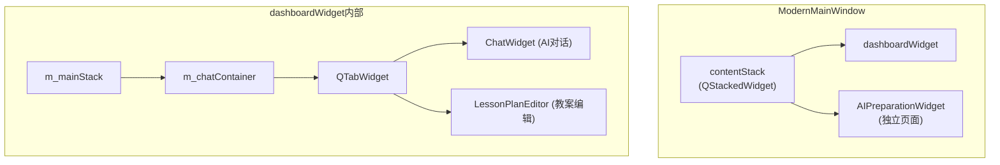
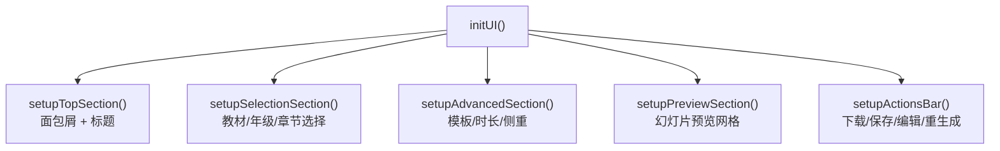
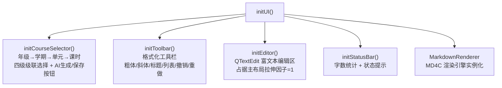
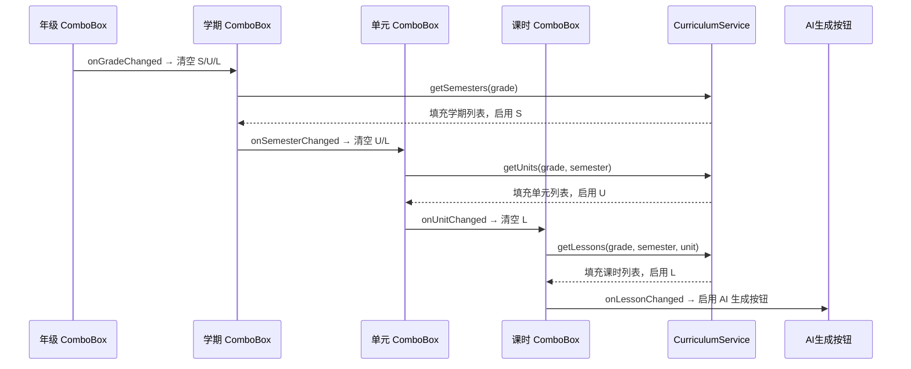
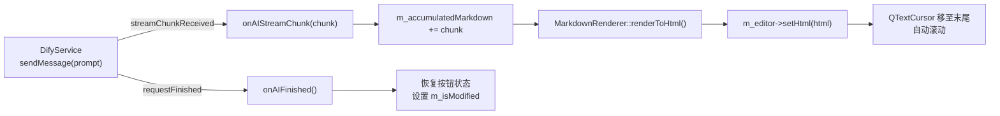

本页深入解析项目中两个核心备课模块的设计与实现：**AIPreparationWidget**（AI 智能备课 · PPT 生成页面）和 **LessonPlanEditor**（教案富文本编辑器）。前者是一个**独立的全页面组件**，负责课程参数选择、PPT 模板配置与幻灯片预览管理；后者是一个**嵌入到标签页中的编辑器**，通过 SSE 流式接收 AI 生成的教案内容，并提供所见即所得的格式化工具栏和多格式导出能力。二者虽共享"AI 辅助教学"的业务目标，但在架构角色、数据流向和交互模式上截然不同。

Sources: [aipreparationwidget.h](src/ui/aipreparationwidget.h#L1-L261), [LessonPlanEditor.h](src/ui/LessonPlanEditor.h#L1-L177)

## 模块定位与职责边界

在 [主工作台 ModernMainWindow](6-zhu-gong-zuo-tai-modernmainwindow-dao-hang-ye-mian-zhan-yu-mo-kuai-bian-pai) 的页面栈中，这两个组件处于不同的层级：



| 维度 | AIPreparationWidget | LessonPlanEditor |
|------|---------------------|------------------|
| **页面角色** | contentStack 中的独立全页面 | AI 对话标签页内的子标签页 |
| **核心产出** | PPT 幻灯片图像 | 结构化教案文本（Markdown/HTML） |
| **AI 交互模式** | 纯信号委托，自身不持有 DifyService | 直接持有 DifyService 指针，SSE 流式消费 |
| **数据源** | 课程参数通过 UI 输入 | 课程目录通过 CurriculumService 级联加载 |
| **导出格式** | PPTX（通过信号委托给外部） | PDF / DOC / HTML / MD / TXT 五种格式 |

Sources: [modernmainwindow.cpp](src/dashboard/modernmainwindow.cpp#L1071-L1080), [modernmainwindow.cpp](src/dashboard/modernmainwindow.cpp#L2499-L2507)

## AIPreparationWidget：PPT 生成全流程管理

### UI 分区架构

AIPreparationWidget 的界面布局严格遵循**从上到下的操作流水线**设计，通过 `initUI()` 方法依次构建五个逻辑区域：



**顶部区域**（setupTopSection）渲染面包屑导航"首页 / AI智能备课"和标题"AI智能备课 · PPT生成"，为用户提供当前页面定位。

**选择区域**（setupSelectionSection）包含三个 `QComboBox`（教材版本、年级、章节）排列在 `QGridLayout` 中，右侧放置"生成PPT"和"高级"两个按钮。教材版本默认提供"人教版"、"部编版"、"粤教版"三选项，年级范围覆盖七至九年级，章节数据以硬编码的思政课章节列表填充。

**高级选项区域**（setupAdvancedSection）默认隐藏，通过 `QPropertyAnimation` 实现展开/收起的平滑过渡动画（320ms，InOutCubic 缓动曲线）。内含三组配置：PPT 风格模板卡片（党政红 / 商务蓝 / 简约白）、课时长度下拉框（45分钟 / 20分钟 / 60分钟）、内容侧重文本输入框。

Sources: [aipreparationwidget.cpp](src/ui/aipreparationwidget.cpp#L103-L118), [aipreparationwidget.cpp](src/ui/aipreparationwidget.cpp#L320-L441)

### 状态机模型与进度反馈

AIPreparationWidget 采用 `GenerationState` 枚举驱动四种 UI 状态：

| 状态 | 含义 | 状态栏表现 | 操作栏可见性 |
|------|------|-----------|-------------|
| `Idle` | 等待生成 | 隐藏 | 隐藏 |
| `Generating` | 正在生成 | 蓝色进度点 + 百分比文字闪烁 | 隐藏 |
| `Success` | 生成完毕 | 绿色胶囊"生成完毕！" | 可见 |
| `Failed` | 生成失败 | 红色文字"生成失败，请重试" | 隐藏 |

`setProgress(int percent)` 方法是外部驱动状态转换的核心入口：当 percent < 100 时自动切换到 `Generating` 状态并更新进度文本，当 percent 达到 100 时自动切换到 `Success`。进度点闪烁效果通过 500ms 间隔的 `QTimer` 驱动 `m_progressDotVisible` 布尔值切换实现。

Sources: [aipreparationwidget.h](src/ui/aipreparationwidget.h#L39-L44), [aipreparationwidget.cpp](src/ui/aipreparationwidget.cpp#L965-L997), [aipreparationwidget.cpp](src/ui/aipreparationwidget.cpp#L1241-L1266)

### 信号委托模式与外部集成

AIPreparationWidget **不持有任何 AI 服务引用**，它严格遵循信号委托模式——用户操作转化为参数映射后通过信号抛出，由宿主层（ModernMainWindow）负责实际的服务调用：

```cpp
void AIPreparationWidget::onGenerateClicked() {
    QMap<QString, QString> params;
    params.insert("textbook", selectedTextbook());
    params.insert("grade", selectedGrade());
    params.insert("chapter", selectedChapter());
    params.insert("template", selectedTemplateKey());
    params.insert("duration", selectedDuration());
    params.insert("contentFocus", contentFocus());
    emit generateRequested(params);
    setGenerationState(GenerationState::Generating);
    setProgress(0);
}
```

完整的信号列表涵盖了生成请求（`generateRequested`）、幻灯片预览（`previewRequested`、`slidePreviewRequested`）、文件下载（`downloadRequested`）、保存到备课库（`saveToLibraryRequested`）、在线编辑（`onlineEditRequested`）、重新生成（`regenerateRequested`）以及幻灯片排序变更（`slidesReordered`）。这种设计使 AIPreparationWidget 成为一个纯粹的 UI 展示/参数收集组件，与具体的 PPT 生成引擎（[PPTXGenerator](17-pptxgenerator-ji-yu-xml-zip-de-yuan-sheng-pptx-wen-jian-gou-jian)、[讯飞智文](18-di-san-fang-ppt-ji-cheng-xun-fei-zhi-wen-api-yu-zhi-pu-agent-fu-wu) 等）完全解耦。

Sources: [aipreparationwidget.cpp](src/ui/aipreparationwidget.cpp#L1281-L1294), [aipreparationwidget.h](src/ui/aipreparationwidget.h#L63-L71)

### 幻灯片预览网格与拖拽排序

预览区域固定显示 3 个幻灯片槽位（`kVisibleSlideSlots = 3`），外加 1 个占位符卡片。每个预览卡片内部结构包含图片标签、标题标签、半透明悬浮层和预览按钮。

**拖拽排序**的实现采用了自定义 MIME 类型 `application/x-aipreview-index`，通过 `eventFilter` 捕获 `MouseMove` 事件在超过 `startDragDistance` 后启动 `QDrag` 操作，在 `dropEvent` 中通过坐标计算目标位置并执行 `m_slideImages.move(fromIndex, toIndex)` 重排数据。拖拽与点击通过 `m_dragging` 标志位互斥：若拖拽距离未达到阈值则视为点击，触发 `showPreviewDialog`。

Sources: [aipreparationwidget.cpp](src/ui/aipreparationwidget.cpp#L1026-L1186), [aipreparationwidget.cpp](src/ui/aipreparationwidget.cpp#L750-L838)

### SlidePreviewDialog：全屏幻灯片查看器

内嵌的 `SlidePreviewDialog` 提供无标题栏（`Qt::FramelessWindowHint`）的全屏预览体验，支持缩放控制（放大 ×1.25 / 缩小 ÷1.25 / 适合窗口）、前后翻页导航和单页删除功能。缩放逻辑通过 `m_fitScale`（初始适配比例）和 `m_scaleFactor`（当前缩放因子）协同工作，`onFitToWindowClicked()` 计算视口与图片的最小宽高比来实现最佳适配。

Sources: [aipreparationwidget.h](src/ui/aipreparationwidget.h#L216-L258), [aipreparationwidget.cpp](src/ui/aipreparationwidget.cpp#L1439-L1655)

## LessonPlanEditor：AI 驱动的结构化教案编辑器

### 四区布局与初始化流程

LessonPlanEditor 的界面由四个层次分明的方法构建：



初始化顺序具有严格的依赖关系：先创建所有 UI 组件（`initUI`），再连接信号槽（`connectSignals`），然后加载课程目录数据（`loadCurriculum`），最后启动自动保存定时器（30 秒间隔）并检查草稿恢复。

Sources: [LessonPlanEditor.cpp](src/ui/LessonPlanEditor.cpp#L57-L87), [LessonPlanEditor.cpp](src/ui/LessonPlanEditor.cpp#L129-L146)

### 课程目录级联选择与 CurriculumService

LessonPlanEditor 通过 **CurriculumService 单例** 实现四级级联下拉框联动：年级（Grade）→ 学期（Semester）→ 单元（Unit）→ 课时（Lesson）。每一级的选择变化都会清空所有下级选项并重新填充：



只有当四级选择全部完成（`m_lessonCombo->currentIndex() > 0`）时，"AI 生成教案"按钮才被启用。课程数据来源于 Qt 资源文件 `curriculum_morality_law.json`，通过 `CurriculumService::instance()` 惰性加载。

Sources: [LessonPlanEditor.cpp](src/ui/LessonPlanEditor.cpp#L626-L751), [CurriculumService.h](src/services/CurriculumService.h#L17-L107)

### AI 生成教案的 SSE 流式管线

当用户点击"AI 生成教案"按钮后，LessonPlanEditor 构建一个结构化的提示词（通过 `buildAIPrompt()`），严格限定 AI 只围绕指定课时的内容生成教案。该提示词包含课程信息表和六个教案结构要求（教学目标、教学重难点、教学过程、板书设计、作业布置、教学反思），并用明确的约束语句防止 AI 越界引用其他课时内容。

AI 内容生成采用 **SSE 流式渲染**架构：



关键实现细节：`m_isGenerating` 标志位用于**隔离**教案生成阶段的流式回调与聊天对话的流式回调，确保 LessonPlanEditor 不会错误处理来自 ChatWidget 的 DifyService 事件。每收到一个 chunk，都会将累积的完整 Markdown 重新渲染为 HTML 并设置到编辑器中，实现逐字展开的视觉效果。

Sources: [LessonPlanEditor.cpp](src/ui/LessonPlanEditor.cpp#L755-L905), [LessonPlanEditor.cpp](src/ui/LessonPlanEditor.cpp#L793-L849)

### 教案结构化解析与模板化导出

LessonPlanEditor 最复杂的功能链路是**结构化导出**：将 AI 生成的 Markdown 文本解析为 12 个预定义章节，然后填入专业的教案表格模板输出为 PDF/Word/HTML。

**Markdown 章节解析**（`parseLessonPlanSections`）通过正则表达式 `^(#{1,4})\s+(.+)$` 按 Markdown 标题拆分内容，然后对每个章节标题进行关键词匹配：

| 匹配关键词 | 映射字段 |
|------------|---------|
| 知识 + 技能/能力 | `knowledgeSkills` |
| 过程 + 方法 | `processMethod` |
| 情感 / 价值观 | `emotionValues` |
| 重点 + 难点（合并） | 拆分为 `keyPoints` 和 `difficulties` |
| 导入 / 引入 / 情境创设 | `introduction` |
| 新课 / 讲授 / 探究 | `mainTeaching` |
| 练习 / 实践 / 互动 | `classExercise` |
| 小结 / 总结 / 归纳 | `classSummary` |
| 板书 | `boardDesign` |
| 作业 / 课后 | `homework` |
| 反思 | `reflection` |

对于未匹配的子章节，解析器根据父级上下文（`currentParent`）归类——若处于"教学过程"下，则按顺序依次填充 导入→新课讲授→课堂练习→课堂小结，超出部分追加到新课讲授。

Sources: [LessonPlanEditor.cpp](src/ui/LessonPlanEditor.cpp#L1319-L1521)

### 双路径导出与结构化 HTML 模板

导出系统根据是否存在结构化 Markdown 源文本（`m_accumulatedMarkdown` 是否为空）分两条路径：

| 路径 | 触发条件 | 输出效果 |
|------|---------|---------|
| **结构化路径** | AI 生成内容存在 | 专业的两页教案表格（含信息表、教学目标、重难点、教学过程、板书设计、作业布置、教学反思虚线格） |
| **回退路径** | 手动输入内容 | 通用 HTML 文档包装（h1 标题 + 编辑器原始内容） |

结构化模板（`buildStructuredHtml`）生成完整的 A4 规格教案表，分为两页：第一页包含课题信息表、教学目标（三维度分行）、教学重难点、完整教学过程（含时间标签 5min/25min/10min/5min）；第二页包含板书设计方框、作业布置和带虚线书写行的教学反思区。针对不同输出目标，CSS 样式策略也不同——`forPrint=true` 时使用 QTextDocument 兼容的简化 CSS，`forPrint=false` 时使用包含 `@page` 规则和 `@media print` 的完整浏览器 CSS。

Sources: [LessonPlanEditor.cpp](src/ui/LessonPlanEditor.cpp#L909-L1009), [LessonPlanEditor.cpp](src/ui/LessonPlanEditor.cpp#L1585-L1984)

### 富文本格式化工具栏

工具栏通过 `QTextCursor` 和 `QTextCharFormat` 直接操作 QTextEdit 的富文本文档模型：

| 按钮 | 实现方式 |
|------|---------|
| **粗体** | `cursor.charFormat().fontWeight()` 切换 Bold/Normal |
| **斜体** | `cursor.charFormat().fontItalic()` 切换 true/false |
| **H1/H2/H3** | `setBlockUnderCursor` + 设置字号（24/18/14pt）和 Bold |
| **无序列表** | `QTextListFormat::ListDisc` + `cursor.createList()` |
| **有序列表** | `QTextListFormat::ListDecimal` + `cursor.createList()` |
| **撤销/重做** | 直接委托给 `QTextEdit::undo()` / `QTextEdit::redo()` |

Sources: [LessonPlanEditor.cpp](src/ui/LessonPlanEditor.cpp#L314-L469), [LessonPlanEditor.cpp](src/ui/LessonPlanEditor.cpp#L1108-L1207)

### 自动保存与草稿恢复

LessonPlanEditor 实现了基于 `QSettings` 的自动保存机制：每次编辑器内容变化时重启 30 秒倒计时定时器，超时后将 HTML 内容保存到 `autoSave/lessonPlan/{lessonTitle}` 键下。组件初始化后 500ms（通过 `QTimer::singleShot`）检查是否有未保存的草稿，若存在则弹窗询问用户是否恢复。保存成功后会自动清除草稿数据，防止重复弹窗。

Sources: [LessonPlanEditor.cpp](src/ui/LessonPlanEditor.cpp#L1264-L1315)

## 设计模式对比

两个组件虽然都服务于"AI 备课"场景，但在架构模式上体现了项目中的两种典型设计：

| 模式 | AIPreparationWidget | LessonPlanEditor |
|------|---------------------|------------------|
| **服务依赖** | 零服务依赖，纯信号委托 | 持有 DifyService + MarkdownRenderer |
| **状态管理** | 枚举驱动四态状态机 | 布尔标志位（m_isGenerating, m_isModified） |
| **数据流向** | 单向：UI → 信号 → 外部 → API → setSlides/setProgress | 双向：UI → DifyService → SSE chunk → 累积渲染 → UI |
| **可测试性** | 高：所有输出均为信号，易于 Mock 验证 | 中：依赖 DifyService 实例，需要 Mock SSE 流 |
| **样式系统** | 类内 setupConstants() 定义色值常量 | 匿名命名空间定义思政红主题色值常量 |

Sources: [aipreparationwidget.h](src/ui/aipreparationwidget.h#L39-L44), [aipreparationwidget.cpp](src/ui/aipreparationwidget.cpp#L80-L101), [LessonPlanEditor.cpp](src/ui/LessonPlanEditor.cpp#L36-L55)

## 延伸阅读

- [DifyService：SSE 流式对话、多事件类型处理与会话管理](10-difyservice-sse-liu-shi-dui-hua-duo-shi-jian-lei-xing-chu-li-yu-hui-hua-guan-li) — 理解 LessonPlanEditor 消费的 SSE 流是如何产生的
- [Markdown 渲染引擎：基于 MD4C 的富文本转换](24-markdown-xuan-ran-yin-qing-ji-yu-md4c-de-fu-wen-ben-zhuan-huan) — 理解 MarkdownRenderer 如何将 AI 输出转换为 QTextEdit 可显示的 HTML
- [主工作台 ModernMainWindow：导航、页面栈与模块编排](6-zhu-gong-zuo-tai-modernmainwindow-dao-hang-ye-mian-zhan-yu-mo-kuai-bian-pai) — 理解两个组件如何被嵌入到页面栈中
- [PPTXGenerator：基于 XML + ZIP 的原生 PPTX 文件构建](17-pptxgenerator-ji-yu-xml-zip-de-yuan-sheng-pptx-wen-jian-gou-jian) — 理解 AIPreparationWidget 信号最终可能触发的 PPT 生成逻辑