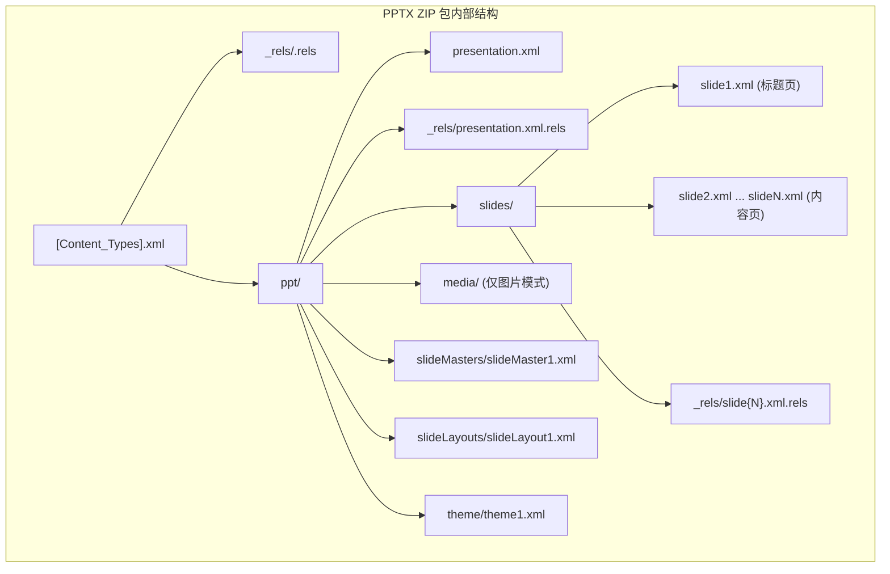
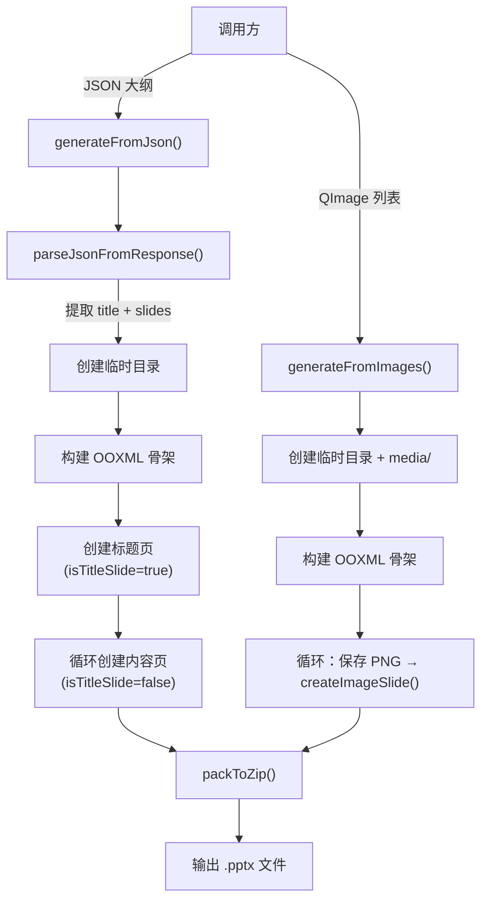
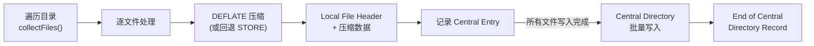
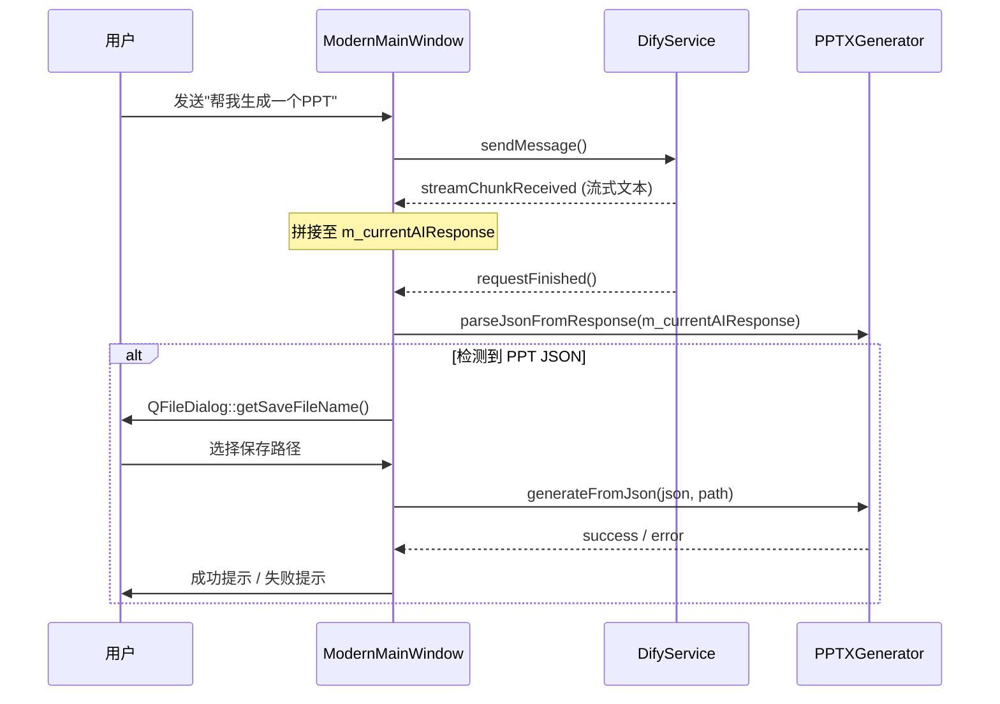

PPTXGenerator 是本系统中完全自主实现的 PPTX 文件生成器——它不依赖任何第三方 Office 库，也不调用外部命令行工具，而是从 **OOXML (Office Open XML)** 格式的第一性原理出发，在 C++ 层面直接拼装 XML 文件并用 DEFLATE 算法打包为合法的 `.pptx` 文件。本文将从 OOXML 格式结构、生成流水线、双模式架构、XML 构造细节以及底层 ZIP 打包器五个层面，系统拆解其设计与实现。

Sources: [PPTXGenerator.h](src/services/PPTXGenerator.h#L1-L81), [PPTXGenerator.cpp](src/services/PPTXGenerator.cpp#L1-L16)

## 设计动机：为什么不用模板，而是从零构建

项目早期曾存在模板模式——从预制的 `.pptx` 模板中提取 XML 再做替换（`resources/templates/party_red_template.pptx` 即为其遗迹），但当前版本已**统一切换到基础生成模式**。构造函数中的日志明确记录了这一决策：

```cpp
qDebug() << "[PPTXGenerator] Template mode disabled, using basic mode only";
```

这一选择背后有三个工程考量：**零文件依赖**（无需将模板打包进应用资源）、**完全可控**（每一行 XML 都由代码生成，便于调试和定制）、以及**跨平台一致**（不依赖系统字体路径或本地化差异）。

Sources: [PPTXGenerator.cpp](src/services/PPTXGenerator.cpp#L12-L16), [resources/templates](resources/templates)

## OOXML 格式基础：PPTX 文件的内部结构

在深入代码之前，需要理解一个核心事实：**PPTX 文件就是一个遵循特定目录约定的 ZIP 压缩包**。PPTXGenerator 的工作本质上就是在临时目录中构建如下的文件树，然后将其打包为 ZIP。



| 文件 | 职责 | 是否动态生成 |
|------|------|:---:|
| `[Content_Types].xml` | 声明 ZIP 内各文件的 MIME 类型映射 | ✅ 按页数动态 |
| `_rels/.rels` | 包级关系：指向 `presentation.xml` 作为入口 | ❌ 静态 |
| `ppt/presentation.xml` | 演示文稿主文档，包含幻灯片 ID 列表和尺寸 | ✅ 按页数动态 |
| `ppt/slides/slide{N}.xml` | 每页幻灯片的完整内容（文本/图片） | ✅ 按内容动态 |
| `ppt/slideMasters/slideMaster1.xml` | 母版定义（颜色映射、布局引用） | ❌ 静态 |
| `ppt/slideLayouts/slideLayout1.xml` | 布局定义（本实现使用空白布局） | ❌ 静态 |
| `ppt/theme/theme1.xml` | 主题颜色、字体、填充方案 | ❌ 静态 |

Sources: [PPTXGenerator.cpp](src/services/PPTXGenerator.cpp#L88-L98), [resources/templates/temp_extract](resources/templates/temp_extract)

## 双模式生成架构

PPTXGenerator 提供两条互不干扰的生成路径，分别面向**文本结构化输出**和**像素级精确输出**两种场景：



### 模式一：JSON 大纲生成 (`generateFromJson`)

这是当前系统的主要使用路径。AI 服务（DifyService）返回的 JSON 大纲被解析后，逐页生成文本型幻灯片。输入 JSON 的结构如下：

```json
{
  "title": "演示文稿标题",
  "author": "作者名（可选）",
  "slides": [
    { "title": "第一页标题", "content": ["要点一", "要点二"] },
    { "title": "第二页标题", "content": ["要点三", "要点四"] }
  ]
}
```

该模式下，系统自动插入一张**标题幻灯片**作为首页（index=1），内容幻灯片从 index=2 开始排列，因此实际生成的 `slideCount = slides.size() + 1`。

Sources: [PPTXGenerator.cpp](src/services/PPTXGenerator.cpp#L61-L145)

### 模式二：图片序列生成 (`generateFromImages`)

该模式将预先渲染好的 `QImage` 列表逐张写入 `ppt/media/` 目录，每张图片独占一页，图片被拉伸至全屏尺寸（12192000 × 6858000 EMU，即 16:9 宽屏）。此模式不创建标题页——页数严格等于图片数量。

这一路径设计为配合 [ZhipuPPTAgentService](src/services/ZhipuPPTAgentService.h) 使用：智谱 Agent 先通过三阶段流水线（大纲 → 布局 → SVG 渲染）生成预览图，再将这些图片打包为 PPTX。

Sources: [PPTXGenerator.cpp](src/services/PPTXGenerator.cpp#L147-L220)

## JSON 智能解析器：从 AI 原始响应中提取结构

`parseJsonFromResponse()` 是一个静态工具方法，承担了从 AI 原始文本中提取 JSON 的职责。它采用三级回退策略：

| 优先级 | 策略 | 正则/逻辑 | 适用场景 |
|:---:|------|------|------|
| 1 | Markdown 代码块提取 | `` ```json...``` `` | AI 用代码块包裹 JSON |
| 2 | 花括号定位 | `indexOf('{')` → `lastIndexOf('}')` | AI 在自然语言中嵌入 JSON |
| 3 | 直接解析 | `QJsonDocument::fromJson()` | 响应本身就是纯 JSON |

这个解析器被声明为 `static`，意味着即使不实例化 PPTXGenerator 对象，也可以直接调用——`ModernMainWindow` 正是这样使用的，在 AI 对话完成时直接调用 `PPTXGenerator::parseJsonFromResponse()` 来检测响应是否包含 PPT 大纲。

Sources: [PPTXGenerator.cpp](src/services/PPTXGenerator.cpp#L18-L49), [modernmainwindow.cpp](src/dashboard/modernmainwindow.cpp#L2728-L2729)

## XML 构造细节：从 OOXML 命名空间到 EMU 坐标

### 坐标体系：EMU 单位

PPTXGenerator 中所有位置和尺寸均使用 **EMU（English Metric Units）**，这是 OOXML 的标准度量单位，1 英寸 = 914400 EMU。代码中出现的关键数值：

| 常量 | EMU 值 | 实际尺寸 | 用途 |
|------|--------|----------|------|
| 宽屏宽度 | 12192000 | 33.867 cm (13.33 in) | 幻灯片宽 |
| 宽屏高度 | 6858000 | 19.05 cm (7.5 in) | 幻灯片高 |
| 标题偏移 | 685800 / 457200 | 1.9/1.27 cm | 标题页/内容页水平偏移 |
| 标题尺寸 | 4400 | 44 pt | 标题页字号 |
| 内容标题 | 3600 | 36 pt | 内容页标题字号 |
| 正文 | 2400 | 24 pt | 项目符号文本 |

Sources: [PPTXGenerator.cpp](src/services/PPTXGenerator.cpp#L325-L378)

### 三大 OOXML 命名空间

每个 `slide{N}.xml` 都声明了三个核心命名空间：

```xml
xmlns:a="http://schemas.openxmlformats.org/drawingml/2006/main"      <!-- DrawingML 绘图 -->
xmlns:r="http://schemas.openxmlformats.org/officeDocument/2006/relationships"  <!-- 关系引用 -->
xmlns:p="http://schemas.openxmlformats.org/presentationml/2006/main" <!-- PresentationML 演示文稿 -->
```

### 标题页 vs 内容页的 XML 差异

两种幻灯片类型的 `<p:ph>` 占位符类型不同，这直接决定了 PowerPoint/WPS 渲染时的默认样式：

| 属性 | 标题页 | 内容页 |
|------|--------|--------|
| 标题占位符 | `type="ctrTitle"`（居中标题） | `type="title"`（左对齐标题） |
| 副标题/内容占位符 | `type="subTitle"` | 无显式 type（默认 body） |
| 标题位置 | y=2130425（约 5.9 cm） | y=274638（约 0.76 cm） |
| 标题字号 | sz="4400" (44pt) | sz="3600" (36pt) |
| 项目符号 | 无 | `<a:buChar char="•"/>` |

内容页的正文采用 `<a:buChar char="•"/>` 定义项目符号，并通过 `marL="342900"` 和 `indent="-342900"` 实现**悬挂缩进**效果——文字内容向右缩进约 0.95 cm，而符号保持在原位。

Sources: [PPTXGenerator.cpp](src/services/PPTXGenerator.cpp#L325-L410)

### 图片幻灯片的特殊处理

`createImageSlide()` 生成的 XML 使用 `<p:pic>` 元素而非 `<p:sp>`（文本形状），核心结构是：

```xml
<p:pic>
  <p:blipFill>
    <a:blip r:embed="rId2"/>       <!-- 通过关系 ID 引用 media/ 下的图片 -->
    <a:stretch><a:fillRect/></a:stretch>  <!-- 拉伸填充 -->
  </p:blipFill>
  <p:spPr>
    <a:xfrm><a:off x="0" y="0"/><a:ext cx="12192000" cy="6858000"/></a:xfrm>
  </p:spPr>
</p:pic>
```

图片通过 `.rels` 文件中的 `rId2` 关系映射到 `../media/image{N}.png`。注意 `rId1` 始终指向 slideLayout——这是 OOXML 规范的要求。

Sources: [PPTXGenerator.cpp](src/services/PPTXGenerator.cpp#L412-L469)

## SimpleZipWriter：零依赖的 ZIP 打包引擎

PPTXGenerator 的最后一步 `packToZip()` 将临时目录交给 `SimpleZipWriter` 进行打包。这个工具类是整个 PPTX 生成链路的基础设施，值得单独审视。

### 为什么需要自研 ZIP 写入器

Qt 没有内置 ZIP 写入 API（`QProcess` 调用系统命令则不够跨平台）。SimpleZipWriter 直接使用 zlib 的 `deflate` 函数实现 **raw DEFLATE**（无 zlib/gzip 头），逐文件写入 ZIP 二进制流，**不依赖任何外部进程**。

### ZIP 文件格式写入流程



每个文件在 ZIP 中由三个部分描述：

| 区段 | 作用 | 包含信息 |
|------|------|---------|
| Local File Header | 紧跟文件数据前 | 签名 `0x04034B50`、压缩方法、CRC32、文件名 |
| Central Directory Header | 位于文件尾部 | 与 Local Header 相同 + 本地头偏移量 |
| EOCD Record | ZIP 文件最末尾 | 中央目录偏移、条目总数 |

### DEFLATE vs STORE 的自动选择

SimpleZipWriter 会先尝试 DEFLATE 压缩，但如果压缩结果**比原始数据更大或压缩失败**，自动回退到 STORE（不压缩）模式。这一策略确保 PNG 等已压缩格式不会因二次压缩而膨胀。

Sources: [SimpleZipWriter.h](src/utils/SimpleZipWriter.h#L1-L37), [SimpleZipWriter.cpp](src/utils/SimpleZipWriter.cpp#L1-L237)

## 集成场景：AI 对话 → PPT 下载的完整链路

PPTXGenerator 在系统中有两个集成点，均位于 Dashboard 层：

### 集成点一：ModernMainWindow 的 PPT 检测流程



关键检测逻辑位于 `ModernMainWindow` 的 `requestFinished` 处理中——当 AI 响应包含 `slides` 字段或 `type == "ppt"` 时，自动弹出保存对话框。

Sources: [modernmainwindow.cpp](src/dashboard/modernmainwindow.cpp#L2727-L2758)

### 集成点二：ChatManager 的预初始化

`ChatManager` 在构造时同样创建了 `PPTXGenerator` 实例，为未来的聊天内嵌 PPT 生成场景预留了能力。

Sources: [ChatManager.cpp](src/dashboard/ChatManager.cpp#L64-L65)

## 信号机制与错误处理

PPTXGenerator 继承自 `QObject`，通过三个信号向调用方报告生命周期事件：

| 信号 | 触发时机 | 参数 |
|------|---------|------|
| `generationStarted()` | 两个生成方法入口处 | 无 |
| `generationFinished(bool, QString)` | 生成结束（成功或失败） | 成功标志 + 文件路径 |
| `errorOccurred(QString)` | 任何步骤失败时 | 错误描述 |

错误信息同时通过 `m_lastError` 成员变量保存，调用方可通过 `lastError()` 方法获取最近一次错误的文本描述。代码中每个 XML 创建步骤都采用了**短路返回模式**——任一步失败，后续步骤不再执行，直接返回 `false`。

Sources: [PPTXGenerator.h](src/services/PPTXGenerator.h#L58-L77)

## 主题与样式约定

当前生成的 PPTX 使用名为 **"思政课堂主题"** 的自定义主题。颜色方案采用 Office 标准色板，字体方案以 Calibri 为主字体（中文由系统回退字体处理），格式方案使用极简的三层填充/线条/效果定义。这一设计哲学是**最小化 OOXML 必要元素**——确保文件能在 PowerPoint、WPS、LibreOffice 中正确打开，同时将视觉风格的精细控制留给未来的第三方 API 集成（参见 [第三方 PPT 集成：讯飞智文 API 与智谱 Agent 服务](18-di-san-fang-ppt-ji-cheng-xun-fei-zhi-wen-api-yu-zhi-pu-agent-fu-wu)）。

Sources: [PPTXGenerator.cpp](src/services/PPTXGenerator.cpp#L471-L513)

## 静态 XML 文件一览

`createTheme()`、`createSlideMaster()`、`createSlideLayout()` 三者生成的是固定 XML 内容，不随页数或内容变化。它们之间的关系链为：

```
presentation.xml → slideMaster1.xml → slideLayout1.xml
                                ↘ theme1.xml
```

每个 slide 的 `.rels` 文件通过 `rId1` 指向 `slideLayout1.xml`，从而间接继承主题配色。这种 **四层引用链**（Presentation → SlideMaster → SlideLayout → Theme）是 OOXML 规范的结构性要求。

Sources: [PPTXGenerator.cpp](src/services/PPTXGenerator.cpp#L516-L593)

## 设计总结与扩展方向

| 维度 | 当前实现 | 设计考量 |
|------|---------|---------|
| 零依赖 | 仅 Qt + zlib | 跨 macOS/Windows 无需额外安装 |
| 格式合规 | 最小 OOXML 子集 | 可被主流 PPT 软件打开 |
| 双模式 | JSON 文本 / 图片全屏 | 兼顾结构化与像素精确场景 |
| AI 集成 | 三级 JSON 解析回退 | 容忍 AI 输出格式波动 |
| 打包 | DEFLATE + STORE 自动切换 | 兼顾压缩率与兼容性 |

如需了解 PPT 生成的完整产品视角——包括讯飞智文 API 的云端生成和智谱 Agent 的 SVG 渲染流水线——请继续阅读 [第三方 PPT 集成：讯飞智文 API 与智谱 Agent 服务](18-di-san-fang-ppt-ji-cheng-xun-fei-zhi-wen-api-yu-zhi-pu-agent-fu-wu)。如果对 DOCX 格式的同类生成方案感兴趣，可以参考 [试卷导出管道：ExportService 的 HTML / DOCX / PDF 多格式生成](16-shi-juan-dao-chu-guan-dao-exportservice-de-html-docx-pdf-duo-ge-shi-sheng-cheng) 中的 DocxGenerator 实现。