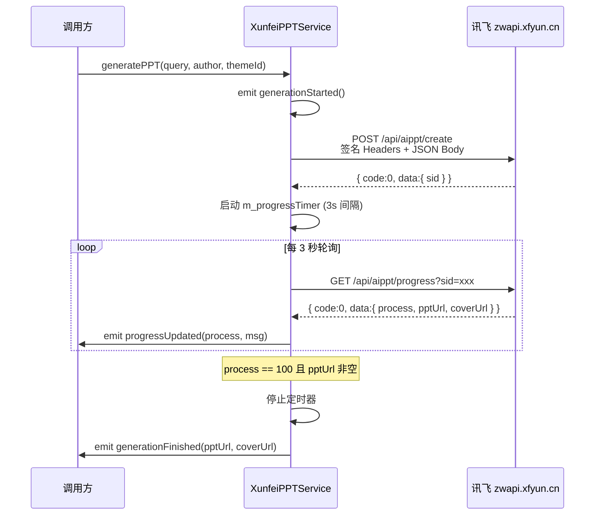
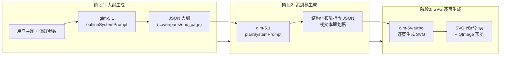

本文档剖析项目中两套独立的第三方 PPT 生成服务——**XunfeiPPTService**（讯飞智文云端 API）与 **ZhipuPPTAgentService**（智谱 GLM 大模型本地 Agent）的设计思路、调用流程和关键技术细节。两套服务采用截然不同的架构策略：前者是"提交任务 → 轮询进度 → 获取下载链接"的经典云端托管模式；后者是"大纲 → 策划 → SVG 逐页生成"的三阶段 Agent 流水线，最终产物为可在本地渲染的 SVG 页面。理解二者的差异是选型与集成的关键。

Sources: [XunfeiPPTService.h](src/services/XunfeiPPTService.h#L1-L115), [ZhipuPPTAgentService.h](src/services/ZhipuPPTAgentService.h#L1-L190)

## 架构定位与设计对比

在项目的 PPT 生成能力体系中，[PPTXGenerator](17-pptxgenerator-ji-yu-xml-zip-de-yuan-sheng-pptx-wen-jian-gou-jian) 负责"将结构化数据打包为 `.pptx` 文件"这一底层工作，而本页描述的两个服务则位于其上层，解决的是 **"PPT 的内容和视觉设计从何而来"** 这一问题。讯飞智文将整个生成过程完全外包给远端 API；智谱 Agent 则在本地编排多轮 AI 调用，仅将文本/代码生成委托给智谱 GLM 模型。

下表从六个维度对比两套服务的核心差异：

| 维度 | XunfeiPPTService（讯飞智文） | ZhipuPPTAgentService（智谱 Agent） |
|---|---|---|
| **生成模式** | 云端托管，远端完成全部渲染 | 本地编排 Agent，三阶段流水线 |
| **最终产物** | 远端 PPT 下载 URL + 封面图 URL | 本地 SVG 代码列表 + QImage 预览图 |
| **认证方式** | HMAC-SHA1 签名（appId + timestamp） | Bearer Token（API Key） |
| **进度获取** | 定时轮询 `/api/aippt/progress`（3 秒间隔） | Agent 内部阶段推进，信号实时通知 |
| **AI 模型依赖** | 无（讯飞黑箱服务） | glm-5.1（文本）、glm-5v-turbo（SVG 代码） |
| **离线能力** | 无，全程依赖网络 | 阶段 3 本地布局拼装可零网络回退 |
| **文件状态** | 已完整实现，未纳入 CMakeLists.txt 构建列表 | 已完整实现，未纳入 CMakeLists.txt 构建列表 |

> **备注**：截至当前版本，两个服务文件均未列入 `CMakeLists.txt` 的 `PROJECT_SOURCES`，也未在 `ModernMainWindow` 中被 `#include`。它们作为独立的、可随时接入的服务模块存在。集成时需将对应的 `.cpp/.h` 添加到构建列表，并在 `onGeneratePPTRequested` 槽函数中选择调用其中一个服务。

Sources: [CMakeLists.txt](CMakeLists.txt#L55-L163), [modernmainwindow_connection_snippet.cpp](src/dashboard/modernmainwindow_connection_snippet.cpp#L69-L82)

## XunfeiPPTService：讯飞智文云端 PPT 生成

### 认证机制与签名算法

讯飞智文 API 使用基于 HMAC-SHA1 的请求签名。构造函数从环境变量 `XUNFEI_APP_ID` 和 `XUNFEI_API_SECRET` 读取凭证（若未设置则回退到内嵌默认值）。签名流程分为三步：

1. 将 `appId` 与 Unix 时间戳拼接为待签名字符串
2. 对待签名字符串做 MD5 散列（输出十六进制字符串）
3. 使用 `apiSecret` 作为密钥对 MD5 结果做 HMAC-SHA1，最终 Base64 编码

生成的 `appId`、`timestamp`、`signature` 三字段随每个请求以自定义 HTTP Header 发送，`Content-Type` 固定为 `application/json`。

Sources: [XunfeiPPTService.cpp](src/services/XunfeiPPTService.cpp#L11-L70)

### 请求-轮询工作流

讯飞智文的生成流程遵循经典的 **"创建 → 轮询 → 完成"** 异步模式，整体时序如下：



请求体包含 `query`（用户需求描述，最大 8000 字）、可选的 `author` 和 `theme` 字段，以及固定为 `true` 的 `isCardNote`（生成演讲备注）。创建成功后获得 `sid`（任务 ID），随后以 3 秒为间隔轮询 `/api/aippt/progress`，直到 `process` 字段达到 100 且 `pptUrl` 非空。

Sources: [XunfeiPPTService.cpp](src/services/XunfeiPPTService.cpp#L72-L165)

### 容错与防护策略

轮询过程中设计了多层防护，防止因网络抖动或服务端异常导致无限等待：

- **错误计数器** `m_progressErrorCount`：每次轮询返回网络错误或 `code != 0` 时递增，连续失败 3 次（`m_maxProgressRetries`）后停止轮询并发射 `errorOccurred` 信号
- **URL 缺失计数器** `m_progressMissingUrlCount`：针对 `process >= 100` 但 `pptUrl` 为空这一边界情况，同样允许最多 3 次容忍
- **旧任务过滤**：通过 `reply->property("sid")` 比对 `m_currentSid`，丢弃延迟到达的旧任务进度响应

Sources: [XunfeiPPTService.cpp](src/services/XunfeiPPTService.cpp#L195-L271)

### 主题列表查询

`fetchThemes()` 方法独立于生成流程，通过 `GET /api/aippt/themeList` 获取可用主题列表。返回的 JSON 中 `data.themeList` 数组包含 `{id, name, coverUrl}` 结构的对象，通过 `themesReceived` 信号通知调用方。该接口使用与生成接口相同的签名认证机制。

Sources: [XunfeiPPTService.cpp](src/services/XunfeiPPTService.cpp#L273-L305)

## ZhipuPPTAgentService：智谱 GLM 三阶段 Agent 流水线

### 三阶段架构总览

ZhipuPPTAgentService 实现了一个完全在本地编排的 **三阶段 PPT 生成 Agent**，每个阶段的输出作为下一阶段的输入，形成一条严格的数据流水线：



状态机由 `State` 枚举驱动：`Idle → GeneratingOutline → GeneratingPlan → GeneratingSVG → Finished`（或任意阶段转入 `Failed`）。每次状态变更都通过 `stateChanged` 信号通知外部，`progressUpdated` 信号则携带百分比、阶段名称和详细信息三层语义。

Sources: [ZhipuPPTAgentService.h](src/services/ZhipuPPTAgentService.h#L31-L39), [ZhipuPPTAgentService.cpp](src/services/ZhipuPPTAgentService.cpp#L41-L68)

### 阶段 1：大纲生成（Outline）

入口方法 `startOutlineGeneration()` 构建一个详细的 user message，包含：

- 从 `params` 中提取的 `textbook`（教材版本）、`grade`（年级）、`chapter`（章节）、`duration`（课时长度）、`contentFocus`（内容侧重）
- 可选的用户偏好参数：`pref_scene`（授课场景）、`pref_style`（表达风格）、`pref_focus`（内容重点）、`pref_pace`（呈现节奏）
- 用户原始需求文本 `userRequest`，用于保留页数等细节要求

系统提示词 `outlineSystemPrompt()` 定义了"顶级 PPT 结构架构师"角色，基于**金字塔原理**（结论先行、以上统下、归类分组、逻辑递进）指导大纲生成，要求 AI 将输出包裹在 `[PPT_OUTLINE]...[/PPT_OUTLINE]` 标记中，输出固定格式的 JSON 结构（`cover → table_of_contents → parts[] → end_page`）。

解析方法 `parseOutlineJson()` 按优先级尝试三种提取策略：`[PPT_OUTLINE]` 标记 → ````json` 代码块 → 首尾 `{}` 花括号。如果三层策略全部失败，则构建一个包含 6 页默认内容的**回退大纲**，确保流水线不会因 AI 输出格式异常而中断。

Sources: [ZhipuPPTAgentService.cpp](src/services/ZhipuPPTAgentService.cpp#L264-L454), [ZhipuPPTAgentService.cpp](src/services/ZhipuPPTAgentService.cpp#L1399-L1457)

### 阶段 2：策划稿 / 布局指令生成（Plan）

阶段 2 将阶段 1 的大纲 JSON 作为输入，调用 `planSystemPrompt()` 指导 AI 为每一页生成结构化布局指令。系统提示词要求 AI 输出用 `[PPT_LAYOUT]...[/PPT_LAYOUT]` 包裹的 JSON，其中 `pages` 数组的每个元素指定页面类型（`cover` / `toc` / `content` / `end`）和对应的布局数据。

`onPlanReplyFinished()` 中存在**双路径分发**逻辑：

| 条件 | 路径 | 数据结构 |
|---|---|---|
| `layoutPages.size() == m_totalPages` | **布局驱动模式**（优先） | `m_pageLayouts: QJsonArray` + `m_useLayoutDriven = true` |
| 页数不匹配 | **文本策划回退** | `m_pagePlans: QStringList` + `m_useLayoutDriven = false` |

文本策划回退路径还额外尝试 `splitPlanPages()` 按"第 X 页"标记拆分 AI 回复；若拆分后页数仍然不匹配，则以 `buildOutlineOnlyPageContent()` 从大纲中逐页提取基本信息作为最终兜底。

Sources: [ZhipuPPTAgentService.cpp](src/services/ZhipuPPTAgentService.cpp#L456-L554), [ZhipuPPTAgentService.cpp](src/services/ZhipuPPTAgentService.cpp#L1459-L1514)

### 阶段 3：SVG 逐页生成

阶段 3 是整个流水线最复杂的部分。当前实现始终走 **AI 驱动的 SVG 生成路径**（使用 `glm-5v-turbo` 模型），逐页串行调用 API：

1. `generateNextSvg()` 为当前页构建 prompt，包含页面内容描述（来自策划稿或大纲兜底）和严格的视觉约束（viewBox 1280×720、党政红主色 #C00000、淡色背景、Bento Grid 布局）
2. 单页 prompt 通过 `clampSvgPromptContent()` 限制在 2200 字符以内，防止过长内容导致 API 400 错误
3. `requestCurrentSvgPage()` 调用 `callZhipuApi()` 发起请求，默认使用 `coding/paas/v4` 端点
4. 响应到达后，`extractSvgCode()` 从 AI 回复中提取 `<svg>...</svg>` 代码（支持 ````svg` 代码块和裸 SVG 两种格式）
5. `sanitizeSvg()` 对 SVG 进行七步清理（补全 xmlns、移除 script/image/foreignObject、清理不兼容 CSS 属性、替换 HTML 实体引用），确保 `QSvgRenderer` 能正确渲染
6. `renderSvgToImage()` 将清理后的 SVG 渲染为 1280×720 的 `QImage` 预览图

**端点切换重试机制**：当 `coding/paas/v4` 端点返回 HTTP 400 时，自动切换到标准 `paas/v4` 端点重试一次（`STANDARD_PAASE_URL`），标记 `m_svgRetriedWithStandardEndpoint` 防止无限重试。若两次均失败，则生成一个带错误提示的占位 SVG。

Sources: [ZhipuPPTAgentService.cpp](src/services/ZhipuPPTAgentService.cpp#L560-L698), [ZhipuPPTAgentService.cpp](src/services/ZhipuPPTAgentService.cpp#L704-L873)

### 统一 API 调用层 `callZhipuApi()`

所有阶段共享同一个 API 调用方法 `callZhipuApi()`，封装了完整的请求构建逻辑：

- **Bearer 认证**：`Authorization: Bearer {apiKey}`
- **HTTP/2 禁用**：`QNetworkRequest::Http2AllowedAttribute = false`（macOS 兼容性，遵循项目统一约定）
- **SSL 放宽**：`QSslSocket::VerifyNone`，因为 `open.bigmodel.cn` 在 macOS SecureTransport 下偶发证书链校验失败
- **3 分钟超时**：`setTransferTimeout(180000)`，应对 AI 模型高负载时的长响应时间
- **思维链控制**：SVG 生成阶段通过 `{"thinking": {"type": "disabled"}}` 关闭 GLM 的思维链输出，减少 token 占用
- **SSL 错误处理**：使用 [NetworkRequestFactory](23-networkrequestfactory-tong-qing-qiu-chuang-jian-ssl-ce-lue-yu-http-2-jin-yong-yue-ding) 的 `handleSslErrors()` 统一处理

Sources: [ZhipuPPTAgentService.cpp](src/services/ZhipuPPTAgentService.cpp#L136-L228)

### 布局驱动的 SVG 本地拼装

虽然当前主流程走 AI SVG 生成，但代码中保留了完整的**本地布局拼装**基础设施（`m_useLayoutDriven` 路径）。当阶段 2 产出结构化 JSON 布局指令时，以下四个 `build*Svg()` 方法可直接将 JSON 转换为 SVG 代码，无需任何 AI 调用：

| 方法 | 页面类型 | 布局特征 |
|---|---|---|
| `buildCoverSvg()` | 封面页 | 左侧 320px 红色色块 + 右侧标题居中 + 装饰圆 |
| `buildTocSvg()` | 目录页 | 顶部红色横条 + 卡片式目录项（≤3 横排，>3 竖排） |
| `buildContentSvg()` | 内容页 | 左侧色条 + 标题栏 + 1~5 张 Bento Grid 卡片 |
| `buildEndSvg()` | 结束页 | 右侧红色色块 + 左侧居中标题 + 装饰线 |

内容页根据卡片数量自动选择五种布局：单卡片居中、双栏对比、三栏并列、2×2 网格、左侧大卡片+右侧 2×2 小网格。每种布局按 `pageIndex % 5` 循环选用不同的侧边装饰色和卡片背景色，实现页面间的视觉节奏变化。

Sources: [ZhipuPPTAgentService.cpp](src/services/ZhipuPPTAgentService.cpp#L941-L1254)

## Prompt 工程体系

三阶段的系统提示词（System Prompt）构成了一套精心设计的指令链，每个提示词都承担明确的职责分工：

**`outlineSystemPrompt()`** — 定义"顶级 PPT 结构架构师"角色，核心方法论为金字塔原理，要求输出严格的 JSON 格式并用 `[PPT_OUTLINE]` 标记包裹。特别强调中学《道德与法治》课堂要求：紧密结合社会主义核心价值观，贴近中学生实际生活。页数策略上，用户指定则严格遵守（如要求 2 页就只生成 2 页），否则默认 8-12 页。

**`planSystemPrompt()`** — 定义"PPT 布局规划师"角色，将大纲转化为四种页面类型（`cover`/`toc`/`content`/`end`）的结构化 JSON 布局指令。约束包括：pages 数量与大纲一致、首尾页固定类型、卡片标题不超过 15 字、卡片内容不超过 80 字。

**`svgSystemPrompt()`** — 定义 SVG 编码专家角色，核心要求为：1280×720 画布、Bento Grid 卡片布局、党政红 #C00000 主色调、淡色明亮背景（禁止暗黑风格）、中文 Microsoft YaHei 字体。只输出纯 `<svg>` 代码。

Sources: [ZhipuPPTAgentService.cpp](src/services/ZhipuPPTAgentService.cpp#L1399-L1550)

## 信号接口与集成指南

### XunfeiPPTService 信号列表

| 信号 | 参数 | 触发时机 |
|---|---|---|
| `generationStarted()` | 无 | `generatePPT()` 被调用且参数校验通过 |
| `progressUpdated(int, QString)` | 百分比 + 消息 | 轮询返回进度、任务创建成功 |
| `generationFinished(QString, QString)` | pptUrl + coverUrl | 轮询检测到 `process >= 100` 且 URL 非空 |
| `errorOccurred(QString)` | 错误描述 | 网络错误、解析失败、服务端拒绝等 |
| `themesReceived(QJsonArray)` | 主题列表 | `fetchThemes()` 成功返回 |

### ZhipuPPTAgentService 信号列表

| 信号 | 参数 | 触发时机 |
|---|---|---|
| `progressUpdated(int, QString, QString)` | 百分比 + 阶段 + 详情 | 每个阶段推进时 |
| `slideGenerated(int, QString, QImage)` | 页索引 + SVG + 预览 | 单页 SVG 生成完成 |
| `allSlidesGenerated(QStringList, QVector<QImage>)` | 全部 SVG + 全部预览 | 所有页面生成完成 |
| `outlineGenerated(QJsonObject)` | 大纲 JSON | 阶段 1 完成 |
| `errorOccurred(QString)` | 错误描述 | 任意阶段失败 |
| `stateChanged(State)` | 新状态枚举 | 状态机转换 |

### 集成步骤概述

将服务接入主窗口需要以下操作：

1. 在 `CMakeLists.txt` 的 `PROJECT_SOURCES` 中添加 `src/services/XunfeiPPTService.cpp/.h` 和 `src/services/ZhipuPPTAgentService.cpp/.h`
2. 在 `ModernMainWindow` 中 `#include` 头文件并声明成员指针
3. 在 `createAIPreparation()` 或构造函数中实例化服务，连接信号到 `AIPreparationWidget` 的进度/状态更新方法
4. 在 `onGeneratePPTRequested()` 槽函数中根据用户选择的模板或配置决定调用哪个服务
5. 讯飞服务的 `generationFinished` 信号提供下载 URL，需要额外实现文件下载逻辑；智谱 Agent 的 `allSlidesGenerated` 信号提供 SVG 和预览图，可直接调用 [PPTXGenerator](17-pptxgenerator-ji-yu-xml-zip-de-yuan-sheng-pptx-wen-jian-gou-jian) 的 `generateFromImages()` 将预览图打包为 `.pptx`

Sources: [XunfeiPPTService.h](src/services/XunfeiPPTService.h#L50-L80), [ZhipuPPTAgentService.h](src/services/ZhipuPPTAgentService.h#L69-L87), [modernmainwindow_connection_snippet.cpp](src/dashboard/modernmainwindow_connection_snippet.cpp#L33-L63)

## 相关阅读

- [PPTXGenerator：基于 XML + ZIP 的原生 PPTX 文件构建](17-pptxgenerator-ji-yu-xml-zip-de-yuan-sheng-pptx-wen-jian-gou-jian) — 智谱 Agent 产出的 SVG/图片需通过此组件打包为 `.pptx` 文件
- [AI 备课与教案编辑：AIPreparationWidget、LessonPlanEditor](15-ai-bei-ke-yu-jiao-an-bian-ji-aipreparationwidget-lessonplaneditor) — 消费这两个服务的 UI 层组件
- [NetworkRequestFactory：统一请求创建、SSL 策略与 HTTP/2 禁用约定](23-networkrequestfactory-tong-qing-qiu-chuang-jian-ssl-ce-lue-yu-http-2-jin-yong-yue-ding) — 智谱 Agent 复用的底层网络请求工具
- [环境变量与密钥配置指南](4-huan-jing-bian-liang-yu-mi-yao-pei-zhi-zhi-nan-env-appconfig-embedded_keys) — 两个服务的 API Key 配置方式