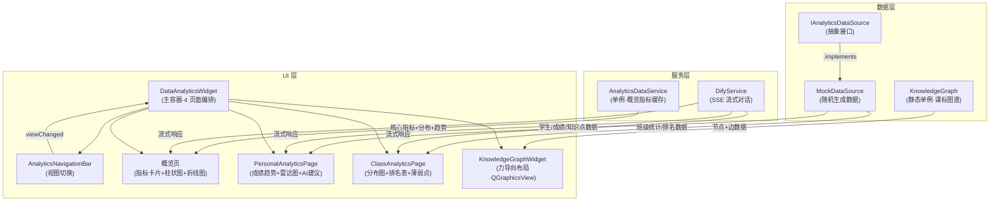
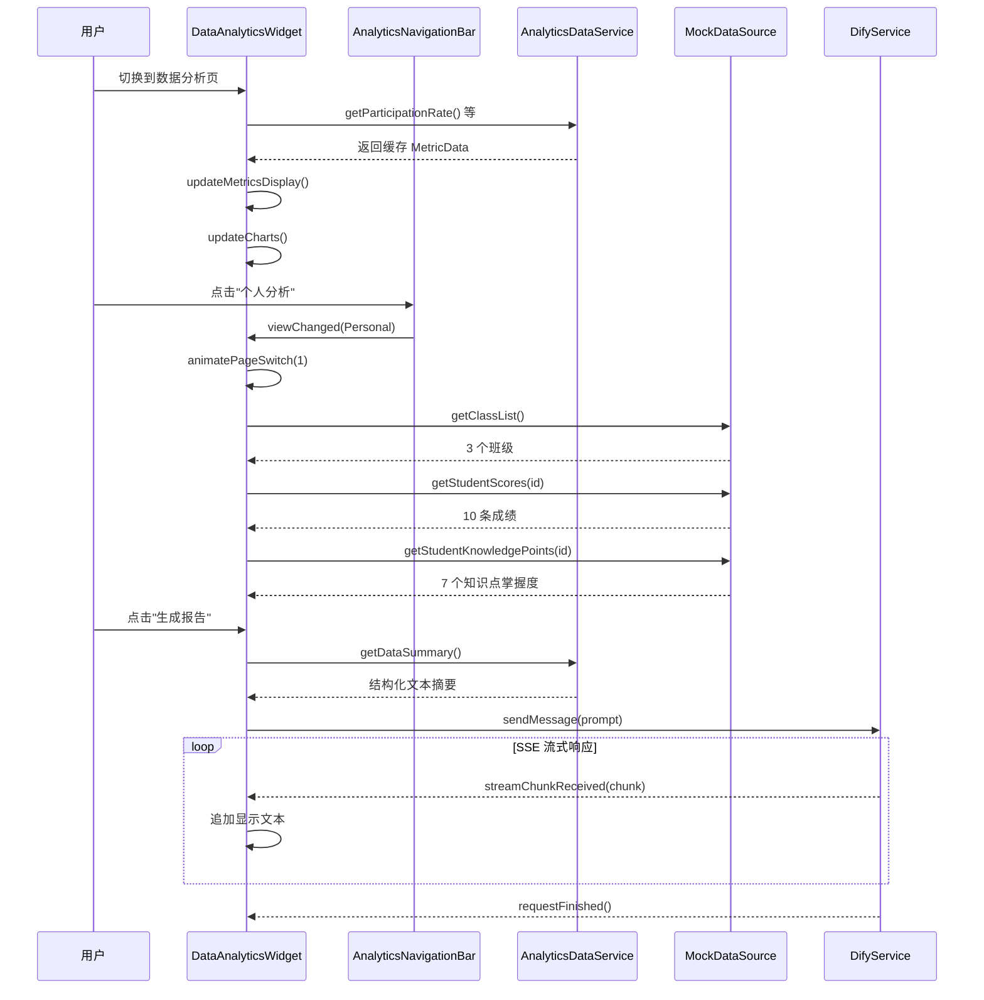

数据分析模块是 AI 思政智慧课堂中负责**学情采集、统计汇总与可视化展示**的核心业务模块。它以 `AnalyticsDataService` 为数据中枢，通过 `IAnalyticsDataSource` 抽象接口隔离真实数据源与 Mock 数据源，在 `DataAnalyticsWidget` 中编排四个子视图——数据概览、个人分析、班级分析、知识图谱——并以 Qt Charts 与自定义 QPainter 组件渲染柱状图、折线图、雷达图和力导向图谱。该模块还集成了 [DifyService](10-difyservice-sse-liu-shi-dui-hua-duo-shi-jian-lei-xing-chu-li-yu-hui-hua-guan-li) 的 SSE 流式通道，实现 AI 智能分析报告的实时生成与 PDF 导出。

Sources: [AnalyticsDataService.h](src/analytics/AnalyticsDataService.h#L1-L84), [DataAnalyticsWidget.h](src/analytics/DataAnalyticsWidget.h#L1-L129)

## 模块目录结构

analytics 模块在 `src/analytics/` 下采用**四层分包**策略，职责边界清晰：

```
src/analytics/
├── AnalyticsDataService.cpp/h    ← 数据中枢（单例 + Mock 生成）
├── DataAnalyticsWidget.cpp/h     ← 主界面编排（4 页面容器）
├── datasources/
│   └── MockDataSource.cpp/h      ← IAnalyticsDataSource 的 Mock 实现
├── interfaces/
│   └── IAnalyticsDataSource.h    ← 数据源抽象接口（纯虚类）
├── models/
│   ├── Student.cpp/h             ← 学生模型（JSON 序列化）
│   ├── CourseClass.cpp/h         ← 班级模型
│   ├── ScoreRecord.cpp/h         ← 成绩记录（含考试类型枚举）
│   ├── KnowledgePoint.cpp/h      ← 知识点掌握度模型
│   ├── ClassStatistics.cpp/h     ← 班级统计汇总模型
│   ├── AnalysisResult.cpp/h      ← 分析结果模型（支持排名百分位）
│   └── KnowledgeGraph.cpp/h      ← 知识图谱数据模型（静态单例）
└── ui/
    ├── AnalyticsNavigationBar.cpp/h   ← 4 视图切换导航栏
    ├── PersonalAnalyticsPage.cpp/h    ← 个人学情分析页
    ├── ClassAnalyticsPage.cpp/h       ← 班级整体分析页
    ├── KnowledgeGraphWidget.cpp/h     ← 知识图谱力导向可视化
    └── RadarChartWidget.cpp/h         ← 自定义雷达图（QPainter）
```

Sources: 目录结构基于实际文件系统

## 架构总览：分层与数据流

在理解各组件细节之前，先通过架构图把握模块内**数据从采集到渲染**的完整流向。模块遵循项目整体分层架构（参见 [分层架构总览](5-fen-ceng-jia-gou-zong-lan-ui-ceng-fu-wu-ceng-wang-luo-yu-gong-ju-ceng)），将数据源、服务、UI 三层严格分离。



Sources: [DataAnalyticsWidget.cpp](src/analytics/DataAnalyticsWidget.cpp#L27-L50), [IAnalyticsDataSource.h](src/analytics/interfaces/IAnalyticsDataSource.h#L1-L50)

## AnalyticsDataService：概览数据中枢

`AnalyticsDataService` 采用**单例模式**，为概览页提供三类核心指标、成绩分布和 30 天趋势数据。它在构造时调用 `generateMockData()` 一次性生成全部随机数据并缓存到成员变量中，后续通过 getter 方法直接返回缓存对象，避免重复计算。

### 核心数据结构

| 数据结构 | 字段 | 说明 |
|-----------|------|------|
| `MetricData` | `value`, `change`, `isPositive` | 单项指标：当前百分比 + 较上周变化 + 变化方向 |
| `GradeDistribution` | `excellent`, `good`, `pass`, `fail` | 四级成绩分布人数（优秀 ≥90、良好 ≥80、及格 ≥60、不及格 <60） |
| `TrendPoint` | `date`, `value` | 趋势线上的一个数据点 |

### Mock 数据生成策略

数据生成采用**区间随机 + 约束修正**的策略。以参与度为例：基础值在 `[75, 95]` 随机，变化量在 `[-5, +8]` 随机（正向偏移略大，模拟教学改善趋势）。趋势数据更精细——以 30 天为窗口，参与度趋势线叠加了**线性上升分量** `+0.3/天` 和 `[-5, +5]` 的随机波动，再用 `qBound(60, value, 100)` 截断到合法区间。`refreshData()` 方法重新执行 `generateMockData()` 并发射 `dataRefreshed()` 信号，驱动 UI 刷新。

Sources: [AnalyticsDataService.cpp](src/analytics/AnalyticsDataService.cpp#L20-L83), [AnalyticsDataService.h](src/analytics/AnalyticsDataService.h#L24-L43)

### getDataSummary：AI 报告的数据模板

`getDataSummary()` 将三类指标和成绩分布格式化为结构化文本，作为 DifyService 的 prompt 输入。该方法使用 `QString::arg()` 链式填充 13 个占位符，确保输出格式统一——AI 服务收到的是经过清洗的纯数据摘要，而非原始数值。

Sources: [AnalyticsDataService.cpp](src/analytics/AnalyticsDataService.cpp#L121-L145)

## IAnalyticsDataSource 接口与 MockDataSource 实现

`IAnalyticsDataSource` 是数据源的**抽象契约**，定义了 5 类共 9 个纯虚方法。设计意图在于：当后续对接 Supabase 真实数据库时（参考 [考勤管理模块的 Supabase CRUD 模式](20-kao-qin-guan-li-mo-kuai-attendanceservice-de-supabase-crud-mo-shi)），只需新建一个 `SupabaseDataSource` 实现类即可替换 Mock，UI 层无需任何修改。

| 接口方法分类 | 方法 | 返回类型 |
|-------------|------|---------|
| 学生数据 | `getStudentList(classId)`, `getStudent(id)` | `QVector<Student>`, `Student` |
| 班级数据 | `getClassList()`, `getClass(id)` | `QVector<CourseClass>`, `CourseClass` |
| 成绩记录 | `getStudentScores(id, start, end)`, `getClassScores(classId, start, end)` | `QVector<ScoreRecord>` |
| 知识点掌握 | `getStudentKnowledgePoints(id)`, `getClassKnowledgePoints(classId)` | `QVector<KnowledgePoint>` |
| 统计排名 | `getClassStatistics(classId)`, `getClassRanking(classId)` | `ClassStatistics`, `QVector<QPair<Student, double>>` |

`MockDataSource` 的数据规模为 3 个班级 × 30 名学生 × 10 次考试 = **900 条成绩记录**。成绩生成使用了**Box-Muller 正态分布变换**（均值 75、标准差 15），比均匀分布更贴近真实成绩分布特征。班级排名通过线性扫描计算每名学生的平均分后降序排列。

Sources: [IAnalyticsDataSource.h](src/analytics/interfaces/IAnalyticsDataSource.h#L18-L48), [MockDataSource.cpp](src/analytics/datasources/MockDataSource.cpp#L20-L87)

## 模型层：6 个数据模型的关系

模型层设计了 6 个轻量值对象，均支持 JSON 序列化/反序列化（`fromJson`/`toJson`），为未来数据持久化预留接口。以下是各模型的核心字段与业务语义：

| 模型 | 核心字段 | 业务语义 |
|------|---------|---------|
| `Student` | `id`, `name`, `classId`, `studentNo` | 学生身份，`displayName()` 返回"姓名 + 学号" |
| `CourseClass` | `id`, `name`, `teacherId`, `studentCount`, `grade` | 班级信息，`displayName()` 返回"年级 + 班级名" |
| `ScoreRecord` | `studentId`, `subject`, `score`, `date`, `examType`, `knowledgePoint` | 单次成绩，`ExamType` 枚举区分日常/期中/期末/随堂 |
| `KnowledgePoint` | `name`, `masteryRate`, `questionCount`, `category` | 知识掌握度，`isWeak()` 判断掌握率 <60% |
| `ClassStatistics` | `averageScore`, `highestScore`, `lowestScore`, `excellentCount`... | 班级汇总，`passRate()` 动态计算及格率 |
| `AnalysisResult` | `targetType`, `averageScore`, `rank`, `aiSuggestion` | 分析结果，`rankPercentile()` 计算排名百分位 |

Sources: [Student.h](src/analytics/models/Student.h#L14-L52), [ScoreRecord.h](src/analytics/models/ScoreRecord.h#L15-L72), [KnowledgePoint.h](src/analytics/models/KnowledgePoint.h#L13-L54), [ClassStatistics.h](src/analytics/models/ClassStatistics.h#L13-L59), [AnalysisResult.h](src/analytics/models/AnalysisResult.h#L15-L60)

## DataAnalyticsWidget：主界面编排与页面栈

`DataAnalyticsWidget` 是数据分析模块的**唯一入口 Widget**，在 [ModernMainWindow](6-zhu-gong-zuo-tai-modernmainwindow-dao-hang-ye-mian-zhan-yu-mo-kuai-bian-pai) 中通过 `contentStack->addWidget()` 挂载到主内容栈。它的内部结构采用 `QStackedWidget` 编排四个页面，通过 `AnalyticsNavigationBar` 的 `viewChanged` 信号驱动页面切换。

### 页面切换与动画

切换动画使用 `QGraphicsOpacityEffect` + `QPropertyAnimation` 实现**交叉淡入淡出**效果——当前页以 150ms OutCubic 曲线淡出，完成后 `QStackedWidget::setCurrentIndex()` 切换，新页面以 150ms InCubic 曲线淡入。动画完成后清除 `graphicsEffect` 避免性能损耗。

Sources: [DataAnalyticsWidget.cpp](src/analytics/DataAnalyticsWidget.cpp#L317-L358)

### 概览页的三层结构

概览页（`m_overviewPage`）由三个功能区域纵向堆叠：

1. **指标卡片行**（`createMetricsCards`）：三个等宽 `QFrame`，分别展示课堂参与度、作业完成率、目标达成率。每个卡片包含图标、标题、数值和变化指示器（↑ 绿色正向 / ↓ 红色负向），数据从 `AnalyticsDataService` 获取。卡片使用 `QGraphicsDropShadowEffect` 增加视觉层次。

2. **图表区**（`createChartsArea`）：左右各一个 `QChartView`。左侧柱状图（`QBarSeries`）展示优秀/良好/及格/不及格人数分布；右侧折线图（`QLineSeries`×2）叠加参与度和完成率两条 30 天趋势线，红色 `#E53935` 表示参与度，蓝色 `#4299E1` 表示完成率。

3. **AI 报告区**（`createAIReportArea`）：包含"生成报告"按钮和报告内容标签。点击按钮后，`getDataSummary()` 生成数据摘要拼入 prompt，通过 [DifyService](10-difyservice-sse-liu-shi-dui-hua-duo-shi-jian-lei-xing-chu-li-yu-hui-hua-guan-li) 发送 SSE 请求。流式响应通过 `onAIStreamChunk` 逐块追加到 `m_aiReportContent`，完成后正则清除 Markdown 标记。

Sources: [DataAnalyticsWidget.cpp](src/analytics/DataAnalyticsWidget.cpp#L360-L429), [DataAnalyticsWidget.cpp](src/analytics/DataAnalyticsWidget.cpp#L540-L706), [DataAnalyticsWidget.cpp](src/analytics/DataAnalyticsWidget.cpp#L733-L843), [DataAnalyticsWidget.cpp](src/analytics/DataAnalyticsWidget.cpp#L996-L1054)

### PDF 导出管道

`onExportClicked()` 使用 `QPrinter`（A4 尺寸，ScreenResolution）+ `QPainter` 手动绘制 PDF。导出内容分三个段落：**核心指标**（三行数据+变化值）、**成绩分布**（四级人数）、**AI 智能分析**（通过 `QTextDocument::drawContents` 渲染长文本）。字体优先使用 PingFang SC，不可用时回退到 Helvetica。

Sources: [DataAnalyticsWidget.cpp](src/analytics/DataAnalyticsWidget.cpp#L852-L994)

## PersonalAnalyticsPage：个人学情分析

个人分析页聚焦**单名学生的多维度画像**，数据全部来自 `MockDataSource` 接口方法。页面采用 `QScrollArea` 包装内容区，防止组件高度不足时布局重叠。

### 班级-学生级联选择

页面顶部 Header 包含两个 `QComboBox`，实现班级→学生的级联筛选。切换班级时，`updateStudentList()` 从数据源获取该班级所有学生并填充下拉列表，过程中使用 `blockSignals(true)` 防止中间状态触发不必要的图表更新。

Sources: [PersonalAnalyticsPage.cpp](src/analytics/ui/PersonalAnalyticsPage.cpp#L470-L505)

### 成绩趋势折线图

使用 `QLineSeries` × 2 绘制**个人成绩线**（红色实线）和**班级平均线**（灰色虚线）。个人成绩通过 `getStudentScores(currentStudentId)` 获取最近 10 次考试分数；班级平均线计算全班所有成绩的均值后叠加微小随机波动，用于直观对比学生与班级整体水平。Y 轴范围固定 `[40, 100]`，X 轴为考试序号 `[0, 9]`。

Sources: [PersonalAnalyticsPage.cpp](src/analytics/ui/PersonalAnalyticsPage.cpp#L215-L320), [PersonalAnalyticsPage.cpp](src/analytics/ui/PersonalAnalyticsPage.cpp#L507-L531)

### 雷达图：知识掌握多维分析

由于 Qt Charts 没有原生雷达图组件，模块通过 `RadarChartWidget` 基于 `QPainter` 自定义绘制。绘制流程分四步：

1. **`drawBackground`**：以数据维度数 N 为边数，绘制 5 层同心正 N 边形作为刻度背景（每层代表 20% 间隔）
2. **`drawAxes`**：从中心向 N 个顶点辐射轴线
3. **`drawData`**：将各维度值（0-100）映射到半径比例，构造闭合多边形，先半透明填充再描边，最后在各顶点绘制 4px 圆点
4. **`drawLabels`**：在轴外 25px 处绘制维度名称（超过 6 字符截断）

数据来源为 `getStudentKnowledgePoints(studentId)` 返回的 7 个思政知识点（马克思主义基本原理、中国特色社会主义理论等），每个知识点随机生成 40-95% 的掌握率。

Sources: [RadarChartWidget.cpp](src/analytics/ui/RadarChartWidget.cpp#L32-L150), [PersonalAnalyticsPage.cpp](src/analytics/ui/PersonalAnalyticsPage.cpp#L322-L380), [PersonalAnalyticsPage.cpp](src/analytics/ui/PersonalAnalyticsPage.cpp#L533-L546)

### AI 个性化学情诊断

点击"开始分析"后，页面组装包含学生姓名、最近成绩和最薄弱知识点的 prompt，通过 `DifyService::sendMessage()` 发送。响应通过 `streamChunkReceived` 信号逐块追加到建议文本区，`requestFinished` 信号恢复按钮状态。Prompt 设计要求 AI 给出"3-5 条具体、可操作的学习建议"。

Sources: [PersonalAnalyticsPage.cpp](src/analytics/ui/PersonalAnalyticsPage.cpp#L548-L587)

## ClassAnalyticsPage：班级整体分析

班级分析页面向教师提供**宏观视角**，包含成绩分布柱状图、学生排名表格和薄弱知识点分析三个核心区域。班级通过顶部 `QComboBox` 切换，支持导出班级数据。

| 区域组件 | 数据来源 | 可视化形式 |
|---------|---------|-----------|
| 成绩分布图 | `getClassScores(classId)` | `QBarSeries` 柱状图 |
| 排名表格 | `getClassRanking(classId)` | `QTableWidget` 按平均分降序 |
| 薄弱知识点 | `getClassKnowledgePoints(classId)` | 按掌握率升序排列的柱状图 |
| AI 建议 | DifyService 流式 | 文本标签 |

Sources: [ClassAnalyticsPage.h](src/analytics/ui/ClassAnalyticsPage.h#L1-L91)

## KnowledgeGraph：课标知识图谱

### 图谱数据模型

`KnowledgeGraph` 是一个**静态单例**，在首次访问时通过 `CurriculumData::allKnowledgePoints()` 加载全量课标知识点节点，再根据 `CORE_RELATIONS` 静态数组建立节点间的关联关系。知识点 ID 采用 `{年级}{学期}-{单元}-{序号}` 编码（如 `7s-1-1` 表示七年级上册第一单元第 1 个知识点）。

关系类型分为四类，在图谱中以不同视觉样式区分：

| RelationType | 中文 | 线条宽度 | 含义 |
|--------------|------|---------|------|
| `Prerequisite` | 前置 | 2.5px | 学习 A 前必须掌握 B |
| `Related` | 相关 | 1.5px | A 与 B 有共同主题 |
| `Extended` | 拓展 | 1.5px | A 是 B 的深入应用 |
| `CrossGrade` | 跨册 | 2.0px | 高年级知识用到低年级基础 |

`CORE_RELATIONS` 数组手工梳理了七至九年级共 6 册思政课本的知识点关联链路，涵盖了同一册内的前置递进、跨册的逻辑延伸（如"友谊（7 上）→ 集体（7 下）→ 社会（8 上）"）以及跨单元的强关联。

Sources: [KnowledgeGraph.cpp](src/analytics/models/KnowledgeGraph.cpp#L1-L165), [KnowledgeGraph.h](src/analytics/models/KnowledgeGraph.h#L20-L62)

### 最短路径算法

`findPath()` 使用 **BFS（广度优先搜索）** 计算两个知识点之间的最短学习路径。算法遍历 `parents + children + related` 三类邻居，使用 `QMap<QString, QString>` 记录前驱节点来重建路径。该功能在 UI 上可用于"从薄弱知识点回溯到应补基础"的学习路径规划。

Sources: [KnowledgeGraph.cpp](src/analytics/models/KnowledgeGraph.cpp#L299-L342)

### KnowledgeGraphWidget：力导向布局可视化

`KnowledgeGraphWidget` 基于 `QGraphicsView`/`QGraphicsScene` 架构实现知识图谱的交互式可视化。节点（`GraphNodeItem`）和边（`GraphEdgeItem`）都是 `QGraphicsItem` 子类，支持 hover 高亮和点击选择。

核心布局算法为**力导向模型**，通过 `QTimer` 以 16ms 间隔（≈60fps）驱动迭代：

| 参数 | 值 | 作用 |
|------|---|------|
| `REPULSION` | 5000.0 | 节点间斥力系数，防止重叠 |
| `ATTRACTION` | 0.05 | 相连节点间弹簧引力系数 |
| `DAMPING` | 0.85 | 速度衰减，使系统逐渐稳定 |
| `IDEAL_LENGTH` | 120.0 | 理想边长（像素） |
| `MAX_LAYOUT_ITERATIONS` | 300 | 最大迭代次数 |

节点视觉大小根据考试权重区分：高频考点使用 `HIGH_FREQ_RADIUS=35`，普通节点使用 `BASE_RADIUS=25`。掌握状态通过颜色表达——已掌握节点显示为绿色系，未掌握为灰色系。该 Widget 支持缩放（`zoomIn`/`zoomOut`）、适应屏幕（`fitToScreen`）、按年级/章节筛选和关键词搜索高亮等交互能力。

Sources: [KnowledgeGraphWidget.h](src/analytics/ui/KnowledgeGraphWidget.h#L21-L196)

## DifyService 集成模式

三个页面（概览、个人、班级）均以**相同模式**集成 DifyService：

1. `setDifyService()` 方法保存指针并连接 `streamChunkReceived` 和 `requestFinished` 信号
2. 用户触发"生成"按钮时，组装数据摘要到 prompt 字符串，调用 `sendMessage()`
3. 流式 chunk 通过槽函数逐步追加到显示区，实现打字机效果
4. `requestFinished` 恢复按钮状态

这种**服务注入 + 信号槽解耦**的模式与 [AI 备课模块](15-ai-bei-ke-yu-jiao-an-bian-ji-aipreparationwidget-lessonplaneditor) 一致，是项目中 AI 功能集成的标准范式。

Sources: [DataAnalyticsWidget.cpp](src/analytics/DataAnalyticsWidget.cpp#L56-L81), [PersonalAnalyticsPage.cpp](src/analytics/ui/PersonalAnalyticsPage.cpp#L53-L65)

## 与主窗口的集成

在 `ModernMainWindow` 初始化流程中，`DataAnalyticsWidget` 在构造后立即调用 `setDifyService(m_difyService)` 注入 AI 服务引用，然后通过 `contentStack->addWidget()` 加入主内容栈。侧边栏的"数据分析报告"卡片点击时，主窗口将 `contentStack` 切换到该 Widget 索引，完成模块激活。

Sources: [modernmainwindow.cpp](src/dashboard/modernmainwindow.cpp#L1107-L1110)

## 数据流完整时序



Sources: 基于 [DataAnalyticsWidget.cpp](src/analytics/DataAnalyticsWidget.cpp), [PersonalAnalyticsPage.cpp](src/analytics/ui/PersonalAnalyticsPage.cpp) 的信号槽连接关系综合绘制

## 设计决策总结

| 决策 | 选择 | 理由 |
|------|------|------|
| 数据源抽象 | `IAnalyticsDataSource` 纯虚接口 | 为 Supabase 真实数据源替换预留扩展点 |
| 概览指标服务 | `AnalyticsDataService` 单例 | 与 `IAnalyticsDataSource` 分离，概览页数据结构更轻量 |
| 雷达图实现 | 自定义 QPainter | Qt Charts 无原生雷达图，自定义实现更灵活 |
| 知识图谱布局 | 力导向算法 + QTimer 动画 | 自然呈现节点群聚关系，思政知识点的网状结构得以表达 |
| 页面切换 | QStackedWidget + 淡入淡出动画 | 避免页面重复创建/销毁，保持数据状态 |
| AI 集成 | DifyService 注入 + SSE 流式 | 与项目其他 AI 功能保持一致的交互模式 |

## 延伸阅读

- [DifyService：SSE 流式对话、多事件类型处理与会话管理](10-difyservice-sse-liu-shi-dui-hua-duo-shi-jian-lei-xing-chu-li-yu-hui-hua-guan-li) — 理解 AI 报告生成的底层通信机制
- [考勤管理模块：AttendanceService 的 Supabase CRUD 模式](20-kao-qin-guan-li-mo-kuai-attendanceservice-de-supabase-crud-mo-shi) — 参考真实数据源的对接模式，为 `IAnalyticsDataSource` 的 Supabase 实现提供模板
- [分层架构总览：UI 层 → 服务层 → 网络与工具层](5-fen-ceng-jia-gou-zong-lan-ui-ceng-fu-wu-ceng-wang-luo-yu-gong-ju-ceng) — 理解本模块在项目整体架构中的定位
- [主工作台 ModernMainWindow：导航、页面栈与模块编排](6-zhu-gong-zuo-tai-modernmainwindow-dao-hang-ye-mian-zhan-yu-mo-kuai-bian-pai) — 理解数据分析页面如何被挂载和激活