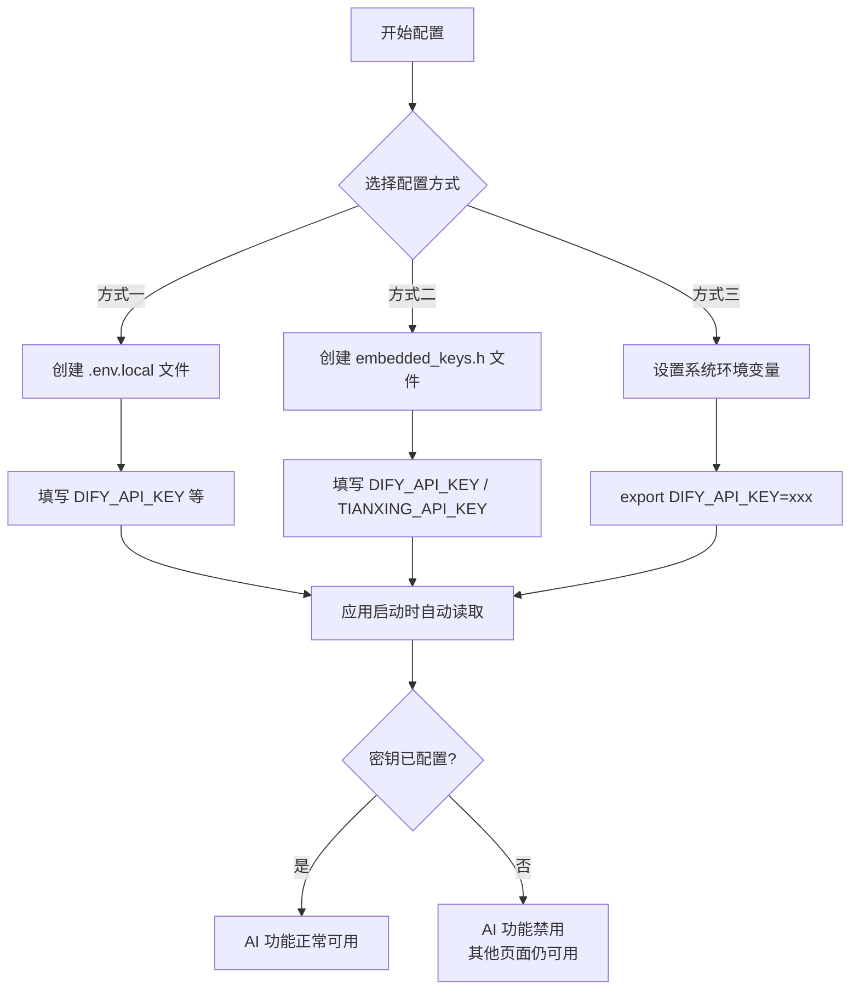
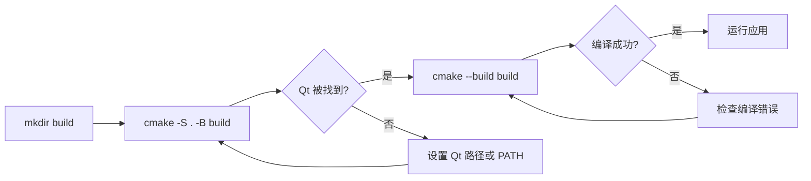

本文是一份面向初学者的端到端指南，帮助你从零开始搭建开发环境，完成 **AI 思政智慧课堂系统**的首次编译与运行。内容涵盖依赖安装、仓库克隆、密钥配置、CMake 构建到应用启动的全流程。完成后你将看到一个可正常登录、进入主工作台的完整桌面应用。

Sources: [README.md](README.md#L1-L56), [CMakeLists.txt](CMakeLists.txt#L1-L13)

---

## 前置条件总览

在动手之前，请确认你的开发环境满足以下最低要求：

| 依赖项 | 最低版本 | macOS 验证命令 | Windows 说明 |
|--------|---------|---------------|-------------|
| **Qt** | 6.6+ | `qmake --version` 或 `brew info qt` | 需含 Widgets、Network、Charts、QuickWidgets、Svg、PrintSupport 模块 |
| **CMake** | 3.16+ | `cmake --version` | 随 Visual Studio 或 Qt Creator 自带 |
| **C++ 编译器** | 支持 C++17 | Xcode Command Line Tools (`xcode-select --install`) | MSVC 2019 64-bit（随 Visual Studio 2019/2022 安装） |
| **zlib** | 系统自带 | macOS / Linux 自带 | vcpkg 或 MSVC 自带 |
| **Git** | 任意 | `git --version` | Git for Windows |

项目使用 C++17 标准编译，CMake 构建系统启用 `AUTOUIC`、`AUTOMOC`、`AUTORCC` 三个 Qt 自动化开关，无需手动处理 `.ui` → `ui_*.h`、`.h` → `moc_*.cpp` 等中间文件。

Sources: [CMakeLists.txt](CMakeLists.txt#L1-L11)

---

## 第一步：安装 Qt 与工具链

### macOS

推荐使用 **Homebrew** 安装 Qt 和 CMake，避免手动配置路径：

```bash
# 安装 Homebrew（如尚未安装）
/bin/bash -c "$(curl -fsSL https://raw.githubusercontent.com/Homebrew/install/HEAD/install.sh)"

# 安装 Qt 6（包含所需模块）
brew install qt@6 cmake

# 确认 Qt 安装成功
brew --prefix qt@6    # 输出路径，如 /opt/homebrew/opt/qt@6
```

如果你使用 Qt 官方安装器（`Qt Online Installer`），请确保勾选 **Qt Charts** 模块——这是项目编译的必要依赖。安装完成后将 `Qt/6.x.x/macos/bin` 加入 `PATH` 即可。

Sources: [.github/workflows/build-macos.yml](.github/workflows/build-macos.yml#L46-L55), [scripts/package_app.sh](scripts/package_app.sh#L95-L124)

### Windows

推荐两种方式之一：

1. **Qt Online Installer**：安装时选择 **MSVC 2019 64-bit** 组件 + **Qt Charts** 模块
2. **Visual Studio 2019/2022**：安装时勾选「使用 C++ 的桌面开发」工作负载，CMake 随之安装

确保 CMake 和 Qt 的 `bin` 目录在系统 `PATH` 中可用。

Sources: [.github/workflows/build-windows.yml](.github/workflows/build-windows.yml#L49-L61)

---

## 第二步：克隆仓库

```bash
git clone <your-repo-url> AItechnology
cd AItechnology
```

克隆完成后，项目根目录应包含 `CMakeLists.txt`、`src/`、`resources/` 等核心目录。

Sources: [CMakeLists.txt](CMakeLists.txt#L1-L4)

---

## 第三步：配置密钥与本地环境变量

应用依赖三类外部服务密钥才能完整运行。本步骤指导你完成本地开发环境的密钥配置。

### 密钥配置流程



Sources: [src/dashboard/modernmainwindow.cpp](src/dashboard/modernmainwindow.cpp#L814-L849)

### 方式一：创建 `.env.local`（推荐开发使用）

在项目根目录创建 `.env.local` 文件（该文件已在 `.gitignore` 中排除，不会被提交）：

```bash
cp .env.example .env.local
```

然后编辑 `.env.local`，填入真实值：

| 变量名 | 是否必需 | 用途 | 示例 |
|--------|---------|------|------|
| `DIFY_API_KEY` | **是** | Dify AI 对话服务 | `app-xxxxxxxx` |
| `PARSER_API_KEY` | 否（默认复用 DIFY） | 文档解析工作流 | `app-xxxxxxxx` |
| `SUPABASE_URL` | **是** | Supabase 项目地址 | `https://xxx.supabase.co` |
| `SUPABASE_ANON_KEY` | **是** | 匿名访问 Key | `eyJhb...` |
| `SUPABASE_SERVICE_KEY` | 否 | 服务端 Key（管理员权限） | `eyJhb...` |
| `TIANXING_API_KEY` | 否 | 天行数据 API（时政新闻） | `your-key` |
| `ALLOW_INSECURE_SSL` | 否 | 开发调试放宽 SSL 校验 | `1` |

> **注意**：即使不配置 `DIFY_API_KEY`，应用仍可启动——只是 AI 功能会提示不可用，非 AI 页面（考勤、数据分析等）正常使用。

Sources: [.env.example](.env.example#L1-L21), [src/config/AppConfig.cpp](src/config/AppConfig.cpp#L58-L91)

### 方式二：创建 `embedded_keys.h`（编译时嵌入）

如果希望密钥随二进制文件分发，可基于示例文件创建：

```bash
cp src/config/embedded_keys.h.example src/config/embedded_keys.h
```

编辑 `src/config/embedded_keys.h`，填入 API Key。该文件同样在 `.gitignore` 中排除。此方式主要面向**发布打包**场景，日常开发推荐使用方式一。

Sources: [src/config/embedded_keys.h.example](src/config/embedded_keys.h.example#L1-L17), [.gitignore](.gitignore#L134)

### 配置加载优先级

应用运行时按以下顺序查找密钥，找到即停止：

1. **系统环境变量**（最高优先级）
2. **随包 `config.env`**（发布版本，位于 App Bundle 同级目录）
3. **开发环境 `.env.local`**（项目根目录）
4. **编译时 `embedded_keys.h`**（内嵌于二进制，仅部分 Key 适用）

Sources: [src/config/AppConfig.h](src/config/AppConfig.h#L7-L18), [src/dashboard/modernmainwindow.cpp](src/dashboard/modernmainwindow.cpp#L814-L841)

---

## 第四步：CMake 配置与编译

### 构建流程图



### macOS / Linux

```bash
# 创建构建目录（out-of-source build）
mkdir -p build
cd build

# CMake 配置（如 Qt 不在默认路径，需指定 CMAKE_PREFIX_PATH）
cmake -DCMAKE_PREFIX_PATH=/opt/homebrew/opt/qt@6 ..

# 编译（利用全部 CPU 核心）
cmake --build . -j$(sysctl -n hw.ncpu)
```

### Windows（Developer Command Prompt）

```powershell
mkdir build
cd build

:: CMake 配置（根据 Qt 安装路径调整）
cmake -DCMAKE_PREFIX_PATH=C:\Qt\6.6.2\msvc2019_64 ..

:: 编译
cmake --build . --config Release
```

### 常见 CMake 配置问题

| 错误信息 | 原因 | 解决方案 |
|----------|------|---------|
| `Could not find Qt6` | Qt 未安装或不在 PATH | 设置 `-DCMAKE_PREFIX_PATH=<Qt安装路径>` |
| `Could not find Qt6Charts` | 未安装 Charts 模块 | 通过 Qt Maintainer Tool 安装 Charts 模块 |
| `Could not find zlib` | 缺少 zlib 库 | macOS 自带；Windows 可通过 vcpkg 安装 |
| `AUTOMOC` 相关错误 | 头文件缺少 `Q_OBJECT` 宏 | 确认 `CMAKE_AUTOMOC` 已开启（CMakeLists.txt 中默认开启） |

Sources: [CMakeLists.txt](CMakeLists.txt#L1-L13), [CMakeLists.txt](CMakeLists.txt#L176-L196)

---

## 第五步：运行应用

### macOS

编译成功后会生成 `.app` Bundle，双击或命令行启动：

```bash
# 方式一：直接打开 Bundle
open build/AILoginSystem.app

# 方式二：使用 Finder 导航到 build/ 目录，双击 AILoginSystem.app
```

如果从 Qt Creator 中运行，点击左下角的运行按钮即可。

### Windows

```powershell
# 直接运行生成的可执行文件
.\build\Release\AILoginSystem.exe
```

> **首次启动**时，应用会以 **SimpleLoginWindow** 登录窗口作为入口。你需要一个已注册的 Supabase 账户才能登录。登录成功后进入主工作台 `ModernMainWindow`。

Sources: [src/main/main.cpp](src/main/main.cpp#L68-L131)

### 应用启动做了什么

`main.cpp` 中的启动流程按顺序完成以下关键操作：

1. 创建 `QApplication`，设置 Fusion 风格 + 自定义调色板（爱国红主题色 `#E53935`）
2. 应用全局样式表，修正 `QMessageBox` 在 Windows 暗色模式下的显示
3. 读取环境变量配置网络代理（支持 `http_proxy` / `https_proxy`，自动检测本地代理可用性）
4. 创建并显示 `SimpleLoginWindow` 登录窗口
5. 进入 Qt 事件循环

Sources: [src/main/main.cpp](src/main/main.cpp#L68-L131)

---

## 构建产物说明

成功编译后，`build/` 目录下将生成两个目标：

| 目标名称 | 类型 | 说明 |
|----------|------|------|
| `AILoginSystem` | GUI 应用（macOS: `.app` Bundle，Windows: `.exe`） | 主程序，包含全部 UI、认证、AI 对话等模块 |
| `ImportTool` | 命令行工具 | 独立的批量导入工具，仅依赖 Qt Core + Network，无 GUI |

`ImportTool` 是一个辅助工具，用于试题的批量导入操作，与主程序共享部分服务层代码（`PaperService`、`BulkImportService` 等）。

Sources: [CMakeLists.txt](CMakeLists.txt#L171-L174), [CMakeLists.txt](CMakeLists.txt#L217-L256)

---

## 常见问题排查

### 编译阶段

| 问题 | 排查方向 |
|------|---------|
| `fatal error: 'embedded_keys.h' file not found` | 需创建 `src/config/embedded_keys.h`，执行 `cp src/config/embedded_keys.h.example src/config/embedded_keys.h` |
| 链接错误：`undefined reference to md4c_*` | 检查 `third_party/md4c` 子目录是否完整克隆 |
| `AUTOMOC` 相关编译错误 | 确保所有含 `Q_OBJECT` 的 `.h` 文件都被加入 `CMakeLists.txt` 的 `PROJECT_SOURCES` |

### 运行阶段

| 问题 | 排查方向 |
|------|---------|
| 登录时网络错误 `RemoteHostClosedError`（错误码 2） | 检查代理设置，确保 `*.supabase.co` 和 `api.dify.ai` 可访问；如使用本地代理，确认代理正在运行 |
| 提示「未设置 DIFY_API_KEY」 | 状态栏显示此信息为正常行为（AI 功能禁用），如需启用请配置 `.env.local` |
| macOS 上应用闪退，提示缺少动态库 | Qt 库路径未正确部署，开发阶段可设置 `DYLD_FRAMEWORK_PATH` 或通过 `macdeployqt` 部署 |
| SSL 证书验证失败 | 开发环境可设置 `ALLOW_INSECURE_SSL=1` 放宽校验 |

Sources: [src/main/main.cpp](src/main/main.cpp#L40-L65), [src/dashboard/modernmainwindow.cpp](src/dashboard/modernmainwindow.cpp#L879-L885)

---

## 下一步阅读

完成首次构建运行后，建议按以下顺序深入了解项目：

1. **[项目目录结构与模块职责速查](3-xiang-mu-mu-lu-jie-gou-yu-mo-kuai-zhi-ze-su-cha)** — 理解每个 `src/` 子目录的职责与边界
2. **[环境变量与密钥配置指南](4-huan-jing-bian-liang-yu-mi-yao-pei-zhi-zhi-nan-env-appconfig-embedded_keys)** — 深入理解 `AppConfig` 的三级加载机制
3. **[分层架构总览](5-fen-ceng-jia-gou-zong-lan-ui-ceng-fu-wu-ceng-wang-luo-yu-gong-ju-ceng)** — 从架构视角理解 UI 层 → 服务层 → 工具层的设计