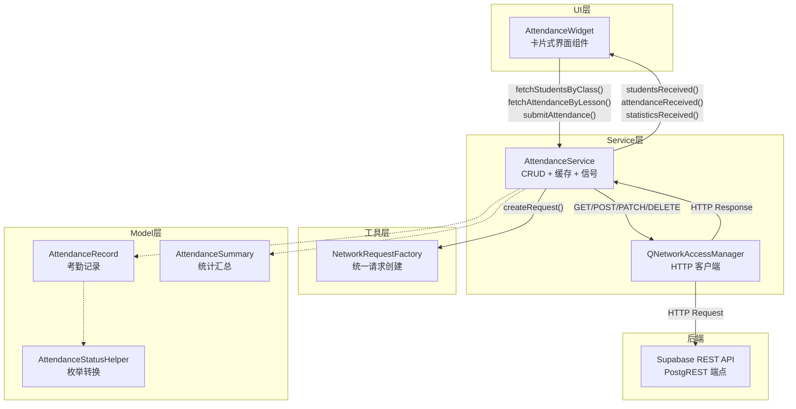
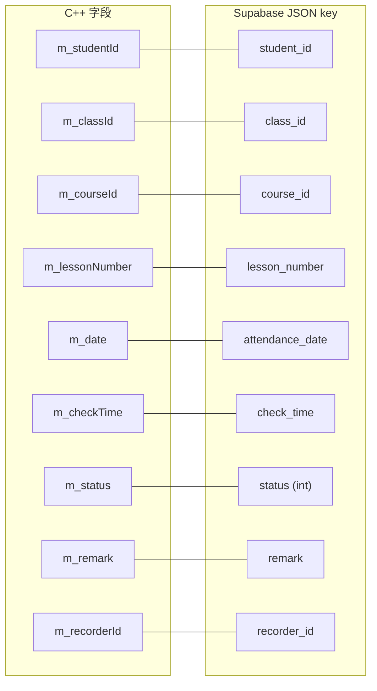
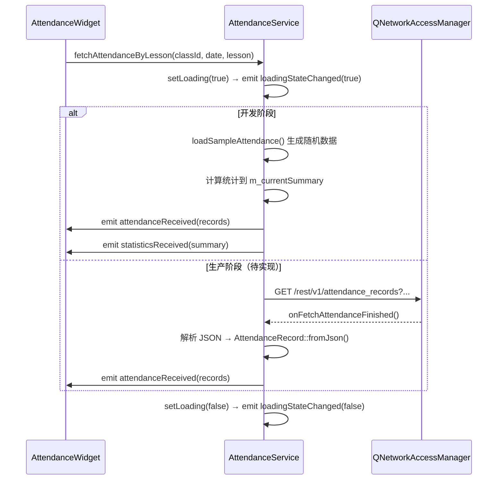
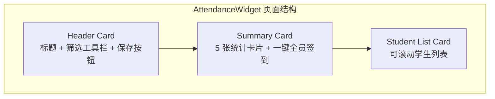

考勤管理模块是 AI 思政智慧课堂系统中负责课堂签到状态记录、统计与提交的业务组件。它采用与 [通知中心：NotificationService 与实时未读计数](21-tong-zhi-zhong-xin-notificationservice-yu-shi-shi-wei-du-ji-shu) 一致的 **Service + Model + Widget 三层分离**架构，通过 Supabase REST API 完成考勤数据的增删改查。当前阶段，CRUD 操作的 HTTP 调用层已就绪（`createRequest` 委托给 `NetworkRequestFactory`），但业务方法仍以示例数据驱动，待后端表就绪后可平滑切换为真实网络请求。

Sources: [AttendanceService.h](src/attendance/services/AttendanceService.h#L1-L101), [AttendanceService.cpp](src/attendance/services/AttendanceService.cpp#L1-L324)

## 模块目录与文件职责

考勤模块位于 `src/attendance/`，内部严格按 `models / services / ui` 三级目录组织，拥有独立的 `CMakeLists.txt` 以源文件列表形式向主构建目标贡献编译单元：

```
src/attendance/
├── CMakeLists.txt                    # 模级构建定义
├── models/
│   ├── AttendanceStatus.h            # 考勤状态枚举 + 工具类
│   ├── AttendanceRecord.h / .cpp     # 考勤记录数据模型（含 JSON 序列化）
│   └── AttendanceSummary.h           # 统计汇总模型（出勤率计算）
├── services/
│   └── AttendanceService.h / .cpp    # 服务层：CRUD 操作 + 信号通知
└── ui/
    └── AttendanceWidget.h / .cpp     # UI 层：卡片式考勤界面
```

Sources: [CMakeLists.txt](src/attendance/CMakeLists.txt#L1-L21)

## 核心架构：三层协作模型

下面的 Mermaid 图展示了考勤模块从用户交互到网络请求的完整数据流。理解本图的前提是熟悉 Qt 的信号/槽（Signal/Slot）机制——当某个对象发出信号时，所有连接到该信号的槽函数会被自动调用，实现对象间的松耦合通信。



**关键设计决策**：`AttendanceService` 不直接持有 Supabase 的 URL 和密钥，而是通过 `NetworkRequestFactory::createSupabaseRequest(endpoint)` 统一构建请求。这意味着 Supabase 连接配置的变更只需修改 `NetworkRequestFactory` 一处，所有依赖它的服务（考勤、通知、认证等）自动受益。

Sources: [AttendanceService.h](src/attendance/services/AttendanceService.h#L82-L83), [NetworkRequestFactory.h](src/utils/NetworkRequestFactory.h#L56-L64)

## 数据模型层：三个核心类

### AttendanceStatus——五态枚举与转换工具

考勤状态被定义为 `enum class AttendanceStatus`，包含五种互斥状态：

| 枚举值 | 整数值 | API 字符串 | 中文显示 | UI 色值 |
|--------|--------|-----------|---------|---------|
| `Present` | 0 | `"present"` | 出勤 | `#4CAF50` (绿) |
| `Absent` | 1 | `"absent"` | 缺勤 | `#F44336` (红) |
| `Late` | 2 | `"late"` | 迟到 | `#FF9800` (橙) |
| `Leave` | 3 | `"leave"` | 请假 | `#2196F3` (蓝) |
| `EarlyLeave` | 4 | `"early_leave"` | 早退 | `#9C27B0` (紫) |

配套的 `AttendanceStatusHelper` 工具类提供了四个静态方法，覆盖枚举在 API 传输（`toString`/`fromString`）、数据库存储（`toInt`/`fromInt`）、UI 显示（`displayName`）和视觉映射（`colorHex`）四个维度上的转换需求。这种将枚举操作集中到工具类的模式，避免了在 Service 和 Widget 中散布 `switch-case` 代码。

Sources: [AttendanceStatus.h](src/attendance/models/AttendanceStatus.h#L1-L92)

### AttendanceRecord——双向 JSON 序列化的考勤记录

`AttendanceRecord` 是模块的核心数据载体，对应 Supabase 中一条 `attendance_records` 表记录。它的字段设计与 API 命名遵循以下映射：



**`fromJson`** 方法将 Supabase 返回的 JSON 对象解析为 C++ 对象。它对日期字段使用 `Qt::ISODate` 格式（如 `"2025-01-15"`），对签到时间使用 `"HH:mm:ss"` 格式，对状态字段通过 `AttendanceStatusHelper::fromInt()` 将整数还原为枚举。

**`toJson`** 方法则用于构造提交给 Supabase 的请求体。它采用**条件写入**策略：仅当 `m_id > 0` 时才写入 `id` 字段（新建记录不携带），仅当 `m_courseId` 非空时才写入 `course_id`，避免向后端发送冗余的空值字段。这种"最小化传输"思想在批量提交场景下能显著减少请求体体积。

**`isValid()`** 方法定义了记录的业务完整性校验：`studentId > 0 && classId > 0 && date.isValid()`，确保只有具备学生身份、班级归属和有效日期的记录才会被提交。

Sources: [AttendanceRecord.h](src/attendance/models/AttendanceRecord.h#L1-L79), [AttendanceRecord.cpp](src/attendance/models/AttendanceRecord.cpp#L1-L111)

### AttendanceSummary——出勤率的计算逻辑

`AttendanceSummary` 是一个纯数据聚合模型，记录班级或个人的考勤统计。其核心业务逻辑集中在 `calculateRate()` 方法中：

```
出勤率 = (出勤人次 + 迟到人次) / 总应到人次 × 100%
```

注意这个公式将**迟到计为到场**——这是教学场景的业务约定，迟到虽然需要记录，但不影响"到课率"指标。`addPresent()`、`addAbsent()` 等累加方法内部同时递增 `m_totalCount`，确保每个状态变更都被统计到总数中，避免遗漏。

该模型同样具备 `fromJson`/`toJson` 能力，可直接对接 Supabase 的 RPC 函数返回值（如 `get_class_statistics`），字段名使用 `snake_case`（如 `attendance_rate`、`present_count`）与 Supabase 列名保持一致。

Sources: [AttendanceSummary.h](src/attendance/models/AttendanceSummary.h#L1-L110)

## 服务层：AttendanceService 的 CRUD 设计

### 接口总览

`AttendanceService` 暴露的公共方法构成了完整的 CRUD 操作集：

| 操作类型 | 方法 | Supabase REST 对应 | 当前状态 |
|---------|------|-------------------|---------|
| **Read** | `fetchStudentsByClass(classId)` | `GET /rest/v1/students?class_id=eq.{id}` | 示例数据 |
| **Read** | `fetchAttendanceByLesson(classId, date, lesson)` | `GET /rest/v1/attendance_records?...` | 示例数据 |
| **Read** | `fetchAttendanceByDateRange(classId, start, end)` | `GET /rest/v1/attendance_records?...` | TODO |
| **Read** | `fetchClassStatistics(classId, start, end)` | `GET /rest/v1/rpc/get_class_stats` | TODO |
| **Read** | `fetchStudentStatistics(studentId, start, end)` | `GET /rest/v1/rpc/get_student_stats` | TODO |
| **Create** | `submitAttendance(records)` | `POST /rest/v1/attendance_records` | 模拟提交 |
| **Update** | `updateAttendance(record)` | `PATCH /rest/v1/attendance_records?id=eq.{id}` | 模拟更新 |
| **Delete** | `deleteAttendance(recordId)` | `DELETE /rest/v1/attendance_records?id=eq.{id}` | 模拟删除 |

Sources: [AttendanceService.h](src/attendance/services/AttendanceService.h#L20-L57), [AttendanceService.cpp](src/attendance/services/AttendanceService.cpp#L1-L324)

### 信号架构：数据驱动的 UI 更新

Service 层通过 Qt 信号向 UI 层传递操作结果，实现了完全的解耦：



这套信号体系包含三类：**数据接收信号**（`studentsReceived`、`attendanceReceived`、`statisticsReceived`）、**操作结果信号**（`attendanceSubmitted`、`attendanceUpdated`、`attendanceDeleted`）和**状态信号**（`loadingStateChanged`、`errorOccurred`）。Widget 层只需 `connect` 感兴趣的信号即可响应数据变化，无需了解数据来源是网络还是本地示例。

Sources: [AttendanceService.h](src/attendance/services/AttendanceService.h#L60-L72)

### 网络回调的完成处理模式

虽然当前 CRUD 方法使用示例数据，Service 层已经为每个操作编写了完整的网络回调槽函数。以 `onFetchStudentsFinished()` 为代表，它展示了标准的 **Supabase REST 响应处理模式**：

1. **Reply 获取与防护**：通过 `qobject_cast<QNetworkReply*>(sender())` 安全获取回复对象，空指针直接返回。
2. **错误分支**：`reply->error() != NoError` 时通过 `errorOccurred` 信号向上传递错误描述。
3. **JSON 解析防护**：使用 `QJsonParseError` 检测解析失败，失败时输出 `qWarning()` 日志并发出 `errorOccurred` 信号。
4. **数组遍历构建**：遍历 `QJsonArray`，调用 `Student::fromJson()` 或 `AttendanceRecord::fromJson()` 将每条记录转为 C++ 对象。
5. **内存释放**：所有分支都保证调用 `reply->deleteLater()`，避免网络回复对象泄漏。

这一模式与 [通知中心：NotificationService 与实时未读计数](21-tong-zhi-zhong-xin-notificationservice-yu-shi-shi-wei-du-ji-shu) 中的处理逻辑完全同构，属于项目级别的**统一网络回调规范**。

Sources: [AttendanceService.cpp](src/attendance/services/AttendanceService.cpp#L250-L312)

### 请求创建：委托给 NetworkRequestFactory

`AttendanceService::createRequest()` 是一个仅一行的转发方法，将 endpoint 字符串直接交给 `NetworkRequestFactory::createSupabaseRequest()`。后者负责：

- 拼接完整 URL：`SupabaseConfig::SUPABASE_URL + endpoint`
- 注入认证头：`apikey` + `Authorization: Bearer {token}`
- 设置 `Prefer: return=representation`（使 POST/PATCH 返回完整记录）
- 配置 SSL 策略与 HTTP/2 禁用（macOS 兼容性）
- 设定 30 秒数据操作超时

这种**间接创建**模式使得 Service 层代码保持纯粹的业务关注，不掺杂任何基础设施配置。

Sources: [AttendanceService.cpp](src/attendance/services/AttendanceService.cpp#L25-L28), [NetworkRequestFactory.h](src/utils/NetworkRequestFactory.h#L56-L64)

### 当前的示例数据策略

开发阶段，`fetchStudentsByClass()` 和 `fetchAttendanceByLesson()` 调用的是 `loadSampleStudents()` 和 `loadSampleAttendance()` 这两个本地方法。示例数据的设计有明确的业务意图：

- **学生列表**：使用 15 个真实风格的中文名（"林雨萱"、"张浩然"等），学号按 `2024{班级号}{序号}` 格式生成。
- **考勤状态分布**：90% 出勤、5% 迟到、3% 请假、2% 缺勤——模拟真实课堂的考勤分布。
- **模拟延迟**：`submitAttendance()` 通过 `QTimer::singleShot(500ms, ...)` 模拟网络延迟，`updateAttendance()` 和 `deleteAttendance()` 使用 300ms 延迟。

这些示例数据在加载的同时会同步计算 `m_currentSummary`，确保 Widget 能立即展示统计信息。

Sources: [AttendanceService.cpp](src/attendance/services/AttendanceService.cpp#L40-L159)

## UI 层：AttendanceWidget 的卡片式设计

### 界面结构

`AttendanceWidget` 采用 iOS/macOS 风格的卡片式布局，由三个核心区域组成：



| 区域 | 功能 | 关键组件 |
|------|------|---------|
| **Header** | 页面标题（"考勤管理"）+ 班级/日期/课次筛选 + 保存按钮 | `QComboBox`×2, `QDateEdit`, `QPushButton` |
| **Summary** | 实时统计仪表盘：出勤/缺勤/迟到/请假/早退计数 + 一键全员签到 | 5×`QLabel` + `QPushButton` |
| **Student List** | 可滚动学生卡片，每行包含莫兰迪色头像、姓名学号、五态分段控件、备注按钮 | `QScrollArea` + 动态行生成 |

Sources: [AttendanceWidget.cpp](src/attendance/ui/AttendanceWidget.cpp#L63-L73), [AttendanceWidget.cpp](src/attendance/ui/AttendanceWidget.cpp#L99-L198)

### 分段控件：五态状态选择器

每个学生行中，考勤状态通过一个**胶囊式分段控件**选择。实现方式是将 5 个 `QPushButton` 放入一个带圆角背景的 `QFrame` 中，每个按钮设为 `checkable`，通过 `QButtonGroup` 实现互斥。激活状态时按钮填充对应的主题色（绿色出勤、红色缺勤等），未激活时保持透明背景和灰色文字。

当教师点击任一状态按钮时，触发 `onStatusButtonClicked(studentIndex, status)`，直接修改 `m_records[studentIndex]` 的状态，并调用 `updateStatistics()` 实时刷新顶部统计卡片。

Sources: [AttendanceWidget.cpp](src/attendance/ui/AttendanceWidget.cpp#L335-L371)

### 色彩体系

Widget 使用一套精心定义的 Tailwind 风格色彩常量：

| 常量 | 色值 | 用途 |
|------|------|------|
| `COL_BG` | `#F3F4F6` (Gray-100) | 页面底色 |
| `COL_CARD` | `#FFFFFF` | 卡片底色 |
| `COL_PRIMARY` | `#10B981` (Emerald-500) | 品牌主色、出勤状态 |
| `COL_DANGER` | `#EF4444` (Rose-500) | 缺勤状态 |
| `COL_WARNING` | `#F59E0B` (Amber-500) | 迟到状态 |
| `COL_INFO` | `#3B82F6` (Blue-500) | 请假状态 |
| `COL_PURPLE` | `#8B5CF6` (Violet-500) | 早退状态 |

学生头像使用**莫兰迪色系**（`#8E9775`、`#E28E8E`、`#9FB8AD` 等 7 色），通过 `getMorandiColor(index)` 按学生序号循环分配，确保列表中相邻学生头像有视觉区分度。

Sources: [AttendanceWidget.cpp](src/attendance/ui/AttendanceWidget.cpp#L17-L29), [AttendanceWidget.cpp](src/attendance/ui/AttendanceWidget.cpp#L373-L377)

## 主窗口集成：服务注入与页面切换

在 [主工作台 ModernMainWindow](6-zhu-gong-zuo-tai-modernmainwindow-dao-hang-ye-mian-zhan-yu-mo-kuai-bian-pai) 中，考勤模块的集成遵循**构造即注入**模式：

```cpp
m_attendanceWidget = new AttendanceWidget(this);
auto *attendanceService = new AttendanceService(this);
attendanceService->setCurrentUserId(currentUserId.isEmpty() ? "teacher_001" : currentUserId);
m_attendanceWidget->setAttendanceService(attendanceService);
contentStack->addWidget(m_attendanceWidget);
```

`AttendanceService` 的生命周期由 `ModernMainWindow` 管理（`this` 作为 parent），通过 `setAttendanceService()` 注入到 Widget。Widget 在注入时自动建立信号连接（`studentsReceived`、`attendanceReceived`、`attendanceSubmitted`），并立即触发首次数据加载。

Sources: [modernmainwindow.cpp](src/dashboard/modernmainwindow.cpp#L1112-L1117)

## 从示例数据迁移到真实 Supabase：实施路径

当前模块处于"骨架就绪、数据 Mock"阶段。迁移到真实后端需要修改的核心路径清晰可控：

**第一步：激活网络调用**。以 `fetchAttendanceByLesson()` 为例，将 `loadSampleAttendance()` 替换为：

```cpp
// 构造查询参数
QString endpoint = QString("/rest/v1/attendance_records?class_id=eq.%1&attendance_date=eq.%2&lesson_number=eq.%3")
    .arg(classId).arg(date.toString(Qt::ISODate)).arg(lessonNumber);
QNetworkRequest request = createRequest(endpoint);
QNetworkReply *reply = m_networkManager->get(request);
connect(reply, &QNetworkReply::finished, this, &AttendanceService::onFetchAttendanceFinished);
connect(reply, QOverload<QNetworkReply::NetworkError>::of(&QNetworkReply::errorOccurred),
        this, &AttendanceService::onNetworkError);
```

**第二步：复用已有回调**。`onFetchAttendanceFinished()` 槽函数已经完整实现了 JSON 解析、`AttendanceRecord::fromJson()` 转换、缓存更新和信号发射逻辑，无需修改。

**第三步：配置 Supabase 表**。需要创建 `attendance_records` 表，列名与 `AttendanceRecord::toJson()` 输出的 JSON key 一致（`student_id`、`class_id`、`attendance_date`、`lesson_number`、`status`、`remark`、`recorder_id`）。

这种"先 Mock 后接入"的开发策略允许前端在后端表就绪之前独立开发 UI 和交互逻辑，是项目中 [Supabase 认证集成](8-supabase-ren-zheng-ji-cheng-deng-lu-zhu-ce-mi-ma-zhong-zhi-yu-token-guan-li) 已验证有效的协作模式。

Sources: [AttendanceService.cpp](src/attendance/services/AttendanceService.cpp#L75-L81), [AttendanceService.cpp](src/attendance/services/AttendanceService.cpp#L282-L312)

## 延伸阅读

- [通知中心：NotificationService 与实时未读计数](21-tong-zhi-zhong-xin-notificationservice-yu-shi-shi-wei-du-ji-shu)——考勤模块直接参考的服务层设计范本，信号架构与网络回调模式高度一致
- [NetworkRequestFactory：统一请求创建、SSL 策略与 HTTP/2 禁用约定](23-networkrequestfactory-tong-qing-qiu-chuang-jian-ssl-ce-lue-yu-http-2-jin-yong-yue-ding)——理解 `createSupabaseRequest()` 如何拼装 URL、注入认证头和配置超时
- [学情数据分析：AnalyticsDataService 与可视化图表组件](19-xue-qing-shu-ju-fen-xi-analyticsdataservice-yu-ke-shi-hua-tu-biao-zu-jian)——考勤模块引用了 `Student` 模型，与学情分析模块共享学生基础数据
- [Supabase 认证集成：登录、注册、密码重置与 Token 管理](8-supabase-ren-zheng-ji-cheng-deng-lu-zhu-ce-mi-ma-zhong-zhi-yu-token-guan-li)——理解 `setCurrentUserId()` 中的教师身份标识如何与认证系统集成