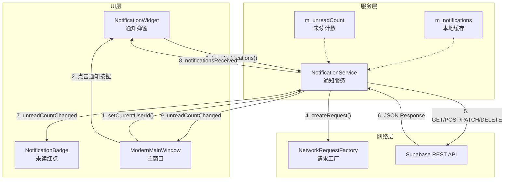
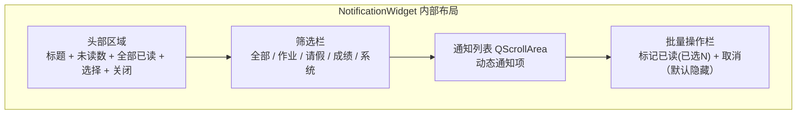

通知中心是 AI 思政智慧课堂系统的站内消息子系统，负责通知的拉取、展示、已读标记与未读计数管理。整个模块遵循项目一贯的 **三层分离** 架构——数据模型层（`Notification`）、服务层（`NotificationService`）、UI 展示层（`NotificationWidget` / `NotificationBadge`），后端对接 Supabase REST API，前端以 Qt 信号/槽驱动 UI 更新，网络请求统一走 `NetworkRequestFactory` 工厂。对于中级开发者而言，理解通知中心的关键在于把握三个核心流：**数据拉取流**、**已读标记流**、**本地通知流**——以下各节将逐一展开。

Sources: [NotificationService.h](src/notifications/NotificationService.h#L1-L67), [notifications.sql](docs/supabase/notifications.sql#L1-L72)

## 模块目录结构与职责速览

通知模块位于 `src/notifications/` 目录下，文件数量精简但层次分明：

```
src/notifications/
├── NotificationService.h        # 服务层：API 调用、缓存管理
├── NotificationService.cpp
├── models/
│   ├── Notification.h           # 数据模型：序列化/反序列化
│   └── Notification.cpp
└── ui/
    ├── NotificationBadge.h      # 未读红点组件
    ├── NotificationBadge.cpp
    ├── NotificationWidget.h     # 通知中心弹窗
    └── NotificationWidget.cpp
```

各层职责清晰划分：

| 层级 | 文件 | 职责 |
|------|------|------|
| **数据模型** | `Notification` / `Notification.h` | 定义 `NotificationType` 枚举、通知字段、JSON 序列化与类型转换 |
| **服务层** | `NotificationService` | 封装 Supabase REST API 调用，维护本地通知缓存与未读计数，发出信号通知 UI |
| **UI 层** | `NotificationWidget` | 380×500 弹窗面板，包含列表渲染、筛选栏、批量选择模式 |
| **UI 层** | `NotificationBadge` | 18×18 红色圆角 Badge，叠加在通知图标右上角显示未读数 |

Sources: [目录结构](src/notifications/NotificationService.h#L1-L8), [NotificationBadge.h](src/notifications/ui/NotificationBadge.h#L1-L27)

## 数据库层：表结构与 RLS 策略

通知表 `notifications` 的 DDL 定义在 `docs/supabase/notifications.sql` 中，设计遵循 Supabase 的标准范式。表结构包含 8 个字段，其中 `receiver_id` 是核心过滤维度——所有查询均按当前用户 ID 筛选，确保数据隔离。四个索引分别覆盖了 `receiver_id`、`created_at`（降序）、`is_read` 和 `type` 四个高频查询维度，为列表拉取和未读计数提供查询性能保障。

**行级安全（RLS）** 策略是此表的关键设计决策：SELECT 和 UPDATE 操作通过 `receiver_id = auth.uid()` 限定，保证用户只能查看和操作自己的通知；DELETE 同理；INSERT 则完全放开（`WITH CHECK (true)`），允许系统级服务向任意用户推送通知。此外，`updated_at` 字段通过 PostgreSQL 触发器 `notifications_updated_at_trigger` 在每次 UPDATE 前自动刷新为当前时间，这是一种经典的数据库层时间戳维护模式。

| 字段 | 类型 | 说明 |
|------|------|------|
| `id` | UUID (PK) | 自动生成，全局唯一 |
| `type` | VARCHAR(50) | 通知类型，默认 `system_announcement` |
| `title` | VARCHAR(255) | 通知标题，NOT NULL |
| `content` | TEXT | 通知正文 |
| `sender_id` | UUID → auth.users | 发送者（可空） |
| `receiver_id` | UUID → auth.users | 接收者，NOT NULL |
| `is_read` | BOOLEAN | 已读标记，默认 FALSE |
| `created_at` | TIMESTAMPTZ | 创建时间，默认 NOW() |
| `updated_at` | TIMESTAMPTZ | 更新时间，触发器维护 |

Sources: [notifications.sql](docs/supabase/notifications.sql#L5-L64)

## 数据模型层：Notification 与类型系统

`Notification` 类采用纯值对象（Value Object）设计，不继承 QObject，所有字段通过 Getter/Setter 暴露。核心设计要点有三：

**第一，通知类型枚举 `NotificationType`** 定义了四种业务类型，每种类型在 UI 层对应不同的颜色标识和中文名称。类型枚举值与数据库中 `type` 字段的字符串表示通过 `typeToString()` / `stringToType()` 静态方法双向映射，实现了数据库层字符串与应用层枚举之间的解耦。

**第二，`fromJson()` / `toJson()` 序列化对**遵循项目统一的 JSON 映射模式——`fromJson()` 从 Supabase 返回的 JSON 对象中提取字段（注意数据库 snake_case 到 C++ camelCase 的转换），`toJson()` 反向构造。`isValid()` 方法通过检查 `id` 和 `title` 非空来判断数据完整性。

**第三，`m_isLocal` 标记位**区分本地通知与远程通知。本地通知由客户端自行创建（UUID 生成 ID），不持久化到后端，页面刷新后消失。这一设计为"不依赖网络的通知需求"预留了扩展空间。

| NotificationType | 枚举值 | 数据库字符串 | UI 显示名 | UI 颜色 |
|---|---|---|---|---|
| `HomeworkSubmission` | 0 | `homework_submission` | 作业提交 | INFO_BLUE `#1976D2` |
| `LeaveApproval` | 1 | `leave_approval` | 请假审批 | WARNING_ORANGE `#F57C00` |
| `GradeRelease` | 2 | `grade_release` | 成绩发布 | SUCCESS_GREEN `#388E3C` |
| `SystemAnnouncement` | 3 | `system_announcement` | 系统公告 | PATRIOTIC_RED `#E53935` |

Sources: [Notification.h](src/notifications/models/Notification.h#L1-L73), [Notification.cpp](src/notifications/models/Notification.cpp#L1-L65)

## 服务层架构：NotificationService

`NotificationService` 是通知模块的核心枢纽，继承 `QObject`，内部持有 `QNetworkAccessManager` 实例、当前用户 ID、通知列表缓存 `m_notifications` 和未读计数 `m_unreadCount`。所有 HTTP 请求通过 `NetworkRequestFactory::createSupabaseRequest()` 创建，统一处理 Supabase 认证头和 SSL 策略。

以下架构图展示了 NotificationService 的核心交互关系：



### 通知拉取流

`fetchNotifications()` 的执行路径最能体现服务层的设计理念。方法首先检查 `m_currentUserId` 是否已设置，然后通过 Supabase PostgREST 语法构建查询端点：`/rest/v1/notifications?receiver_id=eq.{userId}&order=created_at.desc&limit=50`——注意这里直接使用了 PostgREST 的排序和分页参数，按创建时间降序返回最近 50 条。

回调 `onFetchNotificationsFinished()` 中有三条关键逻辑分支：**正常解析**时，遍历 JSON 数组构建 `Notification` 对象列表，同时统计未读数；**JSON 解析失败**或**网络错误**时，调用 `loadSampleNotifications()` 加载硬编码的示例数据作为降级方案；**数据为空**时，同样回退到示例数据。这种"错误即降级"策略保证了 UI 在任何网络状态下都有内容展示。

Sources: [NotificationService.cpp L30-L97](src/notifications/NotificationService.cpp#L30-L97)

### 未读计数流

未读计数通过两个独立路径维护。**路径一**：`fetchUnreadCount()` 发送专用请求 `GET /rest/v1/notifications?receiver_id=eq.{userId}&is_read=eq.false&select=count`，配合 `Prefer: count=exact` 请求头，让 Supabase 在响应头 `content-range` 中返回总数（格式如 `*/42`）。`onFetchUnreadCountFinished()` 解析该头部提取数字。**路径二**：`fetchNotifications()` 的回调中通过本地遍历 `isRead()` 字段同步计算 `m_unreadCount`。

两条路径的结果最终都汇聚到 `unreadCountChanged(int)` 信号，由主窗口接收后更新 Badge 显示。这种双路径设计确保了列表刷新和独立计数查询两种场景下未读数都能实时更新。

Sources: [NotificationService.cpp L158-L190](src/notifications/NotificationService.cpp#L158-L190)

### 已读标记流

通知中心提供三种已读标记方式，覆盖不同交互场景：

**单条标记 `markAsRead(id)`**：发送 `PATCH /rest/v1/notifications?id=eq.{id}`，请求体为 `{"is_read": true}`。回调中通过 `reply->property("notificationId")` 获取关联的通知 ID（利用 Qt 的 dynamic property 机制），在本地缓存中找到对应项更新 `isRead`，并递减 `m_unreadCount`。

**全部标记 `markAllAsRead()`**：发送 `PATCH /rest/v1/notifications?receiver_id=eq.{userId}&is_read=eq.false`，一次性将当前用户所有未读通知设为已读。本地缓存直接批量置 `isRead = true`，`m_unreadCount` 归零。

**批量标记 `markBatchAsRead(ids)`**：利用 Supabase 的 `in` 过滤器——`PATCH /rest/v1/notifications?id=in.(id1,id2,id3)`，单次网络请求完成多条标记。这是三种标记方式中最值得学习的设计：通过 PostgREST 的 `in.(...)` 语法将多条操作合并为一次 HTTP 调用，避免了逐条请求的性能开销。

三种方式的共同模式是：**先发 HTTP 请求 → 回调中更新本地缓存 → 发出信号通知 UI 刷新**。这种"乐观更新"策略在网络请求成功的前提下保证了 UI 的即时响应。

Sources: [NotificationService.cpp L192-L331](src/notifications/NotificationService.cpp#L192-L331)

### 本地通知流

`createLocalNotification(type, title, content)` 提供了一种不依赖后端的通知创建机制。方法通过 `QUuid::createUuid()` 生成唯一 ID，设置 `m_isLocal = true` 标记，并将新通知 `prepend` 到缓存列表头部。`m_unreadCount` 随之递增。发出的信号序列为：`localNotificationCreated()` → `notificationsReceived()` → `unreadCountChanged()`。

这一机制的典型应用场景是客户端内部的事件提示（如"操作完成"类的轻量提醒），特点是**刷新即消失**——因为本地通知不写入后端，下次调用 `fetchNotifications()` 时 `m_notifications` 会被清空重建。

Sources: [NotificationService.cpp L334-L353](src/notifications/NotificationService.cpp#L334-L353)

### 降级机制：loadSampleNotifications()

`loadSampleNotifications()` 是通知服务的一个亮点设计。当网络错误、JSON 解析失败或返回空数据时，该方法构建 5 条预设的示例通知（涵盖全部四种类型），确保用户在任何情况下都能看到通知中心的内容。示例数据的时间戳通过 `QDateTime::currentDateTime().addSecs(-N)` 动态生成，使得相对时间显示（"30分钟前"、"2小时前"）始终自然。

Sources: [NotificationService.cpp L99-L156](src/notifications/NotificationService.cpp#L99-L156)

## 信号清单与数据流总览

NotificationService 定义了 6 个对外信号，构成了服务层到 UI 层的全部通信通道：

| 信号 | 触发时机 | 携带数据 |
|------|----------|----------|
| `notificationsReceived(QList<Notification>)` | 列表拉取完成、标记已读完成、删除完成、本地通知创建 | 完整通知列表 |
| `unreadCountChanged(int)` | 未读计数发生变化 | 新的未读数 |
| `notificationMarkedRead(QString)` | 单条标记已读成功 | 通知 ID |
| `batchMarkedAsRead(QStringList)` | 批量标记已读请求发出 | ID 列表 |
| `localNotificationCreated()` | 本地通知创建成功 | 无 |
| `errorOccurred(QString)` | 网络请求出错 | 错误描述 |
| `loadingStateChanged(bool)` | 请求开始/结束 | 是否加载中 |

Sources: [NotificationService.h L41-L48](src/notifications/NotificationService.h#L41-L48)

## UI 层：NotificationBadge 未读红点

`NotificationBadge` 是一个精简的自绘制组件，继承 `QLabel`，固定尺寸 18×18 像素。核心行为通过 `setCount(int)` 方法驱动：当 `count <= 0` 时调用 `hide()` 隐藏自身；`1 ≤ count ≤ 99` 时显示数字，宽度保持 18px；`count > 99` 时显示 "99+" 并将宽度扩展到 26px。

`paintEvent()` 的绘制逻辑简洁：使用 `QPainter` 开启抗锯齿，以 `StyleConfig::PATRIOTIC_RED`（`#E53935`）填充圆角矩形背景，白色加粗 10px 字体居中绘制文本。整个组件从创建到绘制不依赖任何外部图标资源，纯代码实现。

在主窗口中的集成方式是将 Badge 作为通知按钮的**子控件**，通过 `move(24, -4)` 定位在按钮右上角。当 `NotificationService::unreadCountChanged` 信号触发时，`ModernMainWindow::onUnreadCountChanged` 槽函数调用 `badge->setCount(count)` 完成更新。

Sources: [NotificationBadge.cpp](src/notifications/ui/NotificationBadge.cpp#L1-L53), [modernmainwindow.cpp L1468-L1471](src/dashboard/modernmainwindow.cpp#L1468-L1471)

## UI 层：NotificationWidget 通知弹窗

`NotificationWidget` 是通知中心的主体交互面板，以 `Qt::Popup | Qt::FramelessWindowHint` 窗口标志实现无边框弹窗效果，固定尺寸 380×500 像素。组件内部结构分为四个区域：



**头部区域**包含标题标签"通知中心"、未读计数标签（如"(3 条未读)"）、"全部已读"按钮、"选择"按钮和关闭按钮。"全部已读"按钮在未读数为零时被禁用（样式变灰），这是一种常见的防误操作设计。

**筛选栏** `buildFilterBar()` 创建 5 个 `checkable QPushButton`，对应"全部"（-1）、"作业"（0）、"请假"（1）、"成绩"（2）、"系统"（3）五种筛选条件。按钮使用互斥逻辑——点击任何一个时取消其余按钮的 `checked` 状态——实现了类似 `QButtonGroup` 的单选行为。选中按钮以绿色背景（`#2E7D32`）标识当前筛选。

**通知列表**通过 `createNotificationItem()` 动态构建每个通知项。每项包含：左侧类型图标（36×36 圆角标签，用汉字"作/假/绩/公"标识类型，背景色为对应类型色的 20% 透明度）、中间内容区（标题+小红点+内容预览+相对时间）、右侧删除按钮。**未读/已读**通过三种视觉差异区分：背景色（`#F0F4FF` vs `#FFFFFF`）、边框色（`#BBDEFB` vs `#E5E7EB`）、标题字重（600 vs 400）以及左侧蓝色圆点指示器。

**批量选择模式**通过 `enterSelectMode()` / `exitSelectMode()` 切换。进入选择模式后，每个通知项左侧显示 `QCheckBox`，底部出现批量操作栏（默认隐藏），其中"标记已读"按钮动态显示已选数量。批量操作调用 `NotificationService::markBatchAsRead()` 完成。

Sources: [NotificationWidget.cpp L41-L276](src/notifications/ui/NotificationWidget.cpp#L41-L276)

### 弹窗定位与外部点击关闭

弹窗的定位逻辑位于 `ModernMainWindow::onNotificationBtnClicked()` 中：先通过 `mapToGlobal()` 将通知按钮的左下角映射为屏幕坐标，再计算 `popupX = btnPos.x + btnWidth - widgetWidth` 使弹窗右边缘与按钮右对齐，`popupY = btnPos.y + 8` 留出 8px 间距。

外部点击关闭机制通过 `eventFilter` 实现：`showEvent()` 中安装全局事件过滤器，当检测到 `MouseButtonPress` 事件且点击位置不在弹窗几何区域内时，调用 `hidePopup()` 关闭并移除过滤器。事件过滤器还拦截通知项的点击事件，通过 `property("notificationId")` 识别被点击的通知项。

Sources: [NotificationWidget.cpp L313-L365](src/notifications/ui/NotificationWidget.cpp#L313-L365), [modernmainwindow.cpp L3022-L3037](src/dashboard/modernmainwindow.cpp#L3022-L3037)

### 时间格式化策略

`formatTime()` 方法实现了符合中文习惯的相对时间显示，逻辑清晰：

| 时间范围 | 显示格式 | 示例 |
|----------|----------|------|
| < 60 秒 | "刚刚" | 刚刚 |
| 1-59 分钟 | "{N}分钟前" | 30分钟前 |
| 1-23 小时 | "{N}小时前" | 2小时前 |
| 1-6 天 | "{N}天前" | 1天前 |
| ≥ 7 天 | "MM-dd HH:mm" | 01-15 14:30 |

Sources: [NotificationWidget.cpp L664-L684](src/notifications/ui/NotificationWidget.cpp#L664-L684)

## 主窗口集成：初始化与信号路由

通知系统在 `ModernMainWindow` 构造函数中的初始化流程遵循三个步骤：**创建服务实例** → **设置用户 ID** → **连接未读计数信号**。UI 组件（Badge 和 Widget）的创建发生在 `initUI()` 阶段，与头部栏其他按钮（搜索、用户头像等）一起构建。

```
初始化顺序：
1. new NotificationService(this)                        ← 服务实例
2. setCurrentUserId(currentUserId.isEmpty() ? username : currentUserId)  ← 用户标识
3. connect(unreadCountChanged → onUnreadCountChanged)   ← 信号路由
4. new NotificationBadge(notificationBtn)               ← 红点组件
5. new NotificationWidget(m_notificationService, this)  ← 弹窗组件
```

信号路由的核心链路：`NotificationService::unreadCountChanged` → `ModernMainWindow::onUnreadCountChanged` → `NotificationBadge::setCount`。整个链路仅传递一个 `int` 值，开销极低。

Sources: [modernmainwindow.cpp L862-L866](src/dashboard/modernmainwindow.cpp#L862-L866), [modernmainwindow.cpp L1468-L1478](src/dashboard/modernmainwindow.cpp#L1468-L1478)

## 设计模式总结与扩展指引

通知中心的实现体现了项目中几个值得借鉴的设计模式：

**降级优先（Graceful Degradation）**：`loadSampleNotifications()` 在网络异常、解析失败、数据为空三种情况下均被调用，确保 UI 始终有内容展示。对于教学场景下的弱网环境（如偏远地区教室），这种降级策略尤为实用。

**批量操作合并（Batch Coalescing）**：`markBatchAsRead()` 通过 Supabase 的 `id=in.(...)` 语法将多条 PATCH 合并为单次 HTTP 调用，避免了经典的 N+1 请求问题。如果未来通知量增大，可以考虑引入分页批量（如每次最多 100 条）。

**乐观更新（Optimistic Update）**：所有标记已读操作在 HTTP 回调中才更新本地缓存，这是一种保守的乐观策略。如果追求更极致的响应速度，可以将缓存更新提前到请求发送前，仅在失败时回滚。

**扩展指引**：当前通知系统采用轮询模式（每次打开弹窗时 `fetchNotifications()`），如果需要实时推送能力，可以考虑在 Supabase 层启用 Realtime 功能（基于 WebSocket 的 `postgres_changes` 监听），在 `NotificationService` 中增加 `QWebSocket` 监听线程，收到 INSERT 事件时直接 `prepend` 到缓存并发出信号，无需等待用户手动刷新。

Sources: [NotificationService.h](src/notifications/NotificationService.h#L1-L67), [NotificationService.cpp](src/notifications/NotificationService.cpp#L1-L354)

## 延伸阅读

- [主工作台 ModernMainWindow：导航、页面栈与模块编排](6-zhu-gong-zuo-tai-modernmainwindow-dao-hang-ye-mian-zhan-yu-mo-kuai-bian-pai) — 了解通知按钮在头部栏中的布局与弹窗定位逻辑
- [NetworkRequestFactory：统一请求创建、SSL 策略与 HTTP/2 禁用约定](23-networkrequestfactory-tong-qing-qiu-chuang-jian-ssl-ce-lue-yu-http-2-jin-yong-yue-ding) — 了解 `createSupabaseRequest()` 的认证头注入与 SSL 配置
- [考勤管理模块：AttendanceService 的 Supabase CRUD 模式](20-kao-qin-guan-li-mo-kuai-attendanceservice-de-supabase-crud-mo-shi) — 对比同类 Supabase REST API 服务层的实现模式
- [Supabase 认证集成：登录、注册、密码重置与 Token 管理](8-supabase-ren-zheng-ji-cheng-deng-lu-zhu-ce-mi-ma-zhong-zhi-yu-token-guan-li) — 理解 RLS 策略中 `auth.uid()` 的认证上下文来源