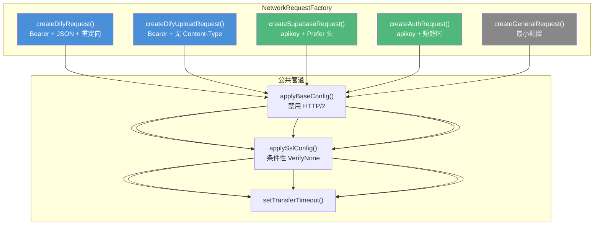
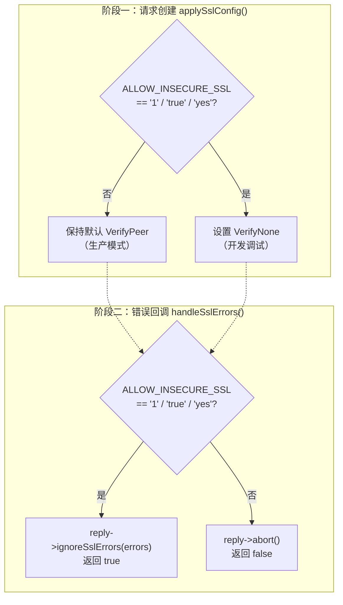
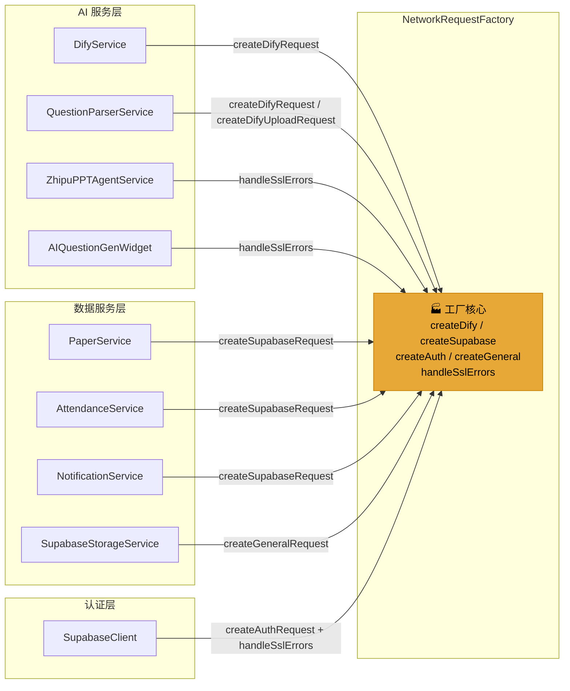
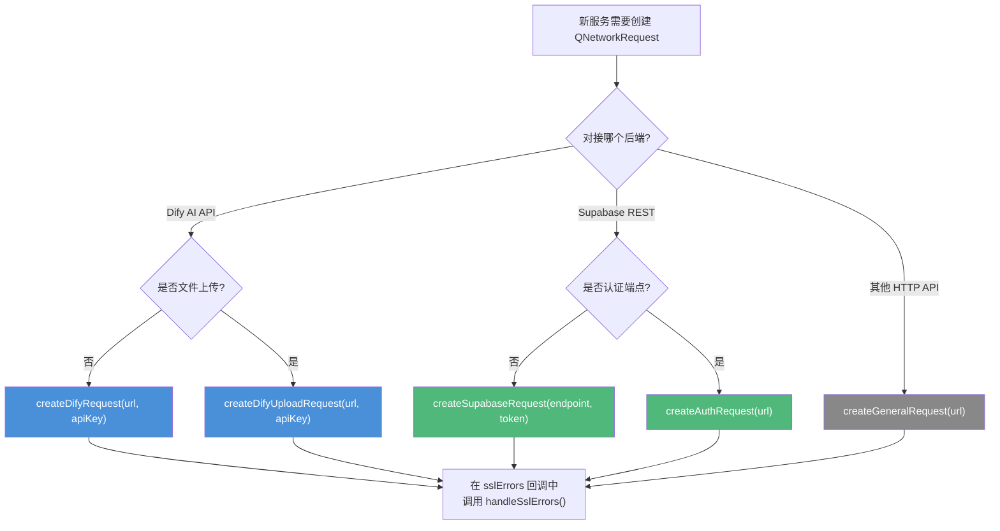

在 Qt 网络编程中，每个 `QNetworkRequest` 的构建涉及 SSL 校验、超时设置、HTTP/2 控制、重定向策略等一系列横切关注点。**NetworkRequestFactory** 作为一个纯静态工具类，将这些分散在各服务中的重复配置收拢为五个语义明确的工厂方法和两个公共辅助方法，确保整个项目的网络请求在安全基线、超时分级和协议兼容性上保持一致。本文将从架构定位、工厂方法矩阵、SSL 双模式策略、HTTP/2 禁用原理以及全项目集成模式五个维度展开深入剖析。

Sources: [NetworkRequestFactory.h](src/utils/NetworkRequestFactory.h#L12-L23), [NetworkRequestFactory.cpp](src/utils/NetworkRequestFactory.cpp#L1-L4)

## 设计定位：无状态静态工厂

NetworkRequestFactory 采用与项目中 `SupabaseConfig` 一致的设计范式——**纯静态类、禁止实例化、不持有任何状态**。这一决策的核心考量在于：各服务类（如 `DifyService`、`PaperService`）自身持有并管理 `QNetworkAccessManager` 实例以控制请求生命周期，而 NetworkRequestFactory 只负责「按规格制造 `QNetworkRequest` 对象」，产出的请求对象交付给服务的 `QNetworkAccessManager` 使用，两者职责完全分离。私有构造函数 `NetworkRequestFactory() = default` 位于 `private` 区域，编译期即可阻止任何实例化尝试。

Sources: [NetworkRequestFactory.h](src/utils/NetworkRequestFactory.h#L108-L119), [NetworkRequestFactory.cpp](src/utils/NetworkRequestFactory.cpp#L36-L49)

## 工厂方法矩阵：五个入口的职责边界



每个工厂方法的职责差异主要体现在**请求头语义**和**默认超时值**上。公共管道 `applyBaseConfig()` → `applySslConfig()` → `setTransferTimeout()` 则保证所有产出的请求都经过统一的基础配置链。

### 工厂方法参数与行为对照表

| 工厂方法 | Content-Type | 认证头 | 额外请求头 | 默认超时 | 典型调用者 |
|---|---|---|---|---|---|
| `createDifyRequest` | `application/json` | `Bearer {apiKey}` | `RedirectPolicy: NoLessSafeRedirectPolicy` | 120s | DifyService、QuestionParserService |
| `createDifyUploadRequest` | **不设置**（由 QHttpMultiPart 决定） | `Bearer {apiKey}` | — | 300s | QuestionParserService |
| `createSupabaseRequest` | `application/json` | `Bearer {accessToken 或 anonKey}` | `apikey: {anonKey}`、`Prefer: return=representation` | 30s | PaperService、AttendanceService、NotificationService |
| `createAuthRequest` | `application/json` | — | `apikey: {anonKey}` | 15s | SupabaseClient |
| `createGeneralRequest` | — | — | — | 30s | SupabaseStorageService |

`createDifyUploadRequest` 特别值得注意——它**故意不设置 `Content-Type`**，因为在 multipart/form-data 文件上传场景中，Qt 的 `QHttpMultiPart` 会自动生成包含 boundary 的完整 Content-Type。若工厂方法手动设置，将覆盖 `QHttpMultiPart` 的自动行为，导致服务器因 boundary 缺失而拒绝请求。

`createSupabaseRequest` 在认证头上有智能降级逻辑：当 `accessToken` 非空时使用用户级 JWT，否则回退到 `anonKey`——这恰好对应 Supabase 的 RLS（Row Level Security）模型中「已认证用户」与「匿名角色」两种访问模式。`preferRepresentation` 参数控制是否添加 `Prefer: return=representation` 头，让 Supabase 在 POST/PATCH 操作后返回完整记录体，省去一次额外的 GET 查询。

Sources: [NetworkRequestFactory.h](src/utils/NetworkRequestFactory.h#L27-L81), [NetworkRequestFactory.cpp](src/utils/NetworkRequestFactory.cpp#L51-L162)

## 超时分级体系：场景驱动的四个量级

```
TIMEOUT_AUTH        = 15s    ← 认证（登录/注册/密码重置）
TIMEOUT_DATA_CRUD   = 30s    ← 数据操作（查询/增删改/存储上传）
TIMEOUT_AI_CHAT     = 120s   ← AI 对话（SSE 流式响应）
TIMEOUT_FILE_UPLOAD = 300s   ← 文件上传（大文件 + AI 工作流调用）
```

这四级常量用 `static constexpr int` 定义，编译期内联，零运行时开销。各级别的设计依据是后端响应特征的显著差异：认证接口通常在数秒内返回；Supabase REST 操作受网络延迟和数据库查询影响，30 秒足够覆盖绝大多数情况；AI 对话使用 SSE 长连接流式输出，首 token 延迟可达数十秒；文件上传则受限于带宽和大文件体积。

调用方可通过工厂方法的 `timeout` 参数覆盖默认值——例如 `QuestionParserService` 调用 `createDifyRequest` 时传入 `300000`（5 分钟）和 `600000`（10 分钟），以适应文档解析工作流的超长执行时间。

Sources: [NetworkRequestFactory.h](src/utils/NetworkRequestFactory.h#L27-L31), [QuestionParserService.cpp](src/services/QuestionParserService.cpp#L117)

## SSL 双模式策略：生产严格校验 vs 开发调试降级

NetworkRequestFactory 的 SSL 策略在**请求创建阶段**和**错误处理阶段**分别设置了不同但协调的机制，两者共同构成一个完整的「严格优先、可降级」安全模型。



### 创建阶段：applySslConfig()

`applySslConfig()` 在每个工厂方法中被调用。当环境变量 `ALLOW_INSECURE_SSL` 未设置或为非真值时，**不修改** `QNetworkRequest` 的 SSL 配置，保持 Qt 默认的 `VerifyPeer` 严格模式。仅当环境变量为 `1`、`true` 或 `yes` 时，才将 `QSslConfiguration` 的 `peerVerifyMode` 设置为 `VerifyNone`，跳过证书链校验。

### 错误处理阶段：handleSslErrors()

`handleSslErrors()` 是一个设计精巧的公共方法，专供各服务在 `QNetworkReply::sslErrors` 信号回调中调用。它先逐条打印 SSL 错误日志（便于排查证书问题），然后做与 `applySslConfig()` 相同的环境变量判断：

- **调试模式**：调用 `reply->ignoreSslErrors(errors)` 并返回 `true`，让请求继续。
- **严格模式**：调用 `reply->abort()` 主动中止连接并返回 `false`，由调用方负责向用户报告错误。

`tag` 参数（如 `"[SupabaseClient]"`、`"[PPTAgent]"`）使日志在多服务并发时能精确定位来源。各服务的集成模式如下：

| 调用者 | handleSslErrors 返回 true 时的行为 | 返回 false 时的行为 |
|---|---|---|
| SupabaseClient | `return`（忽略） | 设置 `sslErrorHandled` 属性，发射 `loginFailed` 等错误信号 |
| ZhipuPPTAgentService | 日志输出 | 日志输出 `SSL errors correctly rejected.` |
| AIQuestionGenWidget | 请求继续执行 | 请求被中止 |
| DifyService | 自行实现相同逻辑（`ignoreSslErrors`） | `abort()` + 发射 `errorOccurred` 信号 |

DifyService 的 `onSslErrors` 是一个值得关注的**历史遗留特例**——它直接调用 `NetworkRequestFactory::allowInsecureSslForDebug()` 自行判断，而非使用 `handleSslErrors()`。这保留了 DifyService 自定义的错误信号发射逻辑（`emit errorOccurred("SSL 证书校验失败…")`），是对 Factory 统一接口的有意偏离而非疏忽。

Sources: [NetworkRequestFactory.cpp](src/utils/NetworkRequestFactory.cpp#L7-L49), [supabaseclient.cpp](src/auth/supabase/supabaseclient.cpp#L465-L475), [DifyService.cpp](src/services/DifyService.cpp#L240-L256), [ZhipuPPTAgentService.cpp](src/services/ZhipuPPTAgentService.cpp#L219-L225), [AIQuestionGenWidget.cpp](src/questionbank/AIQuestionGenWidget.cpp#L751-L756)

## HTTP/2 全局禁用约定：macOS SecureTransport 兼容性

`applyBaseConfig()` 的唯一职责是将 `QNetworkRequest::Http2AllowedAttribute` 显式设为 `false`。这一看似简单的配置背后有一个平台级问题：在 macOS 上，Qt 的网络栈底层使用 SecureTransport 框架（而非 OpenSSL），与部分 HTTPS 服务端交互时 HTTP/2 协议会触发协商失败或 `RemoteHostClosedError`。通过在工厂管道中统一禁用，所有经过 NetworkRequestFactory 的请求都回退到 HTTP/1.1，彻底规避此兼容性风险。

值得注意的是，项目中仍有部分模块**未使用** NetworkRequestFactory，而是自行手动设置 `Http2AllowedAttribute = false`：

| 模块 | 行号 | 方式 |
|---|---|---|
| `RealNewsProvider` | L199, L481, L565, L770, L795, L829, L863, L936 | 手动内联 |
| `HotspotTrackingWidget` | L236 | 手动内联 |
| `NetworkImageTextBrowser` | L52 | 手动内联 |
| `AIQuestionGenWidget` | L710 | 手动内联 |
| `ZhipuPPTAgentService` | L147 | 手动内联 |

这些模块的共同特点是直接构造 `QNetworkRequest` 而未经过工厂。虽然功能上等效，但意味着如果未来需要调整 HTTP/2 策略（例如仅在特定 macOS 版本上禁用），这些散落的调用点需要逐一修改。这属于可接受的**渐进式重构残留**——当这些模块的请求构建逻辑复杂到需要统一认证头和超时时，自然会演进为使用工厂方法。

Sources: [NetworkRequestFactory.cpp](src/utils/NetworkRequestFactory.cpp#L36-L40), [RealNewsProvider.cpp](src/hotspot/RealNewsProvider.cpp#L199), [HotspotTrackingWidget.cpp](src/ui/HotspotTrackingWidget.cpp#L236)

## 全项目集成拓扑

以下 Mermaid 图展示了 NetworkRequestFactory 在整个服务层中的调用关系：



调用关系呈现出清晰的**双轨模式**：

1. **请求创建轨道**：AI 服务层使用 `createDifyRequest` / `createDifyUploadRequest`；数据服务层使用 `createSupabaseRequest`；存储服务使用 `createGeneralRequest`；认证层使用 `createAuthRequest`。每个服务只需一行调用即可获得完整配置的请求对象。

2. **SSL 错误处理轨道**：`SupabaseClient`、`ZhipuPPTAgentService`、`AIQuestionGenWidget` 在 `sslErrors` 信号中调用 `handleSslErrors()`。`DifyService` 保留了自行实现的平行逻辑（调用 `allowInsecureSslForDebug()`）。

Sources: [DifyService.cpp](src/services/DifyService.cpp#L266-L270), [QuestionParserService.cpp](src/services/QuestionParserService.cpp#L117), [PaperService.cpp](src/services/PaperService.cpp#L336-L359), [AttendanceService.cpp](src/attendance/services/AttendanceService.cpp#L25-L28), [NotificationService.cpp](src/notifications/NotificationService.cpp#L25-L28), [SupabaseStorageService.cpp](src/services/SupabaseStorageService.cpp#L62)

## createSupabaseRequest 的 URL 拼接机制

`createSupabaseRequest` 是唯一一个不接收完整 URL、而是接收 `endpoint` 路径片段的工厂方法。它在内部通过 `SupabaseConfig::supabaseUrl() + endpoint` 拼接完整 URL。这意味着调用方只需关注 REST 端点路径（如 `/rest/v1/notifications?receiver_id=eq.xxx`），无需感知 Supabase 实例的 base URL。

这一设计使得 `AttendanceService` 和 `NotificationService` 能以极简的「薄封装」模式集成：各自暴露一个 `createRequest(endpoint)` 方法，内部直接转发给 `NetworkRequestFactory::createSupabaseRequest(endpoint)`，省去了在每个 CRUD 方法中重复配置认证头和超时的样板代码。

Sources: [NetworkRequestFactory.cpp](src/utils/NetworkRequestFactory.cpp#L98-L130), [AttendanceService.cpp](src/attendance/services/AttendanceService.cpp#L25-L28), [NotificationService.cpp](src/notifications/NotificationService.cpp#L25-L28)

## createDifyRequest 的重定向策略

`createDifyRequest` 是唯一配置了重定向策略的工厂方法。通过 `QNetworkRequest::NoLessSafeRedirectPolicy`（要求 Qt ≥ 5.9），它允许 HTTPS → HTTPS 的同安全级别重定向，但拒绝降级到 HTTP。这对于 Dify API 尤为重要——部分 Dify 自部署实例可能配置了反向代理重定向，而 AI 对话请求必须确保全程加密传输。

Sources: [NetworkRequestFactory.cpp](src/utils/NetworkRequestFactory.cpp#L70-L74)

## 扩展指引：如何为新服务接入 NetworkRequestFactory

当引入新的网络服务类时，遵循以下决策路径选择正确的工厂方法：



**接入清单**：

1. 在服务类的 `.cpp` 顶部 `#include "../../utils/NetworkRequestFactory.h"`
2. 选择对应的工厂方法，一行调用获取 `QNetworkRequest`
3. 在 `QNetworkReply::sslErrors` 信号中连接 `NetworkRequestFactory::handleSslErrors()`
4. 若需要自定义超时，传入 `timeout` 参数覆盖默认值
5. 若需要在工厂产出的请求上追加自定义头（如 `SupabaseStorageService` 追加 `x-upsert`），在调用工厂方法后通过 `request.setRawHeader()` 添加

Sources: [NetworkRequestFactory.h](src/utils/NetworkRequestFactory.h#L33-L81), [SupabaseStorageService.cpp](src/services/SupabaseStorageService.cpp#L62-L67)

## 相关阅读

- **上层依赖**：[DifyService：SSE 流式对话、多事件类型处理与会话管理](10-difyservice-sse-liu-shi-dui-hua-duo-shi-jian-lei-xing-chu-li-yu-hui-hua-guan-li) — DifyService 通过 `createConfiguredRequest()` 委托给本工厂创建请求
- **上层依赖**：[Supabase 认证集成：登录、注册、密码重置与 Token 管理](8-supabase-ren-zheng-ji-cheng-deng-lu-zhu-ce-mi-ma-zhong-zhi-yu-token-guan-li) — SupabaseClient 使用 `createAuthRequest` 和 `handleSslErrors`
- **上层依赖**：[NetworkRetryHelper：指数退避重试策略与可配置错误码](9-networkretryhelper-zhi-shu-tui-bi-zhong-shi-ce-lue-yu-ke-pei-zhi-cuo-wu-ma) — PaperService 将本工厂创建的请求交给 NetworkRetryHelper 执行重试
- **架构位置**：[分层架构总览：UI 层 → 服务层 → 网络与工具层](5-fen-ceng-jia-gou-zong-lan-ui-ceng-fu-wu-ceng-wang-luo-yu-gong-ju-ceng) — NetworkRequestFactory 位于工具层基础设施工具区间