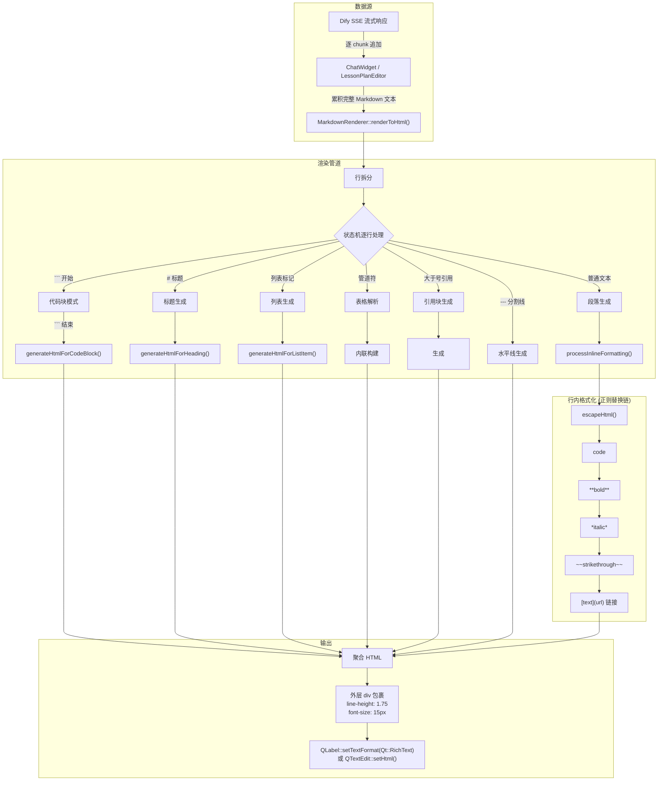
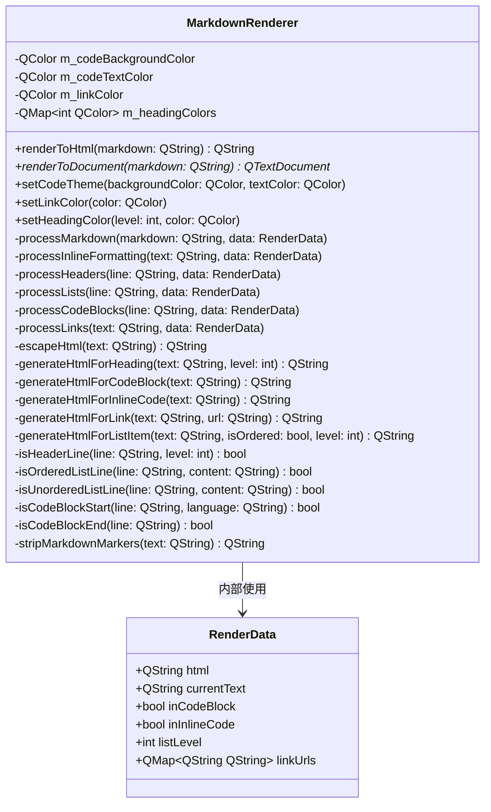
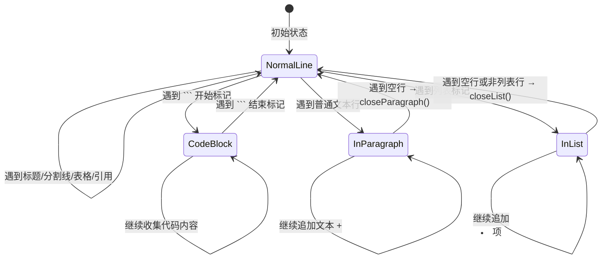
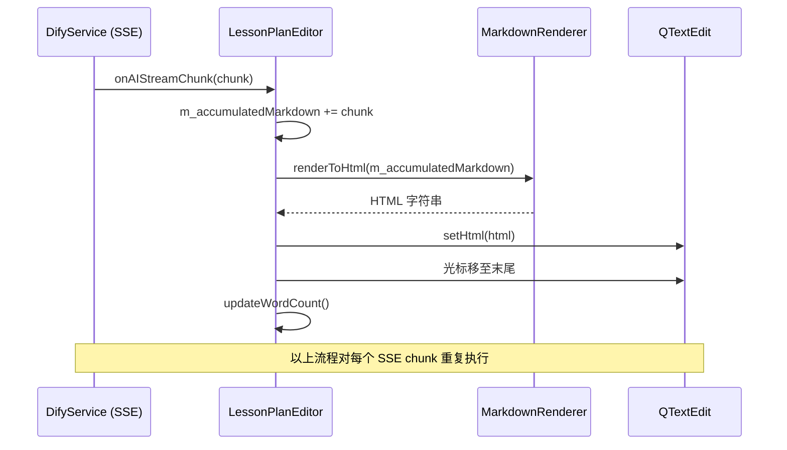

在 AI 思政智慧课堂系统中，AI 的回复内容以 Markdown 格式从 Dify 服务端流式返回。为了让教师看到排版良好的教案、题目解析和对话内容，系统内建了一套自定义的 **Markdown → HTML 富文本渲染管道**。该渲染器位于 `src/utils/MarkdownRenderer`，以纯 Qt/C++ 实现、零外部运行时依赖的方式，将 Markdown 文本转换为带内联样式的 HTML，再由 Qt 的 `QLabel`/`QTextEdit` 等控件以 `Qt::RichText` 模式直接呈现。项目虽然在 `third_party/md4c` 目录下保留了 MD4C（Markdown for C）库作为潜在的底层解析引擎，但当前构建配置中 MD4C 并未参与实际编译与链接——渲染器的实现完全基于 Qt 的 `QRegularExpression` 自研正则解析引擎。

Sources: [MarkdownRenderer.h](src/utils/MarkdownRenderer.h#L1-L105), [MarkdownRenderer.cpp](src/utils/MarkdownRenderer.cpp#L1-L485), [CMakeLists.txt](CMakeLists.txt#L1-L257)

## 架构全景：从 Markdown 文本到屏幕像素

整个渲染管道的核心理念是**单次遍历、状态机驱动**。Markdown 文本先被拆分为行序列，然后由一个有限状态机逐行扫描，根据当前状态（是否在代码块内、是否在段落中、是否在列表中）决定如何生成对应的 HTML 标签。行内格式（粗体、斜体、链接等）则通过独立的正则替换阶段完成。最终产出的 HTML 被包裹在一个带有统一排版参数的 `<div>` 容器中，确保所有渲染结果具有一致的行高、字号和字间距。



Sources: [MarkdownRenderer.cpp#L93-L272](src/utils/MarkdownRenderer.cpp#L93-L272), [MarkdownRenderer.cpp#L274-L316](src/utils/MarkdownRenderer.cpp#L274-L316), [ChatWidget.cpp#L171-L240](src/ui/ChatWidget.cpp#L171-L240)

## 类结构与公共接口

`MarkdownRenderer` 是一个纯值工具类（无继承、无 `QObject` 宏），设计为可被多个 UI 组件独立持有和配置。它的内部状态仅包含样式配置参数，因此在不同渲染上下文间不会产生副作用。



Sources: [MarkdownRenderer.h#L20-L103](src/utils/MarkdownRenderer.h#L20-L103)

### 双输出模式

渲染器提供两种输出接口，适配不同的 Qt 控件体系：

| 方法 | 返回类型 | 适用场景 | 底层机制 |
|---|---|---|---|
| `renderToHtml()` | `QString` | `QLabel::setText()` + `Qt::RichText` | 直接返回带内联样式的 HTML 片段，外层包裹 `<div>` 控制全局排版 |
| `renderToDocument()` | `QTextDocument*` | `QTextEdit`、打印/导出等需要文档对象的场景 | 将 HTML 包装为完整 HTML 文档（含 `<style>` 块），设置到 `QTextDocument` 中 |

`renderToDocument()` 在内部调用 `renderToHtml()` 获取 HTML 片段后，会额外注入一套全局 CSS 样式表，涵盖 `body`、`pre`、`code`、`a`、`ul/ol`、`li`、`blockquote` 等元素的基础样式，并使用 PingFang SC / Noto Sans SC / Microsoft YaHei 作为字体回退链，确保中文字体在所有平台上都有良好表现。

Sources: [MarkdownRenderer.cpp#L24-L73](src/utils/MarkdownRenderer.cpp#L24-L73)

## Markdown 语法支持矩阵

渲染器覆盖了 AI 教学场景中最常用的 Markdown 子集。以下表格按**块级元素**和**行内元素**两个维度列出完整支持情况：

### 块级元素

| 语法 | Markdown 示例 | HTML 产出 | 实现方法 |
|---|---|---|---|
| ATX 标题 | `## 二级标题` | `<h2>` | `isHeaderLine()` → `generateHtmlForHeading()` |
| 有序列表 | `1. 项目` | `<ol><li>` | `isOrderedListLine()` → `generateHtmlForListItem()` |
| 无序列表 | `- 项目` 或 `* 项目` | `<ul><li>` | `isUnorderedListLine()` → `generateHtmlForListItem()` |
| 围栏代码块 | `` ```python `` | `<pre>` | `isCodeBlockStart()` / `isCodeBlockEnd()` → `generateHtmlForCodeBlock()` |
| 表格 | `| A | B |` | `<table><thead><tbody>` | 行内直接构建，支持 `|---|---|` 分隔行 |
| 引用块 | `> 引用文本` | `<blockquote>` | 行首 `> ` 检测 |
| 水平分割线 | `---` / `***` / `___` | `<hr>` | 正则匹配三种标记符 |
| 段落 | 普通文本 | `<p>` | 非空行默认处理 |

### 行内元素

| 语法 | Markdown 示例 | HTML 产出 | 正则模式 |
|---|---|---|---|
| 行内代码 | `` `code` `` | `<code>` | `` `([^`]+)` `` |
| 粗体 | `**bold**` | `<strong>` | `\*\*([^\*]+)\*\*` |
| 斜体 | `*italic*` | `<em>` | `\*([^\*]+)\*` |
| 删除线 | `~~strike~~` | `<del>` | `~~([^~]+)~~` |
| 链接 | `[text](url)` | `<a href="url">` | `\[([^\]]+)\]\(([^\)]+)\)` |

> **注意**：行内格式化的处理顺序经过精心设计。HTML 转义（`escapeHtml()`）首先执行，然后依次处理行内代码 → 粗体 → 斜体 → 删除线 → 链接。粗体必须在斜体之前处理，否则 `**text**` 中的 `*` 会被斜体正则部分匹配导致错误。

Sources: [MarkdownRenderer.cpp#L274-L328](src/utils/MarkdownRenderer.cpp#L274-L328), [MarkdownRenderer.cpp#L424-L469](src/utils/MarkdownRenderer.cpp#L424-L469)

## 状态机驱动的行处理流程

`processMarkdown()` 是渲染器的核心方法，它维护三个关键状态标志来驱动逐行处理：



**状态管理的三个标志位及其含义**：

| 状态标志 | 类型 | 作用 |
|---|---|---|
| `data.inCodeBlock` | `bool` | 标识当前是否在围栏代码块内，代码块内的所有内容原样收集（不做行内格式化） |
| `inParagraph` | `bool`（局部变量） | 标识当前是否在段落中，段落内换行使用 `<br>` 而非新开 `<p>` |
| `inList` + `listIsOrdered` | `bool`（局部变量） | 标识当前是否在列表中及列表类型，遇到不同类型的列表会先关闭再重新开启 |

这三个状态通过 **lambda 闭合函数** `closeParagraph()` 和 `closeList()` 管理，它们在检测到新的块级元素时自动关闭未完成的上一个块，确保 HTML 标签的正确嵌套。

Sources: [MarkdownRenderer.cpp#L93-L272](src/utils/MarkdownRenderer.cpp#L93-L272)

## 主题定制体系

渲染器内置了**思政红**配色方案作为默认主题，同时开放了完整的自定义接口，允许不同 UI 上下文按需调整视觉风格。

### 默认配色方案

| 元素 | 配置项 | 默认值 | 设计意图 |
|---|---|---|---|
| 代码块背景 | `m_codeBackgroundColor` | `#f8f5f0`（暖色调浅底） | 区分正文但不刺眼 |
| 代码块文字 | `m_codeTextColor` | `#B71C1C`（思政红） | 品牌一致性 |
| 链接 | `m_linkColor` | `#B71C1C`（思政红） | 与代码文字同色 |
| H1 标题 | `m_headingColors[1]` | `#1a202c`（最深） | 6 级标题形成由深到浅的视觉梯度 |
| H2 标题 | `m_headingColors[2]` | `#2d3748` | — |
| H3 标题 | `m_headingColors[3]` | `#4a5568` | — |
| H4 标题 | `m_headingColors[4]` | `#4a5568` | — |
| H5 标题 | `m_headingColors[5]` | `#718096` | — |
| H6 标题 | `m_headingColors[6]` | `#718096`（最浅） | — |

### 两个消费方的差异化配置

`ChatWidget` 和 `LessonPlanEditor` 虽然共享同一个 `MarkdownRenderer` 类，但使用了不同的主题配置：

**ChatWidget** 在构造时覆写了代码块主题，采用更中性的 GitHub 风格配色：
```cpp
m_markdownRenderer->setCodeTheme(QColor("#f6f8fa"), QColor("#d73a49"));
```

**LessonPlanEditor** 使用默认的思政红主题，与教案编辑器的整体视觉语言保持一致。

Sources: [MarkdownRenderer.cpp#L6-L18](src/utils/MarkdownRenderer.cpp#L6-L18), [ChatWidget.cpp#L37-L40](src/ui/ChatWidget.cpp#L37-L40), [LessonPlanEditor.cpp#L144-L145](src/ui/LessonPlanEditor.cpp#L144-L145)

## 运行时集成：两个消费场景

### 场景一：ChatWidget —— AI 对话气泡渲染

`ChatWidget` 将 `MarkdownRenderer` 持有为 `std::unique_ptr` 成员，在每条 AI 消息的渲染路径中被调用。关键调用链路为：

1. `addMessage(text, isUser)` → `createMessageBubble()` → `renderMessage()` → `renderToHtml()`
2. `updateLastAIMessage(text)` → `renderMessage()` → `renderToHtml()` （流式更新场景）

**Markdown 渲染的条件逻辑**：
- 用户消息（`isUser == true`）：始终以 `Qt::PlainText` 显示，不经过渲染器
- AI 消息（`isUser == false`）且 `m_markdownEnabled == true`：经渲染器转为 HTML，以 `Qt::RichText` 显示
- `m_markdownEnabled == false`：所有消息纯文本显示

渲染失败的容错机制采用 `try-catch` 包裹，任何异常均降级为原始纯文本输出，确保对话功能不会因渲染问题中断。

Sources: [ChatWidget.h#L139-L164](src/ui/ChatWidget.h#L139-L164), [ChatWidget.cpp#L725-L749](src/ui/ChatWidget.cpp#L725-L749)

### 场景二：LessonPlanEditor —— 教案实时预览

`LessonPlanEditor` 的集成方式更为复杂：AI 生成的教案内容以 SSE 流逐 chunk 返回，编辑器将每个 chunk 追加到 `m_accumulatedMarkdown` 字符串中，然后**对累积的全部内容重新调用** `renderToHtml()`，将结果设置到 `QTextEdit::setHtml()` 中实现实时预览。这意味着在生成过程中，渲染器会被反复调用（每收到一个 chunk 一次），随着内容增长，渲染成本线性上升。



Sources: [LessonPlanEditor.h#L159-L167](src/ui/LessonPlanEditor.h#L159-L167), [LessonPlanEditor.cpp#L851-L871](src/ui/LessonPlanEditor.cpp#L851-L871)

## HTML 输出的排版细节

渲染器产出的 HTML 以**内联样式**为主（不依赖外部 CSS），这样做的原因是 Qt 的 `QLabel` 和 `QTextEdit` 的富文本引擎对 `<style>` 块的支持有限，内联样式可以保证最大兼容性。以下是关键排版参数：

| 排版参数 | 外层容器值 | 代码块值 | 段落值 |
|---|---|---|---|
| `line-height` | `1.75` | — | `1.75` |
| `font-size` | `15px` | — | — |
| `letter-spacing` | `0.2px` | — | — |
| `font-family` | — | `SFMono-Regular, Consolas, Liberation Mono, Menlo, monospace` | — |
| `border-radius` | — | `6px`（代码块），`3px`（行内代码） | — |
| `margin` | — | `8px 0`（代码块） | `14px 0`（段落） |

标题的 `font-size` 从 H1 的 `22px` 逐级递减至 H6 的 `13px`，配合从 `24px 0 14px 0` 到 `12px 0 6px 0` 的 `margin` 梯度，形成了清晰的视觉层次感。

Sources: [MarkdownRenderer.cpp#L34-L38](src/utils/MarkdownRenderer.cpp#L34-L38), [MarkdownRenderer.cpp#L340-L381](src/utils/MarkdownRenderer.cpp#L340-L381), [MarkdownRenderer.cpp#L383-L398](src/utils/MarkdownRenderer.cpp#L383-L398)

## MD4C 库的定位与预留设计

项目在 `third_party/md4c` 目录下保留了 **MD4C v0.5.2** 的完整源码。MD4C 是一个符合 CommonMark 0.31 规范的高性能 Markdown 解析库，核心 API 仅有一个函数 `md_parse()`，采用推模型（push model）通过回调函数向调用方报告文档结构。它支持 GitHub 风格表格、删除线、任务列表、LaTeX 数学公式、Wiki 链接等扩展语法。

**但当前状态**：主项目的 `CMakeLists.txt` 中**没有**通过 `add_subdirectory()` 引入 MD4C，`MarkdownRenderer` 的实现代码中也**没有** `#include` 任何 MD4C 头文件。这意味着 MD4C 目前作为**架构预留**存在——它的存在暗示了未来可能用 CommonMark 合规的专业解析器替换当前的正则实现，以获得更完善的 Markdown 覆盖率和更规范的解析行为。

### 当前自研实现 vs MD4C 的能力对比

| 维度 | 当前 `MarkdownRenderer` | MD4C 库 |
|---|---|---|
| 解析方式 | `QRegularExpression` 正则替换 | 状态机 + 回调 |
| CommonMark 合规 | 部分（覆盖常用子集） | 完全合规 (CommonMark 0.31) |
| 表格 | 简单管道符表格 | GitHub 风格完整表格（含对齐） |
| 嵌套列表 | 单层列表 | 任意嵌套 |
| HTML 转义 | `escapeHtml()` 手动替换 4 个字符 | 完整实体处理 |
| 依赖 | 仅 Qt Core | 仅 C 标准库 |
| 集成成本 | 已集成 | 需添加 `add_subdirectory` 和 C 绑定层 |
| 性能 | O(n·m)，n=文本长度，m=正则数量 | O(n) 线性扫描 |
| 线程安全 | 无状态（可安全并行） | 无状态（可安全并行） |

Sources: [third_party/md4c/CMakeLists.txt#L1-L72](third_party/md4c/CMakeLists.txt#L1-L72), [third_party/md4c/src/md4c.h#L1-L408](third_party/md4c/src/md4c.h#L1-L408), [third_party/md4c/README.md#L1-L200](third_party/md4c/README.md#L1-L200)

## 已知局限与演进方向

基于对代码的精确审查，当前渲染器存在以下可改进的边界情况：

**1. 嵌套结构支持有限**。列表项仅支持单层级，不支持缩进嵌套子列表；表格不支持列对齐语法（`:---`、`:---:`、`---:`）；引用块不支持嵌套引用（`>> ` 不会被识别为二级引用）。

**2. 行内格式化正则边界问题**。粗体正则 `\*\*([^\*]+)\*\*` 无法处理包含 `*` 的粗体文本（如 `**a*b*c**`）；斜体正则 `\*([^\*]+)\*` 在同一行多次出现时可能因为 `text.replace()` 的全局替换特性产生意外匹配。

**3. HTML 转义覆盖范围**。`escapeHtml()` 仅处理了 `&`、`<`、`>`、`"` 四个字符，没有处理单引号 `'`（`&apos;`），在极少见的边缘场景中可能产生不规范的 HTML。

**4. 流式渲染性能**。`LessonPlanEditor` 的 `onAIStreamChunk()` 每收到一个 chunk 就对**全部累积内容**重新执行完整渲染，这在教案较长时（数千字）会带来不必要的重复计算。

Sources: [MarkdownRenderer.cpp#L274-L316](src/utils/MarkdownRenderer.cpp#L274-L316), [MarkdownRenderer.cpp#L330-L338](src/utils/MarkdownRenderer.cpp#L330-L338), [LessonPlanEditor.cpp#L851-L871](src/ui/LessonPlanEditor.cpp#L851-L871)

---

**延伸阅读**：Markdown 渲染器的 HTML 产出会传递给 Qt 的富文本引擎——如果你想了解 AI 对话场景中完整的流式数据路径，可以参阅 [DifyService：SSE 流式对话、多事件类型处理与会话管理](10-difyservice-sse-liu-shi-dui-hua-duo-shi-jian-lei-xing-chu-li-yu-hui-hua-guan-li) 和 [SseStreamParser：纯协议层 SSE 解析器的设计与使用](11-ssestreamparser-chun-xie-yi-ceng-sse-jie-xi-qi-de-she-ji-yu-shi-yong)。Markdown 渲染结果被 ChatWidget 使用的方式详见 [AI 备课与教案编辑：AIPreparationWidget、LessonPlanEditor](15-ai-bei-ke-yu-jiao-an-bian-ji-aipreparationwidget-lessonplaneditor)。构建配置方面，参见 [CMake 构建配置解析：Qt 模块依赖与平台 Bundle 设置](25-cmake-gou-jian-pei-zhi-jie-xi-qt-mo-kuai-yi-lai-yu-ping-tai-bundle-she-zhi)。