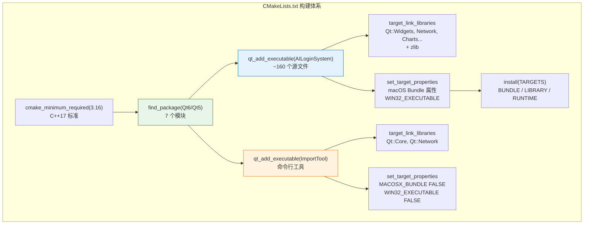
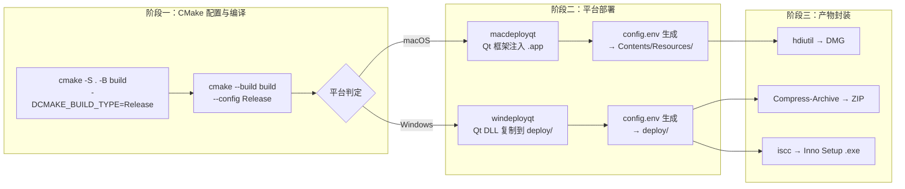

本文档深入剖析项目根目录 [CMakeLists.txt](CMakeLists.txt) 的构建配置体系——从 CMake 最低版本要求与 C++ 语言标准，到 Qt 模块的发现与链接、macOS/Windows 双平台的 Bundle 属性设置、资源编译（QRC）集成方式，以及辅助构建目标 ImportTool 的设计意图。理解这些配置是掌控跨平台编译行为、排查链接错误、定制打包产物的关键前提。

Sources: [CMakeLists.txt](CMakeLists.txt#L1-L257)

## 构建配置全景图

在逐项解读各段配置之前，先建立整体结构认知。下面的 Mermaid 图展示了 CMakeLists.txt 中定义的两个构建目标、它们的依赖关系以及关键配置分区：



**核心观察**：整个构建文件围绕两个可执行目标展开——**AILoginSystem**（主应用，带 GUI）和 **ImportTool**（命令行导入工具，无 GUI）。它们共享部分服务层源码，但在 Qt 模块依赖和平台属性上截然不同。

Sources: [CMakeLists.txt](CMakeLists.txt#L1-L14), [CMakeLists.txt](CMakeLists.txt#L171-L185), [CMakeLists.txt](CMakeLists.txt#L243-L256)

## 项目基础与 C++ 标准设定

```cmake
cmake_minimum_required(VERSION 3.16)
project(AILoginSystem VERSION 1.0.0 LANGUAGES CXX)
set(CMAKE_CXX_STANDARD 17)
set(CMAKE_CXX_STANDARD_REQUIRED ON)
```

构建配置以 **CMake 3.16** 作为最低版本——这个版本是 Qt 6 支持的基线之一，同时确保 `qt_add_executable` 等现代 Qt CMake API 可用。项目名称定义为 `AILoginSystem`，版本号 `1.0.0` 在 `project()` 指令中声明，后续的 `MACOSX_BUNDLE_BUNDLE_VERSION` 和 CI 脚本中的版本解析均从此处读取。C++ 标准锁定为 **C++17** 并设置 `REQUIRED` 为 `ON`，确保编译器不支持时立即报错而非静默降级。

Sources: [CMakeLists.txt](CMakeLists.txt#L1-L6)

## Qt 自动化工具链开关

```cmake
set(CMAKE_AUTOUIC ON)
set(CMAKE_AUTOMOC ON)
set(CMAKE_AUTORCC ON)
```

这三个布尔开关是 Qt CMake 项目的标配，分别控制三种代码生成器的自动调用：

| 开关 | 作用 | 触发条件 |
|------|------|----------|
| **AUTOUIC** | 自动将 `.ui` 文件编译为 `ui_*.h` 头文件 | 源文件中 `#include "ui_xxx.h"` |
| **AUTOMOC** | 自动处理 `Q_OBJECT` 宏的元对象编译 | 头文件包含 `Q_OBJECT` / `Q_GADGET` |
| **AUTORCC** | 自动将 `.qrc` 资源文件编译并链接 | 源文件列表中包含 `.qrc` 文件 |

本项目中有 `.ui` 文件（如 [modernmainwindow.ui](src/dashboard/modernmainwindow.ui)）、大量含 `Q_OBJECT` 的头文件、以及两个 `.qrc` 资源文件（[resources.qrc](resources.qrc) 和 [resources/QtTheme/QtTheme.qrc](resources/QtTheme/QtTheme.qrc)），三者均需要对应的自动工具参与编译。

Sources: [CMakeLists.txt](CMakeLists.txt#L8-L10)

## Qt 模块依赖矩阵

### 发现与链接的两阶段策略

```cmake
find_package(QT NAMES Qt6 Qt5 REQUIRED COMPONENTS Widgets Network QuickWidgets Svg SvgWidgets PrintSupport)
find_package(Qt${QT_VERSION_MAJOR} REQUIRED COMPONENTS Widgets Network Charts QuickWidgets Svg SvgWidgets PrintSupport)
```

项目采用**优先 Qt6、回退 Qt5** 的双版本兼容策略。第一行 `find_package(QT NAMES Qt6 Qt5 ...)` 仅用于确定 `QT_VERSION_MAJOR` 变量的值；第二行根据该值执行实际的模块发现。值得注意的是，两行的 `COMPONENTS` 列表略有差异——第二行额外包含了 **Charts** 模块，而第一行未列出。这是因为 `QT` 辅助包不直接包含 Charts，但实际的 `Qt6` 或 `Qt5` 包需要它。

### 七个 Qt 模块的职责映射

| Qt 模块 | 项目中的用途 | 典型引用点 |
|---------|-------------|-----------|
| **Widgets** | 主 UI 框架——所有窗口、对话框、布局、控件 | [modernmainwindow.cpp](src/dashboard/modernmainwindow.cpp), [simpleloginwindow.cpp](src/auth/login/simpleloginwindow.cpp) |
| **Network** | HTTP 请求、SSE 流式通信、Supabase API 对接 | [DifyService.cpp](src/services/DifyService.cpp), [NetworkRequestFactory.cpp](src/utils/NetworkRequestFactory.cpp) |
| **Charts** | 学情数据可视化——雷达图、柱状图、折线图 | [RadarChartWidget.cpp](src/analytics/ui/RadarChartWidget.cpp), [DataAnalyticsWidget.cpp](src/analytics/DataAnalyticsWidget.cpp) |
| **QuickWidgets** | 嵌入 QML 组件到 Widgets 场景 | [LearningAnalyticsCard.qml](resources/qml/LearningAnalyticsCard.qml) |
| **Svg** | SVG 图标加载与渲染 | 侧边栏图标、QSS 中的 SVG 引用 |
| **SvgWidgets** | SVG 在 Widget 控件中的直接展示 | 图标按钮、状态指示器 |
| **PrintSupport** | 试卷导出 PDF 打印预览 | [ExportService.cpp](src/services/ExportService.cpp) |

### 链接阶段

```cmake
target_link_libraries(AILoginSystem PRIVATE
    Qt${QT_VERSION_MAJOR}::Widgets
    Qt${QT_VERSION_MAJOR}::Network
    Qt${QT_VERSION_MAJOR}::Charts
    Qt${QT_VERSION_MAJOR}::QuickWidgets
    Qt${QT_VERSION_MAJOR}::Svg
    Qt${QT_VERSION_MAJOR}::SvgWidgets
    Qt${QT_VERSION_MAJOR}::PrintSupport
    z
)
```

所有 Qt 模块以 **PRIVATE** 可见性链接，表示这些依赖不传播给可能依赖 AILoginSystem 的其他目标。末尾的 **`z`** 是系统 zlib 库，被 `SimpleZipWriter`（用于 PPTX 文件生成）直接调用 `compress()` / `uncompress()` 函数。CI 环境中 Qt 安装时特别指定了 `archives: 'qtbase qtsvg qtdeclarative qtshadertools'`，确保 QtSvg 和 QuickWidgets 的运行时依赖完整。

Sources: [CMakeLists.txt](CMakeLists.txt#L12-L13), [CMakeLists.txt](CMakeLists.txt#L176-L185), [.github/workflows/build-macos.yml](.github/workflows/build-macos.yml#L46-L55), [.github/workflows/build-windows.yml](.github/workflows/build-windows.yml#L48-L56)

## 源文件组织与资源编译

### PROJECT_SOURCES 清单

`PROJECT_SOURCES` 变量收集了主应用所需的全部约 **160 个源文件**，覆盖项目八大模块：

```cmake
set(PROJECT_SOURCES
    src/main/main.cpp           # 应用入口
    src/auth/login/...          # 认证登录
    src/auth/signup/...         # 用户注册
    src/auth/supabase/...       # Supabase 客户端
    src/dashboard/...           # 主工作台
    src/questionbank/...        # 试题库
    src/smartpaper/...          # 智能组卷
    src/ui/...                  # 通用 UI 组件
    src/services/...            # 业务服务层
    src/analytics/...           # 学情分析（含 models/datasources/ui 子目录）
    src/notifications/...       # 通知中心
    src/attendance/...          # 考勤管理
    src/config/...              # 应用配置
    src/utils/...               # 工具类
    src/settings/...            # 用户设置
    src/hotspot/...             # 时政热点
    resources.qrc              # 主资源文件
    resources/QtTheme/QtTheme.qrc  # Qt 主题资源
)
list(TRANSFORM PROJECT_SOURCES PREPEND "${CMAKE_SOURCE_DIR}/")
```

`list(TRANSFORM ... PREPEND)` 确保所有相对路径被转换为以 `CMAKE_SOURCE_DIR` 为基准的绝对路径，避免在 out-of-source 构建时出现路径解析问题。

### QRC 资源文件的编译集成

项目中包含两个 `.qrc` 文件，通过 `AUTORCC` 自动编译为 C++ 代码并链接到目标：

| QRC 文件 | 资源前缀 | 内容概要 |
|----------|---------|---------|
| [resources.qrc](resources.qrc) | `/icons`, `/styles`, `/QtTheme`, `/data`, `/` | 67 个 SVG 图标、4 套 QSS 样式表、Qt 主题 SVG 图标集、课程数据 JSON、登录界面图片 |
| [QtTheme.qrc](resources/QtTheme/QtTheme.qrc) | `/QtTheme/` | Qt 主题所需的 checkbox/radio/chevron 等 SVG 控件图标（按颜色分类） |

两个 QRC 文件存在部分资源重叠（QtTheme 图标在两处都有注册），这是 QtTheme 作为独立主题包被直接纳入项目时遗留的结果，不影响运行时行为——Qt 资源系统对重复注册的同一文件路径会自动去重。

Sources: [CMakeLists.txt](CMakeLists.txt#L15-L164), [resources.qrc](resources.qrc#L1-L212)

## 平台 Bundle 属性详解

### macOS App Bundle 配置

```cmake
# 应用图标
set(MACOSX_BUNDLE_ICON_FILE AppIcon.icns)
set(APP_ICON_MACOS ${CMAKE_SOURCE_DIR}/resources/AppIcon.icns)
set_source_files_properties(${APP_ICON_MACOS} PROPERTIES MACOSX_PACKAGE_LOCATION "Resources")

# 目标属性
set_target_properties(AILoginSystem PROPERTIES
    MACOSX_BUNDLE_GUI_IDENTIFIER com.aiedu.loginsystem
    MACOSX_BUNDLE_BUNDLE_VERSION ${PROJECT_VERSION}
    MACOSX_BUNDLE_SHORT_VERSION_STRING ${PROJECT_VERSION_MAJOR}.${PROJECT_VERSION_MINOR}
    MACOSX_BUNDLE_ICON_FILE ${MACOSX_BUNDLE_ICON_FILE}
    MACOSX_BUNDLE TRUE
    WIN32_EXECUTABLE TRUE
    RESOURCE "${CMAKE_SOURCE_DIR}/resources/ppt/爱国主义精神传承.pptx"
)
```

这段配置同时处理了 **macOS 和 Windows** 两个平台的可执行文件属性。在 macOS 上，`MACOSX_BUNDLE TRUE` 告诉 CMake 生成 `.app` Bundle 目录结构而非裸可执行文件；在 Windows 上，`WIN32_EXECUTABLE TRUE` 确保生成的是 Win32 GUI 应用（`/SUBSYSTEM:WINDOWS`），不会弹出控制台窗口。

macOS Bundle 的关键属性说明：

| 属性 | 值 | 作用 |
|------|-----|------|
| `MACOSX_BUNDLE_GUI_IDENTIFIER` | `com.aiedu.loginsystem` | Bundle 标识符（反向域名格式），用于 Finder 识别和代码签名 |
| `MACOSX_BUNDLE_BUNDLE_VERSION` | `1.0.0`（来自 `PROJECT_VERSION`） | 内部构建版本号 |
| `MACOSX_BUNDLE_SHORT_VERSION_STRING` | `1.0`（major.minor） | 用户可见的版本号 |
| `MACOSX_BUNDLE_ICON_FILE` | `AppIcon.icns` | 引用 `Info.plist` 中的图标文件名 |
| `MACOSX_PACKAGE_LOCATION` | `Resources` | 将 `.icns` 文件放入 Bundle 的 `Contents/Resources/` 目录 |

### macOS Post-Build 资源复制

```cmake
if(APPLE)
    add_custom_command(TARGET AILoginSystem POST_BUILD
        COMMAND ${CMAKE_COMMAND} -E make_directory "$<TARGET_BUNDLE_DIR:AILoginSystem>/Contents/Resources/ppt"
        COMMAND ${CMAKE_COMMAND} -E copy_if_different
            "${CMAKE_SOURCE_DIR}/resources/ppt/爱国主义精神传承.pptx"
            "$<TARGET_BUNDLE_DIR:AILoginSystem>/Contents/Resources/ppt/"
        COMMENT "Copying PPT resources to app bundle"
    )
endif()
```

这段 `POST_BUILD` 命令仅在 Apple 平台生效，将 PPT 模板文件复制到 App Bundle 的 `Contents/Resources/ppt/` 目录。使用 `copy_if_different` 而非 `copy` 避免每次构建都触发不必要的文件复制。生成器表达式 `$<TARGET_BUNDLE_DIR:AILoginSystem>` 在构建时解析为实际的 `.app` 路径，比硬编码更可靠。

Sources: [CMakeLists.txt](CMakeLists.txt#L166-L207)

### Windows 平台注意事项

CMake 层面的 Windows 配置相对简洁——`WIN32_EXECUTABLE TRUE` 已经覆盖了子系统设置。Windows 端更复杂的部署工作（Qt DLL 复制、运行时资源组织、安装包生成）由打包脚本 [package_windows.ps1](scripts/package_windows.ps1) 在构建完成后通过 `windeployqt` 工具完成，不属于 CMake 配置本身。这部分细节在 [跨平台打包流程：macOS DMG 与 Windows Inno Setup 安装包](26-kua-ping-tai-da-bao-liu-cheng-macos-dmg-yu-windows-inno-setup-an-zhuang-bao) 中详细讨论。

Sources: [CMakeLists.txt](CMakeLists.txt#L194), [scripts/package_windows.ps1](scripts/package_windows.ps1#L186-L197)

## 安装规则

```cmake
include(GNUInstallDirs)
install(TARGETS AILoginSystem
    BUNDLE DESTINATION .
    LIBRARY DESTINATION ${CMAKE_INSTALL_LIBDIR}
    RUNTIME DESTINATION ${CMAKE_INSTALL_BINDIR}
)
```

安装规则使用 `GNUInstallDirs` 确定平台标准目录。`BUNDLE DESTINATION .` 将 macOS `.app` 整体安装到安装前缀的根目录；`LIBRARY` 和 `RUNTIME` 条目为 Linux 等非 Bundle 平台提供回退路径。在实际的 CI/CD 流程中，`cmake --install` 并不直接使用——打包脚本（[package_app.sh](scripts/package_app.sh) 和 [package_windows.ps1](scripts/package_windows.ps1)）通过 `macdeployqt` / `windeployqt` 完成更完整的部署，这些工具自动收集 Qt 运行时依赖。

Sources: [CMakeLists.txt](CMakeLists.txt#L209-L215)

## 辅助目标：ImportTool 命令行工具

```cmake
qt_add_executable(ImportTool
    src/tools/import_tool.cpp
    ${SHARED_SERVICES}
)
target_link_libraries(ImportTool PRIVATE
    Qt${QT_VERSION_MAJOR}::Core
    Qt${QT_VERSION_MAJOR}::Network
)
set_target_properties(ImportTool PROPERTIES
    MACOSX_BUNDLE FALSE
    WIN32_EXECUTABLE FALSE
)
```

**ImportTool** 是一个无 GUI 的命令行批量导入工具，它与主应用共享部分服务层代码（`PaperService`、`BulkImportService`、`QuestionParserService` 等），但仅需 **Qt::Core** 和 **Qt::Network** 两个模块。显式设置 `MACOSX_BUNDLE FALSE` 和 `WIN32_EXECUTABLE FALSE` 确保它生成的是标准可执行文件，而非 macOS Bundle 或 Windows GUI 应用——这是命令行工具的必需行为，否则在终端中无法正常接收 stdin/stdout。

`SHARED_SERVICES` 变量通过 `list(TRANSFORM ... PREPEND)` 同样转换为绝对路径，包含约 14 个源文件，涵盖 Supabase 配置、网络请求、重试逻辑、文档解析等基础设施。

Sources: [CMakeLists.txt](CMakeLists.txt#L217-L257)

## 考勤模块的子目录 CMakeLists.txt

项目中存在一个独立的 [src/attendance/CMakeLists.txt](src/attendance/CMakeLists.txt)，但它**并未被主 CMakeLists.txt 通过 `add_subdirectory()` 引入**。它的设计意图是通过 `PARENT_SCOPE` 将源文件列表传递给父级：

```cmake
# src/attendance/CMakeLists.txt
set(ATTENDANCE_SOURCES
    models/AttendanceRecord.cpp
    services/AttendanceService.cpp
    ui/AttendanceWidget.cpp
)
set(ATTENDANCE_SOURCES ${ATTENDANCE_SOURCES} PARENT_SCOPE)
```

然而当前主 CMakeLists.txt 直接在 `PROJECT_SOURCES` 中列出了这些文件。这个子 CMakeLists.txt 是一种**预留的模块化设计**——未来若项目规模增长需要拆分为子目录构建，只需在主文件中 `add_subdirectory(src/attendance)` 并使用 `${ATTENDANCE_SOURCES}` 即可，无需重写文件清单。

Sources: [src/attendance/CMakeLists.txt](src/attendance/CMakeLists.txt#L1-L21)

## 第三方库集成：MD4C

项目将 [md4c](third_party/md4c)（一个 C 语言 Markdown 解析库）作为源码嵌入 `third_party/` 目录。md4c 拥有自己的 [CMakeLists.txt](third_party/md4c/CMakeLists.txt)，但当前主 CMakeLists.txt 并未通过 `add_subdirectory()` 引入它。Markdown 渲染功能通过 [MarkdownRenderer.cpp](src/utils/MarkdownRenderer.cpp) 直接将 md4c 的 C 源码（`md4c.c`、`md4c-html.c`）列入编译——这是一种简化集成的做法，避免了子项目版本管理和 CMake 变量冲突。

Sources: [third_party/md4c/CMakeLists.txt](third_party/md4c/CMakeLists.txt#L1-L72)

## 构建配置在打包流水线中的角色

CMake 配置不仅是编译阶段的入口，更是整个打包流水线的起点。下图展示了 CMake 构建在两个平台打包流程中的位置：



两个打包脚本（[package_app.sh](scripts/package_app.sh) 和 [package_windows.ps1](scripts/package_windows.ps1)）均遵循相同的三阶段模式：**CMake 构建 → 部署工具链 → 产物封装**。CMake 的 Bundle 属性决定了阶段一的产出结构——macOS 输出 `.app` 目录，Windows 输出 `.exe` 文件——从而直接影响阶段二的部署工具行为。

Sources: [scripts/package_app.sh](scripts/package_app.sh#L224-L235), [scripts/package_windows.ps1](scripts/package_windows.ps1#L162-L170)

## 常见构建问题排查

| 现象 | 根因 | 解决方案 |
|------|------|---------|
| `Could NOT find Qt6Charts` | CI 的 `modules` 参数未包含 `qtcharts` | 确认 `install-qt-action` 的 `modules` 列表包含 `qtcharts` |
| macOS 构建产出裸可执行文件而非 `.app` | `MACOSX_BUNDLE` 属性未生效 | 检查是否意外覆盖了 `set_target_properties` |
| Windows 运行时弹出控制台窗口 | `WIN32_EXECUTABLE` 未设为 `TRUE` | 确认目标属性中包含 `WIN32_EXECUTABLE TRUE` |
| `undefined reference to compress` | 未链接 zlib | 确认 `target_link_libraries` 包含 `z` |
| QSS 样式表在运行时找不到 | `.qrc` 文件未列入 `PROJECT_SOURCES` | 确保 `resources.qrc` 在源文件列表中且 `AUTORCC` 为 `ON` |
| `AUTOMOC` 未生成 `moc_*.cpp` | 头文件中 `Q_OBJECT` 所在类缺少对应 `.h` 入口 | 确认头文件在 `PROJECT_SOURCES` 中被列出 |

Sources: [CMakeLists.txt](CMakeLists.txt#L1-L257)

## 延伸阅读

- **打包的下游流程**：CMake 构建产物的部署与封装细节，参见 [跨平台打包流程：macOS DMG 与 Windows Inno Setup 安装包](26-kua-ping-tai-da-bao-liu-cheng-macos-dmg-yu-windows-inno-setup-an-zhuang-bao)
- **CI/CD 中的自动化构建**：Tag 触发、密钥内嵌与产物上传，参见 [GitHub Actions 自动发布：Tag 触发、密钥内嵌与产物上传](27-github-actions-zi-dong-fa-bu-tag-hong-fa-mi-yao-nei-qian-yu-chan-wu-shang-chuan)
- **配置加载机制**：运行时如何读取密钥与 API 地址，参见 [统一配置加载机制 AppConfig：环境变量 → 随包配置 → 开发配置](7-tong-pei-zhi-jia-zai-ji-zhi-appconfig-huan-jing-bian-liang-sui-bao-pei-zhi-kai-fa-pei-zhi)