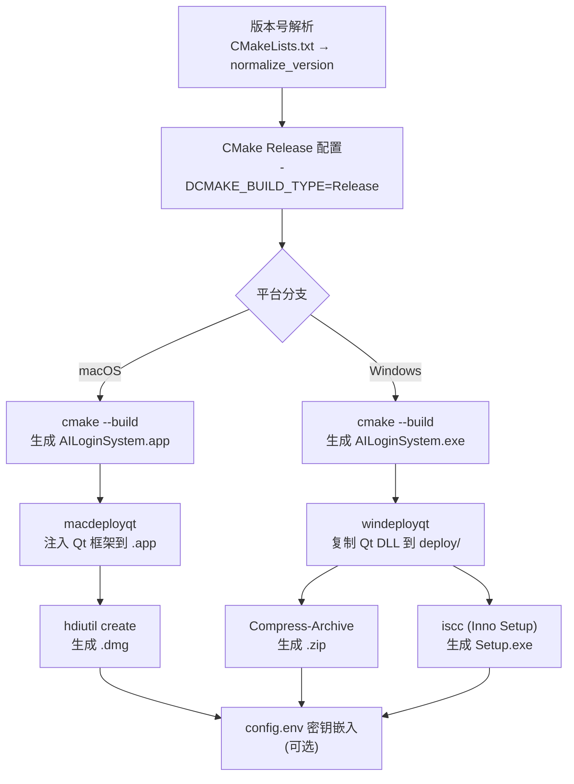

本页深入解析 AI 思政智慧课堂项目的跨平台打包机制——如何在 macOS 上生成自包含的 DMG 磁盘映像，以及在 Windows 上通过 Inno Setup 构建专业级安装程序。内容涵盖两套打包脚本的完整流程、平台差异处理策略、Qt 依赖部署工具（macdeployqt / windeployqt）的行为特征，以及运行时密钥嵌入的端到端方案。本文面向需要在本地或 CI 环境中执行发布构建的高级开发者。

Sources: [package_app.sh](scripts/package_app.sh#L1-L283), [package_windows.ps1](scripts/package_windows.ps1#L1-L229), [windows-installer.iss](scripts/windows-installer.iss#L1-L51)

## 打包流程全景图

两个平台的打包脚本遵循相同的**四阶段流水线**：配置 → 编译 → 依赖部署 → 产物生成。差异集中在依赖部署工具和最终产物格式上。下面的流程图展示了完整的执行路径：



Sources: [package_app.sh](scripts/package_app.sh#L224-L268), [package_windows.ps1](scripts/package_windows.ps1#L162-L221)

## 版本号解析策略

两个脚本共享一致的版本号获取逻辑：优先使用命令行传入的显式版本号，回退到从 `CMakeLists.txt` 的 `project()` 声明中正则提取。版本号规范化时自动去除 `v` 前缀（如 `v1.2.3` → `1.2.3`），确保与文件命名和 Inno Setup 变量兼容。

| 特性 | macOS (`package_app.sh`) | Windows (`package_windows.ps1`) |
|---|---|---|
| 版本来源优先级 | CLI `--version` → CMakeLists.txt | CLI `-Version` → CMakeLists.txt |
| 正则提取方式 | `sed -nE`（Bash 原生） | `Select-String`（PowerShell cmdlet） |
| `v` 前缀处理 | `${raw_version#v}` | `$RawVersion.Substring(1)` |
| 架构自动检测 | `uname -m` → `arm64` / `x64` | 固定 `x64`（由 CI runner 决定） |

Sources: [package_app.sh](scripts/package_app.sh#L55-L93), [package_windows.ps1](scripts/package_windows.ps1#L27-L49)

## macOS 打包：从 App Bundle 到 DMG

### CMake 配置与 Bundle 属性

CMakeLists.txt 中通过 `set_target_properties` 设置了完整的 macOS Bundle 元数据。`MACOSX_BUNDLE TRUE` 标志使 CMake 生成 `.app` 目录结构而非裸二进制；`MACOSX_BUNDLE_ICON_FILE` 指向 `AppIcon.icns`，该文件通过 `MACOSX_PACKAGE_LOCATION` 属性被自动复制到 `Contents/Resources/` 目录。此外，通过 `POST_BUILD` 自定义命令将 PPT 模板资源复制到 Bundle 内部的 `Contents/Resources/ppt/` 路径。

Sources: [CMakeLists.txt](CMakeLists.txt#L166-L207)

### macdeployqt 依赖部署

`macdeployqt` 是 Qt 提供的 macOS 部署工具，其核心职责是将应用所需的 Qt 框架（`QtCore.framework`、`QtWidgets.framework` 等）复制到 `.app/Contents/Frameworks/` 目录中，并修改所有二进制文件的 `@rpath` 和 `install_name`，使应用能够在没有系统级 Qt 安装的目标机器上独立运行。脚本以 `-always-overwrite` 参数调用，确保增量构建时不会因已有框架而跳过更新。

脚本内置了 `find_macdeployqt()` 函数，按以下优先级搜索工具路径：显式 `QT_PATH` 环境变量 → 系统 `PATH` → Homebrew 路径（`/opt/homebrew/opt/qt@6`）→ Qt 官方安装路径（`$HOME/Qt/6.x.x/macos`）。这一多级回退机制确保了在不同开发环境配置下都能定位到正确的部署工具。

Sources: [package_app.sh](scripts/package_app.sh#L95-L124), [package_app.sh](scripts/package_app.sh#L248-L249)

### DMG 创建流程

DMG 的创建使用 macOS 原生的 `hdiutil` 工具，分三步完成：

1. **准备临时目录**：创建 `dmg_temp` 文件夹，将完整的 `.app` Bundle 复制进去，并创建指向 `/Applications` 的符号链接——这是 macOS DMG 安装的标准交互模式（用户拖拽 App 到 Applications 文件夹）。
2. **创建 UDZO 映像**：`hdiutil create -format UDZO` 生成压缩的只读 DMG，卷标设置为产品中文名 "AI思政智慧课堂"。
3. **清理临时目录**：删除中间文件，只保留最终 DMG。

最终产物命名遵循 `AI思政智慧课堂-macOS-{架构}-{版本}.dmg` 格式，如 `AI思政智慧课堂-macOS-arm64-1.0.0.dmg`。由于没有 Apple Developer 代码签名，脚本在完成时输出提示：用户首次打开时需右键点击 → 打开 → 确认，以绕过 Gatekeeper 警告。

Sources: [package_app.sh](scripts/package_app.sh#L254-L283)

## Windows 打包：从 EXE 到安装程序

### 构建与 windeployqt 部署

Windows 打包脚本首先通过 CMake 配置 Release 构建，优先使用 Ninja 生成器（若可用）以加速编译。构建完成后，脚本在 `deploy/` 子目录中创建独立的可分发文件夹结构：

1. 将 `AILoginSystem.exe` 复制到 `deploy/` 目录。
2. 调用 `windeployqt --release --no-translations --no-opengl-sw` 扫描可执行文件的 Qt 依赖，自动复制所需的 DLL 文件、平台插件（`platforms/qwindows.dll`）、图片格式插件等。
3. 手动复制三个运行时资源目录：`resources/ppt`（PPT 模板）、`resources/templates`（文档模板）、`resources/styles`（QSS 样式文件）。

Sources: [package_windows.ps1](scripts/package_windows.ps1#L186-L202)

### Inno Setup 安装程序配置

`windows-installer.iss` 定义了 Inno Setup 编译器（`iscc`）的安装包元数据和行为规则：

| 配置项 | 值 | 说明 |
|---|---|---|
| `AppId` | `{8B2E91A3-...}` | 全局唯一标识符，用于升级/卸载关联 |
| `Compression` | `lzma` | LZMA 压缩算法，高压缩比 |
| `SolidCompression` | `yes` | 固实压缩，跨文件去重，进一步减小体积 |
| `ArchitecturesAllowed` | `x64compatible` | 仅允许 64 位系统安装 |
| `PrivilegesRequired` | `admin` | 需要管理员权限执行安装 |
| `WizardStyle` | `modern` | 使用 Inno Setup 现代向导界面 |
| `SetupIconFile` | `AppIcon_transparent.ico` | 安装程序图标 |

安装包提供了中文界面（`MessagesFile: compiler:Default.isl` 默认即中文）、可选的桌面快捷方式创建任务、开始菜单程序组以及卸载入口。安装完成后会提示用户立即启动应用。

PowerShell 脚本通过 `/D` 参数向 `iscc` 传递编译时变量——`MyAppVersion`、`MyOutputBaseFilename`、`BuildRoot` 和 `OutputDir`——这使得 ISS 文件本身无需硬编码版本号，完全由脚本动态注入。

Sources: [windows-installer.iss](scripts/windows-installer.iss#L1-L51), [package_windows.ps1](scripts/package_windows.ps1#L219-L222)

### 双产物输出

Windows 打包生成两种可分发格式：

- **ZIP 便携版**：`Compress-Archive` 将 `deploy/` 目录打包为 `AI思政智慧课堂-Windows-x64-{版本}.zip`，适合免安装使用场景。
- **安装程序版**：`iscc` 编译生成 `AI思政智慧课堂-Setup-Windows-x64-{版本}.exe`，提供完整的安装/卸载体验。

两种产物共存于同一构建输出目录，用户可根据需求选择下载。通过 `-SkipInstaller` 参数可以跳过 Inno Setup 步骤，仅生成 ZIP。

Sources: [package_windows.ps1](scripts/package_windows.ps1#L207-L228)

## 运行时密钥嵌入机制

两个打包脚本共享同一套密钥嵌入设计：当指定 `--embed-release-keys`（macOS）或 `-EmbedReleaseKeys`（Windows）标志时，脚本从环境变量中读取 API 密钥，生成 `config.env` 文件并放入分发包中。

### macOS 的密钥放置位置

`config.env` 被写入 `AILoginSystem.app/Contents/Resources/config.env`，位于 App Bundle 的标准资源目录。

Sources: [package_app.sh](scripts/package_app.sh#L135-L157)

### Windows 的密钥放置位置

`config.env` 被写入 `build/deploy/config.env`，与 `AILoginSystem.exe` 同级，最终会被打包进 ZIP 或由 Inno Setup 安装到用户机器。

Sources: [package_windows.ps1](scripts/package_windows.ps1#L97-L127)

### AppConfig 运行时加载

应用启动时，`AppConfig::get()` 方法按三级优先级查找配置值：

1. **环境变量**（最高优先级）——`qEnvironmentVariable()` 直接读取系统环境。
2. **随包 config.env**——macOS 检查 `Contents/MacOS/config.env` 和 `Contents/Resources/config.env`；Windows 检查 EXE 同级目录。
3. **开发环境 `.env.local`**——从当前工作目录和向上多级父目录查找。

这种优先级设计确保了：开发者使用 `.env.local` 本地开发；CI 环境通过 `--embed-release-keys` 将密钥烘焙到安装包中；高级用户仍可通过环境变量覆盖任何默认值。

Sources: [AppConfig.cpp](src/config/AppConfig.cpp#L58-L91), [AppConfig.h](src/config/AppConfig.h#L1-L41)

## 命令行接口与常用参数

### macOS 打包脚本

```bash
# 最简用法（自动推断版本、架构、Qt 路径）
./scripts/package_app.sh

# 指定版本号和架构标签
./scripts/package_app.sh --version 2.1.0 --arch-label arm64

# 发布构建（密钥随包分发）
./scripts/package_app.sh --version 2.1.0 --arch-label arm64 --embed-release-keys

# 完整参数指定
./scripts/package_app.sh \
  --version 2.1.0 \
  --qt-path ~/Qt/6.6.2/macos \
  --build-dir build_release \
  --output-dir dist \
  --arch-label arm64 \
  --embed-release-keys
```

Sources: [package_app.sh](scripts/package_app.sh#L1-L43)

### Windows 打包脚本

```powershell
# 最简用法
./scripts/package_windows.ps1

# 指定版本号和 Qt 路径
./scripts/package_windows.ps1 -Version "2.1.0" -QtBinDir "C:\Qt\6.6.2\msvc2019_64\bin"

# 发布构建（密钥随包分发）
./scripts/package_windows.ps1 -Version "2.1.0" -QtBinDir "C:\Qt\6.6.2\msvc2019_64\bin" -EmbedReleaseKeys

# 仅生成 ZIP，跳过安装程序
./scripts/package_windows.ps1 -SkipInstaller
```

Sources: [package_windows.ps1](scripts/package_windows.ps1#L1-L14)

## 平台差异对照总表

| 维度 | macOS | Windows |
|---|---|---|
| 脚本语言 | Bash (`package_app.sh`) | PowerShell (`package_windows.ps1`) |
| 构建产物格式 | `.app` (Bundle) | `.exe` |
| Qt 部署工具 | `macdeployqt -always-overwrite` | `windeployqt --release --no-translations --no-opengl-sw` |
| 分发格式 | DMG（压缩磁盘映像） | ZIP + Inno Setup EXE |
| 图标资源 | `AppIcon.icns` | `AppIcon_transparent.ico` |
| 密钥存放位置 | `Contents/Resources/config.env` | `deploy/config.env`（EXE 同级） |
| 产物命名模式 | `AI思政智慧课堂-macOS-{arch}-{ver}.dmg` | `AI思政智慧课堂-Windows-x64-{ver}.zip` / `Setup-...exe` |
| 压缩工具 | `hdiutil -format UDZO` | `Compress-Archive` + LZMA (Inno) |
| 代码签名 | 无（需用户手动绕过 Gatekeeper） | 无 |

Sources: [package_app.sh](scripts/package_app.sh#L1-L283), [package_windows.ps1](scripts/package_windows.ps1#L1-L229), [windows-installer.iss](scripts/windows-installer.iss#L1-L51)

## 延伸阅读

- 打包脚本的 CI/CD 集成细节见 [GitHub Actions 自动发布：Tag 触发、密钥内嵌与产物上传](27-github-actions-zi-dong-fa-bu-tag-hong-fa-mi-yao-nei-qian-yu-chan-wu-shang-chuan)
- 构建系统的基础配置见 [CMake 构建配置解析：Qt 模块依赖与平台 Bundle 设置](25-cmake-gou-jian-pei-zhi-jie-xi-qt-mo-kuai-yi-lai-yu-ping-tai-bundle-she-zhi)
- 密钥加载优先级的完整设计见 [环境变量与密钥配置指南](4-huan-jing-bian-liang-yu-mi-yao-pei-zhi-zhi-nan-env-appconfig-embedded_keys)
- 统一配置机制的运行时实现见 [统一配置加载机制 AppConfig](7-tong-pei-zhi-jia-zai-ji-zhi-appconfig-huan-jing-bian-liang-sui-bao-pei-zhi-kai-fa-pei-zhi)