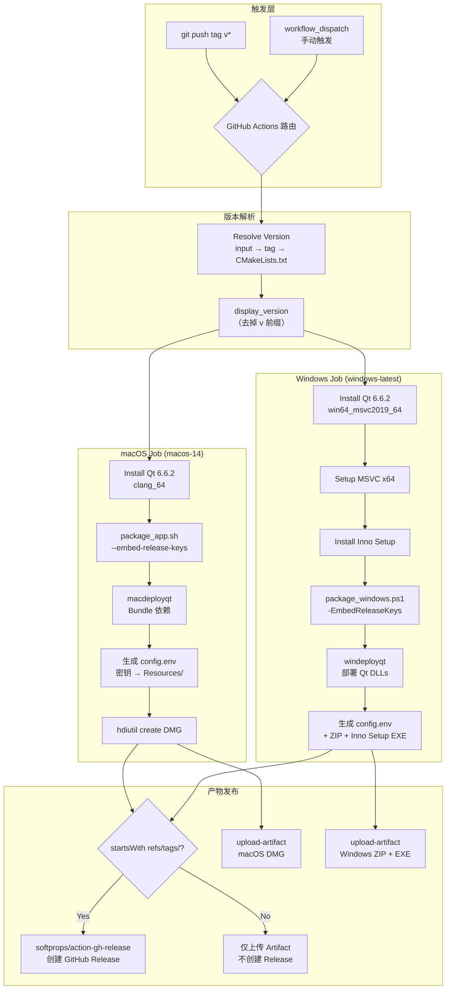
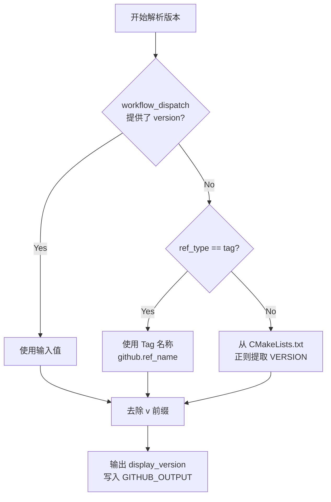
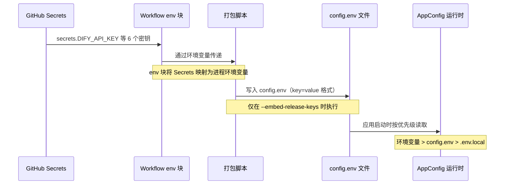
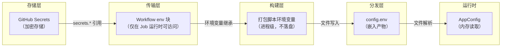

本页深入剖析 AI 思政智慧课堂项目的 **GitHub Actions 自动发布流水线**，覆盖从 Tag 推送触发、密钥安全注入、跨平台构建打包，到 Release 产物上传的完整生命周期。项目维护了两套独立但结构对称的 Workflow——[build-macos.yml](.github/workflows/build-macos.yml) 与 [build-windows.yml](.github/workflows/build-windows.yml)——分别构建 macOS DMG 与 Windows 安装包，并最终聚合到同一个 GitHub Release 下。

Sources: [build-macos.yml](.github/workflows/build-macos.yml#L1-L92), [build-windows.yml](.github/workflows/build-windows.yml#L1-L98)

## 发布流程全景

在深入每个环节的细节之前，先建立对整条流水线的宏观认知。下图描绘了一次典型的 `git tag v1.2.0` 推送后，两个并行 Job 从触发到产物发布的完整数据流：



**关键设计决策**：Workflow 并非直接在 YAML 中完成构建，而是将核心构建逻辑委托给平台专属的打包脚本——macOS 使用 [package_app.sh](scripts/package_app.sh)，Windows 使用 [package_windows.ps1](scripts/package_windows.ps1)。这种「Workflow 作为编排器、脚本作为执行器」的分层设计，使得开发者可以在本地以完全相同的参数复现 CI 构建，极大降低了调试成本。

Sources: [build-macos.yml](.github/workflows/build-macos.yml#L57-L73), [build-windows.yml](.github/workflows/build-windows.yml#L66-L77), [package_app.sh](scripts/package_app.sh#L1-L10), [package_windows.ps1](scripts/package_windows.ps1#L1-L14)

## 触发机制：双入口设计

两个 Workflow 共享完全相同的触发条件配置，采用**双入口模式**：

| 触发方式 | 配置键 | 适用场景 | 版本来源 |
|---------|--------|---------|---------|
| **Tag 推送** | `on.push.tags: ['v*']` | 正式发布 | Tag 名称（如 `v1.2.0`） |
| **手动触发** | `on.workflow_dispatch.inputs.version` | 测试构建 / 紧急修复 | 手动输入或 CMakeLists.txt 回退 |

```yaml
on:
  push:
    tags:
      - 'v*'           # 匹配 v 开头的所有 tag
  workflow_dispatch:
    inputs:
      version:
        description: 'Release version (optional, supports vX.Y.Z)'
        required: false
        type: string
```

**Tag 推送**是正式发布的标准入口。当执行 `git tag v1.2.0 && git push origin v1.2.0` 时，GitHub 会自动匹配 `v*` glob 模式并触发两个 Workflow。**手动触发**则为开发阶段提供了灵活的测试通道——在仓库的 Actions 页面点击 "Run workflow" 即可启动，还可指定任意版本号。

两种触发方式在产物处理上有一个关键差异：**仅 Tag 推送会创建 GitHub Release**。手动触发的构建只会通过 `upload-artifact` 上传到 Workflow Run 的 Artifacts 页面，不会生成正式 Release 条目。这一判断通过条件表达式 `if: startsWith(github.ref, 'refs/tags/')` 实现。

Sources: [build-macos.yml](.github/workflows/build-macos.yml#L3-L12), [build-windows.yml](.github/workflows/build-windows.yml#L3-L12), [build-macos.yml](.github/workflows/build-macos.yml#L82-L91)

## 版本号解析：三级降级策略

版本号是整条流水线的数据主线——它决定了产物文件名、Release 标题、Inno Setup 版本信息。两个平台采用相同的三级降级逻辑，仅在脚本语言上有所差异（Bash vs PowerShell）：



**第一级：手动输入**。当通过 `workflow_dispatch` 触发且填写了 `version` 参数时，直接采用该值。macOS 端检查 `$INPUT_VERSION` 是否非空，Windows 端使用 `[string]::IsNullOrWhiteSpace($inputVersion)` 做等价判断。

**第二级：Tag 名称**。当触发来源是 Tag 推送时，`${{ github.ref_type }}` 为 `"tag"`，`${{ github.ref_name }}` 即为 Tag 文本（如 `v1.2.0`）。

**第三级：CMakeLists.txt 回退**。作为最终兜底，从项目根目录的 [CMakeLists.txt](CMakeLists.txt#L3) 中通过正则匹配 `project(AILoginSystem VERSION X.Y.Z)` 提取版本号。这确保了即使在不规范的触发场景下，流水线也能获取到一个合法版本。

无论哪一级的输出，最终都会经过 **`v` 前缀剥离**处理——macOS 使用 `${VERSION#v}`，Windows 使用 `$version.Substring(1)`——确保输出格式统一为纯数字的 `X.Y.Z`。解析结果通过 `$GITHUB_OUTPUT` 环境文件写入，供后续 Step 以 `${{ steps.version.outputs.display_version }}` 引用。

Sources: [build-macos.yml](.github/workflows/build-macos.yml#L25-L44), [build-windows.yml](.github/workflows/build-windows.yml#L25-L46), [CMakeLists.txt](CMakeLists.txt#L3)

## 密钥注入：从 Secrets 到 config.env

密钥的安全传递是本流水线最精密的设计环节。它需要解决一个核心矛盾：**发布产物必须包含 API 密钥以实现用户免配置，但这些密钥绝不能出现在 Git 仓库的任何文件中**。

### 密钥传递链路



### GitHub Secrets 声明

两个 Workflow 的 Package Step 都定义了完全相同的 6 个密钥环境变量映射：

```yaml
env:
  DIFY_API_KEY: ${{ secrets.DIFY_API_KEY }}
  TIANXING_API_KEY: ${{ secrets.TIANXING_API_KEY }}
  SUPABASE_URL: ${{ secrets.SUPABASE_URL }}
  SUPABASE_ANON_KEY: ${{ secrets.SUPABASE_ANON_KEY }}
  ZHIPU_API_KEY: ${{ secrets.ZHIPU_API_KEY }}
  ZHIPU_BASE_URL: ${{ secrets.ZHIPU_BASE_URL }}
```

这些密钥需要在仓库的 **Settings → Secrets and variables → Actions** 中预先配置。`GITHUB_TOKEN` 则由 GitHub 自动提供，无需手动设置，用于后续的 Release 创建权限。

Sources: [build-macos.yml](.github/workflows/build-macos.yml#L59-L73), [build-windows.yml](.github/workflows/build-windows.yml#L68-L77)

### 打包脚本的 config.env 生成

当打包脚本收到 `--embed-release-keys`（macOS）或 `-EmbedReleaseKeys`（Windows）标志时，会从环境变量中读取密钥并生成 `config.env` 文件。以 macOS 的 [package_app.sh](scripts/package_app.sh) 为例，其 `generate_config_env` 函数逻辑如下：

```bash
# config.env 放进 App Bundle 的 Resources 目录
local config_env_path="$APP_PATH/Contents/Resources/config.env"
cat > "$config_env_path" <<EOF
DIFY_API_KEY=${DIFY_API_KEY:-}
TIANXING_API_KEY=${TIANXING_API_KEY:-}
...
EOF
```

这个文件被放置在 macOS App Bundle 的 `Contents/Resources/config.env` 路径下，或在 Windows 的 `deploy/config.env` 中（与 exe 同级）。`config.env` 使用标准的 `key=value` 格式，`#` 开头的行为注释，空行被忽略。文件头部还嵌入了警告注释 `此文件包含 API 密钥，请勿公开分享`，提醒分发者注意安全。

Sources: [package_app.sh](scripts/package_app.sh#L135-L157), [package_windows.ps1](scripts/package_windows.ps1#L97-L127)

### 运行时加载：AppConfig 三级优先级

应用启动时，[AppConfig](src/config/AppConfig.h) 类按照以下优先级查找配置值：

| 优先级 | 来源 | 路径 | 适用场景 |
|--------|------|------|---------|
| **1（最高）** | 系统环境变量 | `qEnvironmentVariable()` | CI/CD、容器化部署 |
| **2** | 随包 config.env | macOS: `Contents/Resources/config.env`；Windows: exe 同级 | 发布版本（CI 生成） |
| **3** | 开发环境 .env.local | 项目根目录、向上遍历的父目录 | 本地开发 |

这一优先级体系确保了：发布版本的用户无需任何配置即可直接使用（优先级 2 的 config.env 已内嵌密钥）；开发者在本地通过 `.env.local` 维护个人密钥；而 CI 环境中可通过环境变量覆盖一切。完整的加载逻辑详见 [AppConfig.cpp](src/config/AppConfig.cpp#L58-L91) 中的 `AppConfig::get()` 方法。

Sources: [AppConfig.h](src/config/AppConfig.h#L1-L41), [AppConfig.cpp](src/config/AppConfig.cpp#L58-L91), [AppConfig.cpp](src/config/AppConfig.cpp#L102-L141)

## 跨平台构建矩阵

两个 Workflow 在构建工具链上存在平台差异，但保持了高度的架构对称性：

| 维度 | macOS | Windows |
|------|-------|---------|
| **Runner** | `macos-14`（Apple Silicon） | `windows-latest` |
| **Qt 版本** | 6.6.2 | 6.6.2 |
| **Qt 架构** | `clang_64` | `win64_msvc2019_64` |
| **Qt 模块** | qtbase, qtsvg, qtdeclarative, qtshadertools, qtcharts | 同左 |
| **编译器** | Clang（系统自带） | MSVC x64（通过 `ilammy/msvc-dev-cmd` 设置） |
| **部署工具** | `macdeployqt` | `windeployqt` |
| **打包格式** | DMG（hdiutil） | ZIP + Inno Setup EXE |
| **额外依赖** | 无 | Inno Setup（通过 Chocolatey 安装） |

Qt 安装统一使用 `jurplel/install-qt-action@v4`，并通过 `cache: true` 启用缓存以加速后续构建。值得注意的是，两个平台都只安装了最小化的 Qt 组件子集（`qtbase qtsvg qtdeclarative qtshadertools`）和 `qtcharts` 模块，避免下载整个 Qt 安装包。

Sources: [build-macos.yml](.github/workflows/build-macos.yml#L46-L55), [build-windows.yml](.github/workflows/build-windows.yml#L48-L64)

### macOS 构建流程

macOS 构建在 `macos-14` Runner 上执行，生成 Apple Silicon 原生的 ARM64 应用。核心步骤依次为：

1. **CMake 配置**：以 Release 模式配置，优先使用 Ninja 生成器（若可用），并通过 `-DCMAKE_PREFIX_PATH` 指向 Qt 的 CMake 路径
2. **编译构建**：`cmake --build --config Release`，产出 `AILoginSystem.app` Bundle
3. **macdeployqt 部署**：扫描可执行文件的 Qt 依赖，将所需框架和插件复制进 App Bundle
4. **密钥注入**：生成 `config.env` 并放入 `Contents/Resources/`
5. **DMG 创建**：通过 `hdiutil create` 生成 UDZO 压缩格式的磁盘映像

macdeployqt 的路径查找采用多级策略——优先使用 `QT_PATH` 环境变量，其次检查 `PATH`，最后遍历 Homebrew 和 `~/Qt/` 下的常见安装路径。

Sources: [package_app.sh](scripts/package_app.sh#L95-L124), [package_app.sh](scripts/package_app.sh#L224-L268)

### Windows 构建流程

Windows 构建额外需要两个步骤——MSVC 环境初始化和 Inno Setup 安装。核心流程如下：

1. **MSVC 设置**：通过 `ilammy/msvc-dev-cmd@v1` 初始化 x64 编译环境
2. **Inno Setup 安装**：`choco install innosetup --no-progress -y`
3. **CMake + 编译**：与 macOS 类似，产出 `AILoginSystem.exe`
4. **windeployqt 部署**：使用 `--no-translations --no-opengl-sw` 精简部署
5. **资源复制**：手动拷贝 `ppt/`、`templates/`、`styles/` 目录到部署目录
6. **密钥注入**：生成 `config.env` 放入 deploy 目录
7. **双重打包**：`Compress-Archive` 生成 ZIP + `iscc` 编译 Inno Setup 安装包

Windows 产物最终包含两个文件：一个免安装的 ZIP 压缩包和一个标准的 `.exe` 安装程序。Inno Setup 脚本 [windows-installer.iss](scripts/windows-installer.iss) 通过命令行参数 `/DMyAppVersion=...` 动态注入版本号，实现了版本号的单一来源管理。

Sources: [build-windows.yml](.github/workflows/build-windows.yml#L58-L77), [package_windows.ps1](scripts/package_windows.ps1#L156-L221), [windows-installer.iss](scripts/windows-installer.iss#L1-L51)

## 产物管理与 Release 发布

### Artifact 上传

每个 Workflow 都会无条件执行 `actions/upload-artifact@v4`，将构建产物上传为 **Workflow Run Artifact**。即使不创建正式 Release，开发者也可以从 Actions 页面下载这些文件进行验证。

| 平台 | Artifact 名称 | 包含文件 |
|------|---------------|---------|
| macOS | `AI思政智慧课堂-macOS-{version}` | `AI思政智慧课堂-macOS-arm64-{version}.dmg` |
| Windows | `AI思政智慧课堂-Windows-{version}` | ZIP 文件 + Inno Setup EXE 安装包 |

Sources: [build-macos.yml](.github/workflows/build-macos.yml#L75-L80), [build-windows.yml](.github/workflows/build-windows.yml#L79-L85)

### GitHub Release 创建

Release 创建使用 `softprops/action-gh-release@v1`，带有条件守卫 `if: startsWith(github.ref, 'refs/tags/')`——这意味着**只有 Tag 推送触发的构建才会创建正式 Release**。手动 `workflow_dispatch` 触发的构建会跳过此步骤。

```yaml
- name: Create Release
  if: startsWith(github.ref, 'refs/tags/')
  uses: softprops/action-gh-release@v1
  with:
    files: |
      dist/AI思政智慧课堂-macOS-arm64-${{ steps.version.outputs.display_version }}.dmg
    draft: false
    prerelease: false
  env:
    GITHUB_TOKEN: ${{ secrets.GITHUB_TOKEN }}
```

由于两个 Workflow 由同一个 Tag 事件触发，它们会并行执行并向同一个 Release 资源追加文件。`softprops/action-gh-release` 天然支持这种并发追加——第一个完成的 Job 创建 Release，第二个 Job 的 `files` 会被追加到已有 Release 中。Workflow 顶部的 `permissions: contents: write` 声明确保了 `GITHUB_TOKEN` 具有创建 Release 的写权限。

Sources: [build-macos.yml](.github/workflows/build-macos.yml#L82-L91), [build-windows.yml](.github/workflows/build-windows.yml#L87-L97)

## 安全边界：密钥防护体系

密钥在整个生命周期中被多层安全机制保护：



**Git 层面的防护**：[.gitignore](.gitignore#L127-L134) 明确排除了所有密钥相关文件——`.env`、`.env.local`、`.env.production`、`src/config/embedded_keys.h`、`*.key`、`*.pem`。即使在打包脚本中意外生成了这些文件，它们也不会被提交到仓库。

**GitHub Secrets 层面的防护**：密钥在 GitHub 服务器上以加密形式存储，Workflow 日志中所有 `${{ secrets.* }}` 引用都会被自动掩码为 `***`。Workflow 的 `env` 块仅在 Job 执行期间将密钥注入为进程环境变量，Job 结束后立即失效。

**产物层面的权衡**：`config.env` 最终会嵌入到分发的 DMG 和安装包中，这意味着获得安装包的用户理论上可以提取这些密钥。这是一个**有意的安全让步**——项目选择的策略是「便利性优先」，使用 `anon_key` 等低权限密钥而非 `service_role` 密钥，将风险控制在可接受范围内。值得注意的是，[embedded_keys.h.example](src/config/embedded_keys.h.example) 中的编译时内嵌方案（C++ `inline const char*`）已作为遗留机制保留，但当前主要依赖运行时的 `config.env` 方案。

Sources: [.gitignore](.gitignore#L127-L134), [embedded_keys.h.example](src/config/embedded_keys.h.example#L1-L18), [build-macos.yml](.github/workflows/build-macos.yml#L59-L66)

## 本地复现 CI 构建

由于核心逻辑封装在打包脚本中，开发者可以在本地完全复现 CI 的构建过程，无需推送 Tag：

**macOS 本地构建**：
```bash
# 设置密钥环境变量（与 GitHub Secrets 对应）
export DIFY_API_KEY="your-key"
export TIANXING_API_KEY="your-key"
export SUPABASE_URL="https://xxx.supabase.co"
export SUPABASE_ANON_KEY="your-key"
export ZHIPU_API_KEY="your-key"
export ZHIPU_BASE_URL="https://xxx.com"

# 执行打包（--embed-release-keys 激活密钥嵌入）
./scripts/package_app.sh --version 1.0.0 --arch-label arm64 --embed-release-keys
```

**Windows 本地构建**：
```powershell
# 密钥通过环境变量或参数传入
$env:DIFY_API_KEY = "your-key"
# ... 其他密钥同上

.\scripts\package_windows.ps1 -Version "1.0.0" -EmbedReleaseKeys -QtBinDir "C:\Qt\6.6.2\msvc2019_64\bin"
```

省略 `--embed-release-keys` / `-EmbedReleaseKeys` 标志时，脚本会跳过密钥嵌入步骤，生成的产物需要用户自行配置 `.env` 文件。

Sources: [package_app.sh](scripts/package_app.sh#L30-L43), [package_windows.ps1](scripts/package_windows.ps1#L1-L14)

## 必需的 GitHub Secrets 清单

要让 CI 流水线正常工作，仓库管理员需要在 **Settings → Secrets and variables → Actions** 中配置以下 6 个 Repository Secrets：

| Secret 名称 | 用途 | 对应服务 |
|-------------|------|---------|
| `DIFY_API_KEY` | AI 对话、试题解析 | Dify 平台 |
| `TIANXING_API_KEY` | 时政新闻数据源 | 天行数据 |
| `SUPABASE_URL` | 认证、通知、存储 | Supabase |
| `SUPABASE_ANON_KEY` | 客户端匿名访问 | Supabase |
| `ZHIPU_API_KEY` | PPT Agent 生成 | 智谱 AI |
| `ZHIPU_BASE_URL` | 智谱 API 端点 | 智谱 AI |

此外，`GITHUB_TOKEN` 由 GitHub 自动注入，用于 Release 创建，**无需手动配置**。但需要确保 Workflow 的 `permissions: contents: write` 已声明（两个 Workflow 均已包含此声明）。

Sources: [build-macos.yml](.github/workflows/build-macos.yml#L14-L15), [build-macos.yml](.github/workflows/build-macos.yml#L59-L65)

## 延伸阅读

- 密钥的运行时加载优先级和 `AppConfig` 的完整设计参见 [环境变量与密钥配置指南（.env、AppConfig、embedded_keys）](4-huan-jing-bian-liang-yu-mi-yao-pei-zhi-zhi-nan-env-appconfig-embedded_keys)
- 打包脚本的完整参数说明和本地调试技巧参见 [跨平台打包流程：macOS DMG 与 Windows Inno Setup 安装包](26-kua-ping-tai-da-bao-liu-cheng-macos-dmg-yu-windows-inno-setup-an-zhuang-bao)
- CMake 构建配置中 Qt 模块依赖和平台 Bundle 设置参见 [CMake 构建配置解析：Qt 模块依赖与平台 Bundle 设置](25-cmake-gou-jian-pei-zhi-jie-xi-qt-mo-kuai-yi-lai-yu-ping-tai-bundle-she-zhi)