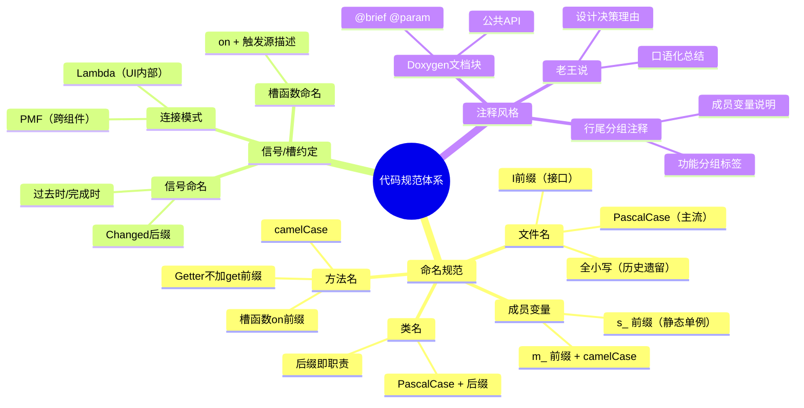

本文系统性地梳理了 AI 思政智慧课堂项目的代码约定——从文件命名到类/成员变量命名，从信号/槽设计模式到三种注释风格。掌握这些规范，你将能像团队成员一样写出"对味"的代码，也能快速读懂现有模块之间的协作关系。所有规范均从真实代码中提炼而来，零猜测，可验证。

Sources: [CLAUDE.md](CLAUDE.md#L110-L116), [modernmainwindow.h](src/dashboard/modernmainwindow.h#L1-L60)

## 文件命名规范：PascalCase 为主，早期模块保留全小写

项目中的文件命名存在两种风格。**新增模块统一使用 PascalCase**（每个单词首字母大写），而项目早期创建的几个核心文件保留全小写风格，属于历史遗留。这是理解目录结构时需要特别注意的第一条线索。

| 命名风格 | 代表文件 | 出现位置 |
|---|---|---|
| **PascalCase**（主流） | `DifyService.h`, `ChatWidget.h`, `QuestionBasket.h`, `Notification.h` | `services/`, `ui/`, `notifications/`, `analytics/` 等较新模块 |
| **全小写**（历史遗留） | `simpleloginwindow.h`, `aipreparationwidget.h`, `modernmainwindow.h`, `questionbankwindow.h` | `auth/login/`, `ui/`, `dashboard/`, `questionbank/` 等早期模块 |
| **接口 I 前缀** | `INewsProvider.h`, `IAnalyticsDataSource.h` | `hotspot/`, `analytics/interfaces/` |

一个关键识别规则：**接口文件以大写 `I` 开头**，后面直接跟领域名词（不插入下划线），例如 `INewsProvider` 而非 `I_NewsProvider`。这种命名源自 COM/Qt 社区的经典约定，一眼就能辨别"这是一个纯虚接口类"。

Sources: [INewsProvider.h](src/hotspot/INewsProvider.h#L1-L7), [IAnalyticsDataSource.h](src/analytics/interfaces/IAnalyticsDataSource.h#L1-L10)

## 类名命名规范：后缀即职责

类名严格遵循 **PascalCase**，并通过后缀传递"这个类是做什么的"这一关键信息。下表展示了项目中使用的核心后缀约定：

| 后缀 | 职责 | 示例 |
|---|---|---|
| `Service` | 业务逻辑层，封装网络/数据操作 | `DifyService`, `PaperService`, `AttendanceService` |
| `Widget` | 可嵌入的 UI 组件（继承 `QWidget`） | `ChatWidget`, `HotspotTrackingWidget`, `NotificationWidget` |
| `Window` | 独立顶级窗口（继承 `QWidget`/`QMainWindow`） | `SimpleLoginWindow`, `QuestionBankWindow` |
| `Dialog` | 弹出式对话框 | `AIChatDialog`, `PaperComposerDialog`, `QualityCheckDialog` |
| `Manager` | 协调器，管理多个组件的联动 | `ChatManager`, `SidebarManager` |
| `Helper` | 静态工具类，封装枚举转换等机械操作 | `AttendanceStatusHelper`, `NetworkRetryHelper` |
| `Generator` | 文件格式生成器 | `DocxGenerator`, `PPTXGenerator` |
| `Provider` | 数据源提供者（策略模式） | `RealNewsProvider`, `MockNewsProvider` |
| `Editor` | 富内容编辑器 | `LessonPlanEditor` |
| `Tracker` | 异步任务状态追踪 | `FailedTaskTracker` |
| `Parser` | 协议/格式解析器 | `SseStreamParser`, `QuestionParserService` |
| `Badge` | 小型指示器组件 | `NotificationBadge` |

接口类以 `I` 为前缀，不继承 `QObject`（如 `IAnalyticsDataSource`）或继承 `QObject`（如 `INewsProvider`），取决于是否需要信号机制。数据模型类（如 `Notification`、`AttendanceRecord`）不继承 `QObject`，是纯 C++ 类，提供 `fromJson()` / `toJson()` 序列化方法。

Sources: [Notification.h](src/notifications/models/Notification.h#L23-L31), [AttendanceRecord.h](src/attendance/models/AttendanceRecord.h#L16-L29), [INewsProvider.h](src/hotspot/INewsProvider.h#L20-L44)

## 成员变量命名：`m_` 前缀 + camelCase

这是 Qt 社区最经典的命名约定，本项目中得到一致遵守。成员变量以 `m_` 开头，后续使用 camelCase：

```cpp
// 服务层典型成员变量
QNetworkAccessManager *m_networkManager;
QNetworkReply *m_currentReply;
QString m_apiKey;
QString m_baseUrl;
QString m_conversationId;
bool m_isLoading = false;
int m_unreadCount = 0;
```

**静态单例成员**使用 `s_` 前缀，如 `QuestionBasket` 中的 `s_instance`。**局部变量和函数参数**不使用前缀，纯 camelCase：`proxyUrl`、`normalizedScheme`、`buffer`。

**布尔成员变量**通常以 `is`/`has` 开头命名，在声明处直接初始化为默认值：`bool m_isLoading = false;`、`bool m_loginProcessed = false;`。这种"声明即初始化"的习惯减少了未初始化变量的风险。

Sources: [DifyService.h](src/services/DifyService.h#L160-L177), [QuestionBasket.h](src/questionbank/QuestionBasket.h#L71-L78), [SimpleLoginWindow.h](src/auth/login/simpleloginwindow.h#L65-L66)

## 方法命名：动词 + 名词， Getter/Setters 风格统一

方法名统一使用 **camelCase**，按功能分为以下几类：

| 类别 | 命名模式 | 示例 |
|---|---|---|
| **业务操作** | 动词 + 名词 | `sendMessage()`, `fetchNotifications()`, `submitAttendance()` |
| **Getter（属性式）** | 直接名词，不加 `get` | `currentConversationId()`, `notifications()`, `unreadCount()` |
| **Getter（布尔式）** | `is`/`has` + 形容词 | `isLoading()`, `isValid()`, `isRead()`, `hasRememberedCredentials()` |
| **Setter** | `set` + 名词 | `setApiKey()`, `setCurrentUserId()`, `setBaseUrl()` |
| **初始化/搭建** | `setup`/`init` + 范围 | `setupUI()`, `initUI()`, `setupStyles()`, `createSidebar()` |
| **槽函数** | `on` + 事件描述 | `onLoginClicked()`, `onReplyFinished()`, `onSendClicked()` |
| **工厂/构建** | `create`/`build` + 名词 | `createConfiguredRequest()`, `buildHeader()`, `createRequest()` |

一个值得注意的细节：**Getter 方法不加 `get` 前缀**。`currentConversationId()` 而非 `getCurrentConversationId()`，`notifications()` 而非 `getNotifications()`。这与 Qt 官方 API 风格完全一致（如 `QWidget::size()` 而非 `getSize()`）。

Sources: [DifyService.h](src/services/DifyService.h#L22-L83), [SupabaseClient.h](src/auth/supabase/supabaseclient.h#L27-L62), [AppConfig.h](src/config/AppConfig.h#L19-L39)

## 常量与枚举命名

### 命名空间常量：UPPER_SNAKE_CASE

全局共享的样式常量集中在 `StyleConfig` 命名空间内，使用 `UPPER_SNAKE_CASE`：

```cpp
namespace StyleConfig {
    inline const QString PATRIOTIC_RED = "#E53935";
    inline const QString SUCCESS_GREEN = "#388E3C";
    inline const QString TEXT_PRIMARY = "#1A1A1A";
    inline constexpr int RADIUS_XL = 24;
    // ...
}
```

在 `.cpp` 文件中，局部作用域的样式字符串常量也使用 `UPPER_SNAKE_CASE` 声明为文件级 `const QString`，如 `SIDEBAR_GRADIENT`、`SIDEBAR_BTN_NORMAL` 等。

### 枚举类：enum class + PascalCase 值

项目统一使用 **C++11 的 `enum class`**（避免隐式转换和命名空间污染），枚举值使用 PascalCase：

```cpp
enum class AttendanceStatus {
    Present = 0,    // 出勤
    Absent = 1,     // 缺勤
    Late = 2,       // 迟到
    Leave = 3,      // 请假
    EarlyLeave = 4  // 早退
};

enum class NotificationType {
    HomeworkSubmission = 0,  // 作业提交
    LeaveApproval = 1,       // 请假审批
    GradeRelease = 2,        // 成绩发布
    SystemAnnouncement = 3   // 系统公告
};
```

枚举值**显式指定整数值**（从 0 递增），并与 Supabase 数据库中的整型字段对应。枚举的序列化/反序列化封装在对应的 `Helper` 工具类中（如 `AttendanceStatusHelper::toString()` / `fromString()`），集中管理映射逻辑。

Sources: [StyleConfig.h](src/shared/StyleConfig.h#L7-L53), [AttendanceStatus.h](src/attendance/models/AttendanceStatus.h#L10-L16), [Notification.h](src/notifications/models/Notification.h#L12-L17)

## 头文件保护宏与 Include 风格

### Include Guard：两种风格并存

| 风格 | 格式 | 示例 | 出现频率 |
|---|---|---|---|
| **传统 `#ifndef` 宏**（主流） | `全大写文件名_H` | `DIFYSERVICE_H`, `NOTIFICATION_H` | 绝大多数文件 |
| **`#pragma once`**（少量） | 直接写 `#pragma once` | `ExportService.h`, `moderncheckbox.h` | 仅 2 个文件 |

传统宏的命名规则：将文件名全转为大写，保留下划线分隔，末尾追加 `_H`。例如 `questionbankwindow.h` → `QUESTIONBANKWINDOW_H`，`AppConfig.h` → `APP_CONFIG_H`。`#pragma once` 仅出现在极少数辅助文件中，不应作为新代码的首选。

### Include 路径

项目内部使用**相对路径**引用头文件，以 `../` 表示上级目录：

```cpp
#include "../shared/StyleConfig.h"
#include "../auth/login/simpleloginwindow.h"
#include "../services/DifyService.h"
```

Sources: [ExportService.h](src/services/ExportService.h#L1), [modernmainwindow.cpp](src/dashboard/modernmainwindow.cpp#L1-L24)

## 信号/槽约定：名称模式与连接语法

### 信号命名：过去时/完成时描述事件

信号名称传达"某事已发生"或"某数据已就绪"的语义，使用以下三种命名模式：

| 模式 | 格式 | 示例 |
|---|---|---|
| **动作完成** | 名词 + 过去分词 | `messageReceived`, `conversationCreated`, `exportFailed` |
| **状态变化** | 名词 + `Changed` | `unreadCountChanged`, `loadingStateChanged`, `countChanged` |
| **简单事件** | 名词/动词 | `requestStarted`, `requestFinished`, `cleared` |

信号的参数携带核心数据，通常第一个参数是主体数据。例如 `void notificationsReceived(const QList<Notification> &notifications)` 直接传递完整数据列表，而非让接收方再回查。

### 槽函数命名：`on` + 触发源描述

私有槽函数统一使用 `on` 前缀，后接动作或信号语义：

- **UI 交互触发的槽**：`onLoginClicked()`、`onSendClicked()`、`onNotificationBtnClicked()`
- **网络回调触发的槽**：`onReplyFinished()`、`onReadyRead()`、`onFetchNotificationsFinished()`
- **子组件信号触发的槽**：`onSearchCompleted()`、`onNewsListReceived()`

这种命名让你在 `.cpp` 文件中看到 `on` 前缀时，立刻知道它是一个槽函数，并且能推断出它的触发场景。

Sources: [DifyService.h](src/services/DifyService.h#L84-L124), [NotificationService.h](src/notifications/NotificationService.h#L41-L54), [AttendanceService.h](src/attendance/services/AttendanceService.h#L60-L71)

## 连接模式：PMF 连接为主，Lambda 用于简单桥接

项目中的 `connect()` 调用遵循两种模式，选择标准清晰明确：

### 模式一：PMF（指针到成员函数）——跨组件信号路由

当信号需要路由到另一个对象的方法时，使用完整的 PMF 语法：

```cpp
// 服务信号 → 主窗口槽（跨对象信号路由）
connect(m_difyService, &DifyService::streamChunkReceived,
        this, &ModernMainWindow::onAIStreamChunk);
connect(m_difyService, &DifyService::messageReceived,
        this, &ModernMainWindow::onAIResponseReceived);

// 认证信号 → 登录窗口槽
connect(m_supabaseClient, &SupabaseClient::loginSuccess,
        this, &SimpleLoginWindow::onLoginSuccess);
```

这种模式用于所有**跨层级的信号传递**（服务层 → UI 层、子组件 → 父窗口），保证类型安全。

### 模式二：Lambda —— UI 内部的事件桥接

当连接的目标是一段简短的胶水逻辑（如打日志、切换页面、调用已有方法）时，使用 Lambda：

```cpp
// 侧栏按钮 → 导航切换 + 调试日志
connect(teacherCenterBtn, &QPushButton::clicked, this,
        [=]() { qDebug() << "教师中心按钮被点击"; onTeacherCenterClicked(); });

// 定时器 → UI 更新
connect(timer, &QTimer::timeout, [timeLabel]() {
    timeLabel->setText(QDateTime::currentDateTime().toString("yyyy-MM-dd HH:mm:ss"));
});
```

**注意**：Lambda 捕获列表中，简单场景用 `[=]`，需要修改成员变量时用 `[this]`。项目中没有使用旧的 `SIGNAL()/SLOT()` 字符串连接语法。

Sources: [modernmainwindow.cpp](src/dashboard/modernmainwindow.cpp#L855-L860), [simpleloginwindow.cpp](src/auth/login/simpleloginwindow.cpp#L26-L37)

## 中文注释风格：三种模式并存

本项目的注释全部使用中文，形成了三种可辨识的风格层次：

### 风格一：Doxygen `/** */` 文档块（服务层和公共接口）

服务类和模型类的公共 API 使用完整的 Doxygen 格式，包含 `@brief`、`@param`、`@return` 标签：

```cpp
/**
 * @brief 发送对话消息到 Dify
 * @param message 用户消息内容
 * @param conversationId 会话ID（可选，留空则创建新会话）
 */
void sendMessage(const QString &message, const QString &conversationId = "");

/**
 * @brief 新闻提供者抽象接口
 *
 * 这个接口定义了获取新闻数据的标准方法。
 * 未来对接外部新闻库时，只需实现此接口即可。
 */
```

这种风格主要用于**头文件中的公共方法声明**，为调用方提供完整的参数说明和使用指引。

### 风格二：行尾 `//` 注释（成员变量和 UI 组件分组）

成员变量声明处的行尾注释说明用途，同时作为分组标签：

```cpp
// 侧边栏导航按钮
QPushButton *teacherCenterBtn = nullptr;      // 教师中心
QPushButton *newsTrackingBtn = nullptr;       // 时政新闻
QPushButton *aiPreparationBtn = nullptr;      // AI智能备课

// 缓存数据
QList<Student> m_students;
QList<AttendanceRecord> m_attendanceRecords;
```

UI 组件按功能分组，每组以一个**分组注释行**开头，后跟具体变量。这种组织方式在 200+ 行的头文件中极大提升了可扫描性。

### 风格三："老王说"幽默注释（业务领域注释）

这是本项目最独特的注释风格——以"老王说："开头的一句话总结，出现在类或枚举的 Doxygen `@brief` 中，兼具信息量和趣味性：

| 文件 | "老王说"原文 |
|---|---|
| `AttendanceStatus.h` | `老王说：5种状态够用了，别整那些花里胡哨的` |
| `NotificationService.h` | `老王说：参考HotspotService模式，Supabase REST API一把梭` |
| `Notification.h` | `老王说：4种通知类型，简单明了` |
| `MockDataSource.h` | `老王说：先用假数据把UI搞好，真数据以后再接` |
| `RadarChartWidget.h` | `老王说：Qt Charts没有雷达图，只能自己画一个` |
| `IAnalyticsDataSource.h` | `老王说：接口就是个约定，实现类爱怎么搞怎么搞` |

"老王说"注释的风格特征：**口语化、直击本质、包含设计决策的理由**。它不是"注释为了注释"，而是在轻松的语气中传达"为什么这样设计"的核心信息。对于初学者来说，这类注释比正式文档更容易理解模块的设计意图。

Sources: [DifyService.h](src/services/DifyService.h#L13-L31), [modernmainwindow.h](src/dashboard/modernmainwindow.h#L126-L146), [AttendanceStatus.h](src/attendance/models/AttendanceStatus.h#L7-L21), [NotificationService.h](src/notifications/NotificationService.h#L10-L13)

## 规范速查表

以下表格汇总了本项目的核心命名规范，可作为编码时的快速参考：



Sources: [CLAUDE.md](CLAUDE.md#L110-L116), [modernmainwindow.h](src/dashboard/modernmainwindow.h#L1-L50), [DifyService.h](src/services/DifyService.h#L1-L30)

## 下一步阅读

理解了代码规范之后，以下页面将帮助你深入理解本项目的架构设计：

- **[分层架构总览：UI 层 → 服务层 → 网络与工具层](5-fen-ceng-jia-gou-zong-lan-ui-ceng-fu-wu-ceng-wang-luo-yu-gong-ju-ceng)**：了解命名规范背后"类为什么叫这个名字"的架构原因
- **[DifyService：SSE 流式对话、多事件类型处理与会话管理](10-difyservice-sse-liu-shi-dui-hua-duo-shi-jian-lei-xing-chu-li-yu-hui-hua-guan-li)**：观察信号/槽约定在真实服务中的完整运用
- **[主工作台 ModernMainWindow：导航、页面栈与模块编排](6-zhu-gong-zuo-tai-modernmainwindow-dao-hang-ye-mian-zhan-yu-mo-kuai-bian-pai)**：观察大量 connect 调用如何编排各模块协同工作
- **[CMake 构建配置解析：Qt 模块依赖与平台 Bundle 设置](25-cmake-gou-jian-pei-zhi-jie-xi-qt-mo-kuai-yi-lai-yu-ping-tai-bundle-she-zhi)**：了解文件组织如何映射到构建系统