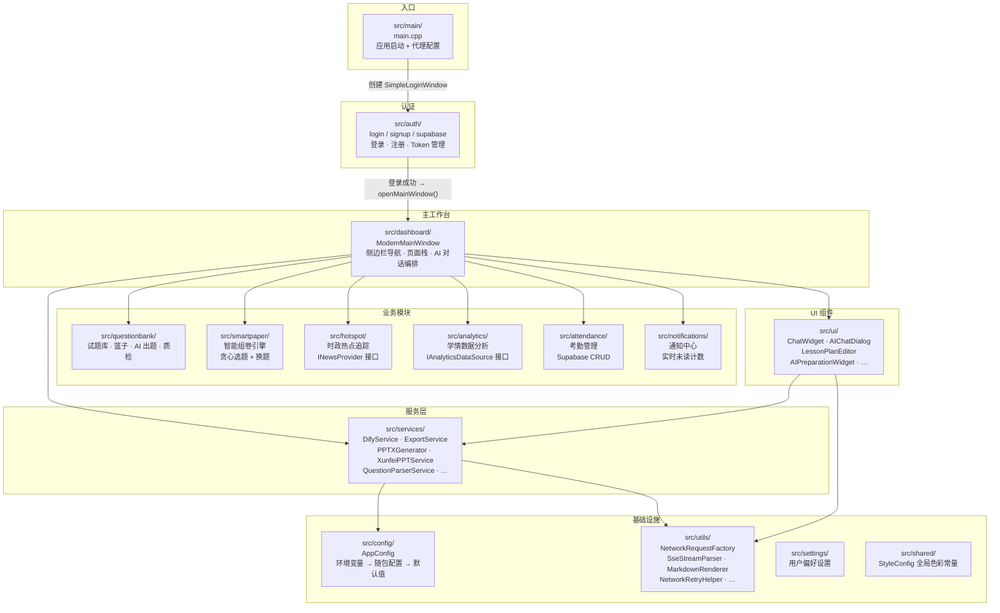

本文是 **AI 思政智慧课堂系统** 的目录结构与模块职责全景地图。你将看到每个顶层目录和 `src/` 下每个子模块的存在理由、核心类名、以及它们之间的依赖关系。这份速查旨在帮助你在首次接触代码时，**30 秒内定位到目标文件**，并为后续阅读 [分层架构总览：UI 层 → 服务层 → 网络与工具层](5-fen-ceng-jia-gou-zong-lan-ui-ceng-fu-wu-ceng-wang-luo-yu-gong-ju-ceng) 等深入文档打下基础。

Sources: [CMakeLists.txt](CMakeLists.txt#L1-L197), [CLAUDE.md](CLAUDE.md#L1-L116), [main.cpp](src/main/main.cpp#L1-L132)

---

## 顶层目录一览

```
AItechnology/
├── src/                  # ★ 全部 C++ 源代码（按业务领域分子目录）
├── resources/            # 图标、图片、QSS 样式表、QML、PPT 模板等静态资源
├── third_party/          # 第三方库（目前仅 md4c — Markdown 解析器）
├── scripts/              # 打包脚本（macOS DMG、Windows Inno Setup）
├── .github/workflows/    # GitHub Actions CI/CD（macOS + Windows 构建）
├── docs/                 # SQL 初始化脚本等辅助文档
├── CMakeLists.txt        # ★ 项目构建入口，定义 Qt 模块依赖与编译目标
├── resources.qrc         # Qt 资源描述文件（图标、样式、主题的资源前缀映射）
└── .env.example          # 环境变量模板（API Key 等，不提交 Git）
```

下表对每个顶层目录的核心职责做快速定位：

| 目录 / 文件 | 职责 | 你什么时候会来这里 |
|---|---|---|
| `src/` | 所有 C++ 业务代码 | 开发任何功能 |
| `resources/` | SVG 图标、QSS 样式、PPT 模板、JSON 数据 | 添加图标或修改 UI 样式 |
| `third_party/md4c/` | C 语言 Markdown→HTML 解析库 | 修改 Markdown 渲染行为 |
| `scripts/` | `package_app.sh`（macOS）、`package_windows.ps1` + `windows-installer.iss` | 制作安装包 |
| `.github/workflows/` | `build-macos.yml`、`build-windows.yml` | 配置 CI/CD 或排查构建失败 |
| `CMakeLists.txt` | 定义 `AILoginSystem` 可执行目标、Qt 模块依赖 | 添加新源文件或 Qt 模块 |
| `resources.qrc` | Qt 资源系统的前缀映射 | 注册新的图标或样式文件 |

Sources: [CMakeLists.txt](CMakeLists.txt#L1-L14), [resources.qrc](resources.qrc#L1-L67)

---

## src/ 模块架构总览

项目采用**按业务领域划分目录**的组织方式。每个子目录内部通常遵循 `模型 → 服务 → UI` 三层结构。下图展示了所有 `src/` 子模块及其在应用启动链中的位置：



> **阅读提示**：箭头方向表示"创建或依赖"关系。从 `main.cpp` 出发，沿箭头即可追溯整个应用的启动和模块加载链路。

Sources: [main.cpp](src/main/main.cpp#L68-L131), [modernmainwindow.h](src/dashboard/modernmainwindow.h#L34-L60)

---

## 各子模块职责详解

### src/main/ — 程序入口

| 文件 | 职责 |
|---|---|
| `main.cpp` | 初始化 `QApplication`，设置全局调色板（爱国红主题色 `#E53935`），配置网络代理（从 `https_proxy` 环境变量读取），创建并显示 `SimpleLoginWindow` |

启动流程一句话概括：`main()` → `SimpleLoginWindow`（登录窗口） → 登录成功后 `openMainWindow()` → `ModernMainWindow`（主工作台）。

Sources: [main.cpp](src/main/main.cpp#L68-L131)

---

### src/auth/ — 用户认证模块

```
src/auth/
├── login/        # SimpleLoginWindow — 登录窗口（含记住我、密码重置）
├── signup/       # SignupWindow — 注册窗口
└── supabase/     # SupabaseClient + SupabaseConfig — Supabase REST API 通信
```

**核心链路**：`SimpleLoginWindow` 内部持有 `SupabaseClient`，通过 Supabase 的 `/auth/v1/token` 端点完成登录。登录成功后通过信号将 `userId`、`email` 传递给 `openMainWindow()` 创建主界面。注册窗口 `SignupWindow` 同样调用 `SupabaseClient` 的注册方法。

Sources: [simpleloginwindow.h](src/auth/login/simpleloginwindow.h#L24-L103)

---

### src/dashboard/ — 主工作台

```
src/dashboard/
├── modernmainwindow.h/cpp       # ModernMainWindow — 主窗口（QMainWindow）
├── ChatManager.h/cpp            # AI 对话会话管理
├── SidebarManager.h/cpp         # 侧边栏导航逻辑
└── modernmainwindow.ui          # Qt Designer 布局文件
```

**ModernMainWindow** 是整个应用的核心编排者。它内部持有所有业务模块的 UI 组件指针（试题库、热点追踪、数据分析、考勤、通知等），通过 `QStackedWidget` 实现侧边栏导航的页面切换。同时管理 AI 对话组件（`DifyService` + `ChatWidget`）和 PPT 生成流程（`PPTXGenerator`）。

侧边栏导航按钮对应关系：

| 按钮 | 槽函数 | 切换到的页面组件 |
|---|---|---|
| 教师中心 | `onTeacherCenterClicked()` | 仪表板（欢迎卡片 + 快捷入口） |
| 时政新闻 | `onNewsTrackingClicked()` | `HotspotTrackingWidget` |
| AI 智能备课 | `onAIPreparationClicked()` | `AIPreparationWidget` + `ChatWidget` |
| 资源库管理 | `onResourceManagementClicked()` | `QuestionBankWindow` |
| 学情与教评 | `onLearningAnalysisClicked()` | `DataAnalyticsWidget` |
| 考勤管理 | `onAttendanceClicked()` | `AttendanceWidget` |
| 系统设置 | `onSettingsClicked()` | `UserSettingsDialog` |

Sources: [modernmainwindow.h](src/dashboard/modernmainwindow.h#L51-L243)

---

### src/services/ — 服务层（业务逻辑与外部 API 通信）

这是项目中**文件数量最多、职责最杂**的目录，集中了所有与外部服务交互和文档生成的核心逻辑：

| 服务类 | 职责 | 依赖的外部服务 |
|---|---|---|
| `DifyService` | SSE 流式 AI 对话（`/chat-messages` 端点），会话管理 | Dify Cloud API |
| `QuestionParserService` | 文档解析 → AI 工作流调用生成试题 | Dify Workflow API |
| `QuestionQualityService` | 试题质量评估 | Dify API |
| `PaperService` | 试卷搜索（Supabase 题库查询） | Supabase REST |
| `ExportService` | 试卷导出为 HTML / DOCX / PDF | 本地文件系统 |
| `DocxGenerator` | 纯 C++ 生成 .docx 文件（XML + ZIP） | — |
| `PPTXGenerator` | 纯 C++ 生成 .pptx 文件（XML + ZIP） | — |
| `XunfeiPPTService` | 讯飞智文 API 生成 PPT | 讯飞开放平台 |
| `ZhipuPPTAgentService` | 智谱 Agent 服务生成 PPT | 智谱 API |
| `HotspotService` | 时政热点数据获取 | 天行数据 API |
| `CurriculumService` | 课程标准数据加载 | 本地 JSON |
| `BulkImportService` | 批量导入试题 | Supabase |
| `SupabaseStorageService` | Supabase 对象存储操作 | Supabase Storage |
| `DocumentReaderService` | 文档内容读取（DOCX/PDF） | 本地文件 |

Sources: [DifyService.h](src/services/DifyService.h#L18-L177), [ExportService.h](src/services/ExportService.h#L1-L41), [XunfeiPPTService.h](src/services/XunfeiPPTService.h#L17-L114)

---

### src/questionbank/ — 试题库管理

```
src/questionbank/
├── questionbankwindow.h/cpp       # 试题库主窗口
├── QuestionRepository.h/cpp       # 题目仓库（本地数据管理）
├── QuestionBasket.h/cpp           # 题目篮子（选中题目集合）
├── QuestionBasketWidget.h/cpp     # 篮子 UI 组件
├── AIQuestionGenWidget.h/cpp      # AI 智能出题页面
├── PaperComposerDialog.h/cpp      # 手动组卷对话框
├── QualityCheckDialog.h/cpp       # 质量检查对话框
└── CurriculumData.h               # 课程标准数据结构
```

这个模块覆盖了试题管理的完整生命周期：**题目录入 → AI 出题 → 选入篮子 → 质量检查 → 组卷 → 导出**。其中 `AIQuestionGenWidget` 调用 `QuestionParserService` 实现 AI 出题，`QualityCheckDialog` 调用 `QuestionQualityService` 进行质量评估。

Sources: [CMakeLists.txt](CMakeLists.txt#L31-L45)

---

### src/smartpaper/ — 智能组卷引擎

```
src/smartpaper/
├── SmartPaperConfig.h     # 组卷配置数据结构 + 结果模型
├── SmartPaperService.h/cpp # 贪心选题算法核心
└── SmartPaperWidget.h/cpp  # 智能组卷 UI 交互
```

**SmartPaperService** 实现了分阶段贪心选题算法：按题型分批从云端题库搜索候选题，对每道候选题计算多维度评分（章节覆盖率、知识点覆盖、难度匹配），然后选出最优组合。支持"换一题"操作，从候选池中替换不满意的单题。

Sources: [SmartPaperService.h](src/smartpaper/SmartPaperService.h#L18-L80)

---

### src/hotspot/ — 时政热点追踪

```
src/hotspot/
├── INewsProvider.h         # ★ 新闻提供者抽象接口
├── NewsItem.h              # 新闻数据模型
├── NewsCategoryUtils.h/cpp # 新闻分类工具
├── MockNewsProvider.h/cpp  # Mock 数据源（开发测试用）
└── RealNewsProvider.h/cpp  # 真实数据源（天行数据 API）
```

这是项目中**接口抽象模式**的典型范例：`INewsProvider` 定义了 `fetchHotNews`、`searchNews`、`fetchNewsDetail` 三个纯虚方法，`MockNewsProvider` 提供本地假数据，`RealNewsProvider` 对接外部 API。上层 `HotspotService` 通过接口指针切换数据源，无需修改调用方代码。

Sources: [INewsProvider.h](src/hotspot/INewsProvider.h#L20-L81)

---

### src/analytics/ — 学情数据分析

```
src/analytics/
├── AnalyticsDataService.h/cpp    # 数据分析服务（协调层）
├── DataAnalyticsWidget.h/cpp     # 数据分析主页面
├── interfaces/
│   └── IAnalyticsDataSource.h    # ★ 数据源抽象接口
├── models/                       # 数据模型：Student、CourseClass、ScoreRecord、KnowledgePoint 等
├── datasources/
│   └── MockDataSource.h/cpp      # Mock 数据源实现
└── ui/                           # 可视化组件：雷达图、知识图谱、个人/班级分析页
```

遵循与 `hotspot` 相同的接口抽象模式：`IAnalyticsDataSource` 定义数据获取标准接口，`MockDataSource` 提供开发测试数据。UI 层包含雷达图（`RadarChartWidget`）、知识图谱（`KnowledgeGraphWidget`）等自定义可视化组件。

Sources: [IAnalyticsDataSource.h](src/analytics/interfaces/IAnalyticsDataSource.h#L18-L48), [CMakeLists.txt](CMakeLists.txt#L101-L134)

---

### src/attendance/ — 考勤管理

```
src/attendance/
├── models/
│   ├── AttendanceRecord.h/cpp    # 考勤记录模型
│   ├── AttendanceStatus.h        # 考勤状态枚举
│   └── AttendanceSummary.h       # 考勤汇总统计
├── services/
│   └── AttendanceService.h/cpp   # Supabase CRUD 服务
└── ui/
    └── AttendanceWidget.h/cpp    # 考勤管理 UI
```

标准的**模型 → 服务 → UI** 三层结构。`AttendanceService` 封装了对 Supabase 数据库的增删改查操作。

Sources: [CMakeLists.txt](CMakeLists.txt#L144-L151)

---

### src/notifications/ — 通知中心

```
src/notifications/
├── models/
│   └── Notification.h/cpp        # 通知数据模型
├── NotificationService.h/cpp     # 通知服务（Supabase 实时订阅）
└── ui/
    ├── NotificationWidget.h/cpp   # 通知列表下拉面板
    └── NotificationBadge.h/cpp    # 未读计数红点
```

`NotificationBadge` 是嵌入在主窗口顶部工具栏的小红点组件，实时显示未读通知数量。`NotificationWidget` 是点击后展开的通知列表面板。

Sources: [modernmainwindow.h](src/dashboard/modernmainwindow.h#L168-L178)

---

### src/ui/ — 通用 UI 组件

```
src/ui/
├── AIPreparationWidget.h/cpp      # AI 智能备课页面（主页之一）
├── ChatWidget.h/cpp               # 气泡样式聊天组件
├── AIChatDialog.h/cpp             # AI 对话弹窗（备用）
├── ChatHistoryWidget.h/cpp        # 对话历史记录侧边栏
├── LessonPlanEditor.h/cpp         # 教案富文本编辑器
├── HotspotTrackingWidget.h/cpp    # 时政热点页面
├── pptpreviewpage.h/cpp           # PPT 预览页面
├── NetworkImageTextBrowser.h/cpp  # 支持网络图片的文本浏览器
├── moderncheckbox.h/cpp           # 自定义复选框组件
└── macosquicklookpreview.h/.mm    # macOS Quick Look 原生预览（Objective-C++）
```

这些是**跨模块复用**的 UI 组件。其中 `ChatWidget` 是应用的核心交互入口之一，负责渲染 AI 流式回复气泡、Markdown 内容、以及输入框。

Sources: [CMakeLists.txt](CMakeLists.txt#L51-L88)

---

### src/config/ — 统一配置

| 文件 | 职责 |
|---|---|
| `AppConfig.h/cpp` | 统一配置读取器，按优先级查找：环境变量 → 随包 `config.env` → `.env.local` → 编译时默认值 |
| `embedded_keys.h` | 编译时 API Key 头文件（发布版由 CI 从 Secrets 生成） |
| `embedded_keys.h.example` | 开发环境模板（不含真实密钥） |

Sources: [AppConfig.h](src/config/AppConfig.h#L19-L39)

---

### src/utils/ — 工具与基础设施

| 工具类 | 职责 |
|---|---|
| `NetworkRequestFactory` | 统一创建 `QNetworkRequest`，全局禁用 HTTP/2、配置 SSL 策略和超时 |
| `NetworkRetryHelper` | 指数退避重试策略，支持可配置错误码列表 |
| `SseStreamParser` | 纯协议层 SSE 解析器（不持有网络连接），将字节流解析为 `(event, JSON)` 对 |
| `MarkdownRenderer` | 基于 md4c 的 Markdown → HTML 渲染引擎 |
| `SimpleZipWriter` | 纯 C++ 最小化 ZIP 文件写入器（用于生成 .docx/.pptx） |
| `FailedTaskTracker` | 失败任务追踪与统计 |
| `LayoutUtils.h` | 布局辅助工具（header-only） |

Sources: [SseStreamParser.h](src/utils/SseStreamParser.h#L26-L178), [NetworkRequestFactory.h](src/utils/NetworkRequestFactory.h#L1-L1)

---

### src/shared/ — 全局共享定义

```
src/shared/
├── StyleConfig.h          # 全局色彩常量（爱国红、成功绿、信息蓝等）+ 圆角半径 + 卡片样式模板
└── resources/
    ├── fonts/             # 内嵌字体文件
    ├── stylesheet.qss     # 全局 QSS 样式表
    └── download.png       # 共享图片资源
```

`StyleConfig.h` 是整个应用的**视觉一致性锚点**：所有 UI 组件的色彩值和圆角半径都从这里引用，避免硬编码。

Sources: [StyleConfig.h](src/shared/StyleConfig.h#L1-L55)

---

## resources/ — 静态资源

```
resources/
├── icons/           # 60+ SVG 图标（sidebar 导航、操作按钮等）
├── images/          # PNG 图片（banner、密码可见性切换等）
├── styles/          # QSS 样式表（auth.qss、question_bank.qss、ChatWidget.qss、qt_theme_safe.qss）
├── QtTheme/         # Qt 主题引擎资源（多色 SVG 图标集）
├── data/            # JSON 数据（课程标准、示例题目）
├── ppt/             # PPT 模板文件
├── templates/       # PPT 模板（党建红色模板）
└── qml/             # QML 组件（LearningAnalyticsCard.qml）
```

所有资源通过 `resources.qrc` 注册到 Qt 资源系统，运行时通过 `:/icons/xxx.svg`、`:/styles/xxx.qss` 等 **资源前缀路径** 访问。

Sources: [resources.qrc](resources.qrc#L1-L67)

---

## scripts/ 与 CI/CD

| 文件 | 用途 |
|---|---|
| `scripts/package_app.sh` | macOS 完整打包流程：CMake 构建 → `macdeployqt` 部署 → 生成 `config.env` → 创建 DMG |
| `scripts/package_windows.ps1` | Windows 打包 PowerShell 脚本 |
| `scripts/windows-installer.iss` | Inno Setup 安装包定义 |
| `.github/workflows/build-macos.yml` | Tag 触发 → Qt 6.6.2 安装 → 构建 → 密钥内嵌 → DMG 上传 + GitHub Release |
| `.github/workflows/build-windows.yml` | Windows 平台 CI/CD |

Sources: [build-macos.yml](.github/workflows/build-macos.yml#L1-L92), [package_app.sh](scripts/package_app.sh#L1-L200)

---

## third_party/ — 第三方依赖

| 库 | 路径 | 用途 |
|---|---|---|
| **md4c** | `third_party/md4c/` | C 语言 Markdown 解析库，被 `MarkdownRenderer` 调用，将 Markdown 文本转为 HTML |

md4c 以源码形式直接编译进项目，无需额外安装。其 `CMakeLists.txt` 被主 `CMakeLists.txt` 通过 `add_subdirectory` 引入（如需确认请查看构建配置）。

Sources: [CMakeLists.txt](third_party/md4c/CMakeLists.txt#L1-L1)

---

## 快速定位指南：我想修改 XX，应该去哪里？

| 我想… | 去这个目录/文件 |
|---|---|
| 修改登录页面的 UI | `src/auth/login/simpleloginwindow.cpp` + `resources/styles/auth.qss` |
| 添加新的侧边栏导航页面 | `src/dashboard/modernmainwindow.h/cpp`（添加按钮 + QStackedWidget 页面） |
| 调用新的 AI API | `src/services/` 下新建 Service 类，参考 `DifyService` 的 SSE 模式 |
| 修改全局配色方案 | `src/shared/StyleConfig.h` |
| 添加新的试题类型 | `src/questionbank/QuestionRepository.h` + 相关 Widget |
| 修改组卷算法 | `src/smartpaper/SmartPaperService.cpp` |
| 添加新的数据源（如真实数据库） | 实现对应模块的接口（`INewsProvider`、`IAnalyticsDataSource`） |
| 修改 AI 对话的 SSE 解析逻辑 | `src/utils/SseStreamParser.h` |
| 调整网络请求的全局设置 | `src/utils/NetworkRequestFactory.cpp` |
| 添加新的 SVG 图标 | `resources/icons/` → 注册到 `resources.qrc` |
| 修改打包流程 | `scripts/package_app.sh` 或 `.github/workflows/` |
| 配置 API Key | `.env` 文件或 `src/config/embedded_keys.h` |

---

## 推荐阅读顺序

作为初学者，建议按以下路径深入理解项目：

1. 📍 **当前位置**：[项目目录结构与模块职责速查](3-xiang-mu-mu-lu-jie-gou-yu-mo-kuai-zhi-ze-su-cha) — 建立全局地图
2. → [环境变量与密钥配置指南](4-huan-jing-bian-liang-yu-mi-yao-pei-zhi-zhi-nan-env-appconfig-embedded_keys) — 理解配置加载优先级
3. → [分层架构总览](5-fen-ceng-jia-gou-zong-lan-ui-ceng-fu-wu-ceng-wang-luo-yu-gong-ju-ceng) — 掌握三层架构设计
4. → [主工作台 ModernMainWindow](6-zhu-gong-zuo-tai-modernmainwindow-dao-hang-ye-mian-zhan-yu-mo-kuai-bian-pai) — 理解页面编排机制
5. → 根据你的工作方向，选择对应业务模块的深入文档继续阅读