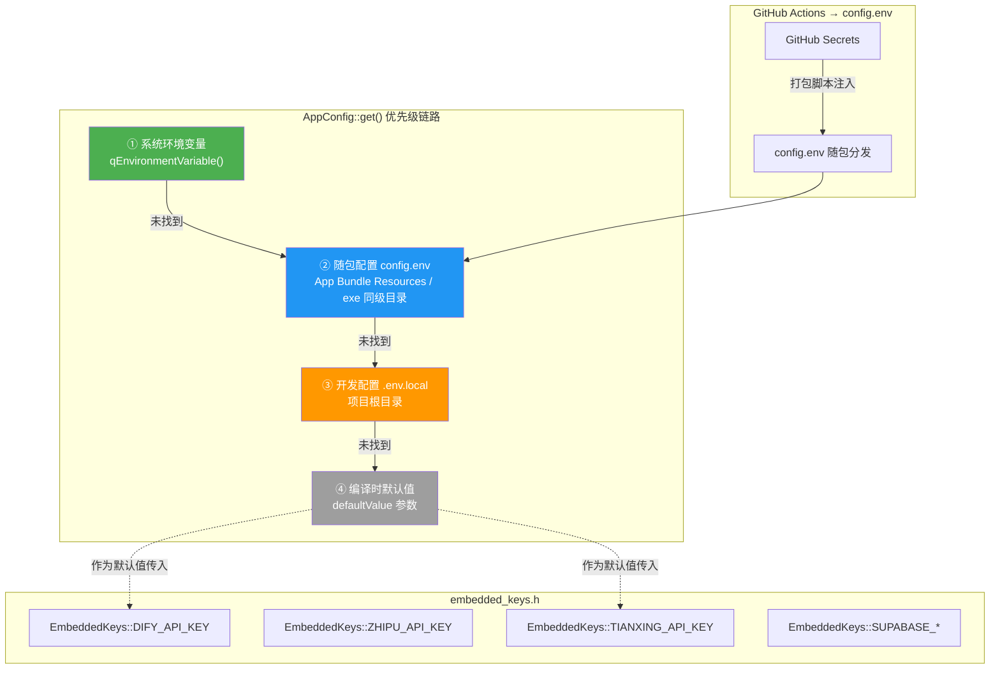
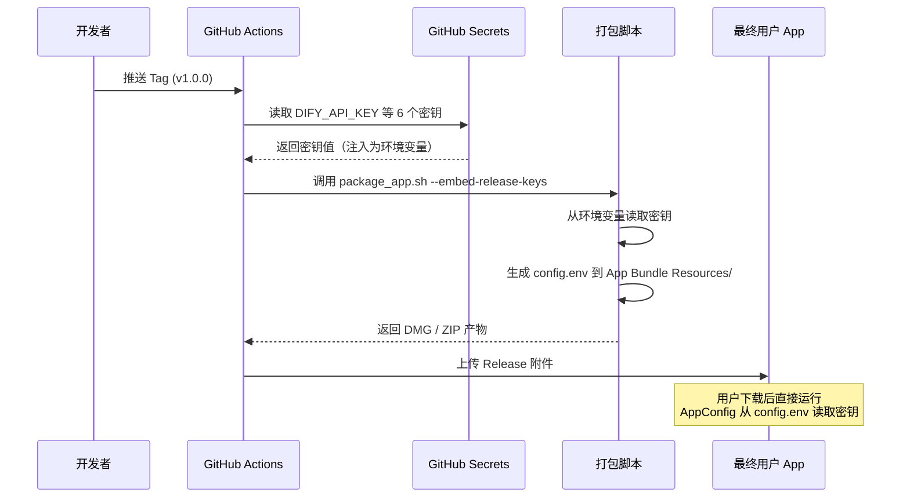

本页系统性地介绍 AI 思政智慧课堂项目中的**配置与密钥管理体系**。项目涉及 Dify AI、智谱 AI、天行数据、Supabase 等多个外部服务，每个服务都需要 API Key 才能工作。为了让开发环境和发布版本都能安全、便捷地获取密钥，项目设计了**三层优先级的统一加载机制**——从环境变量、到运行时配置文件、再到编译时内嵌常量，逐级回退，确保任何场景下都能找到可用的配置值。

Sources: [AppConfig.h](src/config/AppConfig.h#L1-L42), [AppConfig.cpp](src/config/AppConfig.cpp#L1-L142)

## 配置体系全景

项目使用三个互相协作的配置组件，共同构成一套优先级递减的加载链路。理解这三者的关系，是正确配置开发环境和排查密钥缺失问题的前提。



Sources: [AppConfig.cpp L58-L91](src/config/AppConfig.cpp#L58-L91)

## 三个配置组件详解

### `.env.example` / `.env.local` — 开发环境密钥模板

`.env.example` 是密钥的**模板文件**（已提交到 Git），列出了项目运行所需的全部环境变量名称和占位符。开发者首次搭建环境时，需要复制它为 `.env.local` 并填入真实值。`.env.local` 文件已被 `.gitignore` 排除，不会被提交到版本控制。

**`.env.example` 包含的配置项：**

| 变量名 | 用途 | 必需性 | 获取来源 |
|--------|------|--------|----------|
| `DIFY_API_KEY` | Dify AI 对话服务的主 API Key | 必需 | Dify 控制台 → 应用 → API 访问 |
| `PARSER_API_KEY` | 文档解析专用 Dify 应用 Key | 可选（缺省回退到 DIFY_API_KEY） | Dify 控制台 |
| `SUPABASE_URL` | Supabase 项目 URL | 必需 | Supabase 项目设置 → API |
| `SUPABASE_ANON_KEY` | Supabase 匿名访问 Key | 必需 | Supabase 项目设置 → API |
| `SUPABASE_SERVICE_KEY` | Supabase 服务端 Key（高危） | 可选 | Supabase 项目设置 → API |

Sources: [.env.example](.env.example#L1-L21), [.gitignore L127-L134](.gitignore#L127-L134)

### `AppConfig` — 统一配置读取器

`AppConfig` 是整个项目的**配置中心**，所有服务模块都通过 `AppConfig::get("KEY_NAME")` 获取配置值，而不是直接读取文件或环境变量。它的核心设计是一个**四级优先级查找链**：

**优先级 1：系统环境变量**——直接调用 `qEnvironmentVariable()`，适用于 CI/CD 流水线或通过命令行 `export DIFY_API_KEY=xxx` 设置的场景。

**优先级 2：随包配置 `config.env`**——发布版本专用的运行时配置文件。在 macOS 上查找 `AILoginSystem.app/Contents/MacOS/config.env` 和 `Contents/Resources/config.env`；在 Windows 上查找 exe 同级目录的 `config.env`。该文件由打包脚本在构建时从 GitHub Secrets 生成。

**优先级 3：开发环境 `.env.local`**——开发者本地专用，`AppConfig` 会从多个候选路径（当前工作目录、从构建输出目录反推的项目根目录、源码文件相对路径）搜索此文件。

**优先级 4：`defaultValue` 参数**——调用方提供的编译时默认值，例如 `AppConfig::get("ZHIPU_API_KEY", EmbeddedKeys::ZHIPU_API_KEY)`。

所有文件解析结果通过 `QHash<QString, QHash<QString, QString>>` 进行**内存缓存**，同一文件只读取一次，后续调用直接查缓存。

Sources: [AppConfig.h](src/config/AppConfig.h#L1-L42), [AppConfig.cpp L14-L52](src/config/AppConfig.cpp#L14-L52), [AppConfig.cpp L58-L91](src/config/AppConfig.cpp#L58-L91), [AppConfig.cpp L102-L141](src/config/AppConfig.cpp#L102-L141)

### `embedded_keys.h` — 编译时内嵌常量

`embedded_keys.h` 是一个 C++ 头文件，在 `EmbeddedKeys` 命名空间下以 `inline const char*` 定义了所有 API Key 的**编译时默认值**。它的设计意图是为发布版本提供开箱即用的密钥，但在当前实践中，大部分 Key 已迁移到运行时 `config.env` 方案，该文件仅作为 `AppConfig::get()` 的 `defaultValue` 参数使用。

**当前 `embedded_keys.h` 中的常量：**

| 常量名 | 当前值 | 用途 |
|--------|--------|------|
| `DIFY_API_KEY` | 空字符串 `""` | Dify AI 对话服务 |
| `TIANXING_API_KEY` | 空字符串 `""` | 天行数据时政新闻 API |
| `SUPABASE_URL` | 空字符串 `""` | Supabase 项目地址 |
| `SUPABASE_ANON_KEY` | 空字符串 `""` | Supabase 匿名访问 Key |
| `ZHIPU_API_KEY` | 已填写真实值 | 智谱 AI 试题生成 |
| `ZHIPU_BASE_URL` | 已填写真实值 | 智谱 API 端点地址 |

⚠️ **安全提示**：`embedded_keys.h` 文件已被 `.gitignore` 排除，但 `embedded_keys.h.example`（空值模板）已提交到 Git。永远不要在真实密钥文件被提交到版本控制——这一点通过 `.gitignore` 规则保障。

Sources: [embedded_keys.h](src/config/embedded_keys.h#L1-L21), [embedded_keys.h.example](src/config/embedded_keys.h.example#L1-L18), [.gitignore L134](.gitignore#L134)

## 开发者快速配置步骤

### 第一步：创建本地密钥文件

```bash
# 在项目根目录下执行
cp .env.example .env.local
```

### 第二步：填写必需的 API Key

用文本编辑器打开 `.env.local`，将占位符替换为真实值：

```
DIFY_API_KEY=app-xxxxxxxxxxxxxxxx
SUPABASE_URL=https://xxxxx.supabase.co
SUPABASE_ANON_KEY=eyJhbGciOiJIUzI1NiIs...
```

### 第三步：创建编译时密钥文件（可选）

如果你希望某些 Key 在编译时就可用（作为 `AppConfig` 查找的最终回退值），还需要创建 `embedded_keys.h`：

```bash
cp src/config/embedded_keys.h.example src/config/embedded_keys.h
```

然后填入需要的值。**注意**：此文件已被 `.gitignore` 排除，不会被提交。

### 第四步：构建并验证

正常构建项目即可。启动后在终端/控制台查看日志输出，确认 Key 加载情况：

```
[Info] Dify API Key loaded from environment variable.    # 来自环境变量
[Info] Dify API Key loaded from .env.local               # 来自本地配置文件
[Info] Dify API Key loaded from embedded keys.            # 来自编译时内嵌
[Warning] No API Key found. AI features will be disabled. # 所有来源均失败
```

Sources: [modernmainwindow.cpp L814-L849](src/dashboard/modernmainwindow.cpp#L814-L849)

## 全部配置键速查表

以下是项目中所有通过 `AppConfig::get()` 或环境变量使用的配置键，按功能模块分类：

### AI 对话与生成

| 配置键 | 使用位置 | 说明 |
|--------|----------|------|
| `DIFY_API_KEY` | DifyService、QuestionBankWindow、ModernMainWindow | Dify AI 主对话服务 Key |
| `PARSER_API_KEY` | QuestionBankWindow | 文档解析专用 Key，缺省回退到 `DIFY_API_KEY` |
| `DIFY_QUESTION_GEN_API_KEY` | QuestionBankWindow | 试题生成专用 Key，第三回退选项 |
| `PARSER_API_BASE_URL` | QuestionBankWindow | 自定义解析器 API 端点 |
| `ZHIPU_API_KEY` | AIQuestionGenWidget | 智谱 AI 试题生成 Key |
| `ZHIPU_QUESTION_API_KEY` | AIQuestionGenWidget | 智谱试题生成专用 Key（优先于 ZHIPU_API_KEY） |
| `ZHIPU_BASE_URL` | AIQuestionGenWidget | 智谱 API 端点地址 |
| `TIANXING_API_KEY` | RealNewsProvider、ModernMainWindow | 天行数据时政新闻 API Key |

### 后端服务

| 配置键 | 使用位置 | 说明 |
|--------|----------|------|
| `SUPABASE_URL` | SupabaseConfig | Supabase 项目 URL |
| `SUPABASE_ANON_KEY` | SupabaseConfig | Supabase 匿名访问 Key（登录、通知、存储） |
| `SUPABASE_SERVICE_KEY` | SupabaseConfig | Supabase 服务端角色 Key（管理操作） |

### 网络代理（系统环境变量）

| 配置键 | 使用位置 | 说明 |
|--------|----------|------|
| `https_proxy` / `HTTPS_PROXY` | main.cpp | HTTPS 代理地址 |
| `http_proxy` / `HTTP_PROXY` | main.cpp | HTTP 代理地址（回退选项） |

Sources: [questionbankwindow.cpp L56-L68](src/questionbank/questionbankwindow.cpp#L56-L68), [AIQuestionGenWidget.cpp L278-L296](src/questionbank/AIQuestionGenWidget.cpp#L278-L296), [supabaseconfig.cpp](src/auth/supabase/supabaseconfig.cpp#L1-L27), [RealNewsProvider.cpp L141-L142](src/hotspot/RealNewsProvider.cpp#L141-L142), [main.cpp L40-L65](src/main/main.cpp#L40-L65)

## 发布版本的密钥注入流程

发布版本不需要用户手动配置任何 API Key，密钥通过 **GitHub Actions + 打包脚本** 在构建时自动注入：



**关键环节说明**：GitHub Actions 工作流将 `secrets.DIFY_API_KEY`、`secrets.TIANXING_API_KEY` 等 6 个密钥注入为环境变量。打包脚本通过 `--embed-release-keys` 标志识别到这些环境变量后，生成 `config.env` 文件并放入 App Bundle（macOS 放在 `Contents/Resources/`，Windows 放在 exe 同级目录）。运行时 `AppConfig` 在优先级 2 即可找到这些值。

Sources: [build-macos.yml L59-L73](.github/workflows/build-macos.yml#L59-L73), [build-windows.yml L67-L77](.github/workflows/build-windows.yml#L67-L77), [package_app.sh L135-L157](scripts/package_app.sh#L135-L157), [package_windows.ps1 L97-L127](scripts/package_windows.ps1#L97-L127)

## 常见问题排查

| 症状 | 可能原因 | 排查方法 |
|------|----------|----------|
| AI 对话无响应，控制台显示 `No API Key found` | `.env.local` 不存在或 Key 为空 | 检查项目根目录是否有 `.env.local`，确认 `DIFY_API_KEY=` 后有值 |
| 登录窗口无法连接 Supabase | `SUPABASE_URL` 或 `SUPABASE_ANON_KEY` 未配置 | 在 `.env.local` 中补充这两个值 |
| 时政新闻显示旧数据 | `TIANXING_API_KEY` 未设置 | 应用会自动回退到 RSS 源，但数据可能较旧 |
| 构建报错找不到 `embedded_keys.h` | 未从模板创建该文件 | 执行 `cp src/config/embedded_keys.h.example src/config/embedded_keys.h` |
| 发布版本功能缺失 | `config.env` 未随包生成 | 确认打包时使用了 `--embed-release-keys` 参数 |
| 网络请求全部失败 | 代理配置不正确 | 检查 `HTTPS_PROXY` 环境变量是否指向可用的代理地址 |

## 安全约定与最佳实践

项目在密钥安全方面采取了以下防护措施，开发者在协作时务必遵守：

**1. 文件级保护**：`.env`、`.env.local`、`.env.production`、`embedded_keys.h` 均已在 `.gitignore` 中排除。无论使用哪种 Git 客户端，都应确认这些文件不出现在提交列表中。

**2. 模板与实际分离**：`.env.example` 和 `embedded_keys.h.example` 是安全的模板文件（不含真实值），已提交到 Git 供团队参考。真实密钥文件永远留在本地。

**3. 发布密钥托管于 GitHub Secrets**：CI/CD 流水线中的密钥存储在 GitHub 仓库的 Secrets 设置中，只有仓库管理员可以配置，日志中不会明文输出。

**4. 代码中避免硬编码**：所有 API Key 都应通过 `AppConfig::get()` 读取。少数历史代码（如 `ModernMainWindow` 中）直接使用 `qgetenv()` 读取环境变量，这些代码也在逐步迁移到统一使用 `AppConfig`。

Sources: [.gitignore L126-L136](.gitignore#L126-L136), [CLAUDE.md](CLAUDE.md)

## 下一步阅读

掌握了配置体系后，建议继续阅读以下页面，深入了解配置加载的具体实现和构建流程：

- [统一配置加载机制 AppConfig：环境变量 → 随包配置 → 开发配置](7-tong-pei-zhi-jia-zai-ji-zhi-appconfig-huan-jing-bian-liang-sui-bao-pei-zhi-kai-fa-pei-zhi) — 深入分析 `AppConfig` 的实现细节、缓存策略和路径解析逻辑
- [GitHub Actions 自动发布：Tag 触发、密钥内嵌与产物上传](27-github-actions-zi-dong-fa-bu-tag-hong-fa-mi-yao-nei-qian-yu-chan-wu-shang-chuan) — 完整的 CI/CD 流水线工作原理
- [快速上手：环境准备与首次构建运行](2-kuai-su-shang-shou-huan-jing-zhun-bei-yu-shou-ci-gou-jian-yun-xing) — 从零开始搭建开发环境的完整教程