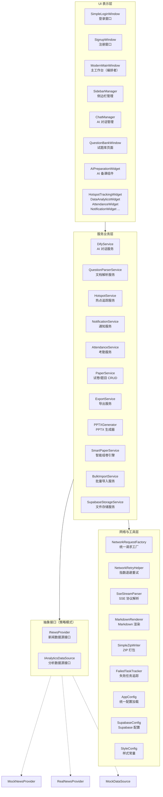
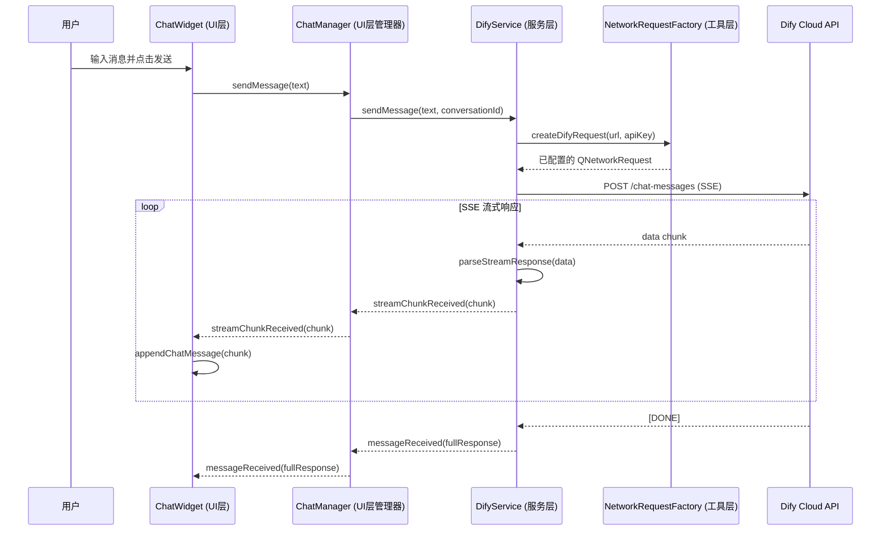

**AI 思政智慧课堂系统**采用经典的**三层分离架构**，将应用拆分为 **UI 表示层**、**服务业务层**和**网络与工具基础设施层**。每一层职责边界清晰，层间通过 Qt 的信号/槽机制进行松耦合通信，使得任何一层的内部重构都不会波及相邻层。本文将从全局视角剖析这三层的划分依据、通信契约与关键设计模式，帮助你在深入各模块细节之前建立完整的架构心智模型。

Sources: [CMakeLists.txt](CMakeLists.txt#L1-L163), [modernmainwindow.cpp](src/dashboard/modernmainwindow.cpp#L1-L66)

---

## 架构全景图

在理解每一层之前，先通过下图建立对整体分层结构的直觉。图中箭头表示**依赖方向**——上层可以调用下层，下层绝不反向依赖上层。虚线表示"可选替换"的接口策略模式。



Sources: [modernmainwindow.cpp](src/dashboard/modernmainwindow.cpp#L758-L888), [modernmainwindow.h](src/dashboard/modernmainwindow.h#L1-L200)

---

## 三层职责划分

| 层次 | 核心职责 | 标识特征 | 典型目录 |
|------|---------|---------|---------|
| **UI 表示层** | 渲染界面、捕获用户操作、展示数据状态 | 继承 `QWidget`/`QMainWindow`，持有 UI 控件指针 | `src/ui/`、`src/dashboard/`、`src/auth/login/`、`*/ui/` |
| **服务业务层** | 封装业务逻辑、管理应用状态、编排工作流 | 继承 `QObject`，定义信号/槽 API，持有 `QNetworkAccessManager` | `src/services/`、`src/auth/supabase/`、`src/hotspot/`、`src/smartpaper/` |
| **网络与工具层** | 提供无状态工具函数、协议解析、配置管理 | 纯静态类或无状态工具类，不持有业务数据 | `src/utils/`、`src/config/`、`src/shared/` |

Sources: [CMakeLists.txt](CMakeLists.txt#L15-L163)

### 依赖方向铁律

三层之间遵循**严格单向依赖**：UI 层 → 服务层 → 工具层。具体表现为：

- **UI 层**创建并持有 Service 实例，通过信号/槽接收业务数据更新
- **服务层**使用 NetworkRequestFactory 创建请求、用 SseStreamParser 解析协议、用 AppConfig 读取密钥——但绝不 `#include` 任何 QWidget 头文件
- **工具层**完全无感知上层业务，所有组件均可独立单元测试

这一规则在代码中的体现极为清晰：`src/utils/` 下没有任何文件引入 `QWidget`，`src/services/` 下没有任何文件引入具体 UI 组件。

Sources: [NetworkRequestFactory.h](src/utils/NetworkRequestFactory.h#L1-L10), [SseStreamParser.h](src/utils/SseStreamParser.h#L1-L9)

---

## UI 表示层：界面渲染与用户交互

### 层内组织结构

UI 层按功能域组织为多个子目录，每个子目录通常包含独立的页面组件和可选的子 UI 组件：

```
src/ui/                          ← 通用可复用 UI 组件
├── ChatWidget                   ← 气泡样式聊天面板
├── AIChatDialog                 ← AI 对话弹窗
├── ChatHistoryWidget            ← 对话历史侧边栏
├── AIPreparationWidget          ← AI 备课主界面
├── HotspotTrackingWidget        ← 时政热点追踪页
├── LessonPlanEditor             ← 教案富文本编辑器
└── NetworkImageTextBrowser      ← 支持网络图片的文本浏览器

src/dashboard/                   ← 主工作台（UI 编排中枢）
├── ModernMainWindow             ← 顶层窗口，持有所有页面和 Service
├── ChatManager                  ← AI 对话子功能提取
└── SidebarManager               ← 侧边栏导航子功能提取

src/auth/login/                  ← 登录页
src/auth/signup/                 ← 注册页
src/questionbank/                ← 试题库页面
src/analytics/ui/                ← 数据分析子页面
src/notifications/ui/            ← 通知中心子组件
src/attendance/ui/               ← 考勤管理子组件
```

Sources: [modernmainwindow.h](src/dashboard/modernmainwindow.h#L33-L50), [aipreparationwidget.h](src/ui/aipreparationwidget.h#L33-L57)

### 主工作台编排模式

**ModernMainWindow** 是整个 UI 层的核心编排者。它的构造函数清晰地展示了 UI 层如何"组装"服务层对象并将其嵌入页面栈：

1. 创建 Service 实例（`DifyService`、`PPTXGenerator`、`NotificationService` 等）
2. 通过 `connect()` 将 Service 的业务信号绑定到 UI 更新槽函数
3. 构建 `QStackedWidget` 页面栈，将各功能页面按需切换显示
4. 读取 `AppConfig` / `EmbeddedKeys` 配置 API Key 并注入 Service

这种"构造函数即装配线"的模式意味着：如果你需要理解某个功能的数据流向，只需追踪 `ModernMainWindow` 构造函数中的 `connect` 调用链即可。

Sources: [modernmainwindow.cpp](src/dashboard/modernmainwindow.cpp#L758-L888)

### 功能拆分：ChatManager 与 SidebarManager

随着功能增长，ModernMainWindow 的代码量曾一度膨胀。项目通过提取 **ChatManager** 和 **SidebarManager** 两个辅助管理器来缓解这一问题。二者均继承 `QObject`，由 ModernMainWindow 持有并将自身作为 `parent` 传入：

- **ChatManager** 管理所有 AI 对话相关状态（DifyService 实例、流式更新定时器、PPT 工作流模拟），对外暴露 `sendMessage()` 和一系列状态信号
- **SidebarManager** 管理侧边栏导航按钮的创建、样式切换与页面索引映射，通过 `navigationRequested(int)` 信号通知主窗口切换页面

这一拆分遵循了"按功能内聚性提取"而非"按技术层拆分"的原则，使得每个 Manager 内部仍然保持完整的 UI + 逻辑闭环。

Sources: [ChatManager.h](src/dashboard/ChatManager.h#L1-L106), [SidebarManager.h](src/dashboard/SidebarManager.h#L1-L102)

---

## 服务业务层：逻辑封装与工作流编排

### 服务分类矩阵

服务层包含 14 个服务类，按职责可归为四类：

| 分类 | 服务类 | 核心职责 | 外部依赖 |
|------|--------|---------|---------|
| **AI / Dify 通信** | `DifyService` | SSE 流式对话、多事件类型处理 | NetworkRequestFactory |
| | `QuestionParserService` | 文档上传 + AI 工作流调用 | SseStreamParser |
| | `XunfeiPPTService` | 讯飞智文 PPT API | NetworkRequestFactory |
| | `ZhipuPPTAgentService` | 智谱 Agent PPT 服务 | NetworkRequestFactory |
| **Supabase CRUD** | `PaperService` | 试卷/题目的增删改查 | FailedTaskTracker |
| | `SupabaseStorageService` | 文件上传（异步队列） | NetworkRequestFactory |
| | `NotificationService` | 通知拉取、标记已读 | SupabaseConfig |
| | `AttendanceService` | 考勤记录管理 | SupabaseConfig |
| | `SupabaseClient` | 认证（登录/注册/刷新） | NetworkRetryHelper |
| **业务逻辑引擎** | `SmartPaperService` | 贪心选题算法 + 换题 | PaperService |
| | `ExportService` | HTML/DOCX/PDF 多格式导出 | DocxGenerator |
| | `BulkImportService` | 多源批量导入编排 | PaperService, QuestionParserService |
| | `HotspotService` | 新闻缓存 + AI 教学内容生成 | INewsProvider |
| **纯本地处理** | `PPTXGenerator` | XML + ZIP 原生 PPTX 构建 | SimpleZipWriter |
| | `DocxGenerator` | OOXML 格式 DOCX 构建 | SimpleZipWriter |
| | `QuestionQualityService` | 题目去重、标签规范化 | — |
| | `CurriculumService` | 课程数据加载 | — |
| | `DocumentReaderService` | 文档文本提取 | — |
| | `AnalyticsDataService` | 模拟统计数据生成 | — |

Sources: [DifyService.h](src/services/DifyService.h#L18-L179), [PaperService.h](src/services/PaperService.h#L80-L170), [HotspotService.h](src/services/HotspotService.h#L20-L123)

### 统一的服务 API 设计模式

几乎所有的服务类都遵循同一套设计契约，这使得学习一个服务就能理解所有服务：

```cpp
class XxxService : public QObject {
    Q_OBJECT
public:
    explicit XxxService(QObject *parent = nullptr);
    
    // 业务方法（异步，无返回值）
    void fetchData();
    void updateData(const Data &data);
    
    // 状态查询（同步，返回缓存）
    QList<Data> cachedData() const;
    
signals:
    // 数据就绪信号
    void dataReceived(const QList<Data> &data);
    // 状态变化信号
    void loadingStateChanged(bool isLoading);
    // 错误信号
    void errorOccurred(const QString &error);
    
private slots:
    // 网络响应回调
    void onReplyFinished();
    
private:
    QNetworkAccessManager *m_networkManager;
    // 缓存数据
    QList<Data> m_data;
};
```

这一模式的核心特征是**"发后即忘 + 信号通知"**：业务方法触发网络请求后立即返回，结果通过信号异步推送。UI 层只需 `connect` 相应信号即可获取数据，完全不需要关心网络通信细节。

Sources: [NotificationService.h](src/notifications/NotificationService.h#L14-L65), [AttendanceService.h](src/attendance/services/AttendanceService.h#L16-L98)

### 接口抽象：策略模式的实战应用

服务层中有两个接口体现了经典的**策略模式**，允许在运行时切换数据源实现：

**INewsProvider** —— 时政热点数据源接口。定义了 `fetchHotNews()`、`searchNews()`、`fetchNewsDetail()` 三个纯虚方法，由 `MockNewsProvider`（本地模拟数据）和 `RealNewsProvider`（真实新闻 API）分别实现。`HotspotService` 通过 `setNewsProvider()` 方法接受注入，完全不感知底层实现。

**IAnalyticsDataSource** —— 学情分析数据源接口。定义了学生、班级、成绩、知识点等维度的数据获取方法，当前仅有 `MockDataSource` 实现，预留了未来对接真实数据库的扩展点。

Sources: [INewsProvider.h](src/hotspot/INewsProvider.h#L20-L79), [IAnalyticsDataSource.h](src/analytics/interfaces/IAnalyticsDataSource.h#L18-L48)

---

## 网络与工具层：无状态基础设施

这一层是整个系统的"螺丝刀和扳手"——所有组件都是无状态的或纯函数式的，不持有任何业务数据，可被任何上层模块自由组合使用。

### 网络通信工具

| 工具类 | 职责 | 使用方式 |
|--------|------|---------|
| **NetworkRequestFactory** | 统一创建 `QNetworkRequest`，封装 SSL 策略、HTTP/2 禁用、超时分级、重定向策略 | 静态工厂方法，如 `createDifyRequest(url, apiKey)` |
| **NetworkRetryHelper** | 指数退避重试封装，支持可配置的重试次数、退避倍数和可重试 HTTP 状态码 | 以组合方式嵌入 Service，接管请求发送/重试生命周期 |
| **SseStreamParser** | SSE 协议纯解析器，将字节流拆分为 `(event, QJsonObject)` 对 | 通过 `feed()` 喂入数据块，通过回调 `EventHandler` 输出解析结果 |
| **FailedTaskTracker** | 记录重试耗尽后的写操作失败，持久化到 QSettings | 由 `PaperService` 持有，为未来的离线重试提供数据基础 |

Sources: [NetworkRequestFactory.h](src/utils/NetworkRequestFactory.h#L24-L119), [NetworkRetryHelper.h](src/utils/NetworkRetryHelper.h#L17-L63), [SseStreamParser.h](src/utils/SseStreamParser.h#L26-L176)

### 配置与常量管理

| 工具类 | 职责 | 加载策略 |
|--------|------|---------|
| **AppConfig** | 统一配置读取器 | 环境变量 → 随包 `config.env` → `.env.local` → 编译时默认值 |
| **SupabaseConfig** | Supabase URL 和 API Key 静态方法 | 从 `AppConfig` 读取 |
| **StyleConfig** | 全局色彩、圆角、卡片样式常量 | 编译时常量，`inline const` 定义 |
| **embedded_keys** | 发布版本内嵌的 API Key（由 CI 注入） | 编译时宏，仅作为最后的回退源 |

配置加载的优先级设计确保了**开发环境灵活性**（`.env.local`）与**发布版本零配置**（`config.env` 随包分发 + `embedded_keys` 编译内嵌）之间的平衡。

Sources: [AppConfig.h](src/config/AppConfig.h#L19-L39), [SupabaseConfig.h](src/auth/supabase/supabaseconfig.h#L6-L23), [StyleConfig.h](src/shared/StyleConfig.h#L7-L53)

### 文档与渲染工具

| 工具类 | 职责 |
|--------|------|
| **MarkdownRenderer** | 基于 MD4C 库将 Markdown 转换为 Qt 富文本 HTML |
| **SimpleZipWriter** | 轻量级 ZIP 文件写入器，支持目录结构和文件压缩 |
| **LayoutUtils** | 布局辅助函数（如 `clearLayout` 清除所有子项） |
| **DocumentReaderService** | 文档文本提取（DOCX/PDF → 纯文本） |

Sources: [MarkdownRenderer.h](src/utils/MarkdownRenderer.h#L20-L103), [SimpleZipWriter.h](src/utils/SimpleZipWriter.h#L1-L10), [LayoutUtils.h](src/utils/LayoutUtils.h#L8-L31)

---

## 层间通信机制：信号/槽驱动的数据流

### 典型的 UI → Service → Network 调用链

以"用户发送 AI 对话消息"为例，完整的数据流跨越三个层次：



Sources: [ChatManager.h](src/dashboard/ChatManager.h#L39-L46), [DifyService.h](src/services/DifyService.h#L31-L33), [NetworkRequestFactory.h](src/utils/NetworkRequestFactory.h#L41-L43)

### 信号/槽连接集中化

所有跨层信号/槽连接集中在 `ModernMainWindow` 的构造函数中（或其子管理器的 `setupConnections()` 方法中）。这一"集中装配"的设计使得数据流向可被全局审计——在构造函数中搜索 `connect(` 即可绘制出完整的模块通信拓扑图。

Sources: [modernmainwindow.cpp](src/dashboard/modernmainwindow.cpp#L854-L866)

---

## 目录结构与三层映射

下表将项目的 `src/` 目录直接映射到架构层次，帮助你快速定位任意文件所属的职责域：

| 目录路径 | 架构层 | 说明 |
|---------|--------|------|
| `src/ui/` | UI 层 | 通用可复用 UI 组件 |
| `src/dashboard/` | UI 层 | 主工作台及子管理器 |
| `src/auth/login/` | UI 层 | 登录页面 |
| `src/auth/signup/` | UI 层 | 注册页面 |
| `src/questionbank/` | UI 层 | 试题库页面及子组件 |
| `src/smartpaper/SmartPaperWidget` | UI 层 | 智能组卷 UI |
| `src/settings/` | UI 层 | 用户设置对话框 |
| `src/analytics/ui/` | UI 层 | 数据分析子页面 |
| `src/notifications/ui/` | UI 层 | 通知中心 UI 组件 |
| `src/attendance/ui/` | UI 层 | 考勤管理 UI 组件 |
| `src/services/` | 服务层 | 业务服务（14 个服务类） |
| `src/auth/supabase/SupabaseClient` | 服务层 | 认证客户端 |
| `src/auth/supabase/SupabaseConfig` | 工具层 | Supabase 配置 |
| `src/hotspot/` | 服务层 | 新闻接口 + Provider 实现 |
| `src/smartpaper/SmartPaperService` | 服务层 | 组卷算法引擎 |
| `src/analytics/AnalyticsDataService` | 服务层 | 数据分析服务 |
| `src/analytics/interfaces/` | 服务层 | 数据源抽象接口 |
| `src/analytics/models/` | 服务层 | 数据模型定义 |
| `src/notifications/NotificationService` | 服务层 | 通知业务逻辑 |
| `src/notifications/models/` | 服务层 | 通知数据模型 |
| `src/attendance/services/` | 服务层 | 考勤业务逻辑 |
| `src/attendance/models/` | 服务层 | 考勤数据模型 |
| `src/utils/` | 工具层 | 网络工具、解析器、渲染器 |
| `src/config/` | 工具层 | 配置加载、密钥管理 |
| `src/shared/` | 工具层 | 样式常量、共享资源 |

Sources: [CMakeLists.txt](CMakeLists.txt#L15-L163)

---

## 关键设计模式总结

| 模式 | 应用位置 | 效果 |
|------|---------|------|
| **观察者模式（信号/槽）** | 所有 Service → UI 通信 | UI 不主动轮询，由 Service 推送数据变更 |
| **工厂方法** | `NetworkRequestFactory` | 统一 SSL/超时/HTTP/2 策略，消除散落的样板代码 |
| **策略模式** | `INewsProvider`、`IAnalyticsDataSource` | 数据源可运行时替换，Mock 与真实实现一键切换 |
| **组合优于继承** | `NetworkRetryHelper` 组合入 `SupabaseClient` | 重试逻辑独立演进，不污染 Service 基类 |
| **单一职责拆分** | `ChatManager`、`SidebarManager` 从 `ModernMainWindow` 提取 | 降低上帝类的复杂度，按功能内聚性拆分 |
| **分层配置加载** | `AppConfig` 四级优先级 | 开发环境灵活、发布版本零配置 |
| **失败任务追踪** | `FailedTaskTracker` 持久化到 QSettings | 写操作重试耗尽后不丢失，支持后续手动恢复 |

Sources: [NetworkRequestFactory.h](src/utils/NetworkRequestFactory.h#L33-L43), [INewsProvider.h](src/hotspot/INewsProvider.h#L20-L26), [FailedTaskTracker.h](src/utils/FailedTaskTracker.h#L16-L50)

---

## 延伸阅读

理解三层架构的全局视图后，建议按以下路径深入各层细节：

1. **主工作台编排机制** → [主工作台 ModernMainWindow：导航、页面栈与模块编排](6-zhu-gong-zuo-tai-modernmainwindow-dao-hang-ye-mian-zhan-yu-mo-kuai-bian-pai)
2. **配置加载优先级** → [统一配置加载机制 AppConfig：环境变量 → 随包配置 → 开发配置](7-tong-pei-zhi-jia-zai-ji-zhi-appconfig-huan-jing-bian-liang-sui-bao-pei-zhi-kai-fa-pei-zhi)
3. **网络基础设施** → [NetworkRequestFactory：统一请求创建、SSL 策略与 HTTP/2 禁用约定](23-networkrequestfactory-tong-qing-qiu-chuang-jian-ssl-ce-lue-yu-http-2-jin-yong-yue-ding)
4. **SSE 流式通信** → [DifyService：SSE 流式对话、多事件类型处理与会话管理](10-difyservice-sse-liu-shi-dui-hua-duo-shi-jian-lei-xing-chu-li-yu-hui-hua-guan-li) 与 [SseStreamParser：纯协议层 SSE 解析器的设计与使用](11-ssestreamparser-chun-xie-yi-ceng-sse-jie-xi-qi-de-she-ji-yu-shi-yong)
5. **认证集成** → [Supabase 认证集成：登录、注册、密码重置与 Token 管理](8-supabase-ren-zheng-ji-cheng-deng-lu-zhu-ce-mi-ma-zhong-zhi-yu-token-guan-li)