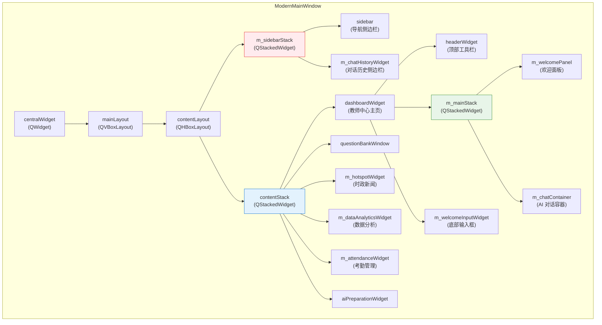
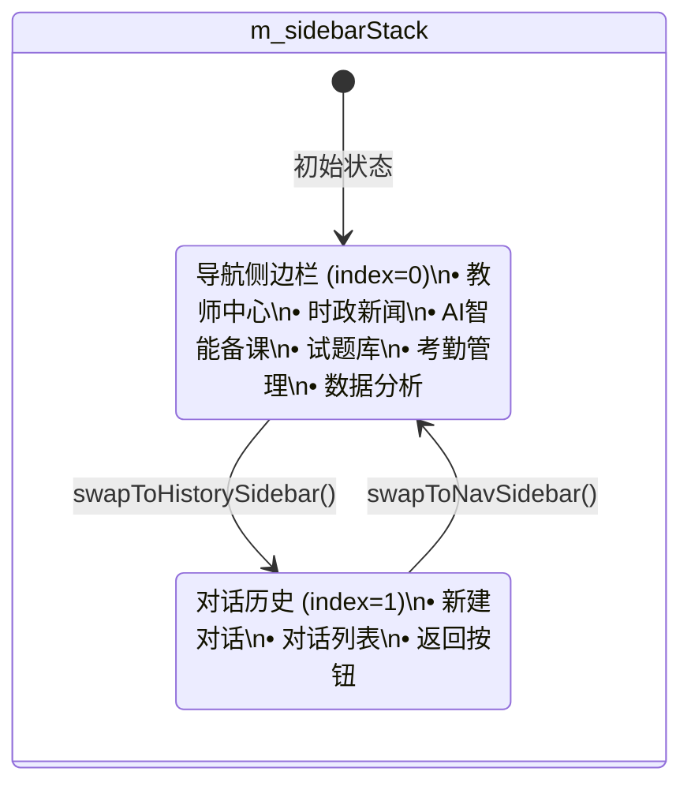

`ModernMainWindow` 是整个 AI 思政智慧课堂系统的**顶层编排枢纽**。它以 `QMainWindow` 为基类，将侧边栏导航、多页面内容栈、AI 对话面板、顶部工具栏与全局服务实例编织为一个统一的工作台。理解它的布局层次和导航机制，是掌握整个应用运行脉络的起点。

Sources: [modernmainwindow.h](src/dashboard/modernmainwindow.h#L51-L59), [modernmainwindow.ui](src/dashboard/modernmainwindow.ui#L4-L34)

## 窗口整体布局：三层嵌套栈

窗口的核心布局可以用一个三层嵌套模型来概括——最外层是 **`contentStack`**（页面栈），中间层是 **`m_mainStack`**（欢迎/对话切换栈），最底层还有 **`m_sidebarStack`**（导航/历史侧边栏切换栈）。三层栈协同工作，构成了完整的导航路由。

最外层的 `contentLayout` 是一个 `QHBoxLayout`，左侧固定放置 `m_sidebarStack`，右侧放置 `contentStack`。`contentStack` 中的每一页都是完整的业务模块——教师中心（Dashboard）、试题库、时政新闻、数据分析、考勤管理、AI 备课。其中教师中心页面（`dashboardWidget`）内部又嵌套了 `m_mainStack`，用于在欢迎面板与 AI 对话容器之间切换。

Sources: [modernmainwindow.cpp](src/dashboard/modernmainwindow.cpp#L965-L1189), [modernmainwindow.h](src/dashboard/modernmainwindow.h#L122-L198)

## 构造函数：初始化管线与 API Key 加载链

构造函数按照严格的顺序完成三阶段初始化：**服务层 → UI 层 → 默认页面**。构造参数接收 `userRole`、`username`、`userId` 三个字符串，贯穿整个窗口生命周期。

| 初始化阶段 | 核心操作 | 顺序 |
|:---|:---|:---|
| **服务层** | 创建 `QuestionRepository`、`DifyService`、`PPTXGenerator`、`NotificationService` | 1-4 |
| **API Key** | 按"环境变量 → `.env.local` → 内嵌 Key"三级优先级加载 Dify 和天行数据 Key | 5 |
| **信号连接** | 将 `DifyService` 的 6 个信号连接到窗口槽函数 | 6 |
| **UI 层** | 依次调用 `initUI()` → `setupMenuBar()` → `setupStatusBar()` → `setupCentralWidget()` → `setupStyles()` | 7 |
| **默认页面** | 调用 `createDashboard()` 并将 `contentStack` 切到 `dashboardWidget` | 8 |

API Key 的三级加载策略值得注意：先检查 `DIFY_API_KEY` 环境变量，再尝试读取应用目录上溯四级找到项目根目录的 `.env.local`，最后兜底使用 `EmbeddedKeys::DIFY_API_KEY` 编译期常量。这一机制在 [环境变量与密钥配置指南](4-huan-jing-bian-liang-yu-mi-yao-pei-zhi-zhi-nan-env-appconfig-embedded_keys) 中有详细说明。

Sources: [modernmainwindow.cpp](src/dashboard/modernmainwindow.cpp#L758-L888)

## 导航机制：按钮状态重置与页面切换

每个侧边栏导航按钮的 `clicked` 信号都连接到对应的 `onXxxClicked()` 槽函数。所有槽函数遵循同一个**三步模式**：

1. **重置全部按钮样式**：将所有导航按钮设为 `SIDEBAR_BTN_NORMAL`（透明背景、深色文字）
2. **激活当前按钮**：将目标按钮设为 `SIDEBAR_BTN_ACTIVE`（红色浅底、红色文字、加粗）
3. **切换内容页面**：调用 `contentStack->setCurrentWidget()` 跳转到目标页面

### 导航槽与目标页面映射

| 槽函数 | 目标页面控件 | contentStack 索引 | 附加行为 |
|:---|:---|:---|:---|
| `onTeacherCenterClicked` | `dashboardWidget` | 0 | 恢复欢迎面板，显示底部输入框 |
| `onAIPreparationClicked` | `dashboardWidget` → `m_chatContainer` | 0 | 嵌套切换到 AI 对话，侧边栏切到历史 |
| `onResourceManagementClicked` | `questionBankWindow` | 2 | 无 |
| `onNewsTrackingClicked` | `m_hotspotWidget` | 3 | 首次进入时调用 `refresh()` |
| `onLearningAnalysisClicked` | `m_dataAnalyticsWidget` | 4 | 每次进入调用 `refresh()` |
| `onAttendanceClicked` | `m_attendanceWidget` | 5 | 无 |

其中 **AI 智能备课** 的导航最为特殊：它先将 `contentStack` 切到 `dashboardWidget`（因为 AI 对话内嵌在 Dashboard 中），再通过 `m_mainStack->setCurrentWidget(m_chatContainer)` 进入对话页面，同时调用 `swapToHistorySidebar()` 将左侧 `m_sidebarStack` 从导航栏切换到对话历史栏。这是一个**双重栈联动**的导航模式。

Sources: [modernmainwindow.cpp](src/dashboard/modernmainwindow.cpp#L1922-L2063)

## 侧边栏双重身份：导航 ↔ 对话历史

`m_sidebarStack` 是一个 `QStackedWidget`，包含两个子页面：

- **索引 0 — 导航侧边栏**（`sidebar`）：包含用户头像区、6 个导航按钮、2 个底部工具按钮
- **索引 1 — 对话历史侧边栏**（`m_chatHistoryWidget`）：显示 Dify 云端的对话列表，支持新建对话、切换对话、返回

切换触发条件如下：进入 AI 对话时自动切换到历史侧边栏；点击历史栏的"返回"按钮（`backRequested` 信号）时恢复导航栏；点击侧边栏"教师中心"时也恢复导航栏。

Sources: [modernmainwindow.cpp](src/dashboard/modernmainwindow.cpp#L1057-L1069), [modernmainwindow.cpp](src/dashboard/modernmainwindow.cpp#L2576-L2588)

## 教师中心主页（Dashboard）：欢迎面板与 AI 对话的切换

Dashboard 页面（`dashboardWidget`）是系统默认首页，其内部布局从上到下依次为：

1. **`headerWidget`**（64px 固定高度）：包含应用标题、搜索框（支持 `/` 和 `Ctrl+K` 快捷键聚焦）、通知按钮（带 `NotificationBadge` 红点）
2. **`m_mainStack`**：在欢迎面板与 AI 对话容器之间切换
3. **`m_welcomeInputWidget`**（100px 固定高度）：仅欢迎页面时显示的底部输入栏

### 欢迎面板（m_welcomePanel）

欢迎面板包含：学士帽图标、"思政智慧课堂助手"标题、副标题、4 张功能卡片（时政新闻、AI 智能备课、试题库、数据分析报告）。这 4 张卡片分别连接到对应的导航槽函数，充当**快捷入口**。

### AI 对话容器（m_chatContainer）

对话容器内是一个 `QTabWidget`（`m_aiTabWidget`），包含两个标签页：
- **AI 对话**（`m_bubbleChatWidget` — `ChatWidget`）：气泡样式聊天组件，连接到 `DifyService` 实现流式对话
- **教案编辑**（`m_lessonPlanEditor` — `LessonPlanEditor`）：结构化教案编辑器

当用户在欢迎面板或 AI 对话中发送第一条消息时，`m_mainStack` 自动从欢迎面板切换到对话容器，`m_sidebarStack` 同步切换到历史侧边栏。

Sources: [modernmainwindow.cpp](src/dashboard/modernmainwindow.cpp#L1503-L1712), [modernmainwindow.cpp](src/dashboard/modernmainwindow.cpp#L2332-L2574)

## 模块间联动：跨页面信号桥接

`ModernMainWindow` 不仅是一个布局容器，更承担了**信号桥接器**的角色——将不同业务模块的信号连接起来实现跨页面协作。两个典型场景：

### 时政新闻 → AI 对话的"生成教学案例"

当用户在时政新闻页面点击某条新闻的"生成教学案例"按钮时，`HotspotTrackingWidget` 发出 `teachingContentRequested(NewsItem)` 信号。主窗口接收后执行多步联动：将 `contentStack` 切回 Dashboard → 将 `m_mainStack` 切到对话容器 → 侧边栏切到历史模式 → 更新按钮状态 → 构建教学案例提示词并发送给 DifyService。这种"信号触发 → 页面跳转 → 服务调用"的组合拳，是主窗口编排能力的核心体现。

### 试题库 → 教师中心的"返回"

`QuestionBankWindow` 发出 `backRequested` 信号时，主窗口将页面切回 Dashboard，恢复导航侧边栏，并激活"教师中心"按钮。

Sources: [modernmainwindow.cpp](src/dashboard/modernmainwindow.cpp#L1120-L1182)

## 样式体系：思政红主题与统一色彩常量

所有颜色值集中定义在 [StyleConfig.h](src/shared/StyleConfig.h) 中，`ModernMainWindow` 通过引用这些常量（如 `PATRIOTIC_RED = "#E53935"`、`GOLD_ACCENT = "#D4A017"`）确保全局视觉一致性。窗口额外定义了两个侧边栏按钮样式常量：

| 常量名 | 用途 | 视觉特征 |
|:---|:---|:---|
| `SIDEBAR_BTN_NORMAL` | 未选中按钮 | 透明背景、深色文字、悬停时 4% 黑色叠加 |
| `SIDEBAR_BTN_ACTIVE` | 选中按钮 | `PATRIOTIC_RED_LIGHT` 浅红背景、`PATRIOTIC_RED` 红色文字、加粗 |

Sources: [modernmainwindow.cpp](src/dashboard/modernmainwindow.cpp#L68-L119), [StyleConfig.h](src/shared/StyleConfig.h#L1-L55)

## 卡片动画系统：四个 Animator 类

主窗口在匿名命名空间中定义了四组动画辅助类，为 Dashboard 的功能卡片和快捷操作按钮提供精细的交互反馈。它们的职责划分如下：

| 类名 | 目标控件 | 动画效果 |
|:---|:---|:---|
| `CardHoverAnimator` | Dashboard 功能卡片 | 悬停上浮 8px + 阴影扩散 + 红色阴影；按下下沉 2px |
| `SimpleCardHoverFilter` | 轻量卡片 | 仅切换 `cardState` 属性（base/hover/pressed），不驱动几何动画 |
| `ButtonHoverAnimator` | 快捷操作按钮 | 按钮尺寸缩放（`scaleDelta` 像素）+ 阴影模糊变化 |
| `FrameHoverAnimator` | 帧容器 | 与 `CardHoverAnimator` 类似，但操作 `pos` 属性而非 `geometry` |

每个 Animator 都是一个 `QObject` 子类，通过 `installEventFilter()` 拦截 `Enter`/`Leave`/`MouseButtonPress`/`MouseButtonRelease` 事件，使用 `QPropertyAnimation` 和 `QVariantAnimation` 驱动平滑过渡，缓动曲线统一采用 `OutCubic`。

Sources: [modernmainwindow.cpp](src/dashboard/modernmainwindow.cpp#L186-L609)

## 重构方向：SidebarManager 与 ChatManager 的提取

代码仓库中已存在两个独立的辅助类——[SidebarManager](src/dashboard/SidebarManager.h) 和 [ChatManager](src/dashboard/ChatManager.h)，它们分别将侧边栏管理和 AI 对话管理的逻辑从主窗口中提取出来：

**SidebarManager**（304 行）封装了侧边栏的创建、按钮样式管理、导航枚举 `PageIndex`（Dashboard=0 到 Help=7），通过 `navigationRequested(int)` 信号向外部通知页面切换请求，使用动态属性 `active` 替代手动 `setStyleSheet()` 来切换按钮状态。

**ChatManager**（261 行）封装了 `DifyService`、`ChatWidget`、`ChatHistoryWidget`、`PPTXGenerator` 的创建与信号连接，统一管理流式响应的节流更新（50ms 间隔）、思考动画的显示/隐藏、PPT 生成关键词检测。

当前 `ModernMainWindow` 的 3045 行实现中，这两个管理器的逻辑仍然以内联方式存在。它们代表了明确的**重构目标**——将侧边栏和对话管理委托给独立对象，主窗口仅保留"编排"职责。

Sources: [SidebarManager.h](src/dashboard/SidebarManager.h#L19-L100), [ChatManager.h](src/dashboard/ChatManager.h#L21-L106), [SidebarManager.cpp](src/dashboard/SidebarManager.cpp#L1-L303), [ChatManager.cpp](src/dashboard/ChatManager.cpp#L1-L260)

## 关键成员变量速查

以下是 `ModernMainWindow` 中最核心的成员变量分组，便于快速定位代码位置：

### 布局与栈

| 变量名 | 类型 | 职责 |
|:---|:---|:---|
| `contentStack` | `QStackedWidget*` | 顶层页面切换（Dashboard / 试题库 / 新闻 / 分析 / 考勤 / AI备课） |
| `m_mainStack` | `QStackedWidget*` | Dashboard 内部切换（欢迎面板 / AI 对话容器） |
| `m_sidebarStack` | `QStackedWidget*` | 侧边栏切换（导航 / 对话历史） |
| `sidebar` | `QFrame*` | 导航侧边栏面板 |
| `headerWidget` | `QFrame*` | 顶部工具栏 |

### 业务模块组件

| 变量名 | 类型 | 对应页面 |
|:---|:---|:---|
| `questionBankWindow` | `QuestionBankWindow*` | 试题库 |
| `m_hotspotWidget` | `HotspotTrackingWidget*` | 时政新闻 |
| `m_dataAnalyticsWidget` | `DataAnalyticsWidget*` | 数据分析 |
| `m_attendanceWidget` | `AttendanceWidget*` | 考勤管理 |
| `m_bubbleChatWidget` | `ChatWidget*` | AI 对话气泡 |
| `m_lessonPlanEditor` | `LessonPlanEditor*` | 教案编辑 |

### 服务实例

| 变量名 | 类型 | 生命周期 |
|:---|:---|:---|
| `m_difyService` | `DifyService*` | 构造时 new，this 为 parent |
| `m_hotspotService` | `HotspotService*` | `setupCentralWidget()` 中 new |
| `m_notificationService` | `NotificationService*` | 构造时 new |
| `m_pptxGenerator` | `PPTXGenerator*` | 构造时 new |
| `questionRepository` | `QuestionRepository*` | 构造时 new |

Sources: [modernmainwindow.h](src/dashboard/modernmainwindow.h#L122-L243)

## 延伸阅读

- 要了解侧边栏按钮如何使用 `PageIndex` 枚举和动态属性实现更优雅的状态切换，参见 [SidebarManager.cpp](src/dashboard/SidebarManager.cpp#L59-L120)
- AI 对话的流式处理、节流机制和思考动画在 [ChatManager.cpp](src/dashboard/ChatManager.cpp#L75-L112) 中有更清晰的封装实现
- 统一色彩常量体系详见 [StyleConfig.h](src/shared/StyleConfig.h#L1-L55)
- 关于 API Key 三级加载策略的完整说明，参见 [环境变量与密钥配置指南](4-huan-jing-bian-liang-yu-mi-yao-pei-zhi-zhi-nan-env-appconfig-embedded_keys)
- DifyService 的 SSE 流式通信细节参见 [DifyService：SSE 流式对话、多事件类型处理与会话管理](10-difyservice-sse-liu-shi-dui-hua-duo-shi-jian-lei-xing-chu-li-yu-hui-hua-guan-li)