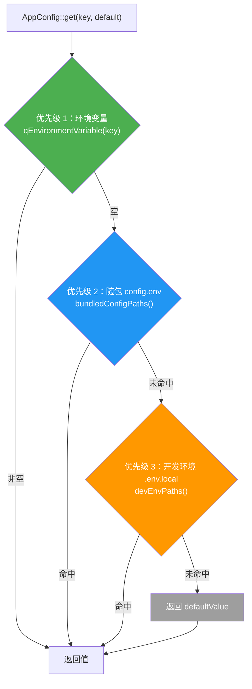
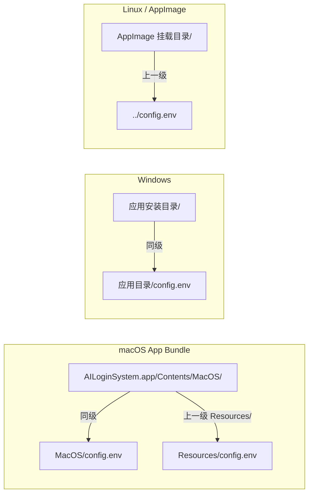
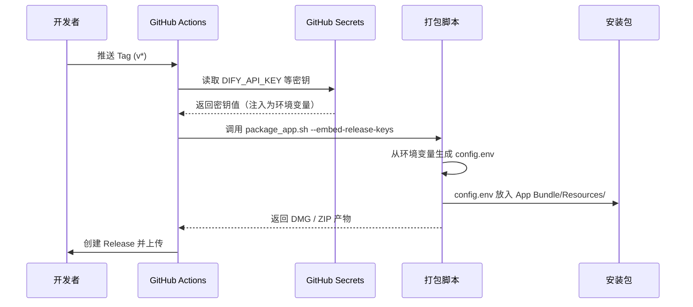

**AppConfig** 是 AI 思政智慧课堂系统中的统一配置读取器，它以一个静态方法 `AppConfig::get(key, defaultValue)` 为唯一入口，将"密钥从哪来"这个分散在各模块的头疼问题收拢为一条清晰的优先级链：**环境变量 → 随包 config.env → 开发环境 .env.local → 编译时默认值**。无论是 Dify AI 对话的 API Key、Supabase 后端 URL，还是智谱大模型的认证信息，都走同一条查找路径。这意味着开发者只需在项目根目录放一个 `.env.local`，打包脚本在 CI 阶段自动将 GitHub Secrets 注入 `config.env` 并随安装包分发，而最终用户打开应用即可直接使用——全程零手动配置。

Sources: [AppConfig.h](src/config/AppConfig.h#L1-L41), [AppConfig.cpp](src/config/AppConfig.cpp#L1-L142)

## 设计动机与问题域

在一个需要对接多个第三方 API（Dify AI、智谱 GLM、天行数据、Supabase）的桌面应用中，配置管理天然面临三重挑战：**开发时**需要本地调试密钥但不能提交到 Git；**打包时**需要将密钥安全地注入安装包；**运行时**需要从多个可能的位置找到配置。在 `AppConfig` 出现之前，`ModernMainWindow` 中存在大量手写的文件读取和 `qgetenv` 调用来逐个查找 API Key，代码分散且路径硬编码。AppConfig 将这些逻辑统一抽取为一个纯静态工具类，任何模块只需一行调用即可获得完整优先级查找能力。

Sources: [modernmainwindow.cpp](src/dashboard/modernmainwindow.cpp#L814-L841)

## 四级优先级链：查找流程全解

`AppConfig::get()` 的核心逻辑是一个逐级降级的查找链。当某个 key 被请求时，系统从最高优先级开始查找，一旦命中即返回，不再继续。



四级优先级的设计意图如下表所示：

| 优先级 | 来源 | 适用场景 | 谁写入 | 安全性 |
|--------|------|----------|--------|--------|
| **1** | 操作系统环境变量 | CI 调试、高级用户覆盖 | 运维 / 用户手动 | 进程生命周期内有效 |
| **2** | 随包 `config.env` | 生产环境（用户安装即用） | CI 打包脚本从 GitHub Secrets 生成 | 文件随安装包分发，不在 Git 仓库中 |
| **3** | 开发环境 `.env.local` | 日常开发调试 | 开发者手动创建 | 已在 `.gitignore` 中排除 |
| **4** | `defaultValue` 参数 | 编译时内嵌的兜底值 | 源码硬编码（仅限非敏感项） | 最弱，仅用于 URL 等非敏感配置 |

Sources: [AppConfig.cpp](src/config/AppConfig.cpp#L58-L91), [AppConfig.h](src/config/AppConfig.h#L7-L17)

## 核心实现：文件解析与缓存

### env 文件解析器

配置文件的格式是标准的 `key=value` 纯文本，支持注释（`#` 开头）和引号包裹值。解析逻辑位于匿名命名空间中的 `parseEnvFile()` 函数。它会逐行读取文件，跳过空行和注释行，以第一个 `=` 号为分隔符拆分键值，并自动去除值两端可能存在的单引号或双引号。值得注意的是，**同一个文件中重复的 key 只保留第一次出现的值**（`!values.contains(key)` 判断），这保证了配置的确定性。

Sources: [AppConfig.cpp](src/config/AppConfig.cpp#L14-L45)

### 进程级文件缓存

为了避免每次调用 `get()` 都重复读取和解析磁盘文件，AppConfig 使用了一个以文件路径为 key 的静态哈希表作为缓存：

```cpp
// 单文件缓存：路径 -> 键值对
QHash<QString, QHash<QString, QString>> &fileCache()
{
    static QHash<QString, QHash<QString, QString>> cache;
    return cache;
}
```

当首次访问某个文件路径时，`parseEnvFile()` 解析结果会被存入缓存；后续对同一文件的查询直接走内存哈希表。由于这是进程生命周期的静态变量，**配置一旦加载就不会再变化**——这符合桌面应用"启动时确定配置"的常见模式，也意味着运行期间修改配置文件需要重启应用才能生效。

Sources: [AppConfig.cpp](src/config/AppConfig.cpp#L48-L52)

### `get()` 方法的查找逻辑

`get()` 方法按以下顺序执行：

1. **环境变量**：调用 `qEnvironmentVariable()` 读取系统环境变量。注意这里使用的是 Qt 封装而非标准库的 `getenv()`，以确保跨平台行为一致。`trimmed()` 后非空则立即返回。
2. **随包 config.env**：遍历 `bundledConfigPaths()` 返回的候选路径列表。对每个路径执行"懒加载"——缓存为空且文件存在时才解析，之后从缓存查找 key。
3. **开发环境 .env.local**：同理遍历 `devEnvPaths()`，同样的懒加载缓存策略。
4. **默认值**：以上全部未命中，返回调用方传入的 `defaultValue`（可能为空字符串）。

Sources: [AppConfig.cpp](src/config/AppConfig.cpp#L58-L91)

## 路径解析策略：跨平台的候选路径

### 随包配置路径（`bundledConfigPaths()`）

随包配置是生产环境的核心查找路径。由于 macOS App Bundle、Windows 安装目录和 Linux AppImage 的文件布局各不相同，`bundledConfigPaths()` 针对每个平台返回候选路径：



在 macOS 上，`QCoreApplication::applicationDirPath()` 返回的是 `*.app/Contents/MacOS/`，因此代码同时搜索该目录和 `../Resources/`（通过 `QDir::cleanPath` 消除 `..`）。在 Windows 上，`applicationDirPath()` 直接就是 exe 所在目录，所以第一个路径即可命中。Linux/AppImage 场景则额外搜索上一级目录。

Sources: [AppConfig.cpp](src/config/AppConfig.cpp#L102-L118)

### 开发环境路径（`devEnvPaths()`）

开发环境下的路径解析更为复杂，因为 Qt Creator 或命令行构建的输出目录可能嵌套很深。`devEnvPaths()` 采用了"广撒网"策略，从多个维度反推项目根目录：

- **`QDir::current()`**：当前工作目录下的 `.env.local`
- **从 `applicationDirPath()` 反推**：尝试向上 4 级、3 级、2 级、1 级目录（覆盖不同构建系统布局）
- **从 `__FILE__` 宏反推**：以 `AppConfig.cpp` 源码文件的物理位置为锚点，向上 3 级到达项目根目录

最后一种方式利用了编译器宏 `__FILE__`，这意味着无论构建目录在哪、当前工作目录在哪，只要源码目录结构不变，就一定能找到正确的 `.env.local`。

Sources: [AppConfig.cpp](src/config/AppConfig.cpp#L120-L141)

## EmbeddedKeys：过渡期的编译时兜底

在 AppConfig 体系建立之前，系统使用 `embedded_keys.h` 将 API Key 直接编译进二进制文件。如今这个文件仍然存在，但已**不再存放真实密钥**（大多数值为空字符串），转为一个兼容层。它的角色体现在两个层面：

1. **作为 `AppConfig::get()` 的 `defaultValue` 参数**：`AIQuestionGenWidget` 中智谱 API 的配置以此方式使用，将 `EmbeddedKeys::ZHIPU_API_KEY` 和 `EmbeddedKeys::ZHIPU_BASE_URL` 作为兜底默认值传入。这意味着如果环境变量、config.env、.env.local 全部未配置，仍可使用编译时内嵌的值。

2. **作为 legacy 代码的直接引用**：`ModernMainWindow` 中的 Dify API Key 和天行数据 Key 仍保留了旧模式——先 `qgetenv()` → 再手动读文件 → 最后 `EmbeddedKeys`。这是一种尚未完全迁移到 `AppConfig::get()` 的过渡状态。

Sources: [embedded_keys.h](src/config/embedded_keys.h#L1-L20), [AIQuestionGenWidget.cpp](src/questionbank/AIQuestionGenWidget.cpp#L278-L291), [modernmainwindow.cpp](src/dashboard/modernmainwindow.cpp#L837-L841)

## 实际集成：各模块如何消费配置

AppConfig 在项目中有两种主要集成模式：

### 模式 A：纯 AppConfig 调用（推荐）

这是标准用法——业务代码直接调用 `AppConfig::get()`，无需关心配置来源：

```cpp
// SupabaseConfig — 通过 static const 缓存 + 默认值
static const QString value = AppConfig::get("SUPABASE_URL", "https://your-project-id.supabase.co");

// RealNewsProvider — 获取天行数据 API Key
m_tianxingKey = AppConfig::get("TIANXING_API_KEY");

// QuestionBankWindow — 多 key 降级查找
QString parserApiKey = AppConfig::get("PARSER_API_KEY");
if (parserApiKey.isEmpty()) {
    parserApiKey = AppConfig::get("DIFY_API_KEY");
}
```

`SupabaseConfig` 的做法尤其值得注意：它使用 `static const QString` 将首次调用结果永久缓存，将 AppConfig 的文件级缓存与函数级单例初始化合二为一，避免了重复调用开销。

### 模式 B：AppConfig + EmbeddedKeys 混合

```cpp
// AIQuestionGenWidget — 智谱 API 以 EmbeddedKeys 作为默认值
m_apiKey = AppConfig::get("ZHIPU_API_KEY", EmbeddedKeys::ZHIPU_API_KEY);
m_baseUrl = AppConfig::get("ZHIPU_BASE_URL", EmbeddedKeys::ZHIPU_BASE_URL);
```

这种模式将编译时兜底值优雅地嵌入 `get()` 的第二个参数，保持了调用形式的统一。

Sources: [supabaseconfig.cpp](src/auth/supabase/supabaseconfig.cpp#L1-L23), [RealNewsProvider.cpp](src/hotspot/RealNewsProvider.cpp#L141-L142), [questionbankwindow.cpp](src/questionbank/questionbankwindow.cpp#L56-L68), [AIQuestionGenWidget.cpp](src/questionbank/AIQuestionGenWidget.cpp#L282-L286)

## 打包管道：从 GitHub Secrets 到 config.env

生产环境的 `config.env` 不是手工创建的，而是由 CI 打包脚本在构建阶段自动生成。整个流程如下：



macOS 打包脚本 `package_app.sh` 中的 `generate_config_env()` 函数在检测到 `--embed-release-keys` 标志时，从 CI 环境变量中提取所有 API Key，写入 `config.env` 并放入 App Bundle 的 `Contents/Resources/` 目录。Windows 的 `package_windows.ps1` 则将 `config.env` 放在 exe 同级目录。两个平台的写入内容完全一致，包含 `DIFY_API_KEY`、`TIANXING_API_KEY`、`SUPABASE_URL`、`SUPABASE_ANON_KEY`、`ZHIPU_API_KEY` 和 `ZHIPU_BASE_URL` 六个密钥。

Sources: [package_app.sh](scripts/package_app.sh#L135-L157), [package_windows.ps1](scripts/package_windows.ps1#L97-L127), [build-macos.yml](.github/workflows/build-macos.yml#L57-L73), [build-windows.yml](.github/workflows/build-windows.yml#L66-L77)

## 配置键总览

以下是系统中所有已注册的配置键及其消费者一览：

| 配置键 | 用途 | 消费者 | 是否有默认值 |
|--------|------|--------|-------------|
| `DIFY_API_KEY` | Dify AI 对话/解析/质量检查 | DifyService、QuestionParserService | 无 |
| `PARSER_API_KEY` | 文档解析专用 API Key（降级到 DIFY_API_KEY） | QuestionBankWindow | 无 |
| `DIFY_QUESTION_GEN_API_KEY` | AI 出题专用 API Key（降级链末位） | QuestionBankWindow | 无 |
| `PARSER_API_BASE_URL` | 解析服务 Base URL | QuestionBankWindow | 无 |
| `ZHIPU_API_KEY` | 智谱 GLM 大模型 API Key | AIQuestionGenWidget | EmbeddedKeys 兜底 |
| `ZHIPU_BASE_URL` | 智谱 API Base URL | AIQuestionGenWidget | EmbeddedKeys 兜底 |
| `ZHIPU_QUESTION_API_KEY` | 智谱出题专用 Key（优先于 ZHIPU_API_KEY） | AIQuestionGenWidget | 无 |
| `TIANXING_API_KEY` | 天行数据新闻 API Key | RealNewsProvider、ModernMainWindow | 无 |
| `SUPABASE_URL` | Supabase 项目 URL | SupabaseConfig | 占位 URL |
| `SUPABASE_ANON_KEY` | Supabase 匿名访问 Key | SupabaseConfig | 无 |
| `SUPABASE_SERVICE_KEY` | Supabase 服务端 Key | SupabaseConfig | 无 |

Sources: [questionbankwindow.cpp](src/questionbank/questionbankwindow.cpp#L56-L68), [AIQuestionGenWidget.cpp](src/questionbank/AIQuestionGenWidget.cpp#L282-L286), [supabaseconfig.cpp](src/auth/supabase/supabaseconfig.cpp#L7-L22), [RealNewsProvider.cpp](src/hotspot/RealNewsProvider.cpp#L142)

## 开发者工作流：如何配置本地密钥

对于本地开发，只需两步即可让所有 API 服务正常工作：

**第一步**：复制 `.env.example` 为 `.env.local` 并填入真实值：

```bash
cp .env.example .env.local
# 编辑 .env.local，填入你的 API Key
```

`.env.local` 已被 `.gitignore` 排除，不会被意外提交。AppConfig 的 `devEnvPaths()` 会从多个候选路径中自动找到它。

**第二步**：直接运行应用。AppConfig 的四级优先级链会自动从 `.env.local` 中加载所有配置。

如果某个服务需要临时覆盖（比如测试不同的 Dify 应用），可以通过环境变量临时注入，无需修改文件：

```bash
DIFY_API_KEY=app-test-key ./AILoginSystem
```

环境变量的优先级高于 `.env.local`，能够实现临时覆盖而不影响文件中的持久配置。

Sources: [.env.example](.env.example#L1-L20), [.gitignore](.gitignore#L126-L134)

## 安全设计要点

AppConfig 的配置体系在安全性上做了多层防护：

- **`.env.local` 和 `embedded_keys.h` 均在 `.gitignore` 中排除**，密钥不会泄露到版本控制
- **`.env.example` 仅包含占位值**，新开发者必须自行填入真实密钥
- **CI 中的密钥来自 GitHub Secrets**，仅在打包时刻注入 `config.env`，不在源码中留存
- **打包脚本支持 `--embed-release-keys` 开关**，开发调试构建时不生成 `config.env`
- **`config.env` 文件头标注"请勿公开分享"**，提醒用户注意保护

Sources: [.gitignore](.gitignore#L126-L134), [package_app.sh](scripts/package_app.sh#L144-L146)

## 与相关页面的关系

AppConfig 是分层架构中"基础设施层"的核心组件。它向上为服务层（DifyService、SupabaseClient 等）提供配置注入，向下依赖 Qt 的文件系统和环境变量 API。理解了 AppConfig 之后，推荐继续阅读以下相关页面：

- [DifyService：SSE 流式对话、多事件类型处理与会话管理](10-difyservice-sse-liu-shi-dui-hua-duo-shi-jian-lei-xing-chu-li-yu-hui-hua-guan-li) — 查看 Dify API Key 如何被 DifyService 消费
- [Supabase 认证集成：登录、注册、密码重置与 Token 管理](8-supabase-ren-zheng-ji-cheng-deng-lu-zhu-ce-mi-ma-zhong-zhi-yu-token-guan-li) — 了解 Supabase URL/Key 的下游使用
- [GitHub Actions 自动发布：Tag 触发、密钥内嵌与产物上传](27-github-actions-zi-dong-fa-bu-tag-hong-fa-mi-yao-nei-qian-yu-chan-wu-shang-chuan) — 完整了解 CI 如何将密钥注入安装包
- [环境变量与密钥配置指南](4-huan-jing-bian-liang-yu-mi-yao-pei-zhi-zhi-nan-env-appconfig-embedded_keys) — 面向新手的配置操作指南