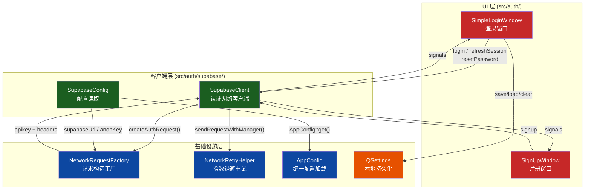
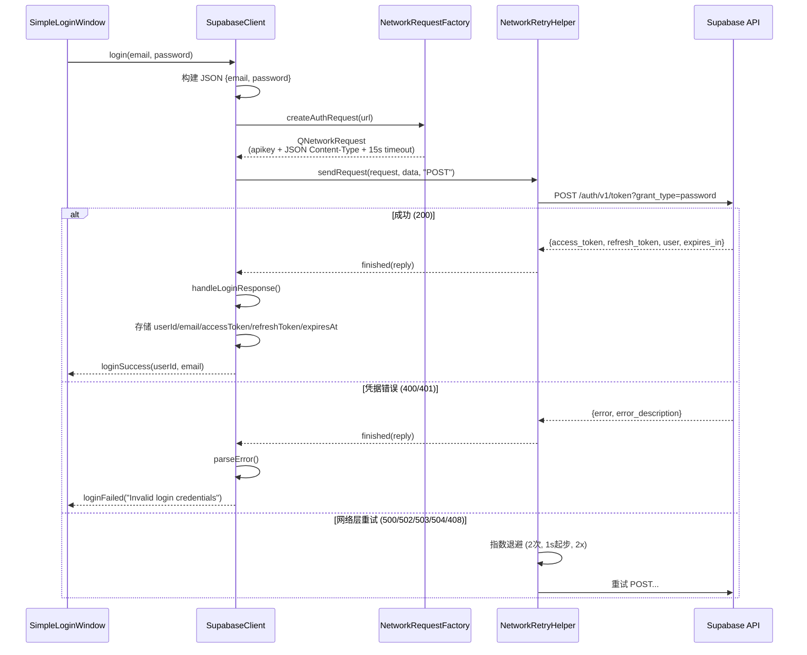
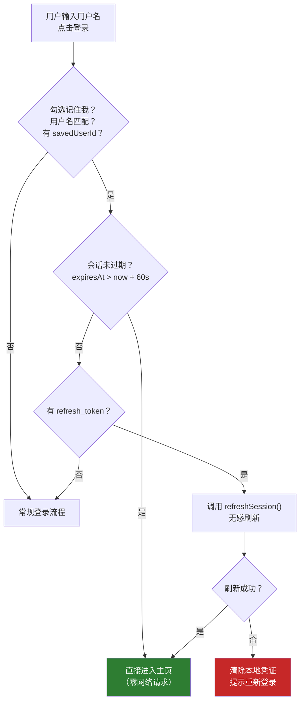

本文深入剖析项目中基于 Supabase 的用户认证体系的完整实现——从配置加载、API 请求构造，到登录/注册/密码重置三大业务流程，再到 Token 的本地持久化与会话恢复机制。阅读本文后，你将理解认证模块的三层分工（配置层 → 网络客户端层 → UI 交互层），掌握 Token 生命周期管理策略，并能复用相同模式扩展其他 Supabase 认证能力。

Sources: [supabaseclient.h](src/auth/supabase/supabaseclient.h#L1-L99), [supabaseconfig.h](src/auth/supabase/supabaseconfig.h#L1-L24), [simpleloginwindow.h](src/auth/login/simpleloginwindow.h#L1-L106), [signupwindow.h](src/auth/signup/signupwindow.h#L1-L100)

## 架构全景：三层职责划分

认证模块在 `src/auth/` 目录下按职责划分为三个子目录，形成**配置层 → 客户端层 → UI 层**的清晰依赖关系。`supabase/` 子目录封装了与 Supabase REST API 交互的所有底层逻辑；`login/` 和 `signup/` 子目录则各自持有独立的 UI 窗口，通过 Qt 信号/槽机制与底层客户端解耦通信。

**SupabaseConfig** 是纯静态工具类，通过 `AppConfig::get()` 读取 `SUPABASE_URL`、`SUPABASE_ANON_KEY` 和 `SUPABASE_SERVICE_KEY` 三个关键配置。它还定义了 `USERS_TABLE = "teachers"` 这一常量，用于用户存在性检查的 REST 查询目标表。所有方法使用 `static const QString` 局部变量实现首次调用时初始化并永久缓存，避免重复解析配置文件。

Sources: [supabaseconfig.cpp](src/auth/supabase/supabaseconfig.cpp#L1-L27), [AppConfig.h](src/config/AppConfig.h#L1-L42)

**SupabaseClient** 是认证的核心网络客户端，对外暴露四个业务方法（`login`、`signup`、`resetPassword`、`checkUserExists`）和 `refreshSession`，通过 Qt 信号向 UI 层报告操作结果。它在构造时创建 `QNetworkAccessManager` 和 `NetworkRetryHelper` 实例，所有 HTTP 请求通过 `sendRequest()` → `sendRequestWithManager()` 的两级调用链发出，自动获得指数退避重试和本地代理降级直连两项弹性能力。

Sources: [supabaseclient.cpp](src/auth/supabase/supabaseclient.cpp#L79-L94), [supabaseclient.h](src/auth/supabase/supabaseclient.h#L19-L98)

## 配置加载链：从环境变量到运行时密钥

Supabase 认证所需的三个密钥通过 **AppConfig 的四级优先级链** 加载，确保在开发、CI 和生产发布三种场景下都能正确获取配置：

| 优先级 | 来源 | 适用场景 | 典型路径 |
|--------|------|----------|----------|
| 1 | 操作系统环境变量 | CI/CD 覆盖 | `SUPABASE_URL=...` |
| 2 | 随包 `config.env` | 生产发布 | `app/Contents/MacOS/config.env` |
| 3 | `.env.local` | 开发调试 | 项目根目录 `.env.local` |
| 4 | 编译时默认值 | 仅非敏感项 | `your-project-id.supabase.co` |

`SupabaseConfig` 的 `supabaseUrl()` 方法使用了带默认值的 `AppConfig::get()` 调用（默认值为 `https://your-project-id.supabase.co`），而 `supabaseAnonKey()` 和 `supabaseServiceKey()` 的默认值为空——这种差异是有意为之的：URL 占位符用于在配置缺失时生成可读的错误提示，而密钥为空则触发配置缺失的短路逻辑。

Sources: [supabaseconfig.cpp](src/auth/supabase/supabaseconfig.cpp#L7-L23), [AppConfig.cpp](src/config/AppConfig.cpp#L56-L91)

**配置缺失短路机制** 在 `sendRequest()` 中实现：如果检测到 URL 仍为占位符或 Anon Key 为空，立即通过信号发出错误（`loginFailed`/`signupFailed`/`passwordResetFailed`/`userCheckFailed`），不发起任何网络请求。错误消息明确指向 `.env.local` 文件，引导开发者完成配置。

Sources: [supabaseclient.cpp](src/auth/supabase/supabaseclient.cpp#L162-L200)

## 登录流程：从凭据到 Token

### API 调用链

登录的核心入口是 `SupabaseClient::login(email, password)`，它向 Supabase 的 `/auth/v1/token?grant_type=password` 端点发送 POST 请求。请求体为 `{email, password}` 两个 JSON 字段。请求通过 `NetworkRequestFactory::createAuthRequest()` 构造，该方法自动注入 `apikey` 头（值为 Anon Key）、`Content-Type: application/json`，以及 **15 秒** 的传输超时——这是 `NetworkRequestFactory` 为认证场景预设的专用超时等级。

Sources: [supabaseclient.cpp](src/auth/supabase/supabaseclient.cpp#L100-L110), [NetworkRequestFactory.cpp](src/utils/NetworkRequestFactory.cpp#L146-L162)

### 响应解析与 Token 提取

`handleLoginResponse()` 方法从成功的 Supabase 响应中提取五个关键数据并存储在 `SupabaseClient` 的成员变量中：

| 字段 | JSON 路径 | 存储位置 | 用途 |
|------|-----------|----------|------|
| userId | `user.id` | `m_currentUserId` | 标识用户，传递给主窗口 |
| email | `user.email` | `m_currentEmail` | 标识用户，传递给主窗口 |
| accessToken | `access_token` | `m_currentAccessToken` | API 调用的 Bearer 令牌 |
| refreshToken | `refresh_token` | `m_currentRefreshToken` | 会话恢复的刷新令牌 |
| expiresAt | `expires_at` 或 `now + expires_in` | `m_currentExpiresAt` | 令牌过期时间戳（秒） |

过期时间的计算采用双策略兼容：优先使用 Supabase 返回的 `expires_at` 绝对时间戳；若该字段缺失，则使用 `当前时间 + expires_in` 作为兜底计算。解析完成后发射 `loginSuccess(userId, email)` 信号。

Sources: [supabaseclient.cpp](src/auth/supabase/supabaseclient.cpp#L358-L387)

### 登录窗口的多路径入口

`SimpleLoginWindow::onLoginClicked()` 实现了一个精心设计的多分支登录决策逻辑：

1. **记住我的有效会话**：如果用户名匹配、勾选"记住我"、且本地会话未过期（`expiresAt > 当前时间 + 60s`），直接使用本地缓存的 userId 进入主页，**完全跳过网络请求**。
2. **记住我的会话刷新**：如果本地会话已过期但 refresh_token 存在，调用 `refreshSession()` 无感刷新。
3. **内置测试账号**：`teacher01`/`student01`/`admin01` 三个硬编码账号直接通过，不经过 Supabase，用于离线演示和开发调试。
4. **Supabase 邮箱登录**：仅当输入包含 `@` 时才走 Supabase 认证路径；否则提示用户使用正确的邮箱格式。

Sources: [simpleloginwindow.cpp](src/auth/login/simpleloginwindow.cpp#L505-L581)

### 错误映射：网络错误的中文化

`SupabaseClient` 在匿名命名空间中定义了 `mapAuthNetworkError()` 函数，将 Qt 的 `QNetworkReply::NetworkError` 枚举映射为面向用户的中文错误提示。例如 `ConnectionRefusedError` → "连接被拒绝，请检查网络"，`SslHandshakeFailedError` → "SSL 握手失败，请检查系统时间或代理证书"。所有代理相关错误统一归类为 "代理连接失败，请检查代理设置或关闭代理后重试"。

Sources: [supabaseclient.cpp](src/auth/supabase/supabaseclient.cpp#L12-L49)

## 注册流程：邮箱验证与窗口跳转

注册窗口 `SignUpWindow` 提供邮箱、用户名、密码、确认密码四个输入字段。表单验证在 `validateInput()` 中实现，规则如下：

| 校验项 | 规则 | 失败行为 |
|--------|------|----------|
| 邮箱非空 | `!email.isEmpty()` | 聚焦邮箱输入框 |
| 邮箱格式 | `contains("@") && contains(".")` | 聚焦邮箱输入框 |
| 密码非空 | `!password.isEmpty()` | 聚焦密码输入框 |
| 密码长度 | `length() >= 8` | 聚焦密码输入框 |
| 确认密码非空 | `!password2.isEmpty()` | 聚焦确认密码输入框 |
| 两次密码一致 | `password1 == password2` | 清空两个密码框 |

`SupabaseClient::signup()` 将 `{email, password, data: {username}}` 发送到 `/auth/v1/signup` 端点。`username` 被嵌套在 `data` 对象中，作为 Supabase 的 **用户元数据（user_metadata）** 存储。注册成功后 Supabase 返回包含 `access_token` 的响应，但 UI 层并不立即登录——而是通过 `QTimer::singleShot(2000, ...)` 延迟 2 秒后自动跳转回登录窗口，引导用户先完成邮箱验证。

Sources: [supabaseclient.cpp](src/auth/supabase/supabaseclient.cpp#L123-L136), [signupwindow.cpp](src/auth/signup/signupwindow.cpp#L470-L598)

### 窗口间跳转的生命周期

登录窗口与注册窗口之间通过 **关闭旧窗口 + 创建新窗口** 的模式实现跳转，两个窗口均设置 `Qt::WA_DeleteOnClose` 属性，确保窗口关闭时自动释放内存。`SignUpWindow::openLoginWindow()` 在创建新登录窗口后还会调用 `raise()` 和 `activateWindow()` 确保窗口获得焦点。

Sources: [signupwindow.cpp](src/auth/signup/signupwindow.cpp#L590-L598), [simpleloginwindow.cpp](src/auth/login/simpleloginwindow.cpp#L583-L596)

## 密码重置流程

密码重置通过 `SupabaseClient::resetPassword(email)` 发送 `{email}` 到 `/auth/v1/recover` 端点。与其他认证接口不同，密码重置的响应处理使用独立的 `handlePasswordResetResponse(httpStatus, data)` 方法，原因是 Supabase 的密码重置成功响应可能返回**空 body 或简短 JSON**，无法统一用 JSON 解析器处理。因此该方法的判断逻辑简化为：HTTP 200 即成功，其他状态码尝试从 JSON 中提取错误消息。

UI 层通过 `QInputDialog` 弹出对话框获取用户邮箱，如果登录框中已输入了包含 `@` 的文本，则自动预填到对话框中。按钮在请求期间禁用并显示"发送中..."，完成后恢复。

Sources: [supabaseclient.cpp](src/auth/supabase/supabaseclient.cpp#L151-L160), [supabaseclient.cpp](src/auth/supabase/supabaseclient.cpp#L408-L426), [simpleloginwindow.cpp](src/auth/login/simpleloginwindow.cpp#L660-L706)

## Token 管理与会话恢复

### 本地持久化机制

登录窗口使用 `QSettings` 将认证状态持久化到本地存储。当用户勾选"记住我"且登录成功后，`saveRememberedCredentials()` 方法保存以下数据：

| QSettings Key | 值来源 | 用途 |
|---------------|--------|------|
| `rememberMe` | `true` | 标记记住我开关 |
| `savedUsername` | 输入框文本 | 自动预填用户名 |
| `savedPassword` | 已移除（不再存储） | — |
| `savedUserId` | `SupabaseClient::currentUserId()` | 会话有效性判断 |
| `savedEmail` | `SupabaseClient::currentEmail()` | 用户标识 |
| `savedAccessToken` | `SupabaseClient::currentAccessToken()` | API 调用凭证 |
| `savedRefreshToken` | `SupabaseClient::currentRefreshToken()` | 令牌刷新 |
| `savedSessionExpiresAt` | `SupabaseClient::currentExpiresAt()` | 过期时间戳（秒） |

值得注意的是，`savedPassword` 虽然在 `saveRememberedCredentials()` 中被 `remove()` 清除（即**不再存储用户密码**），但在 `clearRememberedCredentials()` 中仍保留了对应的清理代码——这是历史遗留的安全优化痕迹。

Sources: [simpleloginwindow.cpp](src/auth/login/simpleloginwindow.cpp#L782-L813)

### 会话恢复的三级判定

当用户打开登录窗口且存在记住的凭证时，系统按以下优先级决定登录路径：

**`isRememberedSessionStillValid()`** 使用 `expiresAt > 当前时间 + 60` 作为判定条件，预留 60 秒的安全边界避免边界条件下的 Token 失效。**`canRefreshRememberedSession()`** 仅检查 refresh_token 是否存在。当会话刷新失败时（`onLoginFailed` 中检测到 `m_isRestoringSession` 标志），系统会清除所有本地凭证并将"记住我"复选框取消勾选，引导用户重新输入密码。

Sources: [simpleloginwindow.cpp](src/auth/login/simpleloginwindow.cpp#L734-L748), [simpleloginwindow.cpp](src/auth/login/simpleloginwindow.cpp#L637-L657)

### Token 刷新接口

`SupabaseClient::refreshSession(refreshToken)` 向 `/auth/v1/token?grant_type=refresh_token` 发送 `{refresh_token}` JSON 体。Supabase 在刷新成功后返回全新的 `access_token`、`refresh_token` 和 `expires_in`/`expires_at`，`handleLoginResponse()` 会自动更新 `SupabaseClient` 中的所有成员变量，并通过 `loginSuccess` 信号通知 UI 层进入主页。

Sources: [supabaseclient.cpp](src/auth/supabase/supabaseclient.cpp#L112-L121)

## 网络弹性：重试与代理降级

### 指数退避重试

`SupabaseClient` 的每次请求都通过 `NetworkRetryHelper` 发出，配置策略为：**最多重试 2 次，首次延迟 1000ms，退避倍数 2.0**（即第二次延迟 2000ms），可重试的 HTTP 状态码为 `500、502、503、504、408`。`NetworkRetryHelper` 以组合模式嵌入，不改变 SupabaseClient 原有的信号/槽架构，仅在其内部封装重试逻辑后通过 `finished(reply)` 信号传递最终结果。

Sources: [supabaseclient.cpp](src/auth/supabase/supabaseclient.cpp#L82-L84), [supabaseclient.cpp](src/auth/supabase/supabaseclient.cpp#L203-L241)

### 本地代理自动降级直连

`shouldRetryWithoutProxy()` 实现了一个针对中国用户网络环境的特殊优化：当请求失败且错误类型为代理相关（如 `ProxyConnectionRefusedError`），同时系统代理指向本地回环地址（`127.0.0.1`、`localhost`、`::1`）时，自动创建一个**无代理的独立 QNetworkAccessManager** 并重发请求。这是因为许多用户使用 VPN/代理工具，其本地代理可能在某些时刻不可用，导致本应正常工作的请求被阻断。`allowDirectFallback` 参数确保只降级一次，不会无限重试。

Sources: [supabaseclient.cpp](src/auth/supabase/supabaseclient.cpp#L43-L76), [supabaseclient.cpp](src/auth/supabase/supabaseclient.cpp#L203-L241)

## 响应路由：基于 URL 的分发模式

`SupabaseClient::onReplyFinished()` 采用 **URL 路径匹配** 来判断响应类型并路由到对应的处理方法。这是一个务实的架构选择——由于所有认证请求共用同一个 `QNetworkAccessManager`，无法通过回调参数直接区分请求来源，因此通过检查 URL 中是否包含 `/auth/v1/token`、`/auth/v1/signup`、`/auth/v1/recover` 或 `/rest/v1/teachers` 来确定响应类型：

| URL 特征 | 处理方法 | 成功信号 | 失败信号 |
|----------|----------|----------|----------|
| `/auth/v1/token` | `handleLoginResponse()` | `loginSuccess` | `loginFailed` |
| `/auth/v1/signup` | `handleSignupResponse()` | `signupSuccess` | `signupFailed` |
| `/auth/v1/recover` | `handlePasswordResetResponse()` | `passwordResetSuccess` | `passwordResetFailed` |
| `/rest/v1/teachers` | 内联数组解析 | `userExists` | `userCheckFailed` |

这种模式在错误处理的多个位置（`onReplyFinished`、`onNetworkError`、`onSslErrors`）中统一重复，确保无论错误发生在哪个阶段，都能路由到正确的信号。

Sources: [supabaseclient.cpp](src/auth/supabase/supabaseclient.cpp#L248-L349), [supabaseclient.cpp](src/auth/supabase/supabaseclient.cpp#L441-L488)

## 防重复提交与状态保护

两个 UI 窗口都实现了防重复提交机制。`SimpleLoginWindow` 使用 `m_loginProcessed` 布尔标志，在 `onLoginSuccess()` 中设为 `true` 后，后续的重复调用会被跳过。同时 `loginButton` 在请求期间被禁用并显示状态文本（"登录中..."、"正在恢复会话..."、"正在进入工作台..."），防止用户多次点击。`SignUpWindow` 使用 `m_signupProcessed` 标志实现相同逻辑，并在注册失败时重置该标志以允许重试。

Sources: [simpleloginwindow.cpp](src/auth/login/simpleloginwindow.cpp#L615-L635), [signupwindow.cpp](src/auth/signup/signupwindow.cpp#L470-L489)

## 认证模块 API 速查表

| 类 | 方法/信号 | 说明 |
|----|-----------|------|
| `SupabaseConfig` | `supabaseUrl()` | 返回 Supabase 项目 URL |
| `SupabaseConfig` | `supabaseAnonKey()` | 返回匿名公钥（用于请求头 `apikey`） |
| `SupabaseConfig` | `supabaseServiceKey()` | 返回服务端密钥（管理操作用） |
| `SupabaseConfig` | `USERS_TABLE` | 常量 `"teachers"`，用户表名 |
| `SupabaseClient` | `login(email, password)` | 邮箱密码登录 |
| `SupabaseClient` | `refreshSession(refreshToken)` | 用 refresh_token 刷新会话 |
| `SupabaseClient` | `signup(email, password, username)` | 注册新用户 |
| `SupabaseClient` | `checkUserExists(email)` | 查询邮箱是否已注册 |
| `SupabaseClient` | `resetPassword(email)` | 发送密码重置邮件 |
| `SupabaseClient` | `loginSuccess(userId, email)` | 登录成功信号 |
| `SupabaseClient` | `loginFailed(errorMessage)` | 登录失败信号 |
| `SupabaseClient` | `signupSuccess(message)` | 注册成功信号 |
| `SupabaseClient` | `signupFailed(errorMessage)` | 注册失败信号 |
| `SupabaseClient` | `passwordResetSuccess(message)` | 密码重置邮件发送成功 |
| `SupabaseClient` | `passwordResetFailed(errorMessage)` | 密码重置失败 |
| `SupabaseClient` | `userExists(exists)` | 用户存在性查询结果 |
| `SupabaseClient` | `currentUserId()` / `currentAccessToken()` 等 | Token 五元组访问器 |
| `NetworkRequestFactory` | `createAuthRequest(url, timeout=15s)` | 构造认证请求（apikey + JSON） |

## 关键设计决策与扩展要点

**为什么不使用 Supabase SDK？** 项目直接调用 Supabase REST API 而非使用官方 C++ SDK（Supabase 没有官方 C++ SDK）。这种选择使得认证层完全基于 Qt 网络栈实现，依赖精简，且能充分利用项目中已有的 `NetworkRetryHelper` 和 `NetworkRequestFactory` 基础设施。

**Token 不直接用于跨模块共享**：当前 `SupabaseClient` 的 Token 存储在成员变量中，仅在登录窗口的生命周期内有效。进入主工作台（`ModernMainWindow`）后，其他需要认证的模块（如考勤、通知）通过 `SupabaseStorageService` 等独立服务各自获取 Token——这暗示未来可能需要一个全局的认证状态管理器（AuthStateManager）来统一 Token 的存储与刷新。

**安全注意事项**：`savedPassword` 已被移除存储，密码不再持久化到 `QSettings`。但 `savedAccessToken` 仍然以明文存储在 `QSettings` 中（通常对应操作系统的注册表或 plist 文件），这在桌面应用中是常见的权衡，但需要注意设备物理安全。如需更高安全等级，可考虑使用操作系统的密钥链服务（macOS Keychain / Windows Credential Manager）替代 `QSettings`。

Sources: [simpleloginwindow.cpp](src/auth/login/simpleloginwindow.cpp#L782-L798)

---

**相关阅读**：理解认证请求底层的重试策略细节，请参阅 [NetworkRetryHelper：指数退避重试策略与可配置错误码](9-networkretryhelper-zhi-shu-tui-bi-zhong-shi-ce-lue-yu-ke-pei-zhi-cuo-wu-ma)；了解配置加载的完整四级优先级机制，请参阅 [统一配置加载机制 AppConfig：环境变量 → 随包配置 → 开发配置](7-tong-pei-zhi-jia-zai-ji-zhi-appconfig-huan-jing-bian-liang-sui-bao-pei-zhi-kai-fa-pei-zhi)；网络请求的 SSL 策略和超时配置细节，请参阅 [NetworkRequestFactory：统一请求创建、SSL 策略与 HTTP/2 禁用约定](23-networkrequestfactory-tong-qing-qiu-chuang-jian-ssl-ce-lue-yu-http-2-jin-yong-yue-ding)。