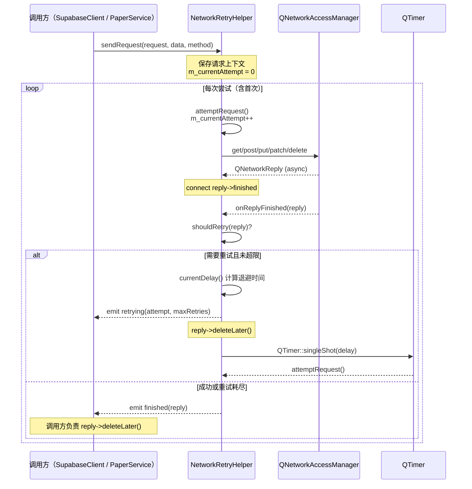
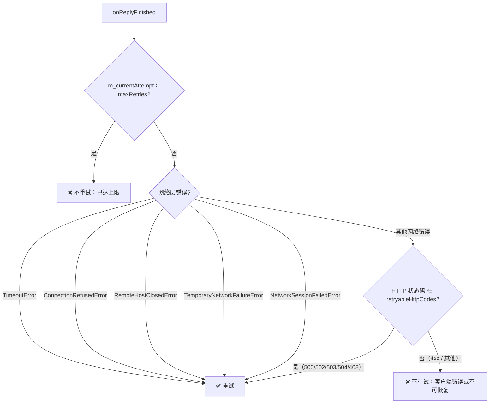

`NetworkRetryHelper` 是本项目网络基础设施层中专注于**请求级容错**的轻量级封装组件。它以组合方式嵌入现有服务类（如 `SupabaseClient`、`PaperService`），在不改变调用方信号/槽架构的前提下，为 HTTP 请求注入指数退避重试能力。本文将从策略模型、核心执行流、判定逻辑、实战集成模式四个维度对其进行全景解析。

Sources: [NetworkRetryHelper.h](src/utils/NetworkRetryHelper.h#L1-L65), [NetworkRetryHelper.cpp](src/utils/NetworkRetryHelper.cpp#L1-L109)

## 设计定位：为何需要独立重试层

在 Qt 网络编程中，`QNetworkAccessManager` 本身不提供重试机制。当遇到服务端瞬时故障（502/503）、网络抖动（超时、连接重置）时，调用方往往需要自行实现重试逻辑。如果将重试代码散落在每个服务类中，会导致大量重复的定时器管理、退避计算和错误码判断代码。

`NetworkRetryHelper` 的设计遵循**单一职责**原则——它只做三件事：**保存请求上下文**、**判定是否需要重试**、**按指数间隔调度下一次尝试**。它不持有 `QNetworkAccessManager` 的所有权，不干预 SSL 配置，不解析响应体，与 [NetworkRequestFactory](23-networkrequestfactory-tong-qing-qiu-chuang-jian-ssl-ce-lue-yu-http-2-jin-yong-yue-ding) 形成清晰的职责边界：前者负责「请求如何构建」，后者负责「请求失败后如何应对」。

Sources: [NetworkRetryHelper.h](src/utils/NetworkRetryHelper.h#L11-L16)

## RetryPolicy 策略模型

`NetworkRetryHelper` 的全部可配置参数集中在一个值结构体 `RetryPolicy` 中，构造时通过值语义传入，运行期间不可变更——这保证了单次请求生命期内策略的确定性。

```cpp
struct RetryPolicy {
    int maxRetries;                  // 最大重试次数（不含首次请求）
    int baseDelayMs;                 // 首次重试延迟（毫秒）
    double backoffMultiplier;        // 退避倍数
    QSet<int> retryableHttpCodes;    // 可重试的 HTTP 状态码集合

    RetryPolicy()  // 默认策略：3 次重试，1s 起步，2 倍递增
        : maxRetries(3), baseDelayMs(1000), backoffMultiplier(2.0)
        , retryableHttpCodes({500, 502, 503, 504, 408}) {}
};
```

Sources: [NetworkRetryHelper.h](src/utils/NetworkRetryHelper.h#L22-L34)

**参数语义详解：**

| 参数 | 类型 | 默认值 | 说明 |
|------|------|--------|------|
| `maxRetries` | `int` | 3 | 不含首次请求的最大重试次数；设为 0 等效于禁用重试 |
| `baseDelayMs` | `int` | 1000 | 首次重试前的等待时间（ms），即 $2^0$ 的乘数基数 |
| `backoffMultiplier` | `double` | 2.0 | 每次重试的延迟倍增系数；2.0 为经典指数退避 |
| `retryableHttpCodes` | `QSet<int>` | {500,502,503,504,408} | 仅这些 HTTP 状态码触发重试；4xx 客户端错误不在其中 |

**项目中两种实际策略对比：**

| 使用场景 | maxRetries | baseDelayMs | backoffMultiplier | retryableHttpCodes |
|----------|-----------|-------------|-------------------|-------------------|
| SupabaseClient（认证） | 2 | 1000 | 2.0 | {500,502,503,504,408} |
| PaperService（数据 CRUD） | 3（默认） | 1000（默认） | 2.0（默认） | {500,502,503,504,408}（默认） |

认证场景将 `maxRetries` 降为 2，因为登录/注册请求具有用户实时等待的交互敏感性，不宜过长阻塞；而 PaperService 的写操作采用默认的 3 次重试，配合 `FailedTaskTracker` 在重试耗尽后持久化失败任务，更适合后台数据同步场景。

Sources: [supabaseclient.cpp](src/auth/supabase/supabaseclient.cpp#L82-L84), [PaperService.cpp](src/services/PaperService.cpp#L365-L366)

## 核心执行流：从 sendRequest 到 finished 信号



Sources: [NetworkRetryHelper.cpp](src/utils/NetworkRetryHelper.cpp#L14-L75)

### 请求上下文的保存与复现

`sendRequest` 方法在首次调用时将 `QNetworkRequest`、`QByteArray`（请求体）和 `QString`（HTTP 方法）保存为成员变量 `m_pendingRequest`、`m_pendingData`、`m_pendingMethod`。这些上下文在后续每次 `attemptRequest()` 调用中被完整复现，确保重试发送的请求与原始请求在语义上完全一致。`m_currentAttempt` 计数器在每次 `sendRequest` 调用时重置为 0，在 `attemptRequest` 中递增，从而为退避计算和重试上限判定提供一致的基准。

Sources: [NetworkRetryHelper.cpp](src/utils/NetworkRetryHelper.cpp#L14-L24), [NetworkRetryHelper.h](src/utils/NetworkRetryHelper.h#L55-L63)

### 多 HTTP 方法的统一分发

`attemptRequest()` 通过字符串匹配 `m_pendingMethod` 来选择对应的 `QNetworkAccessManager` 方法。它覆盖了五种主流 HTTP 方法：

| method 值 | QNAM 调用方式 | 说明 |
|-----------|--------------|------|
| `"GET"` | `get(request)` | 无请求体 |
| `"POST"` | `post(request, data)` | 携带请求体 |
| `"PUT"` | `put(request, data)` | 携带请求体 |
| `"PATCH"` | `sendCustomRequest(request, "PATCH", data)` | 通过自定义请求发送 |
| `"DELETE"` | `sendCustomRequest(request, "DELETE")` | 无请求体 |

若方法字符串不匹配任何分支，`reply` 为 `nullptr`，方法打印警告并直接返回——这是一种防御性编程，避免将空指针传入后续的信号连接。

Sources: [NetworkRetryHelper.cpp](src/utils/NetworkRetryHelper.cpp#L26-L52)

## 判定逻辑：shouldRetry 的三层决策

`shouldRetry` 方法是整个重试机制的核心决策函数，它按以下优先级进行三层判定：



**第一层——重试上限检查**：`m_currentAttempt >= m_policy.maxRetries` 直接返回 `false`。注意比较的是 `>=` 而非 `>`，因为 `m_currentAttempt` 在 `attemptRequest()` 中先自增再发起请求，所以当它等于 `maxRetries` 时意味着已经完成了 `maxRetries` 次尝试（不含首次请求），不应再重试。

**第二层——网络层错误匹配**：检查 `QNetworkReply::NetworkError` 枚举值。仅以下五种被视为瞬时故障可重试：

| 枚举值 | 语义 | 典型场景 |
|--------|------|---------|
| `TimeoutError` | 请求超时 | 服务端响应慢、网络拥堵 |
| `ConnectionRefusedError` | 连接被拒绝 | 服务端临时不可用 |
| `RemoteHostClosedError` | 远端关闭连接 | 服务端重启、负载均衡切换 |
| `TemporaryNetworkFailureError` | 临时网络故障 | WiFi 切换、网络闪断 |
| `NetworkSessionFailedError` | 网络会话失败 | 底层网络栈异常 |

**第三层——HTTP 状态码匹配**：当网络层无错误（即 TCP 连接和 TLS 握手成功完成），但服务端返回了非 2xx 响应时，检查 `retryableHttpCodes` 集合。默认配置覆盖了五类服务端错误码（500/502/503/504/408），**刻意排除所有 4xx 客户端错误**——因为 401 未授权、403 禁止、404 未找到等错误属于语义层面的问题，重试不会改变结果。

Sources: [NetworkRetryHelper.cpp](src/utils/NetworkRetryHelper.cpp#L77-L101)

## 指数退避算法：currentDelay 的数学模型

```cpp
int NetworkRetryHelper::currentDelay() const {
    return static_cast<int>(
        m_policy.baseDelayMs * qPow(m_policy.backoffMultiplier, m_currentAttempt - 1)
    );
}
```

延迟计算公式为：$delay = baseDelay \times multiplier^{(attempt - 1)}$

以默认策略（base=1000ms, multiplier=2.0, maxRetries=3）为例，完整的重试时间线如下：

| 尝试序号 | attempt 值 | 延迟计算 | 实际延迟 |
|---------|-----------|---------|---------|
| 首次请求 | 1 | —（无需等待） | 0ms |
| 第 1 次重试 | 1 | 1000 × 2⁰ | 1000ms |
| 第 2 次重试 | 2 | 1000 × 2¹ | 2000ms |
| 第 3 次重试 | 3 | 1000 × 2² | 4000ms |

注意一个细微之处：`currentDelay()` 在 `onReplyFinished` 中被调用时，`m_currentAttempt` 已经在 `attemptRequest()` 中递增过了。首次请求失败后 `m_currentAttempt=1`，此时计算 `1000 × 2^(1-1) = 1000ms`，这是正确的首次退避值。

Sources: [NetworkRetryHelper.cpp](src/utils/NetworkRetryHelper.cpp#L103-L108)

## 实战集成模式

### 模式一：长生命周期成员变量（SupabaseClient）

SupabaseClient 在构造函数中创建 `NetworkRetryHelper` 作为成员变量，并使用自定义策略（2 次重试），随后在 `sendRequestWithManager` 方法中又创建临时实例以支持代理降级场景：

```cpp
// 构造时创建（但实际未被直接使用，因为 sendRequestWithManager 创建了临时实例）
SupabaseClient::SupabaseClient(QObject *parent)
    : m_retryHelper(new NetworkRetryHelper(m_networkManager,
                                            {2, 1000, 2.0, {500, 502, 503, 504, 408}},
                                            this))

// 实际请求路径：每次创建临时实例
void SupabaseClient::sendRequestWithManager(...) {
    auto *retryHelper = new NetworkRetryHelper(manager,
                                                {2, 1000, 2.0, {500, 502, 503, 504, 408}},
                                                this);
    connect(retryHelper, &NetworkRetryHelper::finished, this, [...] {
        // 代理降级判断 → 或正常处理响应
        retryHelper->deleteLater();
    });
    retryHelper->sendRequest(request, data, method);
}
```

这种**临时实例模式**使得 SupabaseClient 能够在重试耗尽后，检查 `shouldRetryWithoutProxy(reply)` 判定是否因本地代理导致失败，如果是则创建一个 `QNetworkProxy::NoProxy` 的 `QNetworkAccessManager` 再次发起请求——形成「重试 → 代理降级 → 再重试」的两级容错链路。

Sources: [supabaseclient.cpp](src/auth/supabase/supabaseclient.cpp#L79-L84), [supabaseclient.cpp](src/auth/supabase/supabaseclient.cpp#L203-L241)

### 模式二：写操作专用重试 + FailedTaskTracker（PaperService）

PaperService 仅对写操作（POST/PATCH/DELETE）启用重试，GET 请求直接发送不重试——这体现了「**幂等性感知**」的工程判断：写操作在网络层失败后状态不确定，重试可提高送达率；而读操作失败用户可手动刷新，无需自动重试。

```cpp
bool isWriteOp = (method == "POST" || method == "PATCH" || method == "DELETE");
if (isWriteOp) {
    auto *retryHelper = new NetworkRetryHelper(m_networkManager, {}, this);
    connect(retryHelper, &NetworkRetryHelper::finished, this, [...](QNetworkReply *reply) {
        if (reply->error() != QNetworkReply::NoError) {
            // 重试耗尽仍失败 → 持久化到 FailedTaskTracker
            FailedTaskTracker::FailedTask failedTask;
            failedTask.operation = ...;
            failedTask.data = data.toJson();
            m_failedTaskTracker->trackFailure(failedTask);
        }
        onReplyFinished(reply);
        retryHelper->deleteLater();
    });
    retryHelper->sendRequest(request, data.toJson(), method);
}
```

当重试耗尽后仍失败，PaperService 将请求上下文（操作类型、端点、方法、数据、错误信息）打包为 `FailedTask` 交给 `FailedTaskTracker` 持久化到 `QSettings`，支持应用重启后手动重试——这构成了「**自动重试 → 持久化记录 → 人工兜底**」的完整容错链路。

Sources: [PaperService.cpp](src/services/PaperService.cpp#L355-L397), [FailedTaskTracker.h](src/utils/FailedTaskTracker.h#L1-L52)

## 信号设计与生命周期管理

`NetworkRetryHelper` 对外暴露两个信号：

| 信号 | 参数 | 触发时机 | 典型用途 |
|------|------|---------|---------|
| `finished(QNetworkReply*)` | 最终的 reply 对象 | 请求成功或重试耗尽 | 调用方处理响应或记录失败 |
| `retrying(int, int)` | 当前尝试次数、最大次数 | 每次重试前 | UI 进度提示、日志记录 |

**reply 的所有权转移**是一个关键设计决策：当需要重试时，当前 `reply` 通过 `deleteLater()` 销毁；当不需要重试时（成功或耗尽），`reply` 通过 `finished` 信号传递给调用方，由调用方负责销毁。这避免了双重释放和悬空指针的风险。

Sources: [NetworkRetryHelper.cpp](src/utils/NetworkRetryHelper.cpp#L54-L75), [NetworkRetryHelper.h](src/utils/NetworkRetryHelper.h#L45-L48)

## 设计局限与权衡

**无抖动（Jitter）机制**：当前退避算法是纯粹的指数增长，没有引入随机抖动。在高并发场景下，多个客户端可能同时在相同的退避时间点发起重试，导致「惊群效应」。不过对于本项目以桌面端为主的使用场景（单用户、低并发），这一简化的影响可忽略。

**无请求级超时覆盖**：`NetworkRetryHelper` 不管理请求超时——这由 `NetworkRequestFactory` 在创建 `QNetworkRequest` 时通过 `setTransferTimeout` 设定。如果需要为重试请求动态调整超时（如逐步延长超时），需要扩展 `RetryPolicy` 增加超时序列。

**单请求串行模型**：每次 `sendRequest` 调用会覆盖前一次的请求上下文（`m_pendingRequest` 等），因此一个 `NetworkRetryHelper` 实例同一时间只能处理一个请求。SupabaseClient 和 PaperService 均采用「每次请求 new 一个临时实例」的方式来规避这一限制。

Sources: [NetworkRetryHelper.h](src/utils/NetworkRetryHelper.h#L55-L63), [NetworkRetryHelper.cpp](src/utils/NetworkRetryHelper.cpp#L14-L24)

## 延伸阅读

- [NetworkRequestFactory：统一请求创建、SSL 策略与 HTTP/2 禁用约定](23-networkrequestfactory-tong-qing-qiu-chuang-jian-ssl-ce-lue-yu-http-2-jin-yong-yue-ding) — 了解重试请求的「上半段」：请求是如何被构建和配置的
- [Supabase 认证集成：登录、注册、密码重置与 Token 管理](8-supabase-ren-zheng-ji-cheng-deng-lu-zhu-ce-mi-ma-zhong-zhi-yu-token-guan-li) — 查看 NetworkRetryHelper 在认证链路中的完整调用路径
- [DifyService：SSE 流式对话、多事件类型处理与会话管理](10-difyservice-sse-liu-shi-dui-hua-duo-shi-jian-lei-xing-chu-li-yu-hui-hua-guan-li) — SSE 流式请求不使用重试机制的原因与实践