# AI思政教学系统业务流程图

## 系统整体业务流程概览

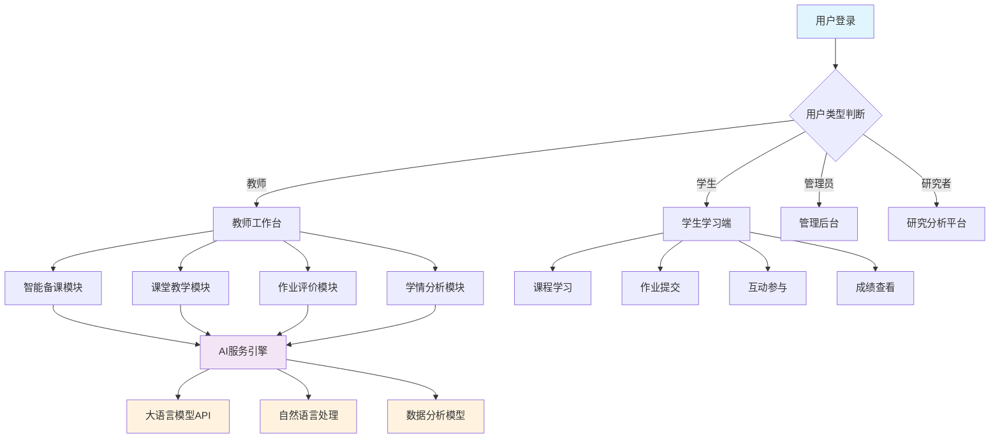
```mermaid
graph TB
    A[用户登录] --> B{用户类型判断}
    B -->|教师| C[教师工作台]
    B -->|学生| D[学生学习端]
    B -->|管理员| E[管理后台]
    B -->|研究者| F[研究分析平台]

    C --> G[智能备课模块]
    C --> H[课堂教学模块]
    C --> I[作业评价模块]
    C --> J[学情分析模块]

    D --> K[课程学习]
    D --> L[作业提交]
    D --> M[互动参与]
    D --> N[成绩查看]

    G --> O[AI服务引擎]
    H --> O
    I --> O
    J --> O

    O --> P[大语言模型API]
    O --> Q[自然语言处理]
    O --> R[数据分析模型]

    style A fill:#e1f5fe
    style O fill:#f3e5f5
    style P fill:#fff3e0
    style Q fill:#fff3e0
    style R fill:#fff3e0
```

---

## 1. 用户注册和权限管理流程

### 1.1 用户注册流程

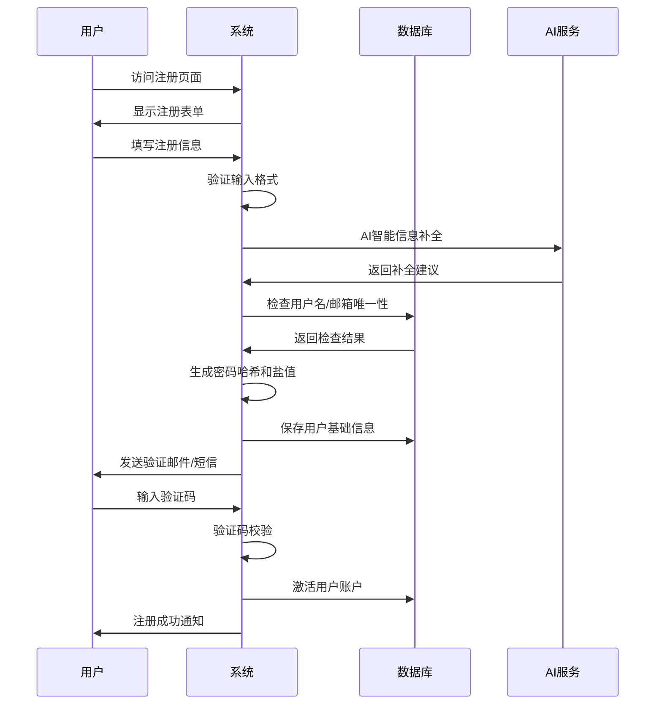
```mermaid
sequenceDiagram
    participant U as 用户
    participant S as 系统
    participant DB as 数据库
    participant A as AI服务

    U->>S: 访问注册页面
    S->>U: 显示注册表单
    U->>S: 填写注册信息
    S->>S: 验证输入格式
    S->>A: AI智能信息补全
    A->>S: 返回补全建议
    S->>DB: 检查用户名/邮箱唯一性
    DB->>S: 返回检查结果
    S->>S: 生成密码哈希和盐值
    S->>DB: 保存用户基础信息
    S->>U: 发送验证邮件/短信
    U->>S: 输入验证码
    S->>S: 验证码校验
    S->>DB: 激活用户账户
    S->>U: 注册成功通知
```

### 1.2 权限分配流程

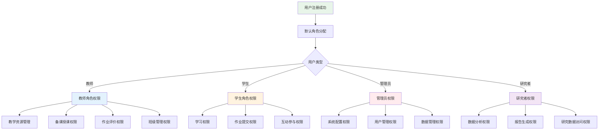
```mermaid
flowchart TD
    A[用户注册成功] --> B[默认角色分配]
    B --> C{用户类型}
    C -->|教师| D[教师角色权限]
    C -->|学生| E[学生角色权限]
    C -->|管理员| F[管理员权限]
    C -->|研究者| G[研究者权限]

    D --> H[教学资源管理]
    D --> I[备课授课权限]
    D --> J[作业评价权限]
    D --> K[班级管理权限]

    E --> L[学习权限]
    E --> M[作业提交权限]
    E --> N[互动参与权限]

    F --> O[系统配置权限]
    F --> P[用户管理权限]
    F --> Q[数据管理权限]

    G --> R[数据分析权限]
    G --> S[报告生成权限]
    G --> T[研究数据访问权限]

    style A fill:#e8f5e9
    style D fill:#e3f2fd
    style E fill:#fff3e0
    style F fill:#ffebee
    style G fill:#f3e5f5
```

---

## 2. 智能备课业务流程

### 2.1 教案创建流程

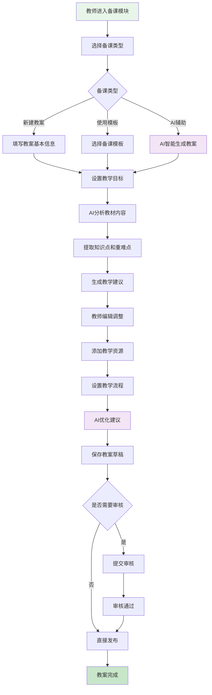
```mermaid
flowchart TD
    A[教师进入备课模块] --> B[选择备课类型]
    B --> C{备课类型}
    C -->|新建教案| D[填写教案基本信息]
    C -->|使用模板| E[选择备课模板]
    C -->|AI辅助| F[AI智能生成教案]

    D --> G[设置教学目标]
    E --> G
    F --> G

    G --> H[AI分析教材内容]
    H --> I[提取知识点和重难点]
    I --> J[生成教学建议]
    J --> K[教师编辑调整]
    K --> L[添加教学资源]
    L --> M[设置教学流程]
    M --> N[AI优化建议]
    N --> O[保存教案草稿]
    O --> P{是否需要审核}
    P -->|是| Q[提交审核]
    P -->|否| R[直接发布]
    Q --> S[审核通过]
    S --> R
    R --> T[教案完成]

    style A fill:#e8f5e9
    style F fill:#f3e5f5
    style N fill:#f3e5f5
    style T fill:#c8e6c9
```

### 2.2 AI辅助备课详细流程

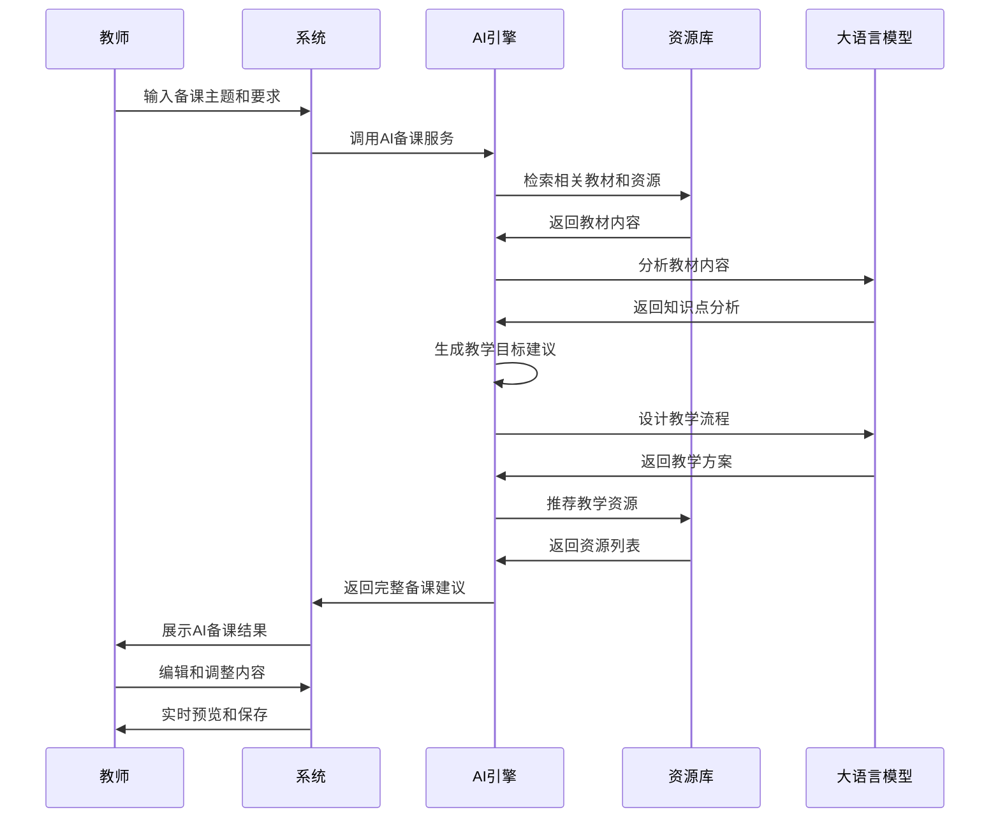
```mermaid
sequenceDiagram
    participant T as 教师
    participant S as 系统
    participant AI as AI引擎
    participant DB as 资源库
    participant LLM as 大语言模型

    T->>S: 输入备课主题和要求
    S->>AI: 调用AI备课服务
    AI->>DB: 检索相关教材和资源
    DB->>AI: 返回教材内容
    AI->>LLM: 分析教材内容
    LLM->>AI: 返回知识点分析
    AI->>AI: 生成教学目标建议
    AI->>LLM: 设计教学流程
    LLM->>AI: 返回教学方案
    AI->>DB: 推荐教学资源
    DB->>AI: 返回资源列表
    AI->>S: 返回完整备课建议
    S->>T: 展示AI备课结果
    T->>S: 编辑和调整内容
    S->>T: 实时预览和保存
```

---

## 3. 课堂教学互动流程

### 3.1 课堂教学主流程

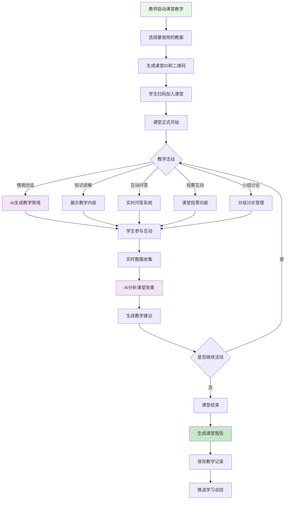
```mermaid
flowchart TD
    A[教师启动课堂教学] --> B[选择要使用的教案]
    B --> C[生成课堂ID和二维码]
    C --> D[学生扫码加入课堂]
    D --> E[课堂正式开始]

    E --> F{教学活动}
    F -->|情境创设| G[AI生成教学情境]
    F -->|知识讲解| H[展示教学内容]
    F -->|互动问答| I[实时问答系统]
    F -->|投票互动| J[课堂投票功能]
    F -->|小组讨论| K[分组讨论管理]

    G --> L[学生参与互动]
    H --> L
    I --> L
    J --> L
    K --> L

    L --> M[实时数据收集]
    M --> N[AI分析课堂效果]
    N --> O[生成教学建议]
    O --> P{是否继续活动}
    P -->|是| F
    P -->|否| Q[课堂结束]

    Q --> R[生成课堂报告]
    R --> S[保存教学记录]
    S --> T[推送学习总结]

    style A fill:#e8f5e9
    style G fill:#f3e5f5
    style N fill:#f3e5f5
    style R fill:#c8e6c9
```

### 3.2 实时互动功能流程

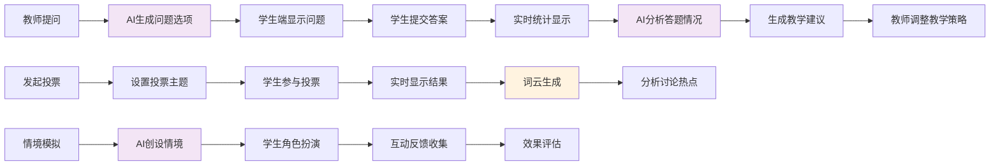
```mermaid
graph LR
    A[教师提问] --> B[AI生成问题选项]
    B --> C[学生端显示问题]
    C --> D[学生提交答案]
    D --> E[实时统计显示]
    E --> F[AI分析答题情况]
    F --> G[生成教学建议]
    G --> H[教师调整教学策略]

    I[发起投票] --> J[设置投票主题]
    J --> K[学生参与投票]
    K --> L[实时显示结果]
    L --> M[词云生成]
    M --> N[分析讨论热点]

    O[情境模拟] --> P[AI创设情境]
    P --> Q[学生角色扮演]
    Q --> R[互动反馈收集]
    R --> S[效果评估]

    style B fill:#f3e5f5
    style F fill:#f3e5f5
    style M fill:#fff3e0
    style P fill:#f3e5f5
```

---

## 4. 作业评价分析流程

### 4.1 作业发布和提交流程

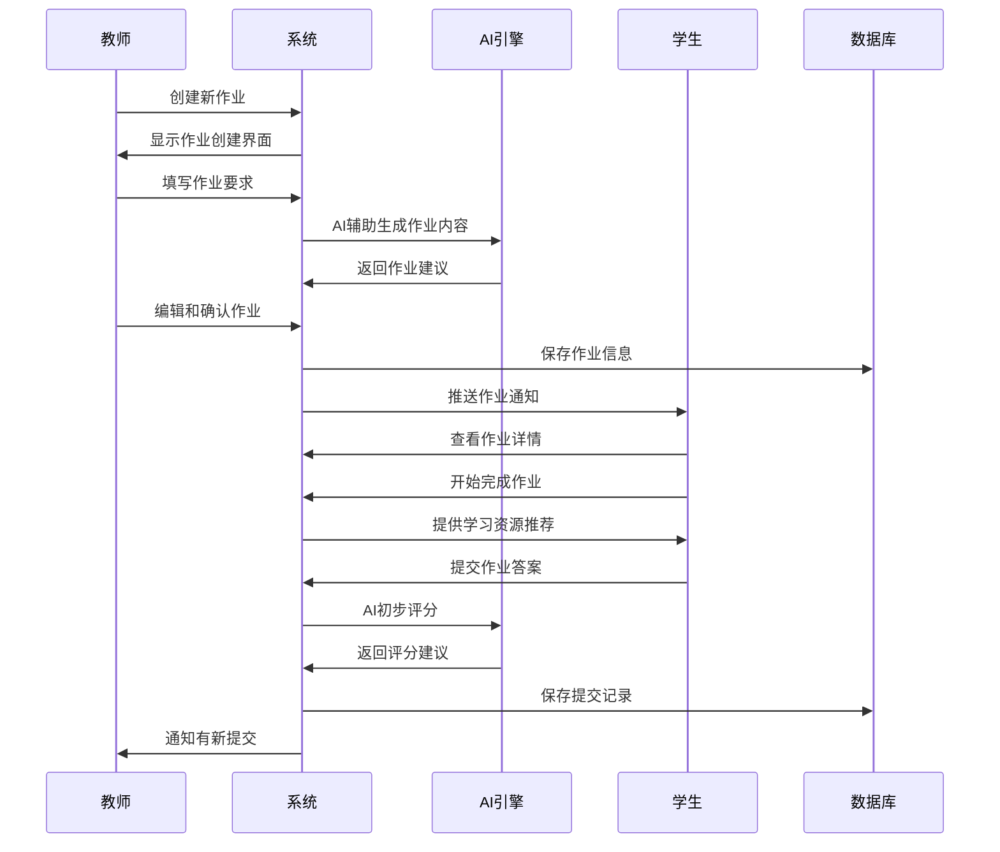
```mermaid
sequenceDiagram
    participant T as 教师
    participant S as 系统
    participant AI as AI引擎
    participant St as 学生
    participant DB as 数据库

    T->>S: 创建新作业
    S->>T: 显示作业创建界面
    T->>S: 填写作业要求
    S->>AI: AI辅助生成作业内容
    AI->>S: 返回作业建议
    T->>S: 编辑和确认作业
    S->>DB: 保存作业信息
    S->>St: 推送作业通知

    St->>S: 查看作业详情
    St->>S: 开始完成作业
    S->>St: 提供学习资源推荐
    St->>S: 提交作业答案
    S->>AI: AI初步评分
    AI->>S: 返回评分建议
    S->>DB: 保存提交记录
    S->>T: 通知有新提交
```

### 4.2 AI辅助评价流程

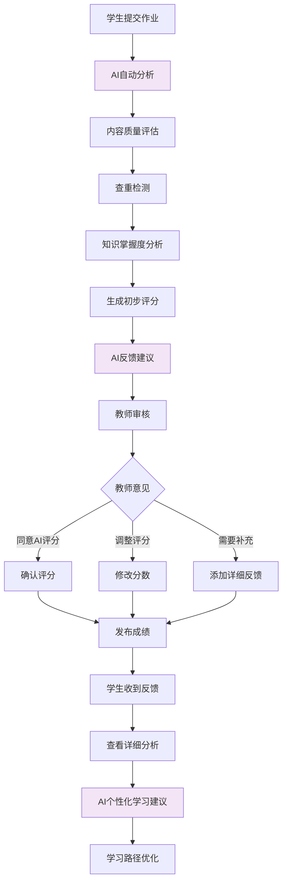
```mermaid
flowchart TD
    A[学生提交作业] --> B[AI自动分析]
    B --> C[内容质量评估]
    C --> D[查重检测]
    D --> E[知识掌握度分析]
    E --> F[生成初步评分]
    F --> G[AI反馈建议]
    G --> H[教师审核]

    H --> I{教师意见}
    I -->|同意AI评分| J[确认评分]
    I -->|调整评分| K[修改分数]
    I -->|需要补充| L[添加详细反馈]

    J --> M[发布成绩]
    K --> M
    L --> M

    M --> N[学生收到反馈]
    N --> O[查看详细分析]
    O --> P[AI个性化学习建议]
    P --> Q[学习路径优化]

    style B fill:#f3e5f5
    style G fill:#f3e5f5
    style P fill:#f3e5f5
```

---

## 5. 学情分析流程

### 5.1 学习数据收集流程

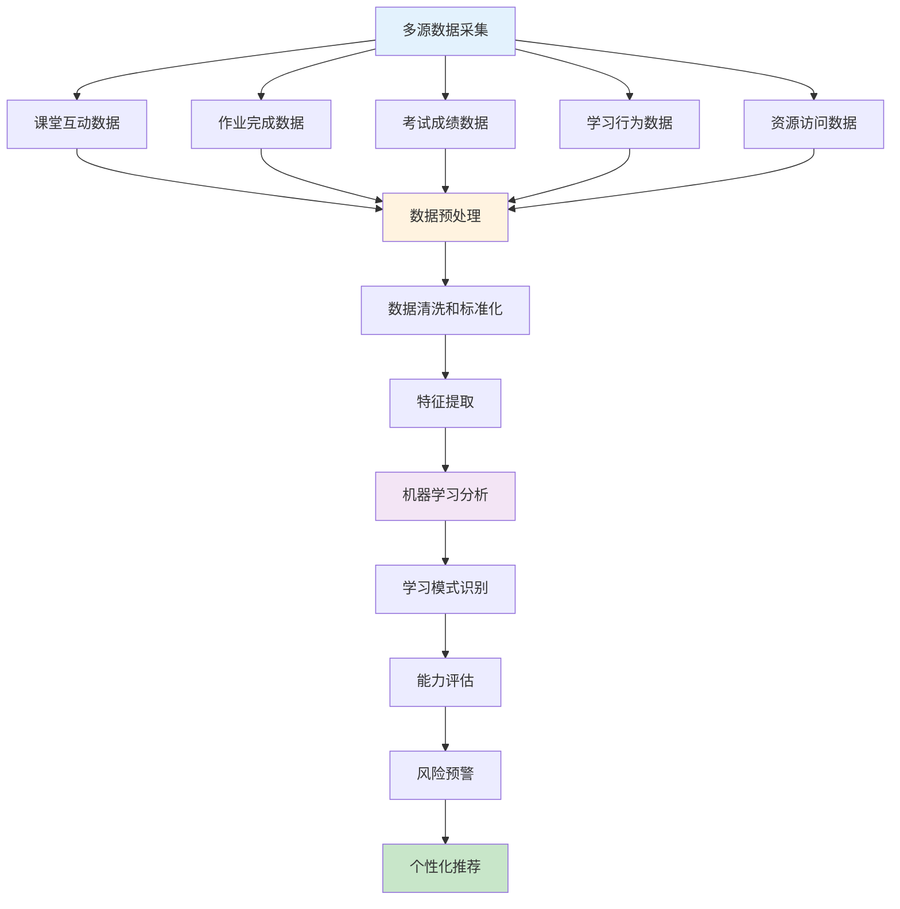
```mermaid
graph TB
    A[多源数据采集] --> B[课堂互动数据]
    A --> C[作业完成数据]
    A --> D[考试成绩数据]
    A --> E[学习行为数据]
    A --> F[资源访问数据]

    B --> G[数据预处理]
    C --> G
    D --> G
    E --> G
    F --> G

    G --> H[数据清洗和标准化]
    H --> I[特征提取]
    I --> J[机器学习分析]
    J --> K[学习模式识别]
    K --> L[能力评估]
    L --> M[风险预警]
    M --> N[个性化推荐]

    style A fill:#e3f2fd
    style G fill:#fff3e0
    style J fill:#f3e5f5
    style N fill:#c8e6c9
```

### 5.2 六维能力雷达图生成流程

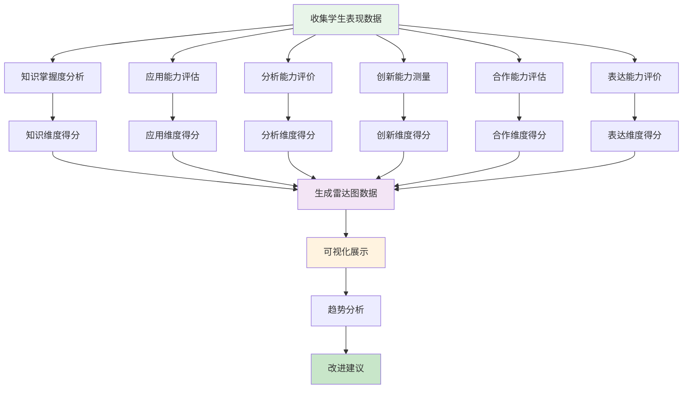
```mermaid
flowchart TD
    A[收集学生表现数据] --> B[知识掌握度分析]
    A --> C[应用能力评估]
    A --> D[分析能力评价]
    A --> E[创新能力测量]
    A --> F[合作能力评估]
    A --> G[表达能力评价]

    B --> H[知识维度得分]
    C --> I[应用维度得分]
    D --> J[分析维度得分]
    E --> K[创新维度得分]
    F --> L[合作维度得分]
    G --> M[表达维度得分]

    H --> N[生成雷达图数据]
    I --> N
    J --> N
    K --> N
    L --> N
    M --> N

    N --> O[可视化展示]
    O --> P[趋势分析]
    P --> Q[改进建议]

    style A fill:#e8f5e9
    style N fill:#f3e5f5
    style O fill:#fff3e0
    style Q fill:#c8e6c9
```

---

## 6. AI服务集成流程

### 6.1 AI服务调用架构

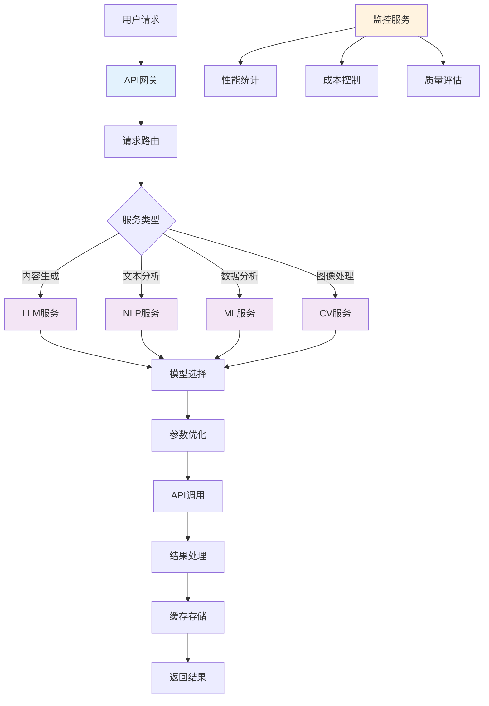
```mermaid
graph TB
    A[用户请求] --> B[API网关]
    B --> C[请求路由]
    C --> D{服务类型}

    D -->|内容生成| E[LLM服务]
    D -->|文本分析| F[NLP服务]
    D -->|数据分析| G[ML服务]
    D -->|图像处理| H[CV服务]

    E --> I[模型选择]
    F --> I
    G --> I
    H --> I

    I --> J[参数优化]
    J --> K[API调用]
    K --> L[结果处理]
    L --> M[缓存存储]
    M --> N[返回结果]

    O[监控服务] --> P[性能统计]
    O --> Q[成本控制]
    O --> R[质量评估]

    style B fill:#e3f2fd
    style E fill:#f3e5f5
    style F fill:#f3e5f5
    style G fill:#f3e5f5
    style H fill:#f3e5f5
    style O fill:#fff3e0
```

### 6.2 内容生成AI服务流程

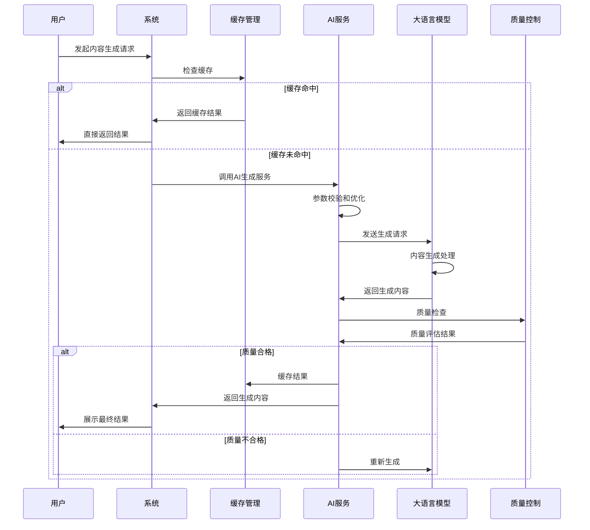
```mermaid
sequenceDiagram
    participant U as 用户
    participant S as 系统
    participant CM as 缓存管理
    participant AI as AI服务
    participant LLM as 大语言模型
    participant QC as 质量控制

    U->>S: 发起内容生成请求
    S->>CM: 检查缓存
    alt 缓存命中
        CM->>S: 返回缓存结果
        S->>U: 直接返回结果
    else 缓存未命中
        S->>AI: 调用AI生成服务
        AI->>AI: 参数校验和优化
        AI->>LLM: 发送生成请求
        LLM->>LLM: 内容生成处理
        LLM->>AI: 返回生成内容
        AI->>QC: 质量检查
        QC->>AI: 质量评估结果
        alt 质量合格
            AI->>CM: 缓存结果
            AI->>S: 返回生成内容
            S->>U: 展示最终结果
        else 质量不合格
            AI->>LLM: 重新生成
        end
    end
```

---

## 7. 数据安全和隐私保护流程

### 7.1 数据加密处理流程

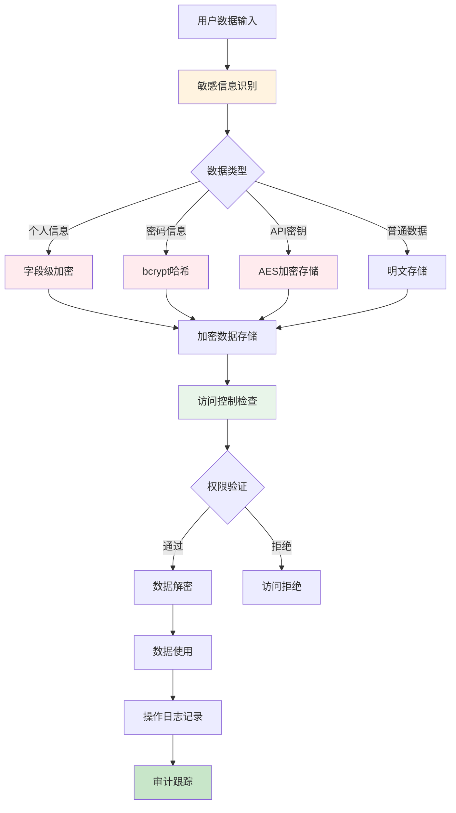
```mermaid
flowchart TD
    A[用户数据输入] --> B[敏感信息识别]
    B --> C{数据类型}
    C -->|个人信息| D[字段级加密]
    C -->|密码信息| E[bcrypt哈希]
    C -->|API密钥| F[AES加密存储]
    C -->|普通数据| G[明文存储]

    D --> H[加密数据存储]
    E --> H
    F --> H
    G --> H

    H --> I[访问控制检查]
    I --> J{权限验证}
    J -->|通过| K[数据解密]
    J -->|拒绝| L[访问拒绝]

    K --> M[数据使用]
    M --> N[操作日志记录]
    N --> O[审计跟踪]

    style B fill:#fff3e0
    style D fill:#ffebee
    style E fill:#ffebee
    style F fill:#ffebee
    style I fill:#e8f5e9
    style O fill:#c8e6c9
```

### 7.2 权限验证流程

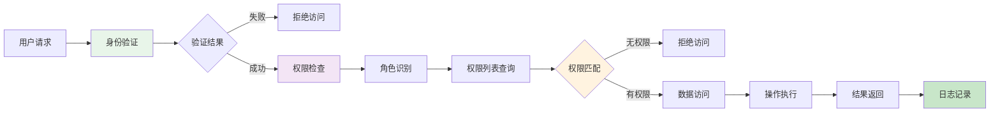
```mermaid
graph LR
    A[用户请求] --> B[身份验证]
    B --> C{验证结果}
    C -->|失败| D[拒绝访问]
    C -->|成功| E[权限检查]

    E --> F[角色识别]
    F --> G[权限列表查询]
    G --> H{权限匹配}
    H -->|无权限| I[拒绝访问]
    H -->|有权限| J[数据访问]

    J --> K[操作执行]
    K --> L[结果返回]
    L --> M[日志记录]

    style B fill:#e8f5e9
    style E fill:#f3e5f5
    style H fill:#fff3e0
    style M fill:#c8e6c9
```

---

## 8. 系统监控和运维流程

### 8.1 系统健康监控流程

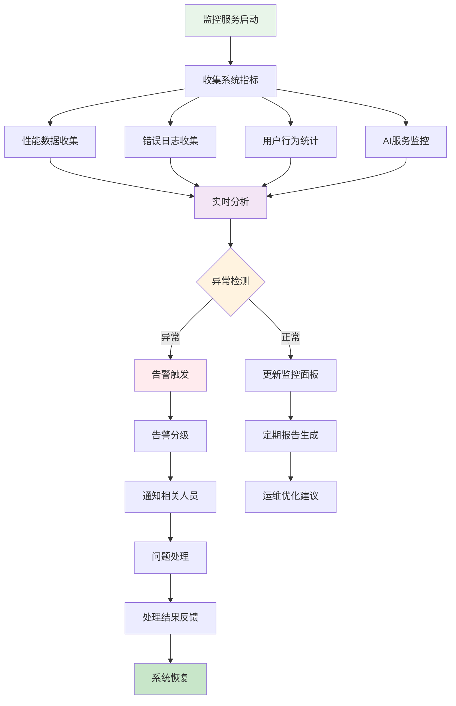
```mermaid
flowchart TD
    A[监控服务启动] --> B[收集系统指标]
    B --> C[性能数据收集]
    B --> D[错误日志收集]
    B --> E[用户行为统计]
    B --> F[AI服务监控]

    C --> G[实时分析]
    D --> G
    E --> G
    F --> G

    G --> H{异常检测}
    H -->|正常| I[更新监控面板]
    H -->|异常| J[告警触发]

    J --> K[告警分级]
    K --> L[通知相关人员]
    L --> M[问题处理]
    M --> N[处理结果反馈]
    N --> O[系统恢复]

    I --> P[定期报告生成]
    P --> Q[运维优化建议]

    style A fill:#e8f5e9
    style G fill:#f3e5f5
    style H fill:#fff3e0
    style J fill:#ffebee
    style O fill:#c8e6c9
```

### 8.2 数据备份和恢复流程

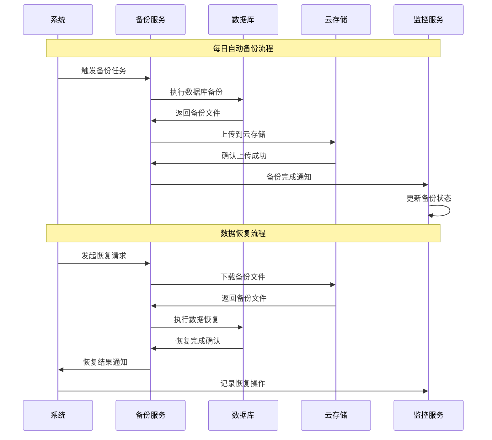
```mermaid
sequenceDiagram
    participant S as 系统
    participant B as 备份服务
    participant DB as 数据库
    participant C as 云存储
    participant M as 监控服务

    Note over S,M: 每日自动备份流程
    S->>B: 触发备份任务
    B->>DB: 执行数据库备份
    DB->>B: 返回备份文件
    B->>C: 上传到云存储
    C->>B: 确认上传成功
    B->>M: 备份完成通知
    M->>M: 更新备份状态

    Note over S,M: 数据恢复流程
    S->>B: 发起恢复请求
    B->>C: 下载备份文件
    C->>B: 返回备份文件
    B->>DB: 执行数据恢复
    DB->>B: 恢复完成确认
    B->>S: 恢复结果通知
    S->>M: 记录恢复操作
```

---

## 9. 移动端和Web端协同流程

### 9.1 多端数据同步流程

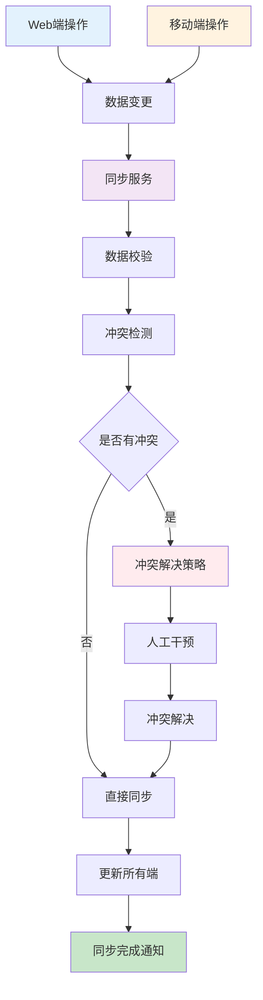
```mermaid
graph TB
    A[Web端操作] --> B[数据变更]
    C[移动端操作] --> B
    B --> D[同步服务]
    D --> E[数据校验]
    E --> F[冲突检测]
    F --> G{是否有冲突}
    G -->|是| H[冲突解决策略]
    G -->|否| I[直接同步]
    H --> J[人工干预]
    J --> K[冲突解决]
    K --> I
    I --> L[更新所有端]
    L --> M[同步完成通知]

    style A fill:#e3f2fd
    style C fill:#fff3e0
    style D fill:#f3e5f5
    style H fill:#ffebee
    style M fill:#c8e6c9
```

### 9.2 离线数据处理流程

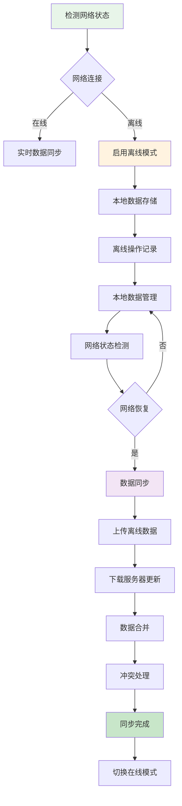
```mermaid
flowchart TD
    A[检测网络状态] --> B{网络连接}
    B -->|在线| C[实时数据同步]
    B -->|离线| D[启用离线模式]

    D --> E[本地数据存储]
    E --> F[离线操作记录]
    F --> G[本地数据管理]
    G --> H[网络状态检测]
    H --> I{网络恢复}
    I -->|否| G
    I -->|是| J[数据同步]

    J --> K[上传离线数据]
    K --> L[下载服务器更新]
    L --> M[数据合并]
    M --> N[冲突处理]
    N --> O[同步完成]
    O --> P[切换在线模式]

    style A fill:#e8f5e9
    style D fill:#fff3e0
    style J fill:#f3e5f5
    style O fill:#c8e6c9
```

---

## 10. 系统集成和扩展流程

### 10.1 第三方系统集成流程

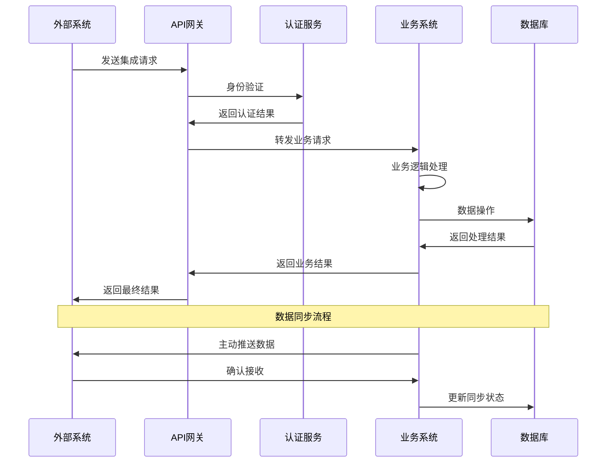
```mermaid
sequenceDiagram
    participant E as 外部系统
    participant G as API网关
    participant A as 认证服务
    participant S as 业务系统
    participant DB as 数据库

    E->>G: 发送集成请求
    G->>A: 身份验证
    A->>G: 返回认证结果
    G->>S: 转发业务请求
    S->>S: 业务逻辑处理
    S->>DB: 数据操作
    DB->>S: 返回处理结果
    S->>G: 返回业务结果
    G->>E: 返回最终结果

    Note over E,DB: 数据同步流程
    S->>E: 主动推送数据
    E->>S: 确认接收
    S->>DB: 更新同步状态
```

### 10.2 系统扩展部署流程

```mermaid
flowchart TD
    A[扩展需求分析] --> B[架构设计调整]
    B --> C[接口定义]
    C --> D[服务开发]
    D --> E[单元测试]
    E --> F{测试通过}
    F -->|否| G[代码修复]
    G --> E
    F -->|是| H[集成测试]
    H --> I{集成测试通过}
    I -->|否| J[问题修复]
    J --> H
    I -->|是| K[部署准备]
    K --> L[灰度发布]
    L --> M[监控观察]
    M --> N{运行稳定}
    N -->|否| O[回滚处理]
    N -->|是| P[全量发布]
    P --> Q[运行监控]
    Q --> R[性能优化]

    style A fill:#e8f5e9
    style F fill:#fff3e0
    style I fill:#fff3e0
    style N fill:#fff3e0
    style P fill:#c8e6c9
```

---

## 总结

这套业务流程图涵盖了AI思政教学系统的所有核心业务场景，包括：

1. **用户管理**：注册、认证、权限分配
2. **智能备课**：AI辅助教案创建和优化
3. **课堂教学**：实时互动和情境创设
4. **作业评价**：智能评分和个性化反馈
5. **学情分析**：多维度学习数据分析和可视化
6. **AI服务**：智能服务调用和质量控制
7. **数据安全**：加密存储和权限控制
8. **系统运维**：监控、备份和恢复
9. **多端协同**：Web和移动端数据同步
10. **系统集成**：第三方服务接入和扩展

每个流程都经过精心设计，确保系统的可用性、可扩展性和安全性，为AI思政教学提供完整的技术支撑。