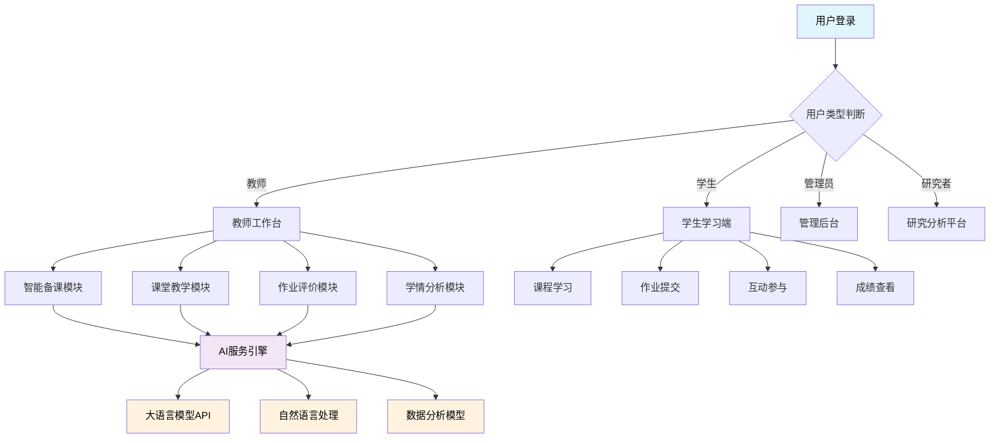
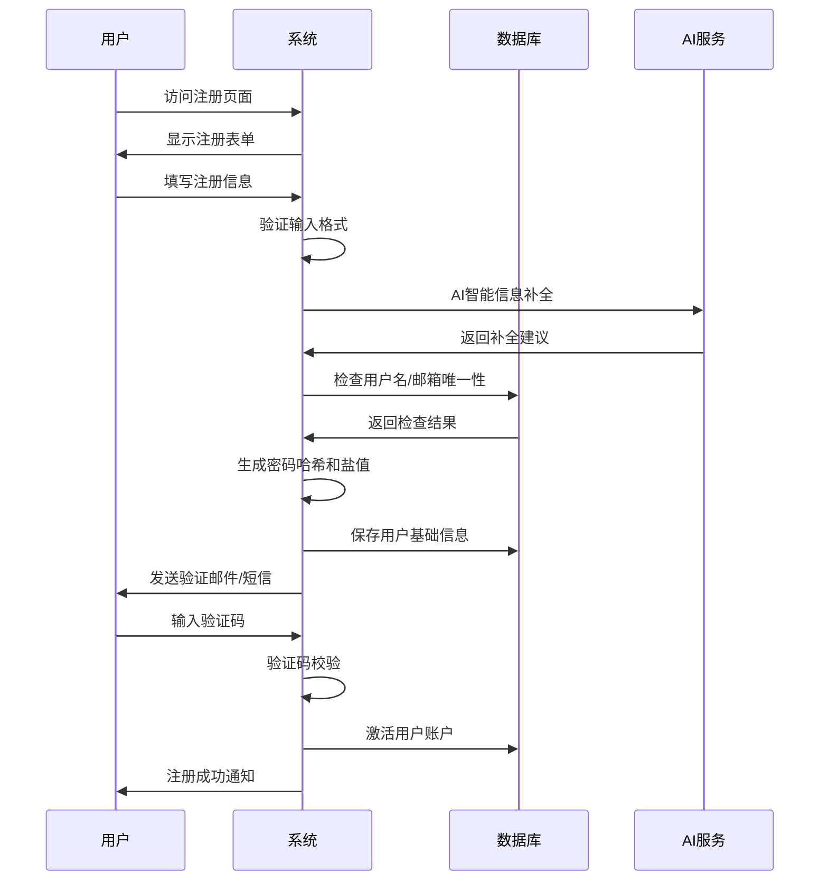
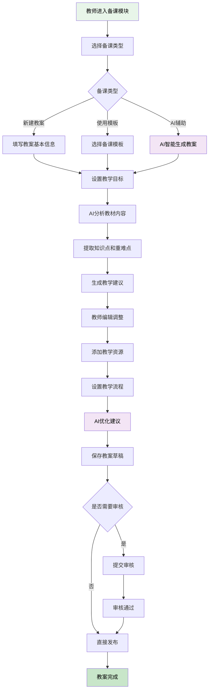
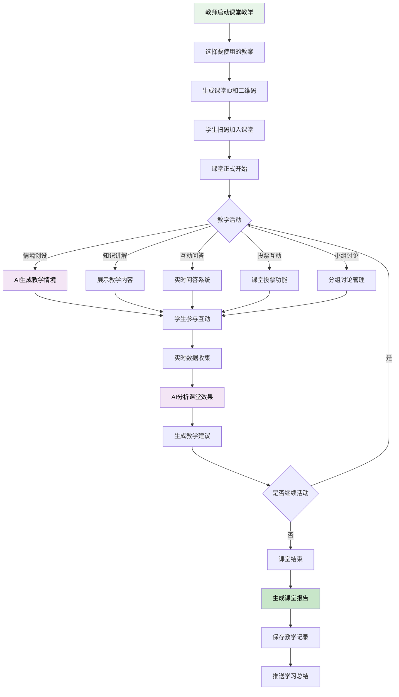
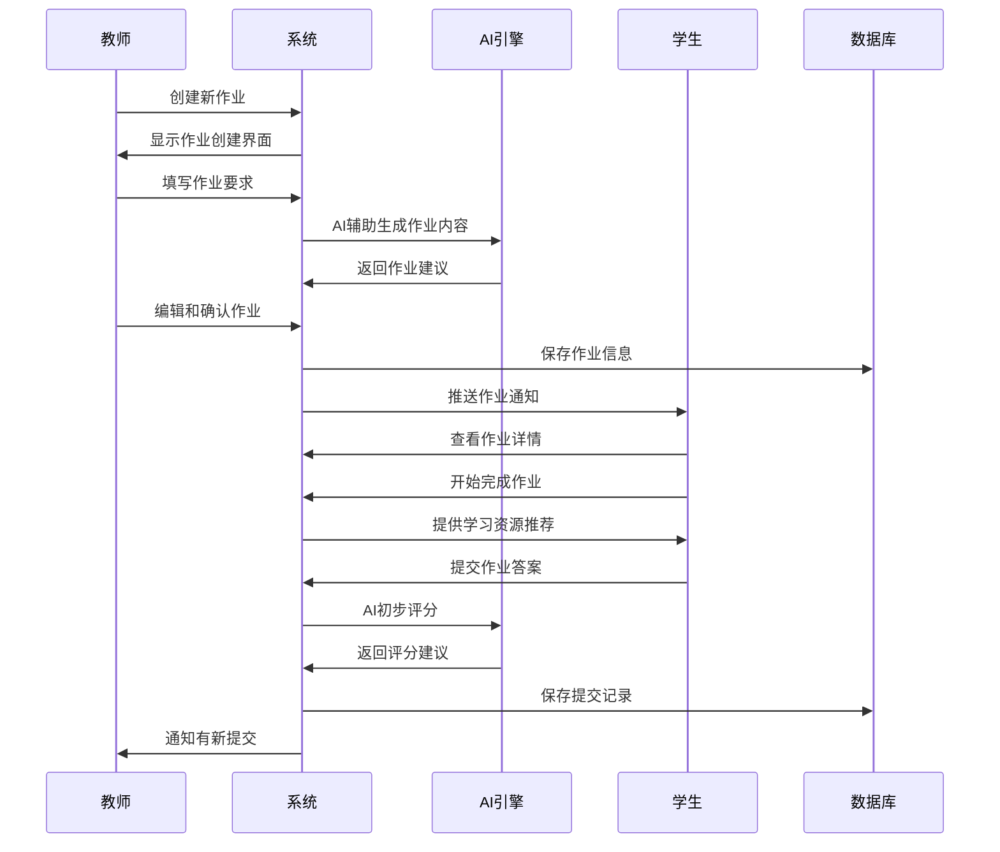
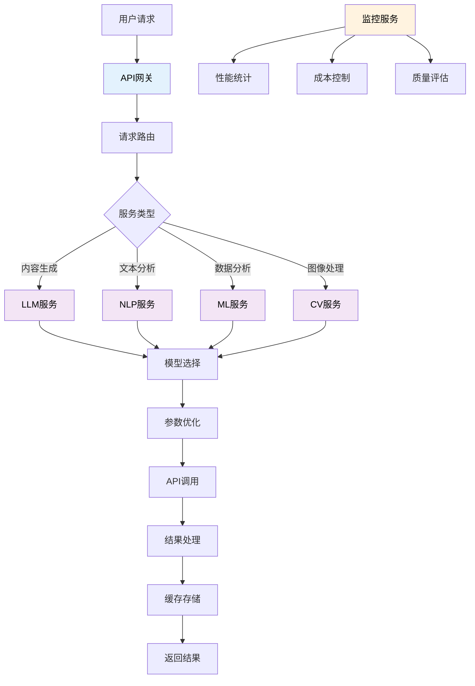
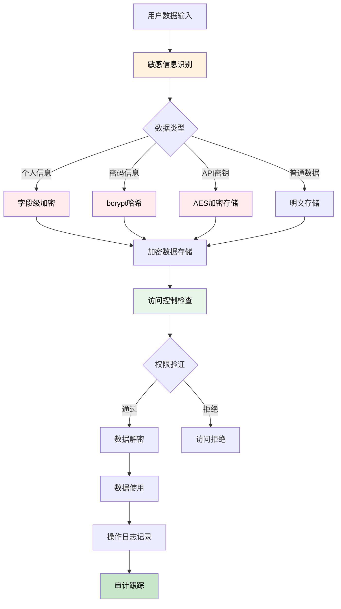
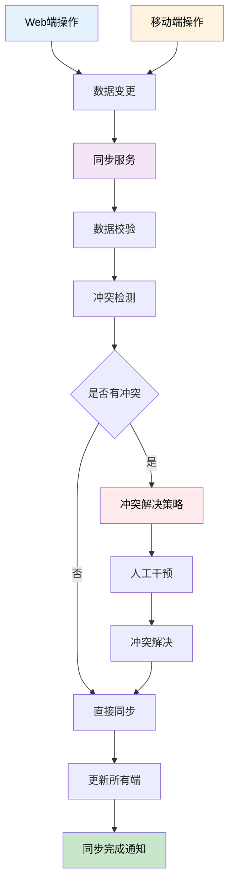
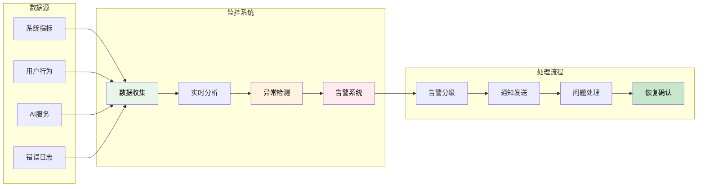

# AI思政教学系统可视化流程图

## 📖 如何查看流程图

这个文档包含Mermaid格式的流程图代码，你需要以下工具来查看可视化图形：

### 方法1：使用VSCode插件
1. 在VSCode中安装 **"Mermaid Preview"** 插件
2. 右键点击文档，选择 "Open Preview"
3. 或者使用快捷键 `Ctrl+Shift+V`

### 方法2：使用在线工具
1. 访问 https://mermaid.live
2. 复制下面的代码粘贴到编辑器
3. 即可看到可视化图形

### 方法3：使用Markdown预览工具
1. 使用Typora、Mark Text等支持Mermaid的Markdown编辑器
2. 直接粘贴代码即可预览

---

## 🎯 系统整体业务流程图



---

## 👥 用户注册流程图



---

## ✍️ 智能备课流程图



---

## 🎯 课堂教学流程图



---

## 📈 作业评价流程图



---

## 🤖 AI服务集成流程图



---

## 📊 学情分析六维能力图


---

## 🔒 数据安全流程图



---

## 📱 多端数据同步流程图



---

## 🖥️ 系统监控流程图



---

## 📝 快速开始指南

### 1. 在VSCode中查看
```bash
# 安装Mermaid插件
# 1. 打开VSCode
# 2. 按Ctrl+Shift+X
# 3. 搜索 "Mermaid Preview"
# 4. 点击安装
# 5. 右键文档选择 "Open Preview"
```

### 2. 在线查看
1. 访问 https://mermaid.live
2. 复制任意上面的代码块
3. 粘贴到左侧编辑器
4. 右侧自动显示图形

### 3. 导出图片
- 在Mermaid Live中点击右上角导出按钮
- 支持PNG、SVG、PDF等格式
- 可直接用于文档和演示

---

## 🎨 流程图说明

### 颜色含义
- 🟢 **绿色** - 开始/成功状态
- 🔵 **蓝色** - 处理/分析过程
- 🟡 **黄色** - AI/智能处理
- 🔴 **红色** - 异常/警告状态

### 图形类型
- **矩形框** - 处理步骤
- **菱形框** - 判断条件
- **圆角框** - 开始/结束
- **数据库图标** - 数据存储
- **云形图标** - 云服务/AI

### 连接线类型
- **实线箭头** - 顺序流程
- **虚线箭头** - 条件流程
- **双向箭头** - 数据交互

这套可视化流程图可以让团队更直观地理解系统架构和业务流程，便于项目开发和协作！